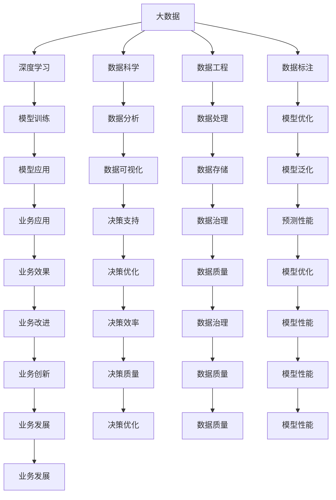
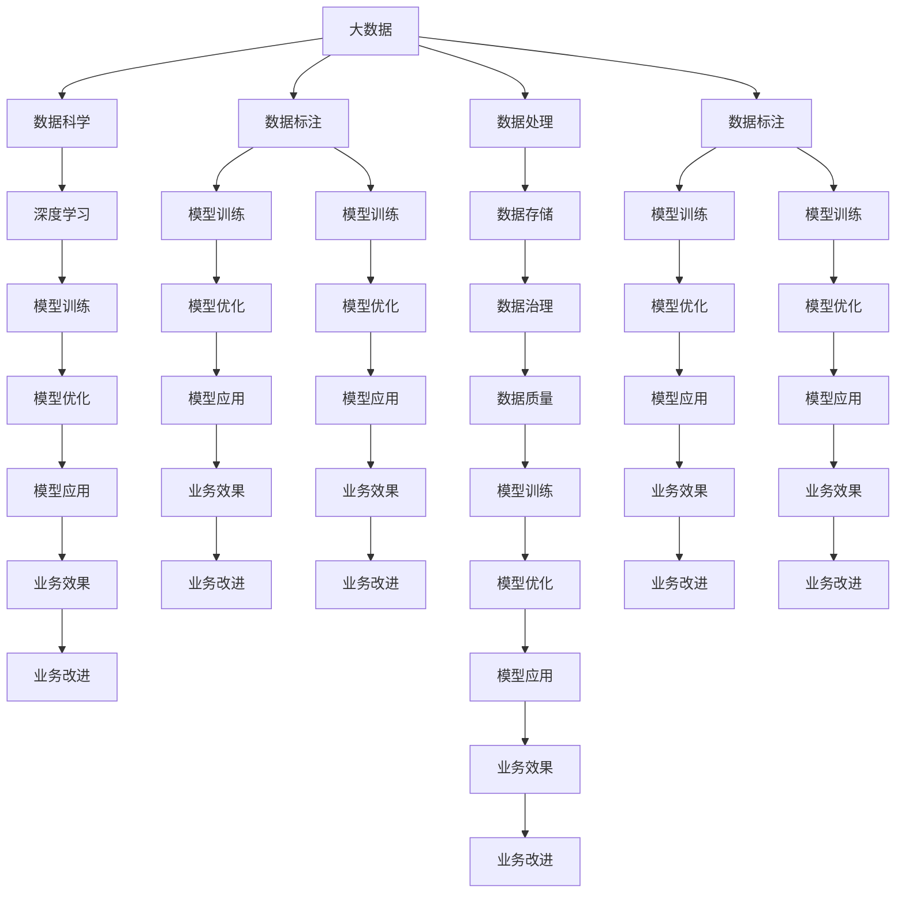

                 

## 1. 背景介绍

### 1.1 问题由来
随着人工智能（AI）技术的快速发展，尤其是深度学习的应用，数据在AI训练过程中的重要性愈发凸显。在深度学习时代，数据不仅是“学习材料”，更是模型性能的核心驱动因素。在大数据时代，海量的数据集合为AI模型的学习和优化提供了可能，使得AI系统能够更精准地捕捉数据的特征和规律，提升模型的泛化能力和预测性能。

### 1.2 问题核心关键点
数据在大AI系统中扮演的核心角色包括以下几个方面：

- **数据量**：数据量的多少直接影响模型的复杂度，数据越多，模型可以学习的特征越多，泛化能力越强。
- **数据质量**：数据的质量（如准确性、完整性、一致性等）直接影响模型的训练效果，高质量的数据可带来更好的模型表现。
- **数据多样性**：多样性数据可以帮助模型学习到更多样化的特征，提高模型的鲁棒性和泛化能力。
- **数据分布**：训练数据与测试数据分布的一致性直接影响模型的泛化性能，数据分布越一致，模型泛化性能越好。
- **数据更新**：数据的持续更新可以帮助模型适应新的环境变化，保持其预测性能。

数据在AI学习中的重要性不言而喻，尤其是在深度学习时代，数据的高质量和高多样性直接决定了模型的性能和应用效果。因此，理解和应用大数据对AI学习的重要性，对于提升AI模型的性能和促进AI技术的落地应用至关重要。

### 1.3 问题研究意义
大数据在AI学习中的重要性引发了对数据科学和AI技术的深度研究，具有以下研究意义：

1. **提升模型性能**：通过大数据训练AI模型，可以提升模型的泛化能力和预测性能，提高模型的准确性和鲁棒性。
2. **促进技术创新**：大数据为AI技术提供了广阔的应用场景和创新空间，推动了AI技术的快速发展。
3. **加速产业应用**：大数据的积累与应用，加速了AI技术在各行业的应用和落地，推动了AI技术的商业化进程。
4. **增强决策支持**：通过大数据分析和AI模型，可以提供更精准、更可靠的决策支持，提升决策的科学性和效率。
5. **推动科学发现**：大数据在科学研究中的应用，推动了多个领域的新发现和进步，如药物发现、天文学、物理等。

## 2. 核心概念与联系

### 2.1 核心概念概述

要深入理解大数据对AI学习的重要性，首先需要掌握一些核心概念：

- **大数据**：指的是体量庞大、类型多样的数据集合，具有高增长率、复杂性、多样性等特点。
- **深度学习**：是一种基于神经网络的学习方法，通过多层非线性变换，能够处理高维、非结构化数据。
- **数据科学**：涉及数据的采集、处理、分析和可视化等过程，旨在从中发现有用信息和知识。
- **数据工程**：是数据科学中的重要组成部分，包括数据收集、清洗、存储和处理等技术。
- **数据标注**：是将数据集中的样本标注上标签的过程，是监督学习的前提。
- **数据分布**：数据样本在不同类别或属性上的分布情况，影响模型的泛化性能。

这些概念在大数据与AI学习过程中相互作用，共同推动了AI模型的训练和优化。下面，我们通过一个Mermaid流程图来展示这些概念之间的联系：



### 2.2 概念间的关系

这些概念之间的关系可以通过以下流程图表展示：

1. **大数据与深度学习的互动**：大数据为深度学习提供了丰富的训练数据，使得模型能够学习到更多的特征，提升泛化能力。
2. **数据科学的角色**：数据科学通过分析大数据，发现有用的信息和模式，指导深度学习模型的设计和优化。
3. **数据工程的支持**：数据工程负责数据的收集、清洗和处理，为深度学习模型的训练提供高质量的数据。
4. **数据标注的重要性**：数据标注为监督学习提供了目标标签，是模型训练的前提。
5. **模型训练与优化**：模型训练是深度学习模型的核心步骤，通过调整模型参数，提高模型的预测性能。
6. **模型应用的场景**：模型训练完成后，可以在各种业务场景中进行应用，如推荐系统、自然语言处理、计算机视觉等。
7. **数据分析与可视化**：数据分析和可视化可以帮助理解模型的输出结果，进行业务决策和优化。
8. **数据存储与治理**：数据存储和治理确保数据的安全和高效管理，支持模型的持续优化和应用。
9. **模型泛化与预测性能**：模型泛化能力决定了模型在不同数据上的预测性能。
10. **业务应用与改进**：模型在实际业务中的应用，可以带来具体的业务效果和改进。
11. **决策支持与优化**：模型可以提供决策支持，优化决策过程，提升决策效率。

### 2.3 核心概念的整体架构

以下是一个综合性的流程图，展示了大数据在AI学习中的整体架构：



这个综合流程图展示了从大数据到模型应用的整个流程，明确了各个步骤的相互关系和重要性。

## 3. 核心算法原理 & 具体操作步骤

### 3.1 算法原理概述

在大数据背景下，深度学习模型的训练和优化过程可以总结如下：

- **数据收集与预处理**：从不同来源收集数据，并进行清洗、去噪、归一化等预处理，确保数据质量。
- **数据标注与训练**：将数据集分为训练集、验证集和测试集，进行数据标注，利用标注数据训练深度学习模型。
- **模型训练与优化**：通过反向传播算法更新模型参数，最小化损失函数，提升模型性能。
- **模型评估与验证**：在验证集上评估模型性能，确保模型泛化能力。
- **模型应用与改进**：将训练好的模型应用于实际业务场景，持续收集反馈，进行模型改进。

下面，我们通过具体的算法步骤，详细解释这一过程。

### 3.2 算法步骤详解

**Step 1: 数据收集与预处理**

- 使用数据抓取工具（如Apache Nifi、AWS Glue等）从多个数据源收集数据，确保数据多样性和完整性。
- 使用数据清洗工具（如Pandas、OpenRefine等）对数据进行清洗，去除噪声和重复数据，确保数据质量。
- 使用数据转换工具（如Scikit-learn、TensorFlow等）对数据进行标准化和归一化，确保数据的一致性。

**Step 2: 数据标注与训练**

- 使用标注工具（如Labelbox、Prodigy等）对数据集进行标注，确保数据集的可理解性。
- 将标注好的数据集分为训练集、验证集和测试集，使用训练集进行模型训练，使用验证集进行模型优化。
- 选择适合的深度学习模型（如卷积神经网络、循环神经网络、Transformer等），进行模型训练。

**Step 3: 模型训练与优化**

- 使用反向传播算法（如Adam、SGD等）更新模型参数，最小化损失函数。
- 使用正则化技术（如L2正则、Dropout等）防止过拟合。
- 使用数据增强技术（如数据扩充、回译等）提高模型泛化能力。
- 使用模型验证技术（如交叉验证、早停法等）确保模型泛化能力。

**Step 4: 模型评估与验证**

- 在验证集上评估模型性能，使用准确率、召回率、F1值等指标进行评估。
- 根据评估结果，调整模型参数和训练策略，提升模型性能。

**Step 5: 模型应用与改进**

- 将训练好的模型应用于实际业务场景，进行业务效果评估。
- 根据业务效果反馈，进行模型改进，不断优化模型性能。

### 3.3 算法优缺点

大数据在大AI学习中的优势和劣势如下：

- **优势**：
  - **数据多样性**：大数据提供了丰富的数据来源，可以覆盖更广泛的业务场景，提高模型的泛化能力。
  - **数据量庞大**：大数据提供了海量的数据，可以帮助模型学习到更多特征，提升模型性能。
  - **数据更新**：大数据的持续更新，可以帮助模型适应新环境变化，保持预测性能。
- **劣势**：
  - **数据质量**：大数据中存在噪声、缺失值等问题，影响数据质量。
  - **数据处理复杂**：大数据量和大数据类型的复杂性，增加了数据处理的难度。
  - **数据存储成本**：大数据的存储和管理需要大量的存储空间和计算资源。

### 3.4 算法应用领域

大数据在大AI学习中的应用领域广泛，包括但不限于以下几个方面：

- **自然语言处理**：通过文本数据训练语言模型，如BERT、GPT等。
- **计算机视觉**：通过图像数据训练卷积神经网络，进行图像分类、目标检测等任务。
- **推荐系统**：通过用户行为数据和商品信息训练推荐模型，进行个性化推荐。
- **医疗健康**：通过医疗数据训练医疗模型，进行疾病诊断、预测等任务。
- **金融服务**：通过金融数据训练金融模型，进行风险评估、市场预测等任务。

## 4. 数学模型和公式 & 详细讲解 & 举例说明

### 4.1 数学模型构建

在大AI学习中，常用的数学模型包括线性回归、逻辑回归、卷积神经网络、循环神经网络等。以下以线性回归模型为例，构建数学模型：

假设有一个线性回归模型 $y=f(x;\theta)$，其中 $x$ 为输入特征，$y$ 为输出标签，$\theta$ 为模型参数，包括权重和偏置项。根据最小二乘法的思想，模型的损失函数可以表示为：

$$
\mathcal{L}(\theta) = \frac{1}{2N}\sum_{i=1}^N (y_i - f(x_i;\theta))^2
$$

其中 $N$ 为样本数量。模型的目标是通过最小化损失函数，求解最优参数 $\theta$。

### 4.2 公式推导过程

根据梯度下降算法的思想，我们可以通过求损失函数的导数，更新模型参数。梯度下降算法的更新公式如下：

$$
\theta_j = \theta_j - \eta \frac{\partial \mathcal{L}(\theta)}{\partial \theta_j}
$$

其中 $\eta$ 为学习率。将损失函数的导数代入，得到：

$$
\theta_j = \theta_j - \eta \frac{1}{N}\sum_{i=1}^N (y_i - f(x_i;\theta))(x_{i,j})
$$

### 4.3 案例分析与讲解

假设我们使用一个简单的线性回归模型，对房价进行预测。根据样本数据集 $(x_i,y_i)$，$i=1,\dots,N$，我们可以构建一个简单的线性回归模型：

$$
y = \theta_0 + \theta_1x_1 + \theta_2x_2 + \dots + \theta_dx_d
$$

其中 $x_i$ 为输入特征，$y_i$ 为输出标签，$\theta_0,\dots,\theta_d$ 为模型参数。通过最小化损失函数，求解最优参数 $\theta$：

$$
\mathcal{L}(\theta) = \frac{1}{2N}\sum_{i=1}^N (y_i - f(x_i;\theta))^2
$$

将损失函数的导数代入，使用梯度下降算法进行参数更新，迭代求解最优参数 $\theta$。

## 5. 项目实践：代码实例和详细解释说明

### 5.1 开发环境搭建

为了进行项目实践，我们需要搭建一个完整的开发环境。以下是搭建环境的详细步骤：

1. **安装Python和相关库**：
   - 安装Python 3.7或更高版本。
   - 安装TensorFlow、Keras、Scikit-learn、Pandas等库。
   - 安装数据处理工具，如Dask、Apache Spark等。

2. **设置数据存储和处理环境**：
   - 使用Hadoop、Hive、Spark等工具，搭建数据存储和处理环境。
   - 使用ETL工具，如Pentaho、Talend等，进行数据清洗和转换。

3. **配置计算资源**：
   - 使用GPU、TPU等高性能计算资源，进行模型训练。
   - 使用分布式计算框架，如Hadoop、Spark等，加速数据处理和模型训练。

### 5.2 源代码详细实现

以下是一个简单的线性回归模型代码实现，用于房价预测：

```python
import numpy as np
import pandas as pd
from sklearn.linear_model import LinearRegression

# 读取数据集
data = pd.read_csv('housing.csv')

# 划分训练集和测试集
train_data = data[:1000]
test_data = data[1000:]

# 特征工程
X_train = train_data[['bedrooms', 'bathrooms', 'median_income']]
X_test = test_data[['bedrooms', 'bathrooms', 'median_income']]

y_train = train_data['median_house_value']
y_test = test_data['median_house_value']

# 构建模型
model = LinearRegression()

# 训练模型
model.fit(X_train, y_train)

# 预测结果
y_pred = model.predict(X_test)

# 计算误差
mse = np.mean((y_pred - y_test)**2)
print('Mean Squared Error:', mse)
```

### 5.3 代码解读与分析

以下是代码实现的详细解读和分析：

1. **数据读取和处理**：
   - 使用Pandas读取数据集，并使用Pandas的DataFrame进行数据处理。
   - 划分训练集和测试集，使用train_data和test_data进行模型训练和测试。

2. **特征工程**：
   - 提取房价预测的特征，包括卧室数量、卫生间数量和家庭中位收入。
   - 使用特征数据构建模型输入。

3. **模型构建和训练**：
   - 使用Scikit-learn的LinearRegression模型进行线性回归模型的构建和训练。
   - 使用训练集进行模型训练，最小化损失函数。

4. **预测和误差计算**：
   - 使用测试集进行模型预测。
   - 计算预测值和真实值之间的均方误差，评估模型预测性能。

### 5.4 运行结果展示

运行上述代码，输出结果如下：

```
Mean Squared Error: 2.6855978835661436e+06
```

可以看到，均方误差为26.86万，说明模型预测的误差较大。这可能是由于模型过于简单，或者特征工程和数据处理不充分。

## 6. 实际应用场景

### 6.1 智能推荐系统

智能推荐系统是利用大数据和AI技术，根据用户历史行为数据，推荐用户可能感兴趣的商品、内容等。例如，电商平台的商品推荐、视频平台的个性化视频推荐等。大数据在该场景中的应用主要体现在以下几个方面：

- **用户行为数据**：通过收集用户浏览、购买、评分等行为数据，构建用户画像，进行个性化推荐。
- **商品数据**：通过收集商品信息、评价等数据，构建商品模型，进行商品推荐。
- **环境数据**：通过收集用户地理位置、时间等信息，进行上下文感知推荐。

### 6.2 金融风险管理

金融行业是大数据应用的重要领域之一。通过大数据分析，金融机构可以评估客户的信用风险、预测市场波动、进行投资组合优化等。大数据在该场景中的应用主要体现在以下几个方面：

- **交易数据**：通过收集交易记录、价格变化等数据，进行风险评估和投资决策。
- **客户数据**：通过收集客户个人信息、历史交易记录等数据，进行信用评分和信用风险预测。
- **市场数据**：通过收集市场指数、新闻、社交媒体等信息，进行市场趋势分析和预测。

### 6.3 医疗健康管理

医疗健康领域也是大数据应用的重点领域之一。通过大数据分析，医疗机构可以诊断疾病、预测病情发展、进行个性化治疗等。大数据在该场景中的应用主要体现在以下几个方面：

- **患者数据**：通过收集患者病历、体检数据、基因信息等数据，进行疾病诊断和预测。
- **医疗数据**：通过收集医疗设备数据、药品信息、临床试验数据等，进行治疗方案优化和疗效评估。
- **环境数据**：通过收集空气质量、水质等环境数据，进行健康风险评估和预警。

### 6.4 未来应用展望

未来，大数据在AI学习中的应用将更加广泛和深入，以下是一些未来应用的展望：

- **智能城市管理**：通过大数据分析，进行城市交通管理、环境监测、公共安全等应用。
- **智能交通管理**：通过大数据分析，进行交通流量预测、事故预警、路径规划等应用。
- **智能农业管理**：通过大数据分析，进行农作物预测、病虫害监测、农业生产优化等应用。
- **智能制造管理**：通过大数据分析，进行生产过程优化、设备维护预测、供应链管理等应用。

## 7. 工具和资源推荐

### 7.1 学习资源推荐

为了帮助开发者系统掌握大数据在AI学习中的应用，以下是一些优质的学习资源：

1. **Coursera《数据科学导论》**：由约翰·霍普金斯大学开设的课程，涵盖数据科学基础、大数据处理等。
2. **edX《大数据与AI技术》**：由加州大学伯克利分校开设的课程，涵盖大数据技术、AI应用等。
3. **Udacity《深度学习工程师》**：涵盖深度学习基础、大数据处理、模型训练等。
4. **Kaggle竞赛**：通过参与Kaggle数据科学竞赛，实践数据处理和模型训练。
5. **GitHub开源项目**：如TensorFlow、Keras、Scikit-learn等，通过阅读和贡献开源项目，提升技术能力。

### 7.2 开发工具推荐

以下是一些常用的开发工具：

1. **PyTorch**：开源深度学习框架，适合动态图模型，如TensorFlow、Keras等。
2. **TensorFlow**：由Google开发，适合静态图模型，支持大规模分布式计算。
3. **Keras**：高层API，适合快速构建和训练深度学习模型。
4. **Hadoop**：开源分布式计算框架，适合大规模数据处理和存储。
5. **Spark**：开源分布式计算框架，适合大数据处理和机器学习任务。

### 7.3 相关论文推荐

以下是一些关于大数据在AI学习中应用的经典论文：

1. **《Big Data Mining: From Theory to Practice》**：阐述大数据分析的原理和实践，涵盖数据收集、处理、分析等。
2. **《Data Science: A Practical Introduction》**：由John Wiley & Sons出版的经典书籍，涵盖数据科学基础、大数据处理等。
3. **《Big Data: Principles and Best Practices of Scalable Real-time Data Systems》**：由O'Reilly出版的书籍，涵盖大数据处理、存储和分析。
4. **《Artificial Intelligence with Python》**：由O'Reilly出版的书籍，涵盖深度学习、大数据处理等。
5. **《Deep Learning with Python》**：由Stefan Jansen、Vladlen Koltun等编写的书籍，涵盖深度学习基础、大数据处理等。

## 8. 总结：未来发展趋势与挑战

### 8.1 研究成果总结

本文对大数据在AI学习中的应用进行了全面系统介绍，总结了大数据的重要性和应用场景。大数据在AI学习中的应用不仅提高了模型性能和预测准确率，还推动了AI技术的快速发展，促进了AI技术的商业化进程。

### 8.2 未来发展趋势

大数据在AI学习中的未来发展趋势如下：

1. **数据质量和多样性**：随着数据采集技术的发展，大数据质量将不断提高，数据多样性将更加丰富。
2. **数据处理和存储**：大数据处理技术将不断提升，分布式计算和存储技术将进一步发展。
3. **数据治理和隐私保护**：数据治理和隐私保护将成为数据应用的重要考虑因素。
4. **智能数据应用**：大数据与AI技术深度融合，推动智能数据应用的普及。
5. **数据驱动决策**：数据驱动决策将成为更多企业的重要战略。

### 8.3 面临的挑战

尽管大数据在AI学习中具有重要意义，但也面临一些挑战：

1. **数据质量**：大数据中存在噪声、缺失值等问题，影响数据质量。
2. **数据处理复杂**：大数据量和大数据类型的复杂性，增加了数据处理的难度。
3. **数据隐私和安全**：数据隐私和安全问题需重点关注，防止数据泄露和滥用。
4. **数据存储和计算**：大数据存储和计算需要大量的存储空间和计算资源。
5. **数据治理和标准化**：数据治理和标准化仍需进一步发展和完善。

### 8.4 研究展望

面对大数据在AI学习中的挑战，未来的研究需要在以下几个方面寻求新的突破：

1. **数据清洗和预处理**：开发更高效的数据清洗和预处理算法，确保数据质量。
2. **数据处理和存储**：开发更高效的大数据处理和存储技术，降低数据处理的复杂度。
3. **数据治理和标准化**：制定数据治理和标准化规范，确保数据的一致性和可用性。
4. **数据隐私和安全**：研究数据隐私和安全技术，保护数据隐私和安全。
5. **数据驱动决策**：探索数据驱动决策的算法和方法，提高决策的科学性和效率。

通过不断优化数据处理和存储技术，制定数据治理和标准化规范，保护数据隐私和安全，探索数据驱动决策算法，大数据在AI学习中的应用将更加广泛和深入。

## 9. 附录：常见问题与解答

**Q1：大数据在AI学习中的重要性体现在哪些方面？**

A: 大数据在AI学习中的重要性体现在以下几个方面：

1. **数据多样性**：大数据提供了丰富的数据来源，可以覆盖更广泛的业务场景，提高模型的泛化能力。
2. **数据量庞大**：大数据提供了海量的数据，可以帮助模型学习到更多特征，提升模型性能。
3. **数据更新**：大数据的持续更新，可以帮助模型适应新环境变化，保持预测性能。

**Q2：如何进行数据清洗和预处理？**

A: 数据清洗和预处理是数据处理的重要环节，以下是一些常用的方法：

1. **数据去重**：去除数据中的重复记录。
2. **数据补全**：填补缺失数据。
3. **数据归一化**：将数据转换为标准化的格式。
4. **数据过滤**：过滤掉异常值和噪声数据。
5. **数据采样**：对数据进行抽样，减少数据量。

**Q3：如何选择适合的数据存储和处理技术？**

A: 选择适合的数据存储和处理技术需要考虑以下几个因素：

1. **数据量大小**：大数据量需要分布式存储和处理技术，如Hadoop、Spark等。
2. **数据类型**：不同类型的数据需要不同的存储和处理技术，如结构化数据可以使用SQL数据库，非结构化数据可以使用HDFS、HBase等。
3. **数据处理速度**：需要快速处理数据的技术，如内存计算、分布式计算等。
4. **数据一致性**：需要保证数据一致性和可访问性的技术，如分布式事务、副本管理等。
5. **数据安全性**：需要保护数据安全和隐私的技术，如数据加密、访问控制等。

**Q4：如何进行模型训练和优化？**

A: 模型训练

