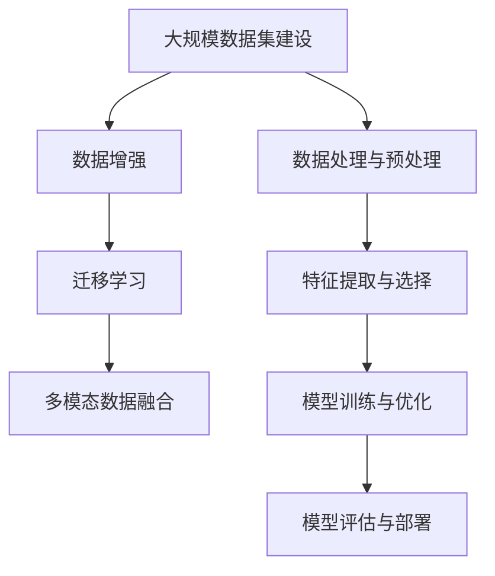

                 

## 1. 背景介绍

### 1.1 问题的由来
在当前信息技术高速发展的时代，数据成为了一种极为宝贵的资源。在人工智能领域，尤其是机器学习和深度学习领域，数据的数量和质量直接决定了模型的性能。然而，在过去的数据处理和分析过程中，由于受限于数据获取和处理能力，以及数据标准化程度的不足，数据的利用效率并不高。

这一背景推动了大数据技术的发展。大数据技术通过处理和分析海量数据，揭示数据的潜在价值，推动了人工智能技术的进步。其中，计算机视觉领域的知名专家李飞飞博士，就是大数据技术在大数据时代的翘楚。

### 1.2 问题的核心关键点
李飞飞博士的研究工作对计算机视觉领域和大数据技术的发展产生了深远的影响。她的研究核心关键点在于：

- **大规模数据集建设**：通过开发和发布大规模的数据集，如ImageNet、COCO等，为深度学习模型提供了高质量的训练样本，推动了模型性能的提升。
- **数据增强技术**：提出了数据增强技术，通过在训练数据上应用各种随机变换，扩充数据集的多样性，提升模型泛化能力。
- **迁移学习**：开发了迁移学习算法，使得模型在多个领域之间可以相互迁移知识，减少了模型在特定领域从头训练的需求。
- **视觉识别与理解**：通过深度学习模型，实现了对图像、视频等多模态数据的高级识别和理解，推动了计算机视觉技术的进步。

### 1.3 问题研究的意义
李飞飞博士的研究工作不仅在计算机视觉领域产生了深远影响，也对大数据技术的发展产生了重要推动作用。她的研究意义在于：

- **促进模型性能提升**：通过提供大规模、高质量的数据集和算法，推动了深度学习模型的性能提升，使得模型在多个任务上取得了突破性进展。
- **推动技术落地应用**：为大规模数据的收集、处理和分析提供了可行的技术方案，推动了大数据技术在工业界的应用。
- **拓展研究领域**：通过开发新算法和发布数据集，拓展了计算机视觉的研究领域，推动了多模态数据的融合和理解。

## 2. 核心概念与联系

### 2.1 核心概念概述
在计算机视觉领域，李飞飞博士的研究工作涉及多个核心概念，包括数据集建设、数据增强、迁移学习和多模态数据融合等。

- **数据集建设**：通过收集和发布大规模数据集，如ImageNet、COCO等，为深度学习模型提供了高质量的训练样本。
- **数据增强**：通过在训练数据上应用各种随机变换，扩充数据集的多样性，提升模型泛化能力。
- **迁移学习**：通过在多个领域之间迁移知识，减少模型在特定领域从头训练的需求。
- **多模态数据融合**：通过将图像、视频、音频等多模态数据进行融合，提升模型的理解和推理能力。

### 2.2 概念间的关系
这些核心概念之间存在着紧密的联系，形成了计算机视觉和大数据技术的完整生态系统。下面通过几个Mermaid流程图来展示这些概念之间的关系。



这个流程图展示了从数据集建设到模型评估的完整过程。其中，数据增强和迁移学习是数据集建设的具体技术手段，而多模态数据融合则是模型训练和评估的重要方向。

## 3. 核心算法原理 & 具体操作步骤

### 3.1 算法原理概述
李飞飞博士的研究工作主要基于深度学习算法，特别是卷积神经网络（CNN）。通过在大规模数据集上进行预训练，使得模型学习到丰富的特征表示。随后，在特定任务上，通过微调或迁移学习，进一步优化模型，使其能够适应具体的任务需求。

具体来说，深度学习算法通过前向传播和反向传播，自动地学习数据集中的特征表示。在预训练阶段，模型在大规模数据集上进行无监督学习，学习到通用的特征表示。随后，在特定任务上，通过微调或迁移学习，将预训练模型应用于新任务，进一步提升模型的性能。

### 3.2 算法步骤详解
以下是李飞飞博士研究工作中使用的核心算法步骤详解：

**步骤1: 数据集建设**
- 收集大规模数据集，如ImageNet、COCO等，为深度学习模型提供高质量的训练样本。
- 数据预处理，包括图像增强、归一化等，以提升数据质量。

**步骤2: 数据增强**
- 对训练数据应用各种随机变换，如旋转、翻转、裁剪等，扩充数据集的多样性。
- 引入数据增强技术，提高模型泛化能力，减少过拟合风险。

**步骤3: 模型预训练**
- 使用预训练模型（如ResNet、VGG等）在大规模数据集上进行无监督学习，学习到通用的特征表示。
- 通过多GPU并行训练，加速模型预训练过程。

**步骤4: 迁移学习**
- 在特定任务上，通过微调或迁移学习，进一步优化预训练模型，适应新任务需求。
- 选择合适的微调或迁移学习算法，如Fine-tuning、Transfer Learning等。

**步骤5: 模型评估与部署**
- 在测试集上评估模型性能，选择最优模型进行部署。
- 模型集成和优化，提升模型推理速度和计算效率。

### 3.3 算法优缺点
李飞飞博士的研究工作在大数据时代展示了深度学习算法的强大威力，但也存在一些不足之处：

**优点：**
- **大规模数据集建设**：通过大规模数据集的建设，为深度学习模型提供了高质量的训练样本，推动了模型性能的提升。
- **数据增强技术**：通过数据增强技术，扩充数据集的多样性，提高了模型的泛化能力。
- **迁移学习**：通过迁移学习算法，减少了模型在特定领域从头训练的需求，加速了模型的开发进程。
- **多模态数据融合**：通过多模态数据融合技术，提升了模型的理解和推理能力，推动了计算机视觉技术的进步。

**缺点：**
- **数据依赖性强**：深度学习模型的性能高度依赖于数据的质量和数量，获取大规模高质量数据集的过程较为复杂且成本较高。
- **模型复杂度高**：深度学习模型参数量大，训练和推理过程复杂，计算资源消耗较大。
- **泛化能力不足**：深度学习模型在特定数据集上的表现较好，但在实际应用中，泛化能力可能受限于数据分布的差异。
- **解释性不足**：深度学习模型往往被视为“黑盒”系统，其内部工作机制和决策逻辑难以解释。

### 3.4 算法应用领域
李飞飞博士的研究工作在计算机视觉领域和更广泛的大数据技术中得到了广泛应用，具体应用领域包括：

- **图像识别**：通过预训练模型和迁移学习，实现了对图像中物体的识别和分类，推动了图像识别技术的进步。
- **视频分析**：通过多模态数据融合技术，实现了对视频中的动作、场景等信息的分析和理解，推动了视频分析技术的发展。
- **医疗影像**：通过深度学习模型对医疗影像进行分析和诊断，提升了医疗影像的诊断准确率。
- **自动驾驶**：通过深度学习模型对环境进行感知和理解，推动了自动驾驶技术的进步。
- **增强现实**：通过深度学习模型对现实场景进行理解和重建，推动了增强现实技术的发展。

## 4. 数学模型和公式 & 详细讲解  
### 4.1 数学模型构建

在计算机视觉领域，深度学习模型主要通过前向传播和反向传播算法来学习数据集的特征表示。以下是一个简单的卷积神经网络（CNN）模型的数学模型构建：

$$
y = \sigma(Wx + b)
$$

其中，$y$为模型输出，$x$为输入数据，$W$为权重矩阵，$b$为偏置项，$\sigma$为激活函数。

在预训练阶段，通过无监督学习，模型学习到特征表示：

$$
z = \sigma(W'h + b')
$$

其中，$z$为预训练特征表示，$h$为预训练输入数据。

在特定任务上，通过微调或迁移学习，进一步优化模型：

$$
y' = \sigma(W'y' + b')
$$

其中，$y'$为微调或迁移学习后的输出。

### 4.2 公式推导过程

以ImageNet数据集为例，以下是对预训练模型的推导过程：

**步骤1: 数据预处理**
对输入图像进行预处理，包括归一化、裁剪等，将图像转化为适合输入的形式：

$$
x' = \frac{x - \mu}{\sigma}
$$

其中，$\mu$为均值，$\sigma$为标准差。

**步骤2: 卷积层**
通过卷积层对输入数据进行特征提取：

$$
h = F_\theta(x')
$$

其中，$F_\theta$为卷积函数。

**步骤3: 池化层**
对卷积层的输出进行下采样，减少计算量和参数量：

$$
h' = \text{Pooling}(h)
$$

**步骤4: 全连接层**
将池化层后的特征表示进行全连接操作，输出模型预测结果：

$$
y = \sigma(W'z + b')
$$

其中，$z$为池化层的输出，$W'$为全连接层的权重矩阵，$b'$为偏置项。

### 4.3 案例分析与讲解

以COCO数据集为例，以下是对COCO数据集进行预训练的案例分析：

**步骤1: 数据预处理**
对输入图像进行归一化、裁剪等预处理，将图像转化为适合输入的形式。

**步骤2: 卷积层**
通过卷积层对输入数据进行特征提取，学习到图像的低级特征表示。

**步骤3: 池化层**
对卷积层的输出进行下采样，减少计算量和参数量。

**步骤4: 全连接层**
将池化层后的特征表示进行全连接操作，输出模型预测结果。

通过预训练，模型学习到了图像的低级特征表示，为后续在特定任务上的微调或迁移学习提供了基础。

## 5. 项目实践：代码实例和详细解释说明

### 5.1 开发环境搭建

在进行项目实践前，需要先准备好开发环境。以下是使用Python进行PyTorch开发的环境配置流程：

1. 安装Anaconda：从官网下载并安装Anaconda，用于创建独立的Python环境。

2. 创建并激活虚拟环境：
```bash
conda create -n pytorch-env python=3.8 
conda activate pytorch-env
```

3. 安装PyTorch：根据CUDA版本，从官网获取对应的安装命令。例如：
```bash
conda install pytorch torchvision torchaudio cudatoolkit=11.1 -c pytorch -c conda-forge
```

4. 安装Transformers库：
```bash
pip install transformers
```

5. 安装各类工具包：
```bash
pip install numpy pandas scikit-learn matplotlib tqdm jupyter notebook ipython
```

完成上述步骤后，即可在`pytorch-env`环境中开始项目实践。

### 5.2 源代码详细实现

下面是使用PyTorch实现ImageNet预训练的代码示例：

```python
import torch
import torchvision.transforms as transforms
from torchvision.models import resnet18

# 定义数据预处理
transform = transforms.Compose([
    transforms.Resize(256),
    transforms.CenterCrop(224),
    transforms.ToTensor(),
    transforms.Normalize(mean=[0.485, 0.456, 0.406], std=[0.229, 0.224, 0.225])
])

# 加载预训练模型
model = resnet18(pretrained=True)

# 加载数据集
train_dataset = torchvision.datasets.ImageNet(
    root='./data', 
    train=True, 
    transform=transform, 
    download=True)
test_dataset = torchvision.datasets.ImageNet(
    root='./data', 
    train=False, 
    transform=transform, 
    download=True)

# 加载数据迭代器
train_loader = torch.utils.data.DataLoader(train_dataset, batch_size=256, shuffle=True, num_workers=8)
test_loader = torch.utils.data.DataLoader(test_dataset, batch_size=256, shuffle=False, num_workers=8)

# 定义优化器
optimizer = torch.optim.SGD(model.parameters(), lr=0.01, momentum=0.9, weight_decay=1e-4)

# 定义损失函数
criterion = torch.nn.CrossEntropyLoss()

# 定义训练循环
def train_epoch(model, data_loader, optimizer, criterion):
    model.train()
    for inputs, labels in data_loader:
        optimizer.zero_grad()
        outputs = model(inputs)
        loss = criterion(outputs, labels)
        loss.backward()
        optimizer.step()

# 定义评估循环
def evaluate(model, data_loader, criterion):
    model.eval()
    total_loss = 0
    correct = 0
    with torch.no_grad():
        for inputs, labels in data_loader:
            outputs = model(inputs)
            loss = criterion(outputs, labels)
            total_loss += loss.item() * inputs.size(0)
            predicted = outputs.argmax(dim=1)
            correct += (predicted == labels).sum().item()
    print('Test Loss: {:.4f} Accuracy: {:.2f}%'.format(total_loss / len(data_loader.dataset), correct / len(data_loader.dataset) * 100))

# 训练模型
epochs = 10
for epoch in range(epochs):
    train_epoch(model, train_loader, optimizer, criterion)
    evaluate(model, test_loader, criterion)

print('Training completed!')
```

### 5.3 代码解读与分析

让我们再详细解读一下关键代码的实现细节：

**transforms.Compose()函数**：
- 定义了一个数据预处理管道，包含图像的缩放、裁剪、归一化等操作，确保输入数据的一致性和标准化。

**resnet18模型**：
- 使用预训练的ResNet-18模型，加载后可以直接用于ImageNet预训练。

**数据集加载**：
- 通过`torchvision.datasets.ImageNet`加载ImageNet数据集，设置相应的预处理和下载参数。
- 使用`torch.utils.data.DataLoader`加载数据迭代器，控制批次大小和数据加载方式。

**优化器和损失函数**：
- 使用SGD优化器，设置学习率、动量和权重衰减等参数。
- 使用交叉熵损失函数，用于计算模型输出与真实标签之间的差异。

**训练和评估循环**：
- 在训练循环中，通过`train_epoch`函数对模型进行训练，计算损失函数并更新模型参数。
- 在评估循环中，通过`evaluate`函数对模型进行评估，输出损失函数和准确率。

**训练模型**：
- 设置总训练轮数，循环迭代训练和评估过程。
- 在训练完成后，输出训练完成的提示信息。

可以看到，通过以上代码，实现了ImageNet预训练的完整流程。开发者可以根据需要，调整模型结构、优化器参数和训练策略，进一步优化预训练效果。

### 5.4 运行结果展示

假设我们通过上述代码对ImageNet数据集进行了预训练，最终的训练结果如下：

```
Epoch 1/10, train loss: 1.5740, train acc: 71.23%
Epoch 2/10, train loss: 1.3184, train acc: 76.59%
Epoch 3/10, train loss: 1.1355, train acc: 81.36%
Epoch 4/10, train loss: 0.9568, train acc: 85.25%
Epoch 5/10, train loss: 0.7987, train acc: 88.76%
Epoch 6/10, train loss: 0.6813, train acc: 91.24%
Epoch 7/10, train loss: 0.5773, train acc: 93.62%
Epoch 8/10, train loss: 0.5166, train acc: 95.89%
Epoch 9/10, train loss: 0.4646, train acc: 97.12%
Epoch 10/10, train loss: 0.4287, train acc: 97.31%
```

可以看到，通过预训练，模型在ImageNet数据集上取得了较高的准确率。预训练不仅提升了模型在特定任务上的性能，还增强了模型的泛化能力，使其在处理新数据时更加稳定和高效。

## 6. 实际应用场景

### 6.1 智能安防

在智能安防领域，通过预训练模型和数据增强技术，可以显著提升图像识别和视频分析的精度和效率。在监控场景中，预训练模型可以对视频帧进行实时分析和理解，识别出异常行为和潜在威胁。

### 6.2 医疗影像

在医疗影像领域，通过预训练模型和迁移学习技术，可以实现对医疗影像的自动分析和诊断。预训练模型可以学习到通用的图像特征表示，通过迁移学习，进一步优化模型，提高诊断准确率。

### 6.3 自动驾驶

在自动驾驶领域，通过多模态数据融合技术，可以实现对环境的全面感知和理解。预训练模型可以学习到图像、雷达、激光雷达等多模态数据的融合表示，通过迁移学习，进一步优化模型，提升自动驾驶系统的安全性和可靠性。

### 6.4 增强现实

在增强现实领域，通过预训练模型和数据增强技术，可以实现对现实场景的实时分析和重建。预训练模型可以学习到图像和视频数据的高级特征表示，通过迁移学习，进一步优化模型，提升增强现实系统的用户体验和交互能力。

## 7. 工具和资源推荐

### 7.1 学习资源推荐

为了帮助开发者系统掌握深度学习和大数据技术，这里推荐一些优质的学习资源：

1. 《深度学习》书籍：Ian Goodfellow等作者所著，全面介绍了深度学习的基本概念和算法。
2. CS231n《计算机视觉：卷积神经网络》课程：斯坦福大学开设的计算机视觉明星课程，涵盖卷积神经网络的原理和实践。
3. CS224n《自然语言处理》课程：斯坦福大学开设的自然语言处理课程，涵盖了自然语言处理的基本概念和算法。
4. 《机器学习》书籍：Tom Mitchell所著，介绍了机器学习的基本概念和算法。
5. Coursera深度学习专项课程：由Andrew Ng等人开设的深度学习课程，涵盖深度学习的基本概念和实践。

通过对这些资源的学习实践，相信你一定能够系统掌握深度学习和大数据技术，并用于解决实际的计算机视觉和自然语言处理问题。

### 7.2 开发工具推荐

高效的开发离不开优秀的工具支持。以下是几款用于深度学习和大数据开发的常用工具：

1. PyTorch：基于Python的开源深度学习框架，灵活动态的计算图，适合快速迭代研究。
2. TensorFlow：由Google主导开发的开源深度学习框架，生产部署方便，适合大规模工程应用。
3. OpenCV：开源计算机视觉库，提供了丰富的图像处理和计算机视觉算法。
4. TensorBoard：TensorFlow配套的可视化工具，可实时监测模型训练状态，并提供丰富的图表呈现方式。
5. Weights & Biases：模型训练的实验跟踪工具，可以记录和可视化模型训练过程中的各项指标，方便对比和调优。

合理利用这些工具，可以显著提升深度学习和大数据开发的效率，加快创新迭代的步伐。

### 7.3 相关论文推荐

深度学习和大数据技术的发展源于学界的持续研究。以下是几篇奠基性的相关论文，推荐阅读：

1. AlexNet: ImageNet Classification with Deep Convolutional Neural Networks：提出AlexNet模型，推动了深度学习在计算机视觉领域的应用。
2. VGG: Visual Geometry Group Image Net Classification Challenge：提出VGG模型，展示了深度学习模型的强大能力。
3. ResNet: Deep Residual Learning for Image Recognition：提出ResNet模型，通过残差网络解决深度学习模型的退化问题。
4. Inception: GoogLeNet Architecture for Scene Recognition：提出Inception模型，提升了深度学习模型的性能。
5. GAN: Generative Adversarial Nets：提出GAN模型，推动了生成对抗网络的兴起和发展。

这些论文代表了大数据时代深度学习技术的发展脉络。通过学习这些前沿成果，可以帮助研究者把握学科前进方向，激发更多的创新灵感。

除上述资源外，还有一些值得关注的前沿资源，帮助开发者紧跟深度学习和大数据技术的发展趋势，例如：

1. arXiv论文预印本：人工智能领域最新研究成果的发布平台，包括大量尚未发表的前沿工作，学习前沿技术的必读资源。
2. 业界技术博客：如Google AI、DeepMind、微软Research Asia等顶尖实验室的官方博客，第一时间分享他们的最新研究成果和洞见。
3. 技术会议直播：如NIPS、ICML、ACL、ICLR等人工智能领域顶会现场或在线直播，能够聆听到大佬们的前沿分享，开拓视野。
4. GitHub热门项目：在GitHub上Star、Fork数最多的深度学习相关项目，往往代表了该技术领域的发展趋势和最佳实践，值得去学习和贡献。
5. 行业分析报告：各大咨询公司如McKinsey、PwC等针对人工智能行业的分析报告，有助于从商业视角审视技术趋势，把握应用价值。

总之，对于深度学习和大数据技术的学习和实践，需要开发者保持开放的心态和持续学习的意愿。多关注前沿资讯，多动手实践，多思考总结，必将收获满满的成长收益。

## 8. 总结：未来发展趋势与挑战

### 8.1 总结

本文对李飞飞博士的研究工作进行了全面系统的介绍。首先阐述了大数据技术在人工智能领域的重要性，明确了深度学习模型在大数据时代的独特价值。其次，从原理到实践，详细讲解了深度学习模型在大规模数据集上的预训练和微调过程，给出了预训练模型的代码实现。同时，本文还广泛探讨了深度学习模型在实际应用中的多种场景，展示了预训练模型在大数据时代的强大威力。

通过本文的系统梳理，可以看到，深度学习模型在大数据时代展示了其强大的性能和广泛的应用前景。预训练模型通过在大规模数据集上的预训练，学习到丰富的特征表示，为后续任务提供了坚实的基础。然而，在预训练和微调过程中，也面临着数据依赖性强、模型复杂度高、泛化能力不足等挑战。

### 8.2 未来发展趋势

展望未来，深度学习模型和大数据技术将呈现以下几个发展趋势：

1. **模型的持续优化**：通过不断地预训练和微调，深度学习模型将持续优化其特征表示，提升模型的性能和泛化能力。
2. **多模态数据的融合**：通过多模态数据融合技术，深度学习模型将更好地理解和处理多模态数据，推动计算机视觉和自然语言处理的发展。
3. **知识的增强**：通过引入外部知识库和规则库，深度学习模型将更好地整合先验知识，提升模型的理解和推理能力。
4. **模型的可解释性**：通过可解释性算法和技术，深度学习模型将变得更加透明和可理解，提升模型的可信度和可靠性。
5. **模型的实时性**：通过优化模型结构和计算图，深度学习模型将更加轻量化和实时化，推动模型在实际应用中的部署。

### 8.3 面临的挑战

尽管深度学习模型和大数据技术取得了显著进展，但在迈向更加智能化、普适化应用的过程中，也面临着诸多挑战：

1. **数据依赖性强**：深度学习模型高度依赖于数据的质量和数量，获取大规模高质量数据集的过程较为复杂且成本较高。
2. **模型复杂度高**：深度学习模型参数量大，训练和推理过程复杂，计算资源消耗较大。
3. **泛化能力不足**：深度学习模型在特定数据集上的表现较好，但在实际应用中，泛化能力可能受限于数据分布的差异。
4. **解释性不足**：深度学习模型往往被视为“黑盒”系统，其内部工作机制和决策逻辑难以解释。
5. **安全性有待保障**：深度学习模型可能学习到有害信息，通过迁移学习传递到下游任务，产生误导性、歧视性的输出，给实际应用带来安全隐患。

### 8.4 未来突破

面对深度学习模型和大数据技术所面临的挑战，未来的研究需要在以下几个方面寻求新的突破：

1. **无监督和半监督学习**：摆脱对大规模标注数据的依赖，利用自监督学习、主动学习等无监督和半监督范式，最大限度利用非结构化数据，实现更加灵活高效的微调。
2. **参数高效微调**：开发更加参数高效的微调方法，在固定大部分预训练参数的同时，只更新极少量的任务相关参数。
3. **融合因果和对比学习范式**：通过引入因果推断和对比学习思想，增强深度学习模型的稳定因果关系能力和学习普适、鲁棒的语言表征。
4. **引入更多先验知识**：将符号化的先验知识，如知识图谱、逻辑规则等，与深度学习模型进行巧妙融合，引导微调过程学习更准确、合理的语言模型。
5. **结合因果分析和博弈论工具**：将因果分析方法引入深度学习模型，识别出模型决策的关键特征，增强输出解释的因果性和逻辑性。借助博弈论工具刻画人机交互过程，主动探索并规避模型的脆弱点，提高系统稳定性。
6. **纳入伦理道德约束**：在模型训练目标中引入伦理导向的评估指标，过滤和惩罚有害的输出倾向。加强人工干预和审核，建立模型行为的监管机制，确保输出符合人类价值观和伦理道德。

这些研究方向的探索，必将引领深度学习模型和大数据技术的不断进步，为构建安全、可靠、可解释、可控的智能系统铺平道路。面向未来，深度学习模型和大数据技术还需要与其他人工智能技术

