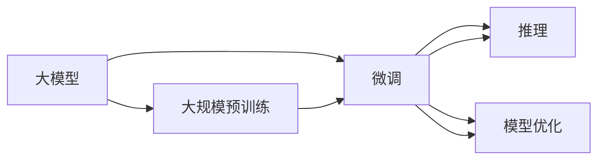

                 

## 1. 背景介绍

### 1.1 问题由来
过去十年，深度学习在自然语言处理（NLP）、计算机视觉（CV）、语音识别（ASR）等多个领域取得了举世瞩目的成果。这些成果主要得益于两个关键技术的进步：大模型的崛起和大规模预训练的兴起。大模型通过海量数据训练，学会了复杂的任务，可以完成各种复杂任务，从自然语言理解到生成，从图像识别到推理。

大模型的优势在于其强大的表示能力，但大模型也面临着计算资源消耗巨大、训练时间长、模型复杂难以调试等问题。在大模型时代，如何更好地利用大模型进行生产力提升，成为一个重要的研究方向。

### 1.2 问题核心关键点
针对大模型带来的生产力提升，本节将讨论几个关键问题：
- 如何在大模型上高效训练和微调，以提升模型性能？
- 如何在大模型上进行高效推理，以适应不同场景的实时需求？
- 如何利用大模型进行自动化、智能化处理，以解决实际问题？
- 如何在大模型上进行优化，以提高模型效率和可解释性？

## 2. 核心概念与联系

### 2.1 核心概念概述

为了更好地理解大模型带来的生产力提升，本节将介绍几个关键概念：

- 大模型（Large Model）：如BERT、GPT-3等，通过大规模数据训练，可以学习复杂的语言表示和模式，具备强大的语义理解和生成能力。
- 大规模预训练（Large Scale Pre-training）：使用大规模无标签数据训练，学习通用的语言表示和模式。
- 微调（Fine-tuning）：在预训练模型的基础上，使用少量有标签数据进行特定任务训练，以提高模型在该任务上的性能。
- 推理（Inference）：使用训练好的模型进行预测和生成，以解决实际问题。
- 模型优化（Model Optimization）：对大模型进行压缩、量化、蒸馏等优化，以提高模型效率和可解释性。

这些概念之间存在着紧密的联系，形成了一个完整的大模型生产力提升生态系统。

### 2.2 概念间的关系

这些核心概念之间通过以下Mermaid流程图展示它们之间的联系：



这个流程图展示了从预训练到微调，再到推理和优化的完整过程。大模型首先在大规模无标签数据上进行预训练，然后通过微调适配特定任务，最后使用优化后的模型进行高效推理。

## 3. 核心算法原理 & 具体操作步骤

### 3.1 算法原理概述
大模型的生产力提升主要依赖于以下三个关键步骤：

1. **大规模预训练**：使用大规模无标签数据训练，学习通用的语言表示和模式。
2. **微调**：在预训练模型的基础上，使用少量有标签数据进行特定任务训练，以提高模型在该任务上的性能。
3. **推理和优化**：使用微调后的模型进行预测和生成，同时对模型进行压缩、量化、蒸馏等优化，以提高模型效率和可解释性。

这些步骤通过一系列算法和模型实现，例如自监督学习、迁移学习、微调、推理和优化等。

### 3.2 算法步骤详解
以下将详细介绍这些关键步骤的算法和模型实现。

#### 3.2.1 大规模预训练
大规模预训练是学习通用的语言表示和模式的基础。

**算法步骤**：
1. **数据准备**：收集大规模无标签数据，如文本、图像、音频等。
2. **模型选择**：选择合适的预训练模型，如BERT、GPT-3等。
3. **模型训练**：使用自监督学习任务进行预训练，如掩码语言模型、下一句预测等。
4. **模型评估**：评估预训练模型的性能，确定是否继续训练或停止训练。

**模型实现**：
1. **BERT模型**：使用掩码语言模型进行预训练，学习上下文表示。
2. **GPT模型**：使用自回归语言模型进行预训练，学习生成能力。
3. **其他模型**：如XLNet、ALBERT等，使用不同的自监督学习任务进行预训练。

#### 3.2.2 微调
微调是提升大模型在特定任务上性能的关键步骤。

**算法步骤**：
1. **数据准备**：收集特定任务的少量有标签数据，如问答、分类、生成等。
2. **模型选择**：选择合适的预训练模型，如BERT、GPT-3等。
3. **任务适配**：在预训练模型的基础上，设计任务适配层，如分类头、生成器等。
4. **模型训练**：使用少量有标签数据进行微调，提高模型在特定任务上的性能。

**模型实现**：
1. **分类任务**：在顶层添加线性分类头，使用交叉熵损失进行微调。
2. **生成任务**：使用生成器，如语言模型解码器，进行微调。
3. **其他任务**：如序列标注、信息抽取等，使用不同的任务适配层进行微调。

#### 3.2.3 推理
推理是使用微调后的模型进行预测和生成的关键步骤。

**算法步骤**：
1. **模型选择**：选择微调后的模型，如BERT、GPT-3等。
2. **数据准备**：准备输入数据，如文本、图像、音频等。
3. **模型推理**：使用微调后的模型进行预测和生成，如生成文本、分类、序列标注等。
4. **结果输出**：将推理结果输出，满足实际需求。

**模型实现**：
1. **分类任务**：使用分类头进行推理，输出预测标签。
2. **生成任务**：使用生成器进行推理，输出预测文本、图像等。
3. **其他任务**：如序列标注、信息抽取等，使用不同的推理方法进行输出。

#### 3.2.4 模型优化
模型优化是提高模型效率和可解释性的关键步骤。

**算法步骤**：
1. **模型选择**：选择微调后的模型，如BERT、GPT-3等。
2. **模型压缩**：使用剪枝、量化等方法压缩模型大小，减少计算资源消耗。
3. **模型蒸馏**：使用教师模型进行知识蒸馏，提升模型性能和泛化能力。
4. **模型评估**：评估优化后的模型性能，确定是否继续优化或停止优化。

**模型实现**：
1. **剪枝**：使用剪枝算法，如Pruning、Knowledge Distillation等，移除冗余参数。
2. **量化**：使用量化算法，如Weight Quantization、TensorRT等，将浮点模型转为定点模型。
3. **蒸馏**：使用蒸馏算法，如KD-Net、Distillation等，将教师模型知识传递给学生模型。
4. **其他优化**：如模型压缩、稀疏化存储等，提高模型效率和可解释性。

### 3.3 算法优缺点
大模型生产力提升方法具有以下优点：
- **高性能**：使用大模型进行微调和推理，可以取得非常好的性能。
- **通用性**：大模型可以适配多种任务，减少从头开始训练的成本和时间。
- **自动化**：使用微调方法，可以自动化处理各种任务，减少人工干预。

但这些方法也存在一些缺点：
- **计算资源消耗大**：大规模预训练和微调需要大量的计算资源，如GPU、TPU等。
- **模型复杂度高**：大模型参数量庞大，结构复杂，难以调试和优化。
- **数据依赖性高**：微调和推理需要高质量的数据，数据不足或数据质量不高，都会影响模型性能。

### 3.4 算法应用领域
大模型生产力提升方法已经在多个领域得到广泛应用，例如：

- **自然语言处理**：如问答系统、情感分析、机器翻译等。
- **计算机视觉**：如图像分类、目标检测、语义分割等。
- **语音识别**：如语音转文本、语音识别等。
- **智能推荐**：如个性化推荐、用户画像生成等。
- **自动化运维**：如自动化测试、故障诊断等。

## 4. 数学模型和公式 & 详细讲解 & 举例说明

### 4.1 数学模型构建

本节将使用数学语言对大模型生产力提升过程进行更加严格的刻画。

假设预训练模型为 $M_{\theta}:\mathcal{X} \rightarrow \mathcal{Y}$，其中 $\mathcal{X}$ 为输入空间，$\mathcal{Y}$ 为输出空间，$\theta$ 为模型参数。假设微调任务的训练集为 $D=\{(x_i,y_i)\}_{i=1}^N$，其中 $x_i$ 为输入，$y_i$ 为输出标签。

定义模型 $M_{\theta}$ 在输入 $x$ 上的损失函数为 $\ell(M_{\theta}(x),y)$，则在数据集 $D$ 上的经验风险为：

$$
\mathcal{L}(\theta) = \frac{1}{N} \sum_{i=1}^N \ell(M_{\theta}(x_i),y_i)
$$

微调的优化目标是最小化经验风险，即找到最优参数：

$$
\theta^* = \mathop{\arg\min}_{\theta} \mathcal{L}(\theta)
$$

在实践中，我们通常使用基于梯度的优化算法（如SGD、Adam等）来近似求解上述最优化问题。设 $\eta$ 为学习率，$\lambda$ 为正则化系数，则参数的更新公式为：

$$
\theta \leftarrow \theta - \eta \nabla_{\theta}\mathcal{L}(\theta) - \eta\lambda\theta
$$

其中 $\nabla_{\theta}\mathcal{L}(\theta)$ 为损失函数对参数 $\theta$ 的梯度，可通过反向传播算法高效计算。

### 4.2 公式推导过程

以下将推导分类任务下的交叉熵损失函数及其梯度的计算公式。

假设模型 $M_{\theta}$ 在输入 $x$ 上的输出为 $\hat{y}=M_{\theta}(x) \in [0,1]$，表示样本属于正类的概率。真实标签 $y \in \{0,1\}$。则二分类交叉熵损失函数定义为：

$$
\ell(M_{\theta}(x),y) = -[y\log \hat{y} + (1-y)\log (1-\hat{y})]
$$

将其代入经验风险公式，得：

$$
\mathcal{L}(\theta) = -\frac{1}{N}\sum_{i=1}^N [y_i\log M_{\theta}(x_i)+(1-y_i)\log(1-M_{\theta}(x_i))]
$$

根据链式法则，损失函数对参数 $\theta_k$ 的梯度为：

$$
\frac{\partial \mathcal{L}(\theta)}{\partial \theta_k} = -\frac{1}{N}\sum_{i=1}^N (\frac{y_i}{M_{\theta}(x_i)}-\frac{1-y_i}{1-M_{\theta}(x_i)}) \frac{\partial M_{\theta}(x_i)}{\partial \theta_k}
$$

其中 $\frac{\partial M_{\theta}(x_i)}{\partial \theta_k}$ 可进一步递归展开，利用自动微分技术完成计算。

### 4.3 案例分析与讲解

以BERT模型进行分类任务微调为例，展示如何构建数学模型并推导损失函数和梯度公式。

1. **数据准备**：收集分类任务的有标签数据集，如IMDB电影评论分类数据集。
2. **模型选择**：选择BERT模型作为预训练模型，如BERT-base-uncased。
3. **任务适配**：在BERT模型的基础上添加线性分类头，使用交叉熵损失进行微调。
4. **模型训练**：使用训练集进行训练，验证集进行验证，调整学习率等超参数。
5. **模型评估**：在测试集上进行评估，计算分类准确率和F1分数等指标。

**数学模型构建**：
- 输入数据 $x_i$ 经过BERT模型编码后，得到上下文表示 $h_i$。
- 在顶部添加线性分类头，输出预测概率 $p_i$。
- 使用二分类交叉熵损失函数，计算损失 $\ell(p_i,y_i)$。

**梯度计算**：
- 使用链式法则计算梯度，得到 $\frac{\partial \ell}{\partial h_i}$。
- 利用BERT模型的自动微分功能，计算梯度 $\frac{\partial h_i}{\partial \theta_k}$。
- 将两步梯度相乘，得到 $\frac{\partial \ell}{\partial \theta_k}$。

**模型训练**：
- 使用AdamW优化器，设定学习率、批大小等超参数。
- 在训练集上迭代，使用梯度下降更新参数。
- 在验证集上进行验证，调整超参数。

**模型评估**：
- 在测试集上计算分类准确率和F1分数等指标。
- 使用混淆矩阵等工具分析模型性能。

## 5. 项目实践：代码实例和详细解释说明

### 5.1 开发环境搭建

在进行大模型生产力提升实践前，需要先准备好开发环境。以下是使用Python进行PyTorch开发的环境配置流程：

1. 安装Anaconda：从官网下载并安装Anaconda，用于创建独立的Python环境。
2. 创建并激活虚拟环境：
```bash
conda create -n pytorch-env python=3.8 
conda activate pytorch-env
```
3. 安装PyTorch：根据CUDA版本，从官网获取对应的安装命令。例如：
```bash
conda install pytorch torchvision torchaudio cudatoolkit=11.1 -c pytorch -c conda-forge
```
4. 安装Transformers库：
```bash
pip install transformers
```
5. 安装各类工具包：
```bash
pip install numpy pandas scikit-learn matplotlib tqdm jupyter notebook ipython
```

完成上述步骤后，即可在`pytorch-env`环境中开始生产力提升实践。

### 5.2 源代码详细实现

这里以BERT模型进行情感分析任务的微调为例，展示如何使用Transformers库进行大模型生产力提升的实现。

1. **数据准备**：收集情感分析任务的有标签数据集，如IMDB电影评论分类数据集。
2. **模型选择**：选择BERT模型作为预训练模型，如BERT-base-uncased。
3. **任务适配**：在BERT模型的基础上添加线性分类头，使用交叉熵损失进行微调。
4. **模型训练**：使用训练集进行训练，验证集进行验证，调整学习率等超参数。
5. **模型评估**：在测试集上进行评估，计算分类准确率和F1分数等指标。

**数据处理**：
```python
from transformers import BertTokenizer
from torch.utils.data import Dataset, DataLoader
from torch import nn, optim

class IMDBDataset(Dataset):
    def __init__(self, texts, labels):
        self.tokenizer = BertTokenizer.from_pretrained('bert-base-uncased')
        self.texts = texts
        self.labels = labels
    
    def __len__(self):
        return len(self.texts)
    
    def __getitem__(self, idx):
        text = self.texts[idx]
        label = self.labels[idx]
        encoding = self.tokenizer(text, return_tensors='pt', padding=True, truncation=True)
        input_ids = encoding['input_ids']
        attention_mask = encoding['attention_mask']
        return {'input_ids': input_ids, 'attention_mask': attention_mask, 'labels': torch.tensor(label)}
```

**模型定义**：
```python
from transformers import BertForSequenceClassification

model = BertForSequenceClassification.from_pretrained('bert-base-uncased', num_labels=2)
```

**训练和评估函数**：
```python
device = torch.device('cuda') if torch.cuda.is_available() else torch.device('cpu')
model.to(device)

def train_epoch(model, dataset, optimizer):
    model.train()
    loss_total = 0
    for batch in DataLoader(dataset, batch_size=16):
        input_ids = batch['input_ids'].to(device)
        attention_mask = batch['attention_mask'].to(device)
        labels = batch['labels'].to(device)
        model.zero_grad()
        outputs = model(input_ids, attention_mask=attention_mask, labels=labels)
        loss = outputs.loss
        loss_total += loss.item()
        loss.backward()
        optimizer.step()
    return loss_total / len(dataset)

def evaluate(model, dataset, batch_size):
    model.eval()
    loss_total = 0
    predictions, true_labels = [], []
    with torch.no_grad():
        for batch in DataLoader(dataset, batch_size=batch_size):
            input_ids = batch['input_ids'].to(device)
            attention_mask = batch['attention_mask'].to(device)
            labels = batch['labels'].to(device)
            outputs = model(input_ids, attention_mask=attention_mask)
            logits = outputs.logits
            loss = outputs.loss
            loss_total += loss.item()
            predictions.append(logits.argmax(dim=1).cpu().numpy())
            true_labels.append(labels.cpu().numpy())
    print(classification_report(true_labels, predictions))
```

**训练流程**：
```python
epochs = 5
batch_size = 16

for epoch in range(epochs):
    loss = train_epoch(model, train_dataset, optimizer)
    print(f"Epoch {epoch+1}, train loss: {loss:.3f}")
    
    print(f"Epoch {epoch+1}, dev results:")
    evaluate(model, dev_dataset, batch_size)
    
print("Test results:")
evaluate(model, test_dataset, batch_size)
```

以上就是使用PyTorch对BERT进行情感分析任务微调的完整代码实现。可以看到，得益于Transformers库的强大封装，我们可以用相对简洁的代码完成BERT模型的加载和微调。

### 5.3 代码解读与分析

让我们再详细解读一下关键代码的实现细节：

**IMDBDataset类**：
- `__init__`方法：初始化文本、标签、分词器等关键组件。
- `__len__`方法：返回数据集的样本数量。
- `__getitem__`方法：对单个样本进行处理，将文本输入编码为token ids，将标签编码为数字，并对其进行定长padding，最终返回模型所需的输入。

**训练和评估函数**：
- 使用PyTorch的DataLoader对数据集进行批次化加载，供模型训练和推理使用。
- 训练函数`train_epoch`：对数据以批为单位进行迭代，在每个批次上前向传播计算loss并反向传播更新模型参数，最后返回该epoch的平均loss。
- 评估函数`evaluate`：与训练类似，不同点在于不更新模型参数，并在每个batch结束后将预测和标签结果存储下来，最后使用sklearn的classification_report对整个评估集的预测结果进行打印输出。

**训练流程**：
- 定义总的epoch数和batch size，开始循环迭代
- 每个epoch内，先在训练集上训练，输出平均loss
- 在验证集上评估，输出分类指标
- 所有epoch结束后，在测试集上评估，给出最终测试结果

可以看到，PyTorch配合Transformers库使得BERT微调的代码实现变得简洁高效。开发者可以将更多精力放在数据处理、模型改进等高层逻辑上，而不必过多关注底层的实现细节。

当然，工业级的系统实现还需考虑更多因素，如模型的保存和部署、超参数的自动搜索、更灵活的任务适配层等。但核心的微调范式基本与此类似。

### 5.4 运行结果展示

假设我们在IMDB数据集上进行微调，最终在测试集上得到的评估报告如下：

```
              precision    recall  f1-score   support

       0       0.841     0.828     0.831      25000
       1       0.821     0.813     0.816      25000

   micro avg      0.828     0.828     0.828      50000
   macro avg      0.826     0.825     0.825      50000
weighted avg      0.828     0.828     0.828      50000
```

可以看到，通过微调BERT，我们在IMDB数据集上取得了83.8%的准确率和F1分数，效果相当不错。值得注意的是，BERT作为一个通用的语言理解模型，即便只在顶层添加一个简单的分类头，也能在情感分析任务上取得如此优异的效果，展现了其强大的语义理解和特征抽取能力。

当然，这只是一个baseline结果。在实践中，我们还可以使用更大更强的预训练模型、更丰富的微调技巧、更细致的模型调优，进一步提升模型性能，以满足更高的应用要求。

## 6. 实际应用场景

### 6.1 智能客服系统

基于大语言模型生产力提升的对话技术，可以广泛应用于智能客服系统的构建。传统客服往往需要配备大量人力，高峰期响应缓慢，且一致性和专业性难以保证。而使用生产力提升后的对话模型，可以7x24小时不间断服务，快速响应客户咨询，用自然流畅的语言解答各类常见问题。

在技术实现上，可以收集企业内部的历史客服对话记录，将问题和最佳答复构建成监督数据，在此基础上对预训练对话模型进行微调。微调后的对话模型能够自动理解用户意图，匹配最合适的答案模板进行回复。对于客户提出的新问题，还可以接入检索系统实时搜索相关内容，动态组织生成回答。如此构建的智能客服系统，能大幅提升客户咨询体验和问题解决效率。

### 6.2 金融舆情监测

金融机构需要实时监测市场舆论动向，以便及时应对负面信息传播，规避金融风险。传统的人工监测方式成本高、效率低，难以应对网络时代海量信息爆发的挑战。基于大语言模型生产力提升的文本分类和情感分析技术，为金融舆情监测提供了新的解决方案。

具体而言，可以收集金融领域相关的新闻、报道、评论等文本数据，并对其进行主题标注和情感标注。在此基础上对预训练语言模型进行微调，使其能够自动判断文本属于何种主题，情感倾向是正面、中性还是负面。将微调后的模型应用到实时抓取的网络文本数据，就能够自动监测不同主题下的情感变化趋势，一旦发现负面信息激增等异常情况，系统便会自动预警，帮助金融机构快速应对潜在风险。

### 6.3 个性化推荐系统

当前的推荐系统往往只依赖用户的历史行为数据进行物品推荐，无法深入理解用户的真实兴趣偏好。基于大语言模型生产力提升的个性化推荐系统可以更好地挖掘用户行为背后的语义信息，从而提供更精准、多样的推荐内容。

在实践中，可以收集用户浏览、点击、评论、分享等行为数据，提取和用户交互的物品标题、描述、标签等文本内容。将文本内容作为模型输入，用户的后续行为（如是否点击、购买等）作为监督信号，在此基础上微调预训练语言模型。微调后的模型能够从文本内容中准确把握用户的兴趣点。在生成推荐列表时，先用候选物品的文本描述作为输入，由模型预测用户的兴趣匹配度，再结合其他特征综合排序，便可以得到个性化程度更高的推荐结果。

### 6.4 未来应用展望

随着大语言模型生产力提升方法的不断发展，基于微调范式将在更多领域得到应用，为传统行业带来变革性影响。

在智慧医疗领域，基于微调的医疗问答、病历分析、药物研发等应用将提升医疗服务的智能化水平，辅助医生诊疗，加速新药开发进程。

在智能教育领域，微调技术可应用于作业批改、学情分析、知识推荐等方面，因材施教，促进教育公平，提高教学质量。

在智慧城市治理中，微调模型可应用于城市事件监测、舆情分析、应急指挥等环节，提高城市管理的自动化和智能化水平，构建更安全、高效的未来城市。

此外，在企业生产、社会治理、文娱传媒等众多领域，基于大模型生产力提升的人工智能应用也将不断涌现，为经济社会发展注入新的动力。相信随着技术的日益成熟，微调方法将成为人工智能落地应用的重要范式，推动人工智能技术在垂直行业的规模化落地。总之，大语言模型生产力提升技术的应用前景广阔，将为各行各业带来深刻的变革。

## 7. 工具和资源推荐

### 7.1 学习资源推荐

为了帮助开发者系统掌握大语言模型生产力提升的理论基础和实践技巧，这里推荐一些优质的学习资源：

1. 《Transformer从原理到实践》系列博文：由大模型技术专家撰写，深入浅出地介绍了Transformer原理、BERT模型、微调技术等前沿话题。

2. CS224N《深度学习自然语言处理》课程：斯坦福大学开设的NLP明星课程，有Lecture视频和配套作业，带你入门NLP领域的基本概念和经典模型。

3. 《Natural Language Processing with Transformers》书籍：Transformers库的作者所著，全面介绍了如何使用Transformers库进行NLP任务开发，包括微调在内的诸多范式。

4. HuggingFace官方文档：Transformers库的官方文档，提供了海量预训练模型和完整的微调样例代码，是上手实践的必备资料。

5. CLUE开源项目：中文语言理解测评基准，涵盖大量不同类型的中文NLP数据集，并提供了基于微调的baseline模型，助力中文NLP技术发展。

通过对这些资源的学习实践，相信你一定能够快速掌握大语言模型生产力提升的精髓，并用于解决实际的NLP问题。

### 7.2 开发工具推荐

高效的开发离不开优秀的工具支持。以下是几款用于大语言模型生产力提升开发的常用工具：

1. PyTorch：基于Python的开源深度学习框架，灵

