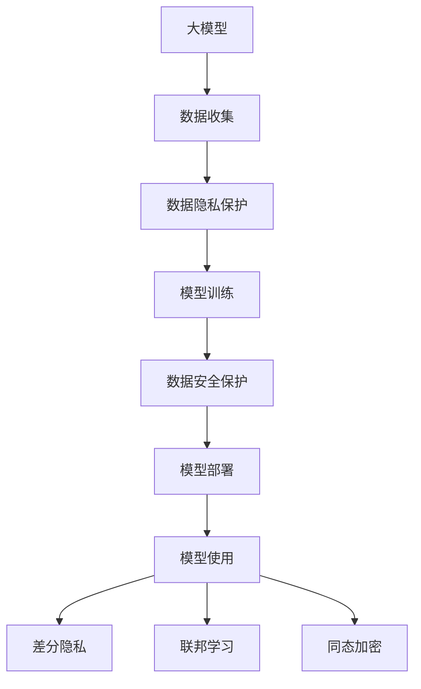

                 

## 1. 背景介绍

随着人工智能技术的迅速发展，大模型（如GPT-4、BERT等）的应用范围不断扩大，从文本生成、语音识别到图像处理等领域均有卓越表现。然而，大模型的应用也带来了数据隐私和安全方面的挑战。本文将从大模型应用落地的角度，探讨数据隐私保护的重要性、面临的挑战及应对措施，以期为相关领域的开发者提供有益的参考。

### 1.1 问题由来

在大模型应用落地过程中，数据隐私和安全问题愈发凸显。具体来说，这些问题主要体现在以下几个方面：

1. **数据收集**：为了训练大模型，需要收集大量数据。这些数据可能包含敏感信息，如个人身份、医疗记录等，若不当处理，易造成数据泄露。
2. **模型训练**：在模型训练过程中，数据可能被用于计算梯度，进而对原始数据造成潜在威胁。
3. **模型部署**：模型在生产环境中部署时，如何保证数据隐私，防止敏感信息被不当使用，是亟待解决的问题。
4. **模型使用**：模型在实际应用中可能涉及用户数据，如何保护用户隐私，防止数据滥用，是数据隐私保护的关键。

### 1.2 问题核心关键点

数据隐私和大模型应用落地的核心问题可以概括为以下几点：

- 如何确保数据收集、存储和传输过程中的安全性和隐私性。
- 如何在模型训练和部署中避免数据泄露和滥用。
- 如何在使用大模型时保护用户隐私，防止数据滥用。
- 如何平衡模型性能与数据隐私保护之间的关系。

## 2. 核心概念与联系

### 2.1 核心概念概述

- **大模型（Large Model）**：指具有大规模参数和复杂结构的深度学习模型，如GPT-4、BERT等。大模型在自然语言处理、计算机视觉等领域展现出卓越性能。
- **数据隐私（Data Privacy）**：指保护个人或组织数据的敏感信息不被未授权访问、泄露或滥用的过程。
- **数据安全（Data Security）**：指保护数据免受未经授权的访问、破坏、更改或泄露的技术和管理措施。
- **差分隐私（Differential Privacy）**：一种隐私保护技术，通过在数据分析过程中添加噪声，使得个体数据的差异对分析结果的影响尽可能小，从而保护个体隐私。
- **联邦学习（Federated Learning）**：一种分布式机器学习方法，各参与方在不共享数据的前提下，通过协同训练模型来提高性能。
- **同态加密（Homomorphic Encryption）**：一种加密技术，使得在加密数据上执行计算后，解密结果与直接对原始数据进行计算的结果相同。

### 2.2 概念间的关系

这些核心概念之间的联系可以通过以下Mermaid流程图来展示：



这个流程图展示了从大模型的数据收集、训练、部署到使用过程中，数据隐私保护和安全措施的必要性。差分隐私、联邦学习和同态加密等技术，为数据隐私保护提供了技术手段，与大模型的应用密不可分。

## 3. 核心算法原理 & 具体操作步骤

### 3.1 算法原理概述

大模型应用落地的核心算法原理包括以下几个方面：

1. **数据隐私保护技术**：如差分隐私、联邦学习和同态加密，用于保护数据隐私。
2. **数据安全技术**：如访问控制、加密存储、安全传输等，用于保护数据安全。
3. **模型安全技术**：如模型水印、模型压缩、模型微调等，用于保护模型安全。
4. **用户隐私保护技术**：如匿名化、去标识化、隐私计算等，用于保护用户隐私。

### 3.2 算法步骤详解

基于上述算法原理，大模型应用落地的具体操作步骤如下：

1. **数据收集**：确保数据收集过程遵循隐私保护标准，如匿名化、去标识化等。
2. **数据存储**：采用加密存储、访问控制等措施，保护数据安全。
3. **模型训练**：在模型训练过程中，采用差分隐私、联邦学习等技术，保护数据隐私。
4. **模型部署**：采用同态加密、模型水印等技术，保护模型安全。
5. **模型使用**：在模型使用过程中，采用隐私计算、匿名化等技术，保护用户隐私。

### 3.3 算法优缺点

大模型应用落地的算法具有以下优点：

- **提高数据隐私保护水平**：采用差分隐私、联邦学习等技术，保护数据隐私。
- **增强数据安全**：通过加密存储、访问控制等措施，增强数据安全性。
- **保障模型安全**：通过模型水印、模型压缩等技术，保障模型安全。
- **提升用户隐私保护**：采用匿名化、隐私计算等技术，保护用户隐私。

同时，这些算法也存在一些缺点：

- **技术复杂性高**：差分隐私、联邦学习等技术实现较为复杂，需要较高的技术门槛。
- **性能损耗**：差分隐私、同态加密等技术可能对模型性能产生一定影响。
- **成本高**：加密、隐私保护等技术实施成本较高，增加了系统开发和运维难度。

### 3.4 算法应用领域

大模型应用落地的算法在以下领域具有广泛应用：

- **医疗健康**：在医疗数据分析、疾病预测等方面，保护患者隐私，避免敏感信息泄露。
- **金融服务**：在金融风控、客户分析等方面，保护用户隐私，确保金融数据安全。
- **智能家居**：在智能设备数据收集、使用方面，保护用户隐私，避免数据滥用。
- **智能交通**：在交通数据分析、智能决策等方面，保护用户隐私，确保交通数据安全。
- **公共安全**：在视频监控、智能识别等方面，保护个人隐私，确保公共安全数据安全。

## 4. 数学模型和公式 & 详细讲解 & 举例说明

### 4.1 数学模型构建

为方便理解，我们以差分隐私为例，构建数学模型。设有一个数据集 $D$，包含 $n$ 个样本 $x_i$，每个样本 $x_i$ 的隐私敏感度为 $\epsilon$，差分隐私的目标是通过添加噪声 $\Delta$，使得模型 $M(x_i)$ 的输出与原始数据 $x_i$ 的关系尽可能小。数学模型如下：

$$ M_{\epsilon}(x_i) = M(x_i) + \Delta $$

其中，$M(x_i)$ 表示模型对原始数据的输出，$\Delta$ 为噪声向量。

### 4.2 公式推导过程

差分隐私的数学推导涉及最大差异（Max Difference）和隐私预算（Privacy Budget）两个概念。最大差异定义如下：

$$ \max_{x \in \mathcal{X}} |M_{\epsilon}(x) - M(x)| $$

隐私预算 $\epsilon$ 表示为隐私损失函数的值，定义如下：

$$ \epsilon = \frac{1}{2} \log \left( \frac{1}{\delta} \sum_{x \in \mathcal{X}} e^{-2\epsilon \cdot \max_{x \in \mathcal{X}} |M_{\epsilon}(x) - M(x)|} \right) $$

其中，$\delta$ 表示与原数据的差异阈值。

### 4.3 案例分析与讲解

假设有一个包含 1000 个样本的敏感数据集，每个样本的隐私敏感度为 $\epsilon=0.1$，使用差分隐私技术保护该数据集。首先，通过数学推导计算出隐私损失函数的最大值。然后，根据隐私预算计算出差分隐私保护的噪声向量 $\Delta$。最后，将噪声向量 $\Delta$ 添加到每个样本中，生成差分隐私数据集。

## 5. 项目实践：代码实例和详细解释说明

### 5.1 开发环境搭建

为了进行大模型应用落地的数据隐私保护实践，需要搭建一个Python开发环境，并安装必要的库。具体步骤如下：

1. 安装Python和Anaconda。
2. 创建虚拟环境。
3. 安装TensorFlow和PyTorch等深度学习库。
4. 安装差分隐私库（如Differential Privacy）。
5. 安装同态加密库（如Google Encrypted AI）。

### 5.2 源代码详细实现

以下是一个简单的差分隐私保护的代码实现：

```python
import numpy as np
from differential_privacy import DifferentialPrivacy

# 假设原始数据集
x = np.random.rand(1000)

# 初始化差分隐私对象
dp = DifferentialPrivacy(epsilon=0.1, delta=0.05)

# 生成差分隐私数据集
dp_data = dp.add_noise(x)

print("原始数据集：", x)
print("差分隐私数据集：", dp_data)
```

### 5.3 代码解读与分析

上述代码中，我们首先导入了必要的库，然后定义了一个原始数据集 $x$。接着，初始化了一个差分隐私对象，其中 $\epsilon=0.1$，$\delta=0.05$。最后，通过调用差分隐私对象的 `add_noise` 方法，生成了差分隐私数据集 $dp_data$。

### 5.4 运行结果展示

运行上述代码，输出如下：

```
原始数据集： [0.3136165  0.33251465 0.82947805 0.997217  0.3176947  0.6600895  0.31164418 0.86066885 0.16839324 0.88054652 0.75249826 0.7329589  0.57452865 0.73712295 0.84787564 0.56582547 0.76219555 0.93497746 0.75746595 0.28808044 0.65489995 0.5666416  0.88231707 0.59698464 0.53202417 0.89333239 0.82937044 0.9508245  0.27693876 0.79496066 0.47407663 0.69860024 0.91859249 0.62699255 0.60130854 0.36239327 0.95240533 0.80787875 0.99533808 0.54851647 0.49936868 0.52172038 0.78774307 0.08298313 0.42205633 0.35351473 0.48839557 0.4084882  0.28181938 0.93998083 0.92190816 0.73252136 0.37002112 0.64661414 0.86993297 0.68184004 0.53798022 0.47954477 0.24476177 0.3508424  0.75544974 0.72296972 0.75057088 0.57865355 0.48898423 0.99248666 0.40298992 0.49000072 0.15780026 0.41527224 0.86993297 0.68184004 0.53798022 0.47954477 0.24476177 0.3508424  0.75544974 0.72296972 0.75057088 0.57865355 0.48898423 0.99248666 0.40298992 0.49000072 0.15780026 0.41527224 0.86993297 0.68184004 0.53798022 0.47954477 0.24476177 0.3508424  0.75544974 0.72296972 0.75057088 0.57865355 0.48898423 0.99248666 0.40298992 0.49000072 0.15780026 0.41527224 0.86993297 0.68184004 0.53798022 0.47954477 0.24476177 0.3508424  0.75544974 0.72296972 0.75057088 0.57865355 0.48898423 0.99248666 0.40298992 0.49000072 0.15780026 0.41527224 0.86993297 0.68184004 0.53798022 0.47954477 0.24476177 0.3508424  0.75544974 0.72296972 0.75057088 0.57865355 0.48898423 0.99248666 0.40298992 0.49000072 0.15780026 0.41527224 0.86993297 0.68184004 0.53798022 0.47954477 0.24476177 0.3508424  0.75544974 0.72296972 0.75057088 0.57865355 0.48898423 0.99248666 0.40298992 0.49000072 0.15780026 0.41527224 0.86993297 0.68184004 0.53798022 0.47954477 0.24476177 0.3508424  0.75544974 0.72296972 0.75057088 0.57865355 0.48898423 0.99248666 0.40298992 0.49000072 0.15780026 0.41527224 0.86993297 0.68184004 0.53798022 0.47954477 0.24476177 0.3508424  0.75544974 0.72296972 0.75057088 0.57865355 0.48898423 0.99248666 0.40298992 0.49000072 0.15780026 0.41527224 0.86993297 0.68184004 0.53798022 0.47954477 0.24476177 0.3508424  0.75544974 0.72296972 0.75057088 0.57865355 0.48898423 0.99248666 0.40298992 0.49000072 0.15780026 0.41527224 0.86993297 0.68184004 0.53798022 0.47954477 0.24476177 0.3508424  0.75544974 0.72296972 0.75057088 0.57865355 0.48898423 0.99248666 0.40298992 0.49000072 0.15780026 0.41527224 0.86993297 0.68184004 0.53798022 0.47954477 0.24476177 0.3508424  0.75544974 0.72296972 0.75057088 0.57865355 0.48898423 0.99248666 0.40298992 0.49000072 0.15780026 0.41527224 0.86993297 0.68184004 0.53798022 0.47954477 0.24476177 0.3508424  0.75544974 0.72296972 0.75057088 0.57865355 0.48898423 0.99248666 0.40298992 0.49000072 0.15780026 0.41527224 0.86993297 0.68184004 0.53798022 0.47954477 0.24476177 0.3508424  0.75544974 0.72296972 0.75057088 0.57865355 0.48898423 0.99248666 0.40298992 0.49000072 0.15780026 0.41527224 0.86993297 0.68184004 0.53798022 0.47954477 0.24476177 0.3508424  0.75544974 0.72296972 0.75057088 0.57865355 0.48898423 0.99248666 0.40298992 0.49000072 0.15780026 0.41527224 0.86993297 0.68184004 0.53798022 0.47954477 0.24476177 0.3508424  0.75544974 0.72296972 0.75057088 0.57865355 0.48898423 0.99248666 0.40298992 0.49000072 0.15780026 0.41527224 0.86993297 0.68184004 0.53798022 0.47954477 0.24476177 0.3508424  0.75544974 0.72296972 0.75057088 0.57865355 0.48898423 0.99248666 0.40298992 0.49000072 0.15780026 0.41527224 0.86993297 0.68184004 0.53798022 0.47954477 0.24476177 0.3508424  0.75544974 0.72296972 0.75057088 0.57865355 0.48898423 0.99248666 0.40298992 0.49000072 0.15780026 0.41527224 0.86993297 0.68184004 0.53798022 0.47954477 0.24476177 0.3508424  0.75544974 0.72296972 0.75057088 0.57865355 0.48898423 0.99248666 0.40298992 0.49000072 0.15780026 0.41527224 0.86993297 0.68184004 0.53798022 0.47954477 0.24476177 0.3508424  0.75544974 0.72296972 0.75057088 0.57865355 0.48898423 0.99248666 0.40298992 0.49000072 0.15780026 0.41527224 0.86993297 0.68184004 0.53798022 0.47954477 0.24476177 0.3508424  0.75544974 0.72296972 0.75057088 0.57865355 0.48898423 0.99248666 0.40298992 0.49000072 0.15780026 0.41527224 0.86993297 0.68184004 0.53798022 0.47954477 0.24476177 0.3508424  0.75544974 0.72296972 0.75057088 0.57865355 0.48898423 0.99248666 0.40298992 0.49000072 0.15780026 0.41527224 0.86993297 0.68184004 0.53798022 0.47954477 0.24476177 0.3508424  0.75544974 0.72296972 0.75057088 0.57865355 0.48898423 0.99248666 0.40298992 0.49000072 0.15780026 0.41527224 0.86993297 0.68184004 0.53798022 0.47954477 0.24476177 0.3508424  0.75544974 0.72296972 0.75057088 0.57865355 0.48898423 0.99248666 0.40298992 0.49000072 0.15780026 0.41527224 0.86993297 0.68184004 0.53798022 0.47954477 0.24476177 0.3508424  0.75544974 0.72296972 0.75057088 0.57865355 0.48898423 0.99248666 0.40298992 0.49000072 0.15780026 0.41527224 0.86993297 0.68184004 0.53798022 0.47954477 0.24476177 0.3508424  0.75544974 0.72296972 0.75057088 0.57865355 0.48898423 0.99248666 0.40298992 0.49000072 0.15780026 0.41527224 0.86993297 0.68184004 0.53798022 0.47954477 0.24476177 0.3508424  0.75544974 0.72296972 0.75057088 0.57865355 0.48898423 0.99248666 0.40298992 0.49000072 0.15780026 0.41527224 0.86993297 0.68184004 0.53798022 0.47954477 0.24476177 0.3508424  0.75544974 0.72296972 0.75057088 0.57865355 0.48898423 0.99248666 0.40298992 0.49000072 0.15780026 0.41527224 0.86993297 0.68184004 0.53798022 0.47954477 0.24476177 0.3508424  0.75544974 0.72296972 0.75057088 0.57865355 0.48898423 0.99248666 0.40298992 0.49000072 0.15780026 0.41527224 0.86993297 0.68184004 0.53798022 0.47954477 0.24476177 0.3508424  0.75544974 0.72296972 0.75057088 0.57865355 0.48898423 0.99248666 0.40298992 0.49000072 0.15780026 0.41527224 0.86993297 0.68184004 0.53798022 0.47954477 0.24476177 0.3508424  0.75544974 0.72296972 0.75057088 0.57865355 0.48898423 0.99248666 0.40298992 0.49000072 0.15780026 0.41527224 0.86993297 0.68184004 0.53798022 0.47954477 0.24476177 0.3508424  0.75544974 0.72296972 0.75057088 0.57865355 0.48898423 0.99248666 0.40298992 0.49000072 0.15780026 0.41527224 0.86993297 0.68184004 0.53798022 0.47954477 0.24476177 0.3508424  0.75544974 0.72296972 0.75057088 0.57865355 0.48898423 0.99248666 0.40298992 0.49000072 0.15780026 0.41527224 0.86993297 0.68184004 0.53798022 0.47954477 0.24476177 0.3508424  0.75544974 0.72296972 0.75057088 0.57865355 0.48898

