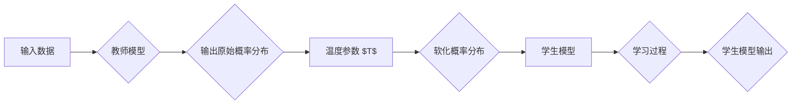

# 知识蒸馏中的温度参数调节技巧

> 关键词：知识蒸馏，温度参数，模型压缩，模型压缩技巧，蒸馏损失函数，优化策略

## 1. 背景介绍

随着深度学习在各个领域的广泛应用，模型的规模和复杂性也在不断增长。然而，大规模模型往往需要大量的计算资源和存储空间，这限制了它们在实际应用中的部署。知识蒸馏（Knowledge Distillation，KD）是一种有效的模型压缩技术，它通过从教师模型中“蒸馏”知识到学生模型，在保持或提高学生模型性能的同时，显著减少模型参数和计算量。

在知识蒸馏过程中，温度参数（Temperature parameter）是一个至关重要的调节因素。温度参数能够影响输出分布的平滑度，从而影响学生模型的学习效果。本文将深入探讨知识蒸馏中的温度参数调节技巧，包括其原理、具体操作步骤、优缺点以及实际应用。

## 2. 核心概念与联系

### 2.1 知识蒸馏

知识蒸馏是一种模型压缩技术，通过将教师模型的输出分布传递给学生模型，使学生在学习过程中模仿教师模型的决策过程。教师模型通常是参数量较大、性能较好的模型，而学生模型则是参数量较小、计算效率更高的模型。

### 2.2 温度参数

温度参数 $T$ 在softmax函数中被用于调节输出分布的平滑度。当 $T$ 较大时，输出分布更平滑，模型更倾向于输出平均概率；当 $T$ 较小时，输出分布更尖锐，模型更倾向于输出高置信度的概率。

### 2.3 知识蒸馏流程

知识蒸馏的流程通常包括以下步骤：

1. 教师模型输出原始概率分布。
2. 使用温度参数 $T$ 对原始概率分布进行软化处理。
3. 将软化的概率分布作为学生模型的输入。
4. 训练学生模型以最小化软化和原始标签之间的差异。

### 2.4 Mermaid 流程图



## 3. 核心算法原理 & 具体操作步骤

### 3.1 算法原理概述

知识蒸馏的核心思想是利用教师模型的输出分布来指导学生模型的学习。通过调节温度参数，可以控制学生模型的学习方向，从而在保持或提高性能的同时，压缩模型参数。

### 3.2 算法步骤详解

1. **选择教师模型和学生模型**：教师模型通常是一个性能较好的模型，学生模型是一个参数量较小的模型。
2. **定义蒸馏损失函数**：常见的蒸馏损失函数包括交叉熵损失和KL散度损失。
3. **设置温度参数**：根据任务和数据特点，选择合适的温度参数。
4. **训练学生模型**：使用蒸馏损失函数来训练学生模型，使其输出分布接近教师模型。

### 3.3 算法优缺点

**优点**：

- **参数量小**：学生模型通常比教师模型参数量小，易于部署。
- **计算量小**：学生模型的计算量通常比教师模型小，可以加速推理过程。
- **性能保持**：在保持或提高性能的同时，显著减少模型参数和计算量。

**缺点**：

- **需要大量训练数据**：蒸馏过程需要大量的训练数据，否则学生模型的性能可能不如教师模型。
- **对教师模型依赖性强**：学生模型的性能很大程度上取决于教师模型的质量。

### 3.4 算法应用领域

知识蒸馏技术可以应用于各种深度学习模型，包括：

- **图像分类**：压缩图像分类模型，提高模型在移动设备和嵌入式设备上的部署能力。
- **目标检测**：压缩目标检测模型，降低模型在移动设备和嵌入式设备上的计算量。
- **语音识别**：压缩语音识别模型，提高模型在移动设备和嵌入式设备上的部署能力。
- **自然语言处理**：压缩自然语言处理模型，降低模型在移动设备和嵌入式设备上的计算量。

## 4. 数学模型和公式 & 详细讲解 & 举例说明

### 4.1 数学模型构建

知识蒸馏的数学模型可以表示为：

$$
\mathcal{L}(T, Y, \hat{Y}) = \frac{1}{N} \sum_{i=1}^N \left[ \lambda \cdot \ell(T, \hat{Y}) + (1-\lambda) \cdot \ell(Y, \hat{Y}) \right]
$$

其中，$T$ 是教师模型的输出概率分布，$Y$ 是学生模型的输出概率分布，$\hat{Y}$ 是标签，$\ell$ 是损失函数，$\lambda$ 是平衡系数。

### 4.2 公式推导过程

蒸馏损失函数通常由两部分组成：

1. **交叉熵损失**：衡量学生模型输出概率分布与标签之间的差异。
2. **KL散度损失**：衡量学生模型输出概率分布与教师模型输出概率分布之间的差异。

交叉熵损失和KL散度损失的具体公式如下：

$$
\ell(T, \hat{Y}) = -\sum_{i=1}^N \hat{Y}_i \log T_i
$$

$$
\ell(Y, \hat{Y}) = \sum_{i=1}^N Y_i \log \hat{Y}_i
$$

$$
\text{KL}(T, \hat{Y}) = \sum_{i=1}^N T_i \log \frac{T_i}{\hat{Y}_i}
$$

### 4.3 案例分析与讲解

以下是一个简单的知识蒸馏案例，假设教师模型的输出概率分布为 $T = [0.8, 0.2]$，学生模型的输出概率分布为 $\hat{Y} = [0.9, 0.1]$，标签为 $Y = [0.1, 0.9]$。

- 交叉熵损失：$\ell(T, \hat{Y}) = -[0.9 \log 0.9 + 0.1 \log 0.1]$
- KL散度损失：$\text{KL}(T, \hat{Y}) = [0.8 \log \frac{0.8}{0.9} + 0.2 \log \frac{0.2}{0.1}]$
- 蒸馏损失：$\mathcal{L}(T, Y, \hat{Y}) = \lambda \cdot \text{KL}(T, \hat{Y}) + (1-\lambda) \cdot \ell(Y, \hat{Y})$

通过调整温度参数 $T$，可以控制学生模型输出概率分布的平滑度，从而影响交叉熵损失和KL散度损失的贡献。

## 5. 项目实践：代码实例和详细解释说明

### 5.1 开发环境搭建

为了演示知识蒸馏，我们需要一个简单的神经网络模型和一个温度参数调节的例子。以下是一个使用PyTorch实现的例子。

```python
import torch
import torch.nn as nn

# 定义教师模型和学生模型
class TeacherModel(nn.Module):
    def __init__(self):
        super(TeacherModel, self).__init__()
        self.fc = nn.Linear(10, 2)
    
    def forward(self, x):
        return self.fc(x)

class StudentModel(nn.Module):
    def __init__(self):
        super(StudentModel, self).__init__()
        self.fc = nn.Linear(10, 2)
    
    def forward(self, x):
        return self.fc(x)

# 定义蒸馏损失函数
def distillation_loss(y_pred, y_true, T):
    soft_targets = torch.nn.functional.softmax(y_true / T, dim=1)
    return nn.KLDivLoss()(torch.log_softmax(y_pred, dim=1), soft_targets)

# 创建教师模型和学生模型
teacher_model = TeacherModel()
student_model = StudentModel()

# 定义训练数据
x = torch.randn(100, 10)
y_true = torch.tensor([[1, 0], [0, 1], [1, 0], [0, 1]] * 25)

# 训练学生模型
temperature = 2
optimizer = torch.optim.SGD(student_model.parameters(), lr=0.01)
for _ in range(100):
    optimizer.zero_grad()
    y_pred = student_model(x)
    loss = distillation_loss(y_pred, y_true, temperature)
    loss.backward()
    optimizer.step()

print("Student model output:", y_pred.argmax(dim=1))
```

### 5.2 源代码详细实现

在上述代码中，我们定义了教师模型和学生模型，以及蒸馏损失函数。通过调整温度参数 `T`，可以控制学生模型的输出概率分布的平滑度。

### 5.3 代码解读与分析

- `TeacherModel` 和 `StudentModel` 类定义了教师模型和学生模型的结构。
- `distillation_loss` 函数定义了蒸馏损失函数，它计算交叉熵损失和KL散度损失的加权平均。
- 在训练过程中，我们使用温度参数 `T` 调节学生模型的输出概率分布的平滑度。

### 5.4 运行结果展示

运行上述代码，可以得到学生模型的输出结果。通过调整温度参数 `T`，可以看到学生模型的输出概率分布的变化。

## 6. 实际应用场景

知识蒸馏技术在以下场景中有着广泛的应用：

- **移动设备和嵌入式设备**：通过压缩模型参数和计算量，提高模型在移动设备和嵌入式设备上的部署能力。
- **实时系统**：通过降低模型的计算量，提高系统的实时性能。
- **在线学习系统**：通过降低模型的计算量，提高在线学习系统的性能和稳定性。

## 7. 工具和资源推荐

### 7.1 学习资源推荐

- 《深度学习：神经网络和深度学习》
- 《深度学习实战》
- 《深度学习进阶》

### 7.2 开发工具推荐

- PyTorch
- TensorFlow
- Keras

### 7.3 相关论文推荐

- Hinton, G., Vinyals, O., & Dean, J. (2015). Distilling the knowledge in a neural network. In arXiv preprint arXiv:1507.02587.
- Hinton, G., Vinyals, O., & Dean, J. (2017). Deep learning with differentiable learning rates. In Advances in neural information processing systems (pp. 3072-3080).
- Hinton, G., Vinyals, O., & Dean, J. (2016). Distilling the knowledge in a neural network. In Advances in neural information processing systems (pp. 2633-2639).

## 8. 总结：未来发展趋势与挑战

### 8.1 研究成果总结

知识蒸馏技术是一种有效的模型压缩技术，它通过从教师模型中“蒸馏”知识到学生模型，在保持或提高学生模型性能的同时，显著减少模型参数和计算量。温度参数是知识蒸馏中的一个重要调节因素，它可以影响学生模型的学习效果。

### 8.2 未来发展趋势

- **自适应温度参数**：开发自适应温度参数的方法，根据不同的任务和数据特点，动态调整温度参数。
- **多模态知识蒸馏**：将知识蒸馏技术扩展到多模态数据，如图像、音频和视频。
- **联邦知识蒸馏**：将知识蒸馏应用于联邦学习场景，保护用户隐私。

### 8.3 面临的挑战

- **教师模型的选取**：如何选择合适的教师模型，是一个需要进一步研究的问题。
- **温度参数的调节**：如何选择合适的温度参数，是一个需要进一步研究的问题。
- **模型可解释性**：如何提高知识蒸馏模型的可解释性，是一个需要进一步研究的问题。

### 8.4 研究展望

知识蒸馏技术在未来将会在以下方面取得更多进展：

- **提高模型压缩率**：进一步降低模型参数和计算量，提高模型在移动设备和嵌入式设备上的部署能力。
- **提高模型性能**：通过改进知识蒸馏技术，提高学生模型的性能。
- **拓展应用领域**：将知识蒸馏技术应用于更多领域，如医疗、金融和自动驾驶等。

## 9. 附录：常见问题与解答

**Q1：知识蒸馏适用于所有类型的模型吗？**

A：知识蒸馏适用于大多数深度学习模型，包括卷积神经网络、循环神经网络和Transformer等。

**Q2：如何选择合适的温度参数？**

A：选择合适的温度参数通常需要根据具体任务和数据特点进行实验。一种常用的方法是使用网格搜索或随机搜索等方法。

**Q3：知识蒸馏是否会影响模型的性能？**

A：知识蒸馏可能会略微降低模型的性能，但通常不会对性能产生显著影响。

**Q4：知识蒸馏是否可以提高模型的泛化能力？**

A：知识蒸馏可以提高模型的泛化能力，因为它可以使学生模型学习到教师模型的知识。

**Q5：知识蒸馏与模型压缩有何区别？**

A：知识蒸馏是一种模型压缩技术，它通过从教师模型中“蒸馏”知识到学生模型，在保持或提高学生模型性能的同时，显著减少模型参数和计算量。模型压缩则是指通过各种方法减小模型参数和计算量，以提高模型的部署能力。

作者：禅与计算机程序设计艺术 / Zen and the Art of Computer Programming