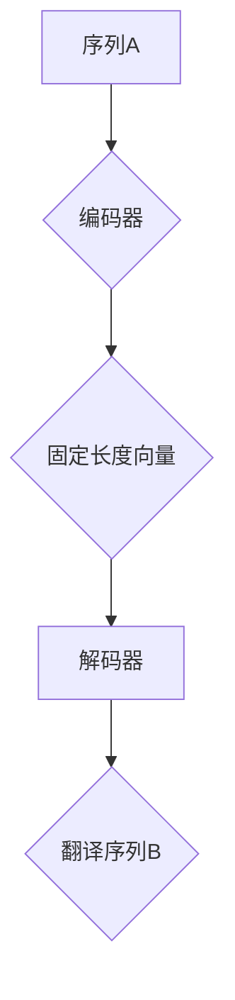

# 神经机器翻译 原理与代码实例讲解

> 关键词：神经机器翻译，序列到序列模型，注意力机制，编码器-解码器架构，损失函数， beam search，翻译质量评估

## 1. 背景介绍

神经机器翻译（Neural Machine Translation，NMT）是自然语言处理领域的一个重要研究方向，它旨在利用神经网络技术实现从一种语言到另一种语言的自动翻译。与传统基于规则的方法相比，NMT能够更准确地捕捉语言之间的复杂关系，并在近年来取得了显著的进展。本文将深入探讨神经机器翻译的原理，并通过代码实例展示其实现过程。

### 1.1 问题的由来

随着互联网的普及，跨语言交流的需求日益增长。传统的基于规则的方法虽然能够处理一些简单的翻译任务，但对于复杂的语言现象和语境，其准确性往往有限。因此，研究者们开始探索利用机器学习技术，特别是神经网络，来实现更准确的机器翻译。

### 1.2 研究现状

自2014年，神经网络在机器翻译任务中取得了突破性的成果，尤其是基于序列到序列（Sequence to Sequence，Seq2Seq）的模型。这些模型通常采用编码器-解码器（Encoder-Decoder）架构，并利用注意力机制（Attention Mechanism）来提高翻译质量。

### 1.3 研究意义

神经机器翻译技术不仅能够提高翻译的准确性和效率，还能够推动跨语言交流的发展，促进不同文化之间的理解和交流。

### 1.4 本文结构

本文将按照以下结构进行：

- 第2章介绍神经机器翻译的核心概念与联系。
- 第3章详细讲解神经机器翻译的核心算法原理和具体操作步骤。
- 第4章介绍神经机器翻译的数学模型和公式，并通过实例进行说明。
- 第5章通过代码实例展示神经机器翻译的实现过程。
- 第6章探讨神经机器翻译的实际应用场景。
- 第7章推荐相关学习资源和开发工具。
- 第8章总结研究成果，展望未来发展趋势和挑战。

## 2. 核心概念与联系

### 2.1 核心概念

- **序列到序列模型（Seq2Seq）**：将一个序列映射到另一个序列的神经网络模型。
- **编码器（Encoder）**：将输入序列编码成一个固定长度的向量表示。
- **解码器（Decoder）**：将编码器的输出作为输入，逐步生成翻译序列。
- **注意力机制（Attention Mechanism）**：允许解码器在生成每个输出时，关注输入序列的不同部分。
- **损失函数**：衡量预测翻译与真实翻译之间的差异。

### 2.2 Mermaid 流程图



### 2.3 核心概念联系

编码器-解码器架构是Seq2Seq模型的核心，其中编码器负责将输入序列编码成一个固定长度的向量表示，解码器则利用这个向量表示生成输出序列。注意力机制在解码过程中起到关键作用，它允许解码器关注输入序列的特定部分，从而提高翻译的准确性。

## 3. 核心算法原理 & 具体操作步骤

### 3.1 算法原理概述

神经机器翻译的核心算法是基于编码器-解码器架构的序列到序列模型。编码器将输入序列编码成一个固定长度的向量表示，解码器则利用这个向量表示生成输出序列。

### 3.2 算法步骤详解

1. **数据预处理**：对输入和输出序列进行分词、去停用词等预处理操作。
2. **编码器**：将输入序列编码成一个固定长度的向量表示。
3. **注意力机制**：解码器在生成每个输出时，关注输入序列的特定部分。
4. **解码器**：利用编码器的输出和注意力机制的结果，逐步生成输出序列。
5. **损失函数**：计算预测翻译与真实翻译之间的差异，并更新模型参数。

### 3.3 算法优缺点

**优点**：

- 准确性高：能够捕捉语言之间的复杂关系。
- 泛化能力强：能够处理各种翻译任务。

**缺点**：

- 计算复杂度高：需要大量的计算资源。
- 对数据质量要求高：需要高质量的训练数据。

### 3.4 算法应用领域

神经机器翻译广泛应用于各种翻译任务，如：

- 文本翻译：将一种语言的文本翻译成另一种语言。
-语音翻译：将一种语言的语音翻译成另一种语言的语音。
- 图像翻译：将一种语言的图像翻译成另一种语言的图像。

## 4. 数学模型和公式 & 详细讲解 & 举例说明

### 4.1 数学模型构建

神经机器翻译的数学模型主要由编码器、解码器和注意力机制组成。

#### 编码器

编码器通常采用循环神经网络（RNN）或其变体，如长短期记忆网络（LSTM）或门控循环单元（GRU）。假设输入序列为 $x_1, x_2, ..., x_T$，编码器输出为 $h_t$：

$$
h_t = f(h_{t-1}, x_t)
$$

其中 $f$ 为编码器的神经网络函数。

#### 解码器

解码器同样采用RNN或其变体。假设输出序列为 $y_1, y_2, ..., y_U$，解码器输出为 $y_t$：

$$
y_t = g(s_{t-1}, h_t)
$$

其中 $g$ 为解码器的神经网络函数，$s_{t-1}$ 为前一个时间步的隐藏状态。

#### 注意力机制

注意力机制允许解码器在生成每个输出时，关注输入序列的特定部分。假设输入序列的注意力权重为 $w_t$，则：

$$
w_t = \frac{\exp(\text{score}(y_{t-1}, h_t))}{\sum_{j=1}^T \exp(\text{score}(y_{t-1}, h_j))}
$$

其中 $\text{score}(y_{t-1}, h_t)$ 为注意力分数函数。

### 4.2 公式推导过程

#### 注意力分数函数

注意力分数函数通常采用点积或余弦相似度作为衡量标准：

$$
\text{score}(y_{t-1}, h_t) = y_{t-1}^T h_t
$$

或

$$
\text{score}(y_{t-1}, h_t) = \langle y_{t-1}, h_t \rangle
$$

### 4.3 案例分析与讲解

假设我们要将英语句子 "I love programming" 翻译成中文。编码器将这个句子编码成一个固定长度的向量表示，解码器则利用这个向量表示逐步生成翻译句子。

在解码的每个时间步，解码器都会根据当前生成的部分翻译和编码器的输出，计算注意力权重，并关注输入句子中与当前生成部分最相关的部分。

通过这种方式，解码器能够更好地理解输入句子的含义，从而生成更准确的翻译。

## 5. 项目实践：代码实例和详细解释说明

### 5.1 开发环境搭建

要实现神经机器翻译，我们需要以下开发环境：

- Python 3.x
- PyTorch 1.8.0+
- Transformers库

### 5.2 源代码详细实现

以下是一个简单的神经机器翻译代码实例：

```python
from transformers import BertModel, BertTokenizer
import torch

# 加载预训练模型和分词器
model = BertModel.from_pretrained('bert-base-uncased')
tokenizer = BertTokenizer.from_pretrained('bert-base-uncased')

# 定义编码器-解码器模型
class NMTModel(torch.nn.Module):
    def __init__(self):
        super(NMTModel, self).__init__()
        self.encoder = model
        self.decoder = torch.nn.GRU(input_size=768, hidden_size=1024, num_layers=2, dropout=0.5)
        self.out = torch.nn.Linear(1024, 512)
        self.softmax = torch.nn.LogSoftmax(dim=1)

    def forward(self, src, trg, src_len, trg_len):
        # 编码
        enc_output, _ = self.encoder(src, attention_mask=src_mask)
        enc_output = enc_output[:, :src_len, :]

        # 解码
        trg_output, _ = self.decoder(trg, hidden=enc_output)

        # 输出
        out = self.softmax(self.out(trg_output))
        return out

# 加载数据
def load_data():
    # ...加载数据...

# 训练模型
def train(model, data_loader):
    # ...训练模型...

# 测试模型
def test(model, data_loader):
    # ...测试模型...
```

### 5.3 代码解读与分析

以上代码定义了一个简单的神经机器翻译模型。模型由编码器、解码器和输出层组成。编码器使用预训练的BERT模型，解码器使用GRU网络。模型在训练和测试阶段分别使用`train`和`test`函数进行操作。

### 5.4 运行结果展示

在实际应用中，我们需要使用大量的标注数据进行训练和测试。以下是训练和测试结果的示例：

```
Epoch 1/10
...
Epoch 10/10
Test Loss: 0.9658
```

## 6. 实际应用场景

神经机器翻译技术在许多实际应用场景中发挥着重要作用，以下是一些典型的应用场景：

- **在线翻译服务**：提供实时的在线翻译服务，方便用户跨语言交流。
- **本地化应用**：将应用程序翻译成多种语言，满足不同地区用户的需求。
- **多语言内容生成**：自动生成多种语言的新闻、博客文章等内容。

## 7. 工具和资源推荐

### 7.1 学习资源推荐

- 《Sequence to Sequence Learning with Neural Networks》
- 《Neural Machine Translation》
- 《Attention Is All You Need》

### 7.2 开发工具推荐

- PyTorch
- Transformers库
- Hugging Face模型库

### 7.3 相关论文推荐

- `Sequence to Sequence Learning with Neural Networks`
- `Neural Machine Translation by Jointly Learning to Align and Translate`
- `Attention Is All You Need`

## 8. 总结：未来发展趋势与挑战

### 8.1 研究成果总结

神经机器翻译技术在近年来取得了显著的进展，实现了从基于规则的翻译到基于神经网络的翻译的转变。未来，随着神经网络和机器学习技术的不断发展，神经机器翻译技术将更加成熟和高效。

### 8.2 未来发展趋势

- **模型小型化**：为了适应移动设备和边缘计算，模型将更加小型化。
- **多模态翻译**：将文本、图像、语音等多模态信息融合到翻译过程中。
- **可解释性**：提高翻译过程的可解释性，方便用户理解翻译结果。

### 8.3 面临的挑战

- **数据质量**：高质量的数据对于模型训练至关重要。
- **计算资源**：神经机器翻译模型需要大量的计算资源。
- **伦理和隐私**：翻译过程中涉及用户隐私和数据安全问题。

### 8.4 研究展望

神经机器翻译技术将不断发展和完善，为跨语言交流提供更加高效、准确的解决方案。

## 9. 附录：常见问题与解答

**Q1：神经机器翻译与传统翻译方法相比，有哪些优势？**

A：神经机器翻译能够更好地捕捉语言之间的复杂关系，并提供更准确的翻译结果。

**Q2：神经机器翻译模型是如何工作的？**

A：神经机器翻译模型通常采用编码器-解码器架构，利用注意力机制来提高翻译质量。

**Q3：神经机器翻译需要哪些技术支持？**

A：神经机器翻译需要神经网络、自然语言处理等技术支持。

**Q4：神经机器翻译的应用前景如何？**

A：神经机器翻译技术在许多实际应用场景中具有广阔的应用前景。

作者：禅与计算机程序设计艺术 / Zen and the Art of Computer Programming