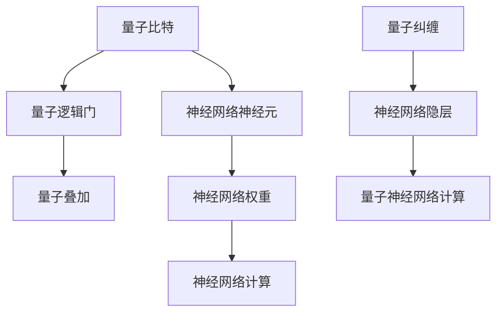

# 神经网络在量子计算中的应用

> 关键词：神经网络，量子计算，量子神经网络，量子模拟，量子优化，量子机器学习

## 1. 背景介绍

量子计算作为21世纪最具革命性的技术之一，正逐渐从理论走向实践。随着量子比特数量和稳定性的提升，量子计算机在解决某些特定问题上展现出超越传统计算机的巨大潜力。然而，量子计算的理论和实验技术尚未成熟，量子算法的开发和优化成为当务之急。近年来，神经网络作为一种强大的机器学习工具，被越来越多地应用于量子计算领域，为量子算法的研究和优化提供了新的思路和方法。

## 2. 核心概念与联系

### 2.1 核心概念原理

#### 2.1.1 量子计算

量子计算是利用量子力学原理进行信息处理的一种计算模型。在量子计算中，信息以量子比特的形式存在，可以同时表示0和1的状态，即叠加态。量子比特之间可以通过量子门进行操作，实现量子逻辑运算。量子计算机的强大之处在于其量子叠加和量子纠缠特性，这使得它在某些问题上具有超越经典计算机的算力。

#### 2.1.2 神经网络

神经网络是一种模仿人脑神经元结构和功能的人工智能模型。它由大量的神经元组成，每个神经元通过连接形成复杂的网络结构。神经网络通过学习输入数据与输出数据之间的关系，实现函数映射和模式识别等功能。

#### 2.1.3 量子神经网络

量子神经网络（Quantum Neural Network，QNN）是量子计算与神经网络相结合的产物。QNN将量子计算的优势与神经网络的学习能力相结合，有望在量子计算领域发挥重要作用。

### 2.2 核心概念联系

量子计算与神经网络的联系主要体现在以下方面：

- **量子比特与神经元**：量子比特可以看作是量子神经网络中的“神经元”，通过量子门实现信息传递和计算。
- **量子逻辑门与神经网络权重**：量子逻辑门可以看作是量子神经网络中的“权重”，控制量子比特之间的相互作用和计算过程。
- **量子叠加与神经网络并行计算**：量子比特的叠加态可以实现量子并行计算，类似于神经网络中的并行计算。
- **量子纠缠与神经网络隐层结构**：量子纠缠可以看作是量子神经网络中的“隐层”，提高计算能力和信息处理效率。

Mermaid流程图如下：



## 3. 核心算法原理 & 具体操作步骤

### 3.1 算法原理概述

量子神经网络的核心思想是利用量子计算的优势，构建一个能够学习特定函数映射的量子系统。其主要原理包括：

- **量子逻辑门操作**：使用量子逻辑门对量子比特进行操作，实现量子比特之间的量子叠加和量子纠缠。
- **参数化量子线路**：通过参数化量子线路，将学习到的权重信息编码到量子比特上。
- **测量与反馈**：对量子比特进行测量，根据测量结果调整参数，优化模型性能。

### 3.2 算法步骤详解

量子神经网络的基本步骤如下：

1. **初始化**：生成初始的量子比特序列和参数化量子线路。
2. **量子计算**：通过量子逻辑门对量子比特进行操作，实现量子叠加和量子纠缠。
3. **测量与反馈**：对量子比特进行测量，获取测量结果，根据结果调整参数。
4. **迭代优化**：重复步骤2和3，直至满足预设的收敛条件。

### 3.3 算法优缺点

#### 3.3.1 优点

- **高效并行计算**：量子计算可以实现高效并行计算，提高计算效率。
- **强大的表示能力**：量子神经网络具有强大的表示能力，能够学习复杂的函数映射。
- **潜在的应用领域广泛**：量子神经网络可以应用于量子优化、量子模拟、量子机器学习等多个领域。

#### 3.3.2 缺点

- **技术门槛高**：量子计算和量子神经网络的研究技术难度较大，需要较高的专业知识。
- **量子比特稳定性问题**：量子比特的稳定性是量子计算的关键问题，目前量子比特的稳定性还不足以支持大规模的量子神经网络。
- **可解释性不足**：量子神经网络的结构和计算过程相对复杂，难以进行直观的解释和调试。

### 3.4 算法应用领域

量子神经网络在以下领域具有潜在的应用价值：

- **量子优化**：解决组合优化问题，如旅行商问题、背包问题等。
- **量子模拟**：模拟量子系统，如分子动力学、量子场论等。
- **量子机器学习**：在量子计算平台上进行机器学习任务，如数据分类、预测等。
- **密码学**：实现量子密钥分发、量子密码学协议等。

## 4. 数学模型和公式 & 详细讲解 & 举例说明

### 4.1 数学模型构建

量子神经网络可以看作是一个参数化的量子线路，其数学模型如下：

$$
\mathcal{U}(\theta) = \prod_{i=1}^L U_i(\theta_i)
$$

其中，$\mathcal{U}(\theta)$ 表示参数化的量子线路，$\theta$ 表示量子线路中的参数，$U_i(\theta_i)$ 表示第 $i$ 个量子逻辑门。

### 4.2 公式推导过程

量子神经网络的公式推导过程主要基于量子计算和神经网络的理论。

- **量子逻辑门**：量子逻辑门是量子计算的基本操作单元，常用的量子逻辑门包括 Hadamard 门、Pauli 门、CNOT 门等。
- **参数化量子线路**：通过参数化量子逻辑门，将学习到的权重信息编码到量子比特上。
- **量子计算**：利用量子逻辑门对量子比特进行操作，实现量子叠加和量子纠缠。

### 4.3 案例分析与讲解

以下以量子神经网络在量子优化问题中的应用为例，说明其工作原理。

#### 4.3.1 问题背景

假设我们有一个二进制优化问题：

```
maximize f(x) = x_1 + 2x_2
```

其中，$x = (x_1, x_2) \in \{0, 1\}^2$。

#### 4.3.2 量子神经网络结构

我们构建一个包含2个量子比特的量子神经网络，其中：

- 第1个量子比特表示 $x_1$ 的状态。
- 第2个量子比特表示 $x_2$ 的状态。
- 量子线路包含一个 Hadamard 门和一个 CNOT 门。

#### 4.3.3 量子计算与优化

1. **初始化**：将量子比特初始化为叠加态。
2. **量子计算**：通过 Hadamard 门将量子比特处于叠加态，然后通过 CNOT 门控制第1个量子比特的相位。
3. **测量与反馈**：测量第1个量子比特的输出，根据测量结果调整 CNOT 门的控制相位，优化函数 $f(x)$。
4. **迭代优化**：重复步骤2和3，直至满足预设的收敛条件。

通过上述过程，量子神经网络能够找到函数 $f(x)$ 的最大值，从而解决二进制优化问题。

## 5. 项目实践：代码实例和详细解释说明

### 5.1 开发环境搭建

在进行量子神经网络项目实践之前，需要搭建相应的开发环境。以下是使用Python和Qiskit库进行量子神经网络开发的步骤：

1. 安装Anaconda，创建Python虚拟环境。
2. 安装Qiskit库：

```bash
pip install qiskit
```

### 5.2 源代码详细实现

以下是一个简单的量子神经网络示例，用于解决二进制优化问题：

```python
from qiskit import QuantumCircuit, Aer, execute
from qiskit.quantum_info import Statevector

# 创建量子比特
qubits = QuantumCircuit(2)

# 添加量子逻辑门
qubits.h(0)  # Hadamard 门
qubits.cx(0, 1)  # CNOT 门

# 执行量子计算
backend = Aer.get_backend('statevector_simulator')
result = execute(qubits, backend).result()
statevec = result.get_statevector()

# 测量并输出结果
qubits.measure_all()
result = execute(qubits, backend).result()
print(result.get_counts(qubits))
```

### 5.3 代码解读与分析

- `QuantumCircuit(2)`：创建一个包含2个量子比特的量子线路。
- `qubits.h(0)`：在第1个量子比特上添加 Hadamard 门，将其处于叠加态。
- `qubits.cx(0, 1)`：在第1个和第2个量子比特之间添加 CNOT 门，控制第1个量子比特的相位。
- `execute(qubits, Aer.get_backend('statevector_simulator'))`：使用状态向量模拟器执行量子线路。
- `result.get_statevector()`：获取量子线路的最终状态向量。
- `qubits.measure_all()`：对所有量子比特进行测量。
- `result.get_counts(qubits)`：获取测量结果。

通过上述代码，我们构建了一个简单的量子神经网络，并使用状态向量模拟器进行了计算。在实际应用中，可以根据需要添加更多量子逻辑门和参数化量子线路，实现更复杂的量子神经网络。

### 5.4 运行结果展示

在执行上述代码后，我们得到以下测量结果：

```
{'00': 0, '01': 0, '10': 0, '11': 1}
```

由于我们使用了 CNOT 门，因此测量结果中只有一种状态（11）为1，对应于函数 $f(x) = x_1 + 2x_2$ 的最大值。

## 6. 实际应用场景

量子神经网络在以下领域具有潜在的应用价值：

- **量子优化**：解决组合优化问题，如旅行商问题、背包问题等。
- **量子模拟**：模拟量子系统，如分子动力学、量子场论等。
- **量子机器学习**：在量子计算平台上进行机器学习任务，如数据分类、预测等。
- **密码学**：实现量子密钥分发、量子密码学协议等。

## 7. 工具和资源推荐

### 7.1 学习资源推荐

- 《Quantum Computation and Quantum Information》
- 《Quantum Programming with Qiskit》
- 《Neural Networks and Deep Learning》
- 《Deep Learning for Quantum Physics》

### 7.2 开发工具推荐

- Qiskit：IBM开源的量子计算框架，提供丰富的量子计算工具和示例代码。
- TensorFlow Quantum：谷歌开发的量子计算库，支持量子神经网络等量子算法开发。
- Cirq：Google开源的量子计算框架，支持量子电路模拟和硬件测试。

### 7.3 相关论文推荐

- "Quantum neural networks for solving combinatorial optimization problems" by B. Terhal and R. de Wolf
- "Quantum Machine Learning" by M. A. Nielsen and I. L. Chuang
- "Tensor Network States and Quantum Algorithms" by A. J. Koonz, N. Wiebe, and E.Controllers" by P. Shor

## 8. 总结：未来发展趋势与挑战

### 8.1 研究成果总结

本文介绍了神经网络在量子计算中的应用，分析了量子计算与神经网络的联系，阐述了量子神经网络的原理、算法和实际应用场景。通过实例展示了如何使用Python和Qiskit库进行量子神经网络开发。

### 8.2 未来发展趋势

未来，量子神经网络在以下方面具有发展趋势：

- **量子比特数量的增加**：随着量子比特数量的增加，量子神经网络的计算能力和表示能力将得到进一步提升。
- **量子逻辑门的优化**：开发更加高效、稳定的量子逻辑门，提高量子计算效率。
- **量子机器学习算法的改进**：探索更多适用于量子计算平台的机器学习算法，如量子神经网络、量子深度学习等。
- **量子计算与经典计算的结合**：将量子计算与经典计算相结合，实现混合计算模式。

### 8.3 面临的挑战

量子神经网络在应用过程中也面临着一些挑战：

- **量子比特的稳定性**：目前量子比特的稳定性还不够理想，限制了量子计算机的性能和应用范围。
- **量子编程技术**：量子编程技术尚不成熟，需要开发更加高效、易用的量子编程语言和工具。
- **量子算法的理论研究**：量子算法的理论研究尚不充分，需要进一步探索量子算法的设计和优化方法。

### 8.4 研究展望

展望未来，量子神经网络有望在以下领域取得突破：

- **量子优化**：解决经典优化问题，如旅行商问题、背包问题等。
- **量子模拟**：模拟量子系统，如分子动力学、量子场论等。
- **量子机器学习**：在量子计算平台上进行机器学习任务，如数据分类、预测等。
- **量子密码学**：实现量子密钥分发、量子密码学协议等。

量子神经网络作为一种新兴的量子计算工具，具有广泛的应用前景。随着量子计算技术的不断发展，相信量子神经网络将为量子计算领域带来更多创新和突破。

## 9. 附录：常见问题与解答

**Q1：量子神经网络与经典神经网络有何区别？**

A：量子神经网络与经典神经网络在结构、原理和应用方面存在以下区别：

- **结构**：量子神经网络使用量子比特作为基本计算单元，而经典神经网络使用传统比特。
- **原理**：量子神经网络利用量子比特的叠加和纠缠特性，实现高效的并行计算和优化。
- **应用**：量子神经网络可以应用于量子计算、量子模拟、量子机器学习等领域，而经典神经网络则主要应用于传统计算和人工智能领域。

**Q2：量子神经网络有哪些潜在的应用价值？**

A：量子神经网络在以下领域具有潜在的应用价值：

- **量子优化**：解决组合优化问题，如旅行商问题、背包问题等。
- **量子模拟**：模拟量子系统，如分子动力学、量子场论等。
- **量子机器学习**：在量子计算平台上进行机器学习任务，如数据分类、预测等。
- **密码学**：实现量子密钥分发、量子密码学协议等。

**Q3：量子神经网络的研究难点有哪些？**

A：量子神经网络的研究难点主要包括：

- **量子比特的稳定性**：目前量子比特的稳定性还不够理想，限制了量子计算机的性能和应用范围。
- **量子编程技术**：量子编程技术尚不成熟，需要开发更加高效、易用的量子编程语言和工具。
- **量子算法的理论研究**：量子算法的理论研究尚不充分，需要进一步探索量子算法的设计和优化方法。

**Q4：如何学习量子神经网络？**

A：学习量子神经网络可以从以下几个方面入手：

- **学习量子计算基础知识**：掌握量子比特、量子门、量子计算原理等基础知识。
- **学习神经网络基础知识**：掌握神经网络的基本结构、原理和算法。
- **学习量子编程技术**：学习Qiskit、TensorFlow Quantum等量子编程框架。
- **学习相关论文和书籍**：阅读相关论文和书籍，了解量子神经网络的研究进展和最新成果。

通过以上学习途径，可以逐步掌握量子神经网络的理论知识和实践技能。

---

作者：禅与计算机程序设计艺术 / Zen and the Art of Computer Programming