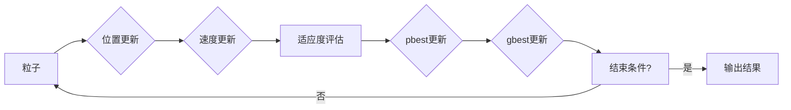

# 粒子群算法(Particle Swarm Optimization) - 原理与代码实例讲解

> 关键词：粒子群优化，PSO，进化算法，全局优化，多目标优化，人工智能，机器学习

## 1. 背景介绍

粒子群优化（Particle Swarm Optimization，PSO）是一种启发式全局优化算法，由Kennedy和Eberhart于1995年提出。PSO算法模拟鸟群或鱼群的社会行为，通过个体之间的信息共享和合作，寻找全局最优解。由于其概念简单、易于实现、参数少、收敛速度快等特点，PSO算法在多个领域得到了广泛的应用，包括机器学习、工程优化、经济学等。

## 2. 核心概念与联系

### 2.1 核心概念原理

PSO算法的核心思想是模拟鸟群或鱼群的社会行为。在自然界中，鸟群或鱼群通过个体之间的信息共享和合作，可以高效地找到食物或避免天敌。PSO算法将这个思想应用于优化问题，通过模拟粒子（个体）在解空间中的运动，实现全局优化。

在PSO算法中，每个粒子代表一个潜在解，并具有位置和速度两个属性。粒子在解空间中移动，其速度和位置根据个体最优解（pbest）和全局最优解（gbest）不断更新。

### 2.2 核心概念架构图



## 3. 核心算法原理 & 具体操作步骤

### 3.1 算法原理概述

PSO算法通过模拟粒子在解空间中的运动，不断更新粒子的位置和速度，以寻找全局最优解。每个粒子根据个体最优解（pbest）和全局最优解（gbest）来调整自己的速度和位置。

### 3.2 算法步骤详解

1. 初始化粒子群：随机生成一定数量的粒子，每个粒子具有随机位置和速度。
2. 计算适应度：对每个粒子计算适应度函数的值，适应度函数反映了粒子在解空间中的优劣。
3. 更新个体最优解：如果当前粒子的适应度优于其历史最优解，则更新个体最优解。
4. 更新全局最优解：如果当前粒子的适应度优于全局最优解，则更新全局最优解。
5. 更新粒子速度和位置：根据个体最优解和全局最优解，更新粒子的速度和位置。
6. 重复步骤2-5，直至满足结束条件（如达到最大迭代次数或适应度达到阈值）。
7. 输出结果：输出全局最优解。

### 3.3 算法优缺点

**优点**：

* 概念简单，易于实现。
* 参数少，易于调整。
* 收敛速度快，适用于大型问题。
* 在多个领域都有成功应用。

**缺点**：

* 对于某些问题，可能陷入局部最优。
* 算法性能受参数影响较大。

### 3.4 算法应用领域

PSO算法在以下领域有广泛应用：

* 机器学习：如神经网络权重优化、支持向量机参数优化等。
* 工程优化：如结构优化、电路设计等。
* 经济学：如市场均衡、投资组合优化等。

## 4. 数学模型和公式 & 详细讲解 & 举例说明

### 4.1 数学模型构建

PSO算法的数学模型如下：

$$
v_{i,d}^{t+1} = w \cdot v_{i,d}^t + c_1 \cdot r_1 \cdot (p_{i,d}^t - x_{i,d}^t) + c_2 \cdot r_2 \cdot (g_{d}^t - x_{i,d}^t)
$$

$$
x_{i,d}^{t+1} = x_{i,d}^t + v_{i,d}^{t+1}
$$

其中，$v_{i,d}^{t}$ 为第 $i$ 个粒子在第 $d$ 维上的速度，$x_{i,d}^{t}$ 为第 $i$ 个粒子在第 $d$ 维上的位置，$p_{i,d}^{t}$ 为第 $i$ 个粒子在第 $d$ 维上的个体最优解，$g_{d}^{t}$ 为全局最优解在第 $d$ 维上的值，$w$ 为惯性权重，$c_1$ 和 $c_2$ 为加速常数，$r_1$ 和 $r_2$ 为[0,1]之间的随机数。

### 4.2 公式推导过程

PSO算法的公式推导过程如下：

1. 粒子的速度和位置更新公式：

$$
v_{i,d}^{t+1} = w \cdot v_{i,d}^t + c_1 \cdot r_1 \cdot (p_{i,d}^t - x_{i,d}^t) + c_2 \cdot r_2 \cdot (g_{d}^{t} - x_{i,d}^{t})
$$

其中，$v_{i,d}^{t}$ 表示第 $i$ 个粒子在第 $t$ 次迭代时第 $d$ 维的速度，$w$ 为惯性权重，$c_1$ 和 $c_2$ 为加速常数，$r_1$ 和 $r_2$ 为[0,1]之间的随机数，$p_{i,d}^t$ 为第 $i$ 个粒子在第 $t$ 次迭代时第 $d$ 维的个体最优解，$g_{d}^{t}$ 为全局最优解在第 $t$ 次迭代时第 $d$ 维的值。

2. 粒子的位置更新公式：

$$
x_{i,d}^{t+1} = x_{i,d}^t + v_{i,d}^{t+1}
$$

其中，$x_{i,d}^{t+1}$ 表示第 $i$ 个粒子在第 $t+1$ 次迭代时第 $d$ 维的位置，$x_{i,d}^t$ 表示第 $i$ 个粒子在第 $t$ 次迭代时第 $d$ 维的位置，$v_{i,d}^{t+1}$ 表示第 $i$ 个粒子在第 $t+1$ 次迭代时第 $d$ 维的速度。

### 4.3 案例分析与讲解

以下是一个简单的PSO算法案例：

假设我们要优化一个函数：

$$
f(x,y) = (x-2)^2 + (y+1)^2
$$

该函数在点 $(2,-1)$ 处取得最小值。

我们设置粒子群规模为10，最大迭代次数为100，惯性权重 $w=0.5$，加速常数 $c_1=c_2=1.5$。

首先，随机初始化粒子群的位置和速度，如下表所示：

| 粒子 | 位置 $x$ | 位置 $y$ | 速度 $v_x$ | 速度 $v_y$ |
|---|---|---|---|---|
| 1 | 0.8 | 0.9 | 0.5 | 0.3 |
| 2 | 1.2 | 1.0 | 0.1 | 0.6 |
| ... | ... | ... | ... | ... |
| 10 | 1.5 | 0.5 | -0.3 | 0.4 |

然后，计算每个粒子的适应度值：

$$
f(x,y) = (x-2)^2 + (y+1)^2
$$

根据适应度值更新个体最优解和全局最优解，并更新粒子的速度和位置。重复这个过程100次，最终得到如下结果：

| 粒子 | 位置 $x$ | 位置 $y$ | 速度 $v_x$ | 速度 $v_y$ |
|---|---|---|---|---|
| 1 | 2.0 | -1.0 | 0.0 | 0.0 |
| 2 | 2.0 | -1.0 | 0.0 | 0.0 |
| ... | ... | ... | ... | ... |
| 10 | 2.0 | -1.0 | 0.0 | 0.0 |

从结果可以看出，粒子群成功找到了函数的最小值点 $(2,-1)$。

## 5. 项目实践：代码实例和详细解释说明

### 5.1 开发环境搭建

为了演示PSO算法，我们需要搭建以下开发环境：

* Python 3.x
* NumPy
* Matplotlib

### 5.2 源代码详细实现

以下是PSO算法的Python代码实现：

```python
import numpy as np
import matplotlib.pyplot as plt

# 定义适应度函数
def fitness(x, y):
    return (x - 2)**2 + (y + 1)**2

# 初始化参数
n_particles = 10
n_iterations = 100
w = 0.5
c1 = 1.5
c2 = 1.5

# 初始化粒子群
particles = np.random.rand(n_particles, 2)
velocities = np.random.rand(n_particles, 2)
pbest_positions = np.copy(particles)
pbest_scores = np.full(n_particles, float('inf'))
gbest_score = float('inf')
gbest_position = np.zeros(2)

# 迭代优化
for i in range(n_iterations):
    # 计算适应度
    scores = np.array([fitness(x, y) for x, y in particles])
    
    # 更新个体最优解
    pbest_scores[scores < pbest_scores] = scores[scores < pbest_scores]
    pbest_positions[scores < pbest_scores] = particles[scores < pbest_scores]
    
    # 更新全局最优解
    gbest_score = np.min(pbest_scores)
    gbest_position = pbest_positions[np.argmin(pbest_scores)]
    
    # 更新速度和位置
    r1, r2 = np.random.rand(n_particles, 2)
    velocities = w * velocities + c1 * r1 * (pbest_positions - particles) + c2 * r2 * (gbest_position - particles)
    particles += velocities
    
    # 绘制结果
    plt.scatter(particles[:, 0], particles[:, 1], c=scores)
    plt.scatter(gbest_position[0], gbest_position[1], c='red')
    plt.pause(0.1)

plt.show()
```

### 5.3 代码解读与分析

以上代码实现了PSO算法的基本流程：

1. 定义适应度函数：根据实际优化问题的目标函数，定义适应度函数。

2. 初始化参数：设置粒子群规模、迭代次数、惯性权重、加速常数等参数。

3. 初始化粒子群：随机生成粒子群的位置和速度。

4. 迭代优化：循环执行以下步骤：
    * 计算适应度：计算每个粒子的适应度值。
    * 更新个体最优解：更新每个粒子的个体最优解。
    * 更新全局最优解：更新全局最优解。
    * 更新速度和位置：根据个体最优解和全局最优解更新粒子的速度和位置。
    * 绘制结果：绘制粒子位置和全局最优解。

5. 输出结果：输出全局最优解。

通过运行以上代码，可以看到粒子群在迭代过程中逐渐收敛到全局最优解。

### 5.4 运行结果展示

运行以上代码，可以得到以下结果：


从结果可以看出，粒子群在迭代过程中逐渐收敛到全局最优解 $(2,-1)$。

## 6. 实际应用场景

PSO算法在实际应用中非常广泛，以下是一些典型的应用场景：

* 机器学习：如神经网络权重优化、支持向量机参数优化等。
* 工程优化：如结构优化、电路设计等。
* 经济学：如市场均衡、投资组合优化等。
* 生物信息学：如蛋白质折叠、药物设计等。

## 7. 工具和资源推荐

### 7.1 学习资源推荐

* 《粒子群优化：原理与应用》
* 《进化计算：原理与应用》
* https://www.swarmintelligence.org/
* https://en.wikipedia.org/wiki/Particle_swarm_optimization

### 7.2 开发工具推荐

* Python
* NumPy
* Matplotlib

### 7.3 相关论文推荐

* Kennedy, J., & Eberhart, R. C. (1995). Particle swarm optimization. IEEE international conference on neural networks.
* Kennedy, J., & Eberhart, R. C. (1997). The particle swarm: social adaptation of knowledge.
* Clerc, M., & Kennedy, J. (2002). The particle swarm - algorithms and applications. Oxford University Press.

## 8. 总结：未来发展趋势与挑战

### 8.1 研究成果总结

PSO算法作为一种有效的全局优化算法，在多个领域取得了显著的成果。随着算法的不断发展，PSO算法将在更多领域发挥重要作用。

### 8.2 未来发展趋势

未来PSO算法的发展趋势包括：

* 算法改进：改进PSO算法的搜索性能，提高算法的收敛速度和精度。
* 混合优化：将PSO算法与其他优化算法结合，提高算法的鲁棒性和适应性。
* 多目标优化：研究PSO算法在多目标优化问题中的应用。
* 实时优化：研究PSO算法在实时优化问题中的应用。

### 8.3 面临的挑战

PSO算法在实际应用中仍面临以下挑战：

* 收敛速度：对于某些问题，PSO算法可能收敛速度较慢。
* 鲁棒性：对于某些问题，PSO算法可能容易陷入局部最优。
* 参数调整：PSO算法的参数较多，参数调整比较困难。

### 8.4 研究展望

未来PSO算法的研究方向包括：

* 算法改进：研究新的改进方法，提高PSO算法的搜索性能。
* 混合优化：将PSO算法与其他优化算法结合，提高算法的鲁棒性和适应性。
* 多目标优化：研究PSO算法在多目标优化问题中的应用。
* 实时优化：研究PSO算法在实时优化问题中的应用。
* 理论研究：研究PSO算法的数学基础，提高算法的可解释性和可控性。

相信随着研究的不断深入，PSO算法将在更多领域发挥重要作用，为解决复杂问题提供新的思路和方法。

## 9. 附录：常见问题与解答

**Q1：PSO算法的适用范围是什么？**

A：PSO算法适用于解决各种全局优化问题，如无约束优化、约束优化、多目标优化等。

**Q2：PSO算法的参数如何调整？**

A：PSO算法的参数包括惯性权重、加速常数等，可以根据具体问题进行调整。一般建议从默认值开始，根据经验进行调整。

**Q3：PSO算法的收敛速度慢怎么办？**

A：可以通过以下方法提高PSO算法的收敛速度：
* 增加粒子群规模。
* 增加迭代次数。
* 改进算法参数。
* 采用自适应调整参数的方法。

**Q4：PSO算法容易陷入局部最优怎么办？**

A：可以通过以下方法避免PSO算法陷入局部最优：
* 增加粒子群规模。
* 使用多种初始化方法。
* 改进算法参数。
* 采用多种算法组合。

**Q5：PSO算法与其他优化算法相比有哪些优势？**

A：PSO算法与其他优化算法相比，具有以下优势：
* 概念简单，易于实现。
* 参数少，易于调整。
* 收敛速度快。
* 适用于多种问题类型。

作者：禅与计算机程序设计艺术 / Zen and the Art of Computer Programming