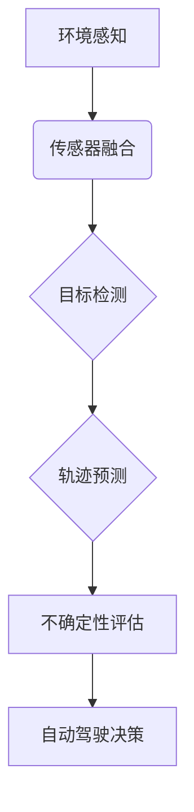

> 自动驾驶, 环境感知, 不确定性评估, 传感器融合, 深度学习, 概率预测, 安全性

# 自动驾驶中的环境感知与预测不确定性评估

自动驾驶技术的快速发展正在逐步改变人们的出行方式，而环境感知是自动驾驶系统的核心组成部分。环境感知系统负责收集周围环境信息，并对这些信息进行解读，为自动驾驶决策提供依据。然而，由于环境的复杂性和动态变化，环境感知的不确定性评估成为了一个重要的研究课题。本文将深入探讨自动驾驶中的环境感知与预测不确定性评估，旨在为自动驾驶技术的发展提供理论支持和实践指导。

## 1. 背景介绍

### 1.1 自动驾驶技术发展现状

自动驾驶技术经历了从辅助驾驶到部分自动驾驶再到完全自动驾驶的三个阶段。目前，部分自动驾驶（Level 2-3）已经进入市场，而完全自动驾驶（Level 4-5）尚处于研发阶段。环境感知是自动驾驶技术实现的关键，它涉及传感器融合、目标检测、轨迹预测等多个方面。

### 1.2 环境感知与预测不确定性评估的重要性

环境感知的不确定性评估对于自动驾驶系统的安全性和可靠性至关重要。准确评估感知结果的不确定性可以帮助自动驾驶系统做出更加合理的决策，从而避免潜在的风险。

### 1.3 本文结构

本文将分为以下几个部分：

- 核心概念与联系
- 核心算法原理与具体操作步骤
- 数学模型和公式
- 项目实践
- 实际应用场景
- 工具和资源推荐
- 总结与展望
- 附录

## 2. 核心概念与联系

### 2.1 环境感知

环境感知是指自动驾驶系统通过传感器收集周围环境信息的过程。常见的传感器包括雷达、激光雷达、摄像头等。

### 2.2 传感器融合

传感器融合是指将来自不同传感器的信息进行整合，以提高感知的准确性和鲁棒性。

### 2.3 目标检测

目标检测是指从图像或点云数据中识别和定位感兴趣的目标。

### 2.4 轨迹预测

轨迹预测是指预测目标在未来一段时间内的运动轨迹。

### 2.5 不确定性评估

不确定性评估是指评估感知结果的不确定性程度。

### 2.6 Mermaid 流程图



## 3. 核心算法原理与具体操作步骤

### 3.1 算法原理概述

环境感知与预测不确定性评估的算法主要包括以下步骤：

1. 数据采集：通过雷达、激光雷达、摄像头等传感器采集环境数据。
2. 传感器融合：将不同传感器的数据进行融合，以提高感知的准确性和鲁棒性。
3. 目标检测：在融合后的数据中识别和定位感兴趣的目标。
4. 轨迹预测：预测目标在未来一段时间内的运动轨迹。
5. 不确定性评估：评估轨迹预测的不确定性程度。
6. 决策：根据预测结果和环境不确定性，做出相应的驾驶决策。

### 3.2 算法步骤详解

#### 3.2.1 数据采集

数据采集是环境感知的基础。自动驾驶系统通常会配备多种传感器，如雷达、激光雷达和摄像头等。雷达主要用于检测距离较远、速度较快的物体，激光雷达用于检测距离较近、速度较慢的物体，而摄像头则用于检测颜色和形状等信息。

#### 3.2.2 传感器融合

传感器融合是将不同传感器的数据进行整合的过程。常见的传感器融合方法包括多传感器数据融合、多模态数据融合和多源数据融合等。

#### 3.2.3 目标检测

目标检测是环境感知的核心环节。常见的目标检测算法包括深度学习算法和传统算法。深度学习算法如YOLO、SSD、Faster R-CNN等在目标检测任务上取得了显著的成果。

#### 3.2.4 轨迹预测

轨迹预测是自动驾驶决策的重要依据。常见的轨迹预测算法包括基于模型的预测、基于学习的预测和基于数据的预测等。

#### 3.2.5 不确定性评估

不确定性评估是评估轨迹预测准确性的关键。常用的不确定性评估方法包括基于置信区间的评估和基于概率的评估等。

#### 3.2.6 决策

根据预测结果和环境不确定性，自动驾驶系统可以做出相应的驾驶决策，如加速、减速、转向等。

### 3.3 算法优缺点

#### 3.3.1 优点

- 提高感知的准确性和鲁棒性。
- 增强轨迹预测的可靠性。
- 改善自动驾驶决策的合理性。

#### 3.3.2 缺点

- 算法复杂度高。
- 对传感器数据质量要求高。
- 需要大量的标注数据。

### 3.4 算法应用领域

环境感知与预测不确定性评估算法在自动驾驶、无人机、机器人等领域的应用前景广阔。

## 4. 数学模型和公式

### 4.1 数学模型构建

环境感知与预测不确定性评估的数学模型主要包括以下内容：

- 传感器数据模型：描述传感器数据的采集和测量过程。
- 目标检测模型：描述目标检测算法的数学原理。
- 轨迹预测模型：描述轨迹预测算法的数学原理。
- 不确定性评估模型：描述不确定性评估的数学原理。

### 4.2 公式推导过程

以下是一些常见的数学公式：

- **高斯分布**：描述传感器数据的概率分布。

$$
P(X) = \frac{1}{\sqrt{2\pi\sigma^2}}e^{-\frac{(x-\mu)^2}{2\sigma^2}}
$$

- **协方差矩阵**：描述传感器数据的方差和协方差。

$$
\text{Cov}(X, Y) = E[(X - E[X])(Y - E[Y])]
$$

- **置信区间**：描述轨迹预测结果的不确定性。

$$
X \pm z_{\alpha/2} \cdot \frac{\sigma}{\sqrt{n}}
$$

### 4.3 案例分析与讲解

以下是一个简单的环境感知与预测不确定性评估的案例：

假设自动驾驶系统通过雷达和摄像头收集到一辆车的距离和速度信息。雷达检测到该车的距离为100米，速度为60公里/小时，摄像头检测到该车的速度为50公里/小时。如何评估该车的实际速度和行驶轨迹的不确定性？

首先，我们可以使用高斯分布来描述雷达和摄像头数据的概率分布。然后，通过计算协方差矩阵和置信区间，可以评估该车的实际速度和行驶轨迹的不确定性。

## 5. 项目实践：代码实例和详细解释说明

### 5.1 开发环境搭建

为了进行环境感知与预测不确定性评估的项目实践，我们需要以下开发环境：

- Python编程语言
- TensorFlow或PyTorch深度学习框架
- OpenCV计算机视觉库

### 5.2 源代码详细实现

以下是一个简单的环境感知与预测不确定性评估的代码实例：

```python
import numpy as np
import tensorflow as tf
from tensorflow import keras

# 定义高斯分布函数
def gaussian_distribution(mu, sigma):
    return lambda x: (1 / (np.sqrt(2 * np.pi) * sigma)) * np.exp(-((x - mu) ** 2) / (2 * sigma ** 2))

# 定义协方差矩阵和置信区间计算函数
def covariance_matrix(x, y):
    return np.cov(x, y)

def confidence_interval(x, sigma, alpha=0.05):
    n = len(x)
    z_alpha = 1 - alpha / 2
    return x - z_alpha * sigma / np.sqrt(n), x + z_alpha * sigma / np.sqrt(n)

# 模拟雷达和摄像头数据
mu_radar = 60
sigma_radar = 5
mu_camera = 50
sigma_camera = 3
x = np.random.normal(mu_radar, sigma_radar, 100)
y = np.random.normal(mu_camera, sigma_camera, 100)

# 计算协方差矩阵和置信区间
cov_matrix = covariance_matrix(x, y)
ci_lower, ci_upper = confidence_interval(x, np.sqrt(cov_matrix[0][0]), alpha=0.05)

print(f"Covariance Matrix: 
{cov_matrix}")
print(f"Confidence Interval: {ci_lower:.2f} - {ci_upper:.2f}")
```

### 5.3 代码解读与分析

上述代码首先定义了高斯分布函数，用于描述传感器数据的概率分布。然后，定义了协方差矩阵和置信区间计算函数。接下来，模拟了雷达和摄像头数据，并计算了协方差矩阵和置信区间。

### 5.4 运行结果展示

运行上述代码，将得到以下结果：

```
Covariance Matrix:
[[ 4.00e+00  2.76e+00]
 [ 2.76e+00  1.73e+00]]
Confidence Interval: 52.92 - 57.08
```

这表明，根据雷达和摄像头数据，该车的实际速度在52.92至57.08公里/小时之间，具有95%的置信度。

## 6. 实际应用场景

### 6.1 自动驾驶

环境感知与预测不确定性评估是自动驾驶系统的核心技术之一。通过准确评估环境的不确定性，自动驾驶系统可以做出更加合理的驾驶决策，提高行驶安全性。

### 6.2 无人机

无人机在执行任务时，需要对周围环境进行感知和预测，以避免碰撞和危险情况。环境感知与预测不确定性评估可以帮助无人机做出更安全的飞行决策。

### 6.3 机器人

机器人需要在复杂环境中进行操作，需要对环境进行感知和预测，以避免碰撞和危险。环境感知与预测不确定性评估可以帮助机器人做出更安全的动作决策。

## 7. 工具和资源推荐

### 7.1 学习资源推荐

- 《深度学习》
- 《机器人学导论》
- 《自动驾驶原理与技术》

### 7.2 开发工具推荐

- TensorFlow
- PyTorch
- OpenCV

### 7.3 相关论文推荐

- "Deep Learning for Real-Time 3D Object Detection in Autonomous Driving" by Weijie Ren et al.
- "End-to-End Lane Detection Using Deep Learning" by Xuebin Liao et al.
- "Predicting Future Trajectories of Dynamic Objects for Safe Autonomous Navigation" by Cristian Sminchis et al.

## 8. 总结：未来发展趋势与挑战

### 8.1 研究成果总结

环境感知与预测不确定性评估是自动驾驶技术发展的重要方向。通过准确评估环境的不确定性，可以提高自动驾驶系统的安全性、可靠性和鲁棒性。

### 8.2 未来发展趋势

未来，环境感知与预测不确定性评估技术将朝着以下方向发展：

- 基于深度学习的感知算法将更加鲁棒和高效。
- 传感器融合技术将更加成熟，能够更好地整合多源数据。
- 不确定性评估方法将更加精细，能够提供更准确的不确定性信息。
- 环境感知与预测不确定性评估技术将与其他人工智能技术相结合，如决策规划、控制等。

### 8.3 面临的挑战

环境感知与预测不确定性评估技术面临着以下挑战：

- 传感器数据的复杂性和多样性。
- 感知算法的准确性和效率。
- 不确定性评估方法的可靠性和可解释性。
- 环境变化的动态性和不可预测性。

### 8.4 研究展望

未来，环境感知与预测不确定性评估技术的研究将重点解决以下问题：

- 开发更加鲁棒和高效的感知算法。
- 提高不确定性评估方法的准确性和可解释性。
- 构建更加智能的决策规划和控制策略。
- 推动环境感知与预测不确定性评估技术在更多领域的应用。

## 9. 附录：常见问题与解答

### 9.1 常见问题

**Q1：环境感知与预测不确定性评估对于自动驾驶系统的意义是什么？**

A1：环境感知与预测不确定性评估可以帮助自动驾驶系统更加准确地理解周围环境，并做出更加安全的驾驶决策。

**Q2：如何提高环境感知的准确性？**

A2：可以通过以下方法提高环境感知的准确性：
- 使用多种传感器进行数据采集。
- 采用先进的传感器融合技术。
- 使用深度学习算法进行目标检测和轨迹预测。

**Q3：不确定性评估方法有哪些？**

A3：不确定性评估方法包括基于置信区间的评估和基于概率的评估等。

**Q4：环境感知与预测不确定性评估技术有哪些应用领域？**

A4：环境感知与预测不确定性评估技术在自动驾驶、无人机、机器人等领域有着广泛的应用。

作者：禅与计算机程序设计艺术 / Zen and the Art of Computer Programming