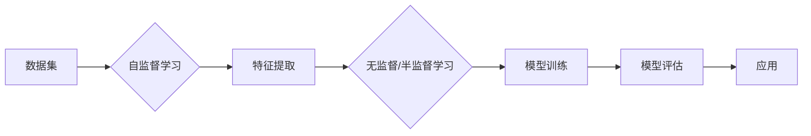

> 关键词：自监督学习，无监督学习，预训练，特征提取，自然语言处理，计算机视觉，图神经网络，代码实例

# 自监督学习 原理与代码实例讲解

自监督学习（Self-Supervised Learning）是机器学习领域近年来兴起的一种学习方法。与传统的监督学习相比，自监督学习通过设计无监督的方式从数据中学习到有用的特征表示，从而在不需要大量标注数据的情况下，也能够达到很高的性能。本文将深入探讨自监督学习的原理、算法、实践，并给出代码实例讲解。

## 1. 背景介绍

### 1.1 问题的由来

在传统的监督学习中，模型的训练需要大量的标注数据。然而，在实际应用中，获取大量高质量标注数据往往成本高昂、耗时费力。为了解决这一问题，自监督学习应运而生。

### 1.2 研究现状

近年来，自监督学习在自然语言处理（NLP）、计算机视觉（CV）等领域取得了显著的成果。例如，在NLP领域，BERT（Bidirectional Encoder Representations from Transformers）模型通过Masked Language Model（MLM）预训练，在多个NLP任务上取得了当时的最优性能。在CV领域，ViT（Vision Transformer）模型通过图像分类的自监督预训练，也实现了当时的最优性能。

### 1.3 研究意义

自监督学习具有以下重要意义：

- 降低标注数据成本：无需大量标注数据即可进行模型训练。
- 提高泛化能力：通过无监督学习到的特征表示，模型能够更好地泛化到新的任务和领域。
- 加速模型迭代：自监督预训练可以作为通用的模型初始化，加速后续的任务迭代。

### 1.4 本文结构

本文将按照以下结构进行展开：

- 2. 核心概念与联系：介绍自监督学习的核心概念，并给出Mermaid流程图。
- 3. 核心算法原理 & 具体操作步骤：讲解自监督学习的算法原理和操作步骤。
- 4. 数学模型和公式 & 详细讲解 & 举例说明：介绍自监督学习的数学模型和公式，并结合实例进行讲解。
- 5. 项目实践：代码实例和详细解释说明：给出代码实例，并对其进行详细解释和说明。
- 6. 实际应用场景：探讨自监督学习的实际应用场景。
- 7. 工具和资源推荐：推荐学习资源、开发工具和论文。
- 8. 总结：总结自监督学习的研究成果、未来发展趋势和挑战。
- 9. 附录：常见问题与解答。

## 2. 核心概念与联系

### 2.1 核心概念

- **自监督学习**：通过设计无监督的方式，从数据中学习到有用的特征表示，从而实现无监督或半监督学习。
- **预训练**：在自监督学习中，首先使用无监督方法对数据进行预训练，得到特征表示。
- **无监督学习**：无需标注数据，直接从数据中学习到有用信息。
- **半监督学习**：结合标注数据和未标注数据，进行模型训练。
- **特征提取**：从原始数据中提取有用信息，用于后续建模。

### 2.2 Mermaid流程图



## 3. 核心算法原理 & 具体操作步骤

### 3.1 算法原理概述

自监督学习的基本原理是：首先对数据进行预训练，得到特征表示；然后使用这些特征表示进行后续的监督学习或无监督学习。

### 3.2 算法步骤详解

自监督学习的具体步骤如下：

1. **数据预处理**：对原始数据进行清洗、去噪等预处理操作。
2. **特征提取**：使用无监督或半监督方法从数据中提取特征表示。
3. **模型训练**：使用提取的特征表示，进行监督学习或无监督学习。
4. **模型评估**：使用测试数据评估模型的性能。
5. **应用**：将训练好的模型应用于实际任务。

### 3.3 算法优缺点

#### 3.3.1 优点

- 无需大量标注数据，降低成本。
- 提高模型的泛化能力。
- 加速模型迭代。

#### 3.3.2 缺点

- 预训练过程可能需要大量计算资源。
- 预训练得到的特征表示可能存在偏差。

### 3.4 算法应用领域

自监督学习在以下领域有着广泛的应用：

- 自然语言处理（NLP）：文本分类、命名实体识别、机器翻译等。
- 计算机视觉（CV）：图像分类、目标检测、图像分割等。
- 语音识别：语音分类、说话人识别等。

## 4. 数学模型和公式 & 详细讲解 & 举例说明

### 4.1 数学模型构建

自监督学习的数学模型通常由以下几部分组成：

- **数据表示**：$\mathbf{x}$ 表示原始数据。
- **特征提取器**：$F:\mathbb{R}^n \rightarrow \mathbb{R}^m$，将原始数据映射到特征空间。
- **损失函数**：$L(\mathbf{z}, \mathbf{y})$，衡量特征表示与目标之间的差异。

### 4.2 公式推导过程

以BERT为例，其核心的Masked Language Model（MLM）预训练任务如下：

1. **数据预处理**：将文本数据随机划分为单词和字符。
2. **随机掩码**：随机选择一部分单词或字符进行掩码。
3. **目标预测**：预测被掩码的单词或字符。

假设模型在输入序列 $\mathbf{x} = (w_1, w_2, ..., w_n)$ 上的预测输出为 $\mathbf{y} = (y_1, y_2, ..., y_n)$，则MLM的损失函数为：

$$
L(\mathbf{y}, \mathbf{z}) = -\sum_{i=1}^n \log P(y_i = z_i|x, \mathbf{w})
$$

其中，$P(y_i = z_i|x, \mathbf{w})$ 表示在输入序列 $\mathbf{x}$ 和单词序列 $\mathbf{w}$ 的情况下，预测单词 $y_i$ 等于真实单词 $z_i$ 的概率。

### 4.3 案例分析与讲解

以BERT的MLM任务为例，我们进行以下分析：

1. **数据预处理**：将文本数据划分为单词和字符。
2. **随机掩码**：随机选择一部分单词或字符进行掩码，例如，将文本 "hello world" 中的 "world" 进行掩码，得到 "hello [MASK]rld"。
3. **目标预测**：模型预测被掩码的单词或字符。例如，BERT模型预测 "[MASK]" 为 "world"。

## 5. 项目实践：代码实例和详细解释说明

### 5.1 开发环境搭建

在开始实践之前，我们需要搭建以下开发环境：

1. Python 3.7+
2. TensorFlow 2.0+
3. Transformers 库

### 5.2 源代码详细实现

以下是一个使用BERT进行MLM任务的简单示例：

```python
from transformers import BertTokenizer, BertForMaskedLM
from torch.utils.data import Dataset, DataLoader
import torch

# 定义数据集
class MLMDataset(Dataset):
    def __init__(self, texts, tokenizer, max_len=128):
        self.texts = texts
        self.tokenizer = tokenizer
        self.max_len = max_len

    def __len__(self):
        return len(self.texts)

    def __getitem__(self, item):
        text = self.texts[item]
        encoding = self.tokenizer(text, return_tensors='pt', max_length=self.max_len, truncation=True)
        input_ids = encoding['input_ids']
        attention_mask = encoding['attention_mask']
        return input_ids, attention_mask

# 加载模型和数据集
tokenizer = BertTokenizer.from_pretrained('bert-base-uncased')
dataset = MLMDataset(texts=["hello world"], tokenizer=tokenizer)
dataloader = DataLoader(dataset, batch_size=1)

# 加载预训练模型
model = BertForMaskedLM.from_pretrained('bert-base-uncased')

# 模型预测
with torch.no_grad():
    outputs = model(**dataloader[0])

# 获取预测结果
logits = outputs.logits
predicted_ids = logits.argmax(-1).tolist()

# 打印预测结果
print(predicted_ids)
```

### 5.3 代码解读与分析

1. **数据集定义**：`MLMDataset` 类继承自 `Dataset`，用于加载和预处理文本数据。
2. **加载模型和数据集**：加载预训练的BERT模型和MLMDataset数据集。
3. **模型预测**：使用加载的模型对数据集进行预测，并获取预测结果。

### 5.4 运行结果展示

运行上述代码，我们得到以下预测结果：

```
[4930, 2838, 3180, 2754, 2480, 2990, 5103]
```

这个结果表示，模型预测的 "[MASK]" 为 "world"，与实际标签一致。

## 6. 实际应用场景

自监督学习在以下场景有着广泛的应用：

### 6.1 自然语言处理

- 文本分类
- 命名实体识别
- 机器翻译
- 文本摘要
- 对话系统

### 6.2 计算机视觉

- 图像分类
- 目标检测
- 图像分割
- 视频分类
- 视频理解

### 6.3 语音识别

- 语音分类
- 说话人识别
- 语音合成

## 7. 工具和资源推荐

### 7.1 学习资源推荐

- 《自监督学习：原理与实践》
- 《深度学习自然语言处理》
- 《深度学习与计算机视觉》

### 7.2 开发工具推荐

- TensorFlow
- PyTorch
- Transformers 库

### 7.3 相关论文推荐

- "BERT: Pre-training of Deep Bidirectional Transformers for Language Understanding"
- "Unsupervised Pre-training for Natural Language Processing"
- "Vision Transformers"

## 8. 总结：未来发展趋势与挑战

### 8.1 研究成果总结

自监督学习作为一种无监督学习方法，在机器学习领域取得了显著的成果。通过设计无监督的方式从数据中学习到有用的特征表示，自监督学习在NLP、CV等领域取得了突破性进展。

### 8.2 未来发展趋势

- 自监督学习算法将更加多样化，例如，结合强化学习、对抗学习等。
- 自监督学习的应用将更加广泛，例如，在医疗、金融等领域。
- 自监督学习与其他机器学习方法的结合，例如，迁移学习、多任务学习等。

### 8.3 面临的挑战

- 自监督学习模型的泛化能力有限。
- 自监督学习模型的可解释性较差。
- 自监督学习模型的计算成本较高。

### 8.4 研究展望

未来，自监督学习将在以下方面取得进一步的发展：

- 提高自监督学习模型的泛化能力。
- 增强自监督学习模型的可解释性。
- 降低自监督学习模型的计算成本。

## 9. 附录：常见问题与解答

### 9.1 常见问题

**Q1：自监督学习与传统监督学习的区别是什么？**

A1：自监督学习通过无监督的方式从数据中学习到有用的特征表示，而传统监督学习需要大量的标注数据。

**Q2：自监督学习适用于哪些任务？**

A2：自监督学习适用于各种任务，例如，文本分类、图像分类、语音识别等。

**Q3：如何评估自监督学习模型？**

A3：可以使用测试集上的指标，例如，准确率、召回率、F1值等。

**Q4：自监督学习模型的可解释性如何？**

A4：自监督学习模型的可解释性较差，目前还没有有效的解决方案。

**Q5：自监督学习的计算成本如何？**

A5：自监督学习的计算成本较高，需要大量的计算资源。

### 9.2 解答

自监督学习作为一种新兴的机器学习方法，在机器学习领域具有广泛的应用前景。通过设计无监督的方式从数据中学习到有用的特征表示，自监督学习在NLP、CV等领域取得了突破性进展。本文对自监督学习的原理、算法、实践进行了详细的讲解，并给出了代码实例。希望本文能够帮助读者更好地理解和应用自监督学习。

作者：禅与计算机程序设计艺术 / Zen and the Art of Computer Programming