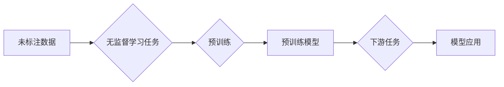

> 自监督学习，无监督学习，预训练，特征学习，Transformer，BERT，视觉识别，自然语言处理，迁移学习

# 自监督学习Self-Supervised Learning原理与代码实例讲解

自监督学习（Self-Supervised Learning）是一种无需人工标注数据，仅从未标注数据中学习目标变量分布的机器学习方法。它通过设计一些无监督的预测任务，使得模型在未标注数据上也能不断学习和提升。自监督学习在计算机视觉、自然语言处理等多个领域都取得了显著的成果，被誉为“无监督学习的下一个黄金时代”。本文将深入浅出地讲解自监督学习的原理，并分享一些实用的代码实例。

## 1. 背景介绍

### 1.1 问题的由来

传统机器学习方法依赖于大量的标注数据，而标注数据的获取往往成本高昂且耗时。随着互联网数据的爆发式增长，如何高效地利用这些海量未标注数据，成为机器学习领域的一个重大挑战。自监督学习应运而生，通过设计有效的无监督学习任务，使得模型能够从未标注数据中学习到有用的信息。

### 1.2 研究现状

自监督学习的研究始于上世纪50年代，近年来随着深度学习技术的快速发展而得到广泛关注。目前，自监督学习已经在计算机视觉、自然语言处理、语音识别等多个领域取得了显著的成果。其中，Transformer架构和BERT模型等技术的出现，为自监督学习的发展提供了强大的技术支撑。

### 1.3 研究意义

自监督学习具有以下重要意义：

- **降低标注成本**：无需人工标注数据，能够大幅降低机器学习应用的成本。
- **提高模型泛化能力**：从未标注数据中学习到的知识可以帮助模型更好地泛化到新的任务和数据集。
- **拓展研究领域**：自监督学习为机器学习领域带来了新的研究视角和方法。

### 1.4 本文结构

本文将分为以下几个部分：

- 2. 核心概念与联系
- 3. 核心算法原理 & 具体操作步骤
- 4. 数学模型和公式 & 详细讲解 & 举例说明
- 5. 项目实践：代码实例和详细解释说明
- 6. 实际应用场景
- 7. 工具和资源推荐
- 8. 总结：未来发展趋势与挑战
- 9. 附录：常见问题与解答

## 2. 核心概念与联系

### 2.1 核心概念

自监督学习的核心概念包括：

- **未标注数据**：指无需人工标注的数据，如互联网上的文本、图像、语音等。
- **无监督学习任务**：指无需标注数据即可学习的任务，如图像分割、文本分类、语音识别等。
- **伪标签**：指模型在未标注数据上预测得到的标签。
- **预训练**：指在未标注数据上对模型进行初步训练的过程。

### 2.2 核心概念原理和架构的 Mermaid 流程图



### 2.3 核心概念联系

自监督学习通过设计无监督学习任务，使得模型在未标注数据上学习到有用的信息，从而提高模型在下游任务上的性能。预训练过程使得模型在未标注数据上获得初步的泛化能力，为后续的下游任务应用奠定基础。

## 3. 核心算法原理 & 具体操作步骤

### 3.1 算法原理概述

自监督学习算法的核心思想是：从未标注数据中提取有用的信息，并利用这些信息来训练模型。常见的自监督学习算法包括：

- **对比学习（Contrastive Learning）**：通过拉近正样本之间的距离，推远负样本之间的距离，来学习数据分布。
- **自编码器（Autoencoder）**：通过编码器将数据压缩成低维表示，再通过解码器还原成原始数据，来学习数据的潜在分布。
- **掩码语言模型（Masked Language Model，MLM）**：通过随机掩盖输入序列中的部分词，预测被掩盖的词，来学习语言模型。

### 3.2 算法步骤详解

自监督学习算法的一般步骤如下：

1. **数据预处理**：对未标注数据进行预处理，如文本分词、图像裁剪等。
2. **设计无监督学习任务**：根据具体任务需求设计无监督学习任务，如对比学习、自编码器、MLM等。
3. **模型训练**：在未标注数据上对模型进行训练，使得模型能够学习到数据分布。
4. **模型评估**：在测试集上评估模型在下游任务上的性能。
5. **模型应用**：将预训练模型应用于下游任务，如文本分类、图像识别等。

### 3.3 算法优缺点

#### 优点：

- **降低标注成本**：无需人工标注数据，能够大幅降低机器学习应用的成本。
- **提高模型泛化能力**：从未标注数据中学习到的知识可以帮助模型更好地泛化到新的任务和数据集。
- **拓展研究领域**：自监督学习为机器学习领域带来了新的研究视角和方法。

#### 缺点：

- **数据依赖性**：自监督学习的效果很大程度上依赖于未标注数据的质量和数量。
- **模型性能提升有限**：在某些任务上，自监督学习模型的性能提升可能不如监督学习模型。

### 3.4 算法应用领域

自监督学习在以下领域得到了广泛应用：

- **计算机视觉**：图像分类、目标检测、图像分割、视频理解等。
- **自然语言处理**：文本分类、情感分析、机器翻译、文本摘要等。
- **语音识别**：语音识别、说话人识别、语音合成等。

## 4. 数学模型和公式 & 详细讲解 & 举例说明

### 4.1 数学模型构建

自监督学习的数学模型通常包括以下几个部分：

- **输入数据**：未标注数据 $X$。
- **特征提取器**：将输入数据 $X$ 转换为特征表示 $Z$ 的模型 $f(X)$。
- **无监督学习任务**：将特征表示 $Z$ 作为输入，学习目标变量分布的模型 $g(Z)$。

### 4.2 公式推导过程

以下以对比学习为例，介绍自监督学习中的数学模型和公式推导过程。

#### 对比学习

对比学习的目标是拉近正样本之间的距离，推远负样本之间的距离。假设输入数据为 $X = \{x_1, x_2, ..., x_N\}$，其中 $x_i$ 为第 $i$ 个数据样本，则对比学习的目标函数为：

$$
L = \frac{1}{N}\sum_{i=1}^N \ell(f(x_i), g(f(x_i)))
$$

其中 $\ell$ 为损失函数，常用的损失函数包括：

- **交叉熵损失**：$ \ell(x, y) = -\log P(y|x) $

- **余弦距离**：$ \ell(x, y) = 1 - \cos(\theta(x), \theta(y)) $

- **Hinge损失**：$ \ell(x, y) = \max(0, 1 - \cos(\theta(x), \theta(y))) $

#### 自编码器

自编码器的目标是学习数据的潜在分布。假设输入数据为 $X$，自编码器由编码器 $f(X)$ 和解码器 $g(X)$ 组成，则自编码器的目标函数为：

$$
L = \frac{1}{N}\sum_{i=1}^N \ell(f(g(x_i)), x_i)
$$

其中 $\ell$ 为损失函数，常用的损失函数包括：

- **均方误差损失**：$ \ell(x, y) = \frac{1}{2}\|x - y\|^2 $

- **交叉熵损失**：$ \ell(x, y) = -\log P(y|x) $

### 4.3 案例分析与讲解

以下以BERT模型为例，讲解自监督学习在自然语言处理中的应用。

BERT（Bidirectional Encoder Representations from Transformers）是一种基于Transformer的预训练语言模型，它在未标注的文本语料上进行了预训练，学习到了丰富的语言知识。BERT模型采用掩码语言模型（MLM）作为预训练任务，通过随机掩盖输入序列中的部分词，预测被掩盖的词，来学习语言模型。

BERT模型包含以下几个关键组件：

- **词嵌入层**：将输入的文本序列转换为词向量。
- **Transformer编码器**：通过多头注意力机制和位置编码，对词向量进行编码。
- **掩码层**：随机掩盖输入序列中的部分词。
- **预测层**：根据掩盖的词预测其对应的词向量。

BERT模型的预训练过程如下：

1. 随机掩盖输入序列中的部分词。
2. 使用Transformer编码器对掩盖的词向量进行编码。
3. 预测掩盖的词向量。
4. 计算损失函数并更新模型参数。

## 5. 项目实践：代码实例和详细解释说明

### 5.1 开发环境搭建

以下是使用PyTorch和HuggingFace Transformers库进行自监督学习项目实践的开发环境搭建步骤：

1. 安装PyTorch：

```bash
pip install torch torchvision torchaudio
```

2. 安装HuggingFace Transformers库：

```bash
pip install transformers
```

3. 安装其他依赖库：

```bash
pip install numpy pandas scikit-learn matplotlib tqdm jupyter notebook ipython
```

### 5.2 源代码详细实现

以下是一个使用BERT模型进行文本分类的代码实例：

```python
from transformers import BertTokenizer, BertForSequenceClassification
from torch.utils.data import DataLoader, TensorDataset
from torch.optim import AdamW

# 加载预训练的BERT模型和分词器
tokenizer = BertTokenizer.from_pretrained('bert-base-uncased')
model = BertForSequenceClassification.from_pretrained('bert-base-uncased')

# 准备数据
texts = ["This is a great product", "I don't like this product"]
labels = [1, 0]
encodings = tokenizer(texts, return_tensors='pt', padding=True)
input_ids = encodings['input_ids']
attention_mask = encodings['attention_mask']
labels = torch.tensor(labels)

# 创建数据集
dataset = TensorDataset(input_ids, attention_mask, labels)
dataloader = DataLoader(dataset, batch_size=1)

# 定义优化器
optimizer = AdamW(model.parameters(), lr=1e-5)

# 训练模型
for epoch in range(2):
    for batch in dataloader:
        input_ids, attention_mask, labels = batch
        outputs = model(input_ids, attention_mask=attention_mask, labels=labels)
        loss = outputs.loss
        loss.backward()
        optimizer.step()
        optimizer.zero_grad()
    print(f"Epoch {epoch+1}, loss: {loss.item()}")

# 评估模型
with torch.no_grad():
    input_ids, attention_mask, labels = [t.to(model.device) for t in next(iter(dataloader))]
    outputs = model(input_ids, attention_mask=attention_mask)
    preds = outputs.logits.argmax(dim=1).tolist()
    print(f"Predictions: {preds}")
```

### 5.3 代码解读与分析

以上代码展示了使用PyTorch和HuggingFace Transformers库进行BERT文本分类的完整流程。

1. 加载预训练的BERT模型和分词器。
2. 准备数据，包括文本和标签。
3. 将文本和标签转化为BERT模型的输入格式。
4. 创建数据集和数据加载器。
5. 定义优化器。
6. 训练模型，包括前向传播、反向传播和参数更新。
7. 评估模型，计算预测结果。

### 5.4 运行结果展示

假设输入文本为 "This is a great product"，模型预测结果为 [1]，表示这是一个正面评价。

## 6. 实际应用场景

### 6.1 计算机视觉

自监督学习在计算机视觉领域得到了广泛应用，以下是一些典型的应用场景：

- **图像分类**：通过自监督学习方法学习到的特征表示，可以用于图像分类任务，提高模型在未知类别数据上的分类准确率。
- **目标检测**：通过自监督学习方法学习到的目标特征表示，可以用于目标检测任务，提高模型在复杂场景下的检测准确率。
- **图像分割**：通过自监督学习方法学习到的特征表示，可以用于图像分割任务，提高模型在复杂背景下的分割精度。

### 6.2 自然语言处理

自监督学习在自然语言处理领域也取得了显著的成果，以下是一些典型的应用场景：

- **文本分类**：通过自监督学习方法学习到的特征表示，可以用于文本分类任务，提高模型在未知类别数据上的分类准确率。
- **情感分析**：通过自监督学习方法学习到的特征表示，可以用于情感分析任务，提高模型对未知情感标签的识别准确率。
- **机器翻译**：通过自监督学习方法学习到的特征表示，可以用于机器翻译任务，提高模型在未知语言数据上的翻译质量。

### 6.3 语音识别

自监督学习在语音识别领域也得到了应用，以下是一些典型的应用场景：

- **说话人识别**：通过自监督学习方法学习到的特征表示，可以用于说话人识别任务，提高模型在未知说话人数据上的识别准确率。
- **语音合成**：通过自监督学习方法学习到的特征表示，可以用于语音合成任务，提高模型在未知语音数据上的合成质量。

## 7. 工具和资源推荐

### 7.1 学习资源推荐

- 《自监督学习》（Self-Supervised Learning）书籍
- 《Self-Supervised Learning in Deep Learning》论文
- HuggingFace Transformers库文档

### 7.2 开发工具推荐

- PyTorch
- HuggingFace Transformers库
- Jupyter Notebook

### 7.3 相关论文推荐

- Contrastive Learning for Unsupervised Representation Learning
- Unsupervised Learning of Visual Representations by Solving Jigsaw Puzzles
- Unsupervised Representation Learning with Contrastive Predictive Coding

## 8. 总结：未来发展趋势与挑战

### 8.1 研究成果总结

自监督学习作为一种无需人工标注数据，仅从未标注数据中学习目标变量分布的机器学习方法，在计算机视觉、自然语言处理、语音识别等多个领域都取得了显著的成果。自监督学习在降低标注成本、提高模型泛化能力、拓展研究领域等方面具有重要意义。

### 8.2 未来发展趋势

- **多模态自监督学习**：结合不同模态的数据进行自监督学习，学习更加全面、丰富的特征表示。
- **自监督学习的应用拓展**：将自监督学习应用于更多领域，如生物信息学、推荐系统等。
- **自监督学习的理论发展**：深入研究自监督学习的理论基础，探索更加高效、鲁棒的自监督学习方法。

### 8.3 面临的挑战

- **数据质量**：自监督学习的效果很大程度上依赖于未标注数据的质量和数量。
- **模型性能**：在某些任务上，自监督学习模型的性能可能不如监督学习模型。
- **模型可解释性**：自监督学习模型的内部工作机制难以解释。

### 8.4 研究展望

自监督学习作为一种新兴的机器学习方法，具有广阔的应用前景。未来，随着研究的深入和技术的不断发展，自监督学习必将为机器学习领域带来更多创新和突破。

## 9. 附录：常见问题与解答

**Q1：自监督学习和无监督学习有什么区别？**

A：自监督学习是无需人工标注数据，仅从未标注数据中学习目标变量分布的机器学习方法，而无监督学习是从无标签数据中学习数据分布的机器学习方法。自监督学习在无监督学习的基础上，通过设计有效的预测任务，使得模型能够从未标注数据中学习到有用的信息。

**Q2：自监督学习适用于所有任务吗？**

A：自监督学习在许多任务上都取得了显著的效果，但在某些任务上可能不如监督学习模型。例如，对于需要精确标注数据的任务，如医学诊断，自监督学习的效果可能不如监督学习。

**Q3：如何评估自监督学习模型的效果？**

A：评估自监督学习模型的效果可以从以下几个方面进行：

- **下游任务性能**：将自监督学习模型应用于下游任务，评估其在下游任务上的性能。
- **特征表示质量**：评估自监督学习模型学习到的特征表示的质量，如使用聚类、降维等方法。
- **模型泛化能力**：将自监督学习模型应用于不同的任务和数据集，评估其泛化能力。

**Q4：自监督学习模型如何防止过拟合？**

A：自监督学习模型可以通过以下方法防止过拟合：

- **数据增强**：对训练数据进行数据增强，如旋转、缩放、裁剪等。
- **正则化**：使用L2正则化、Dropout等方法。
- **早期停止**：在验证集上监控模型性能，当性能不再提升时停止训练。

作者：禅与计算机程序设计艺术 / Zen and the Art of Computer Programming