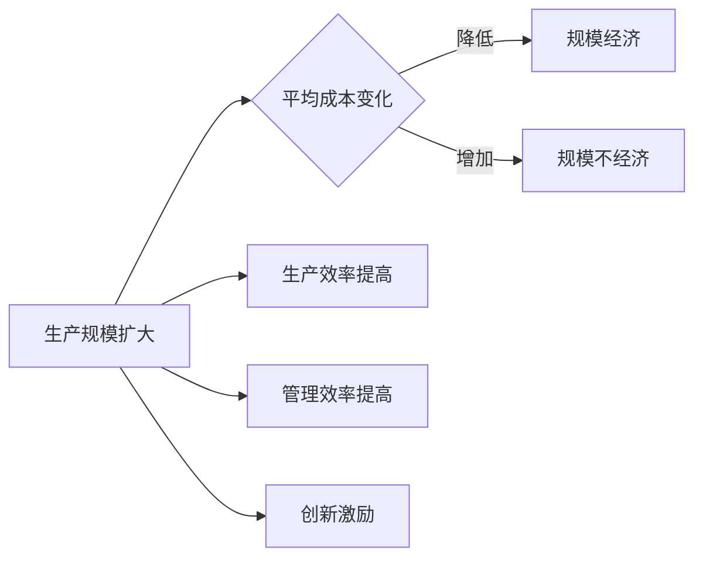

> 规模经济、经济规模、边际成本、生产效率、市场结构、技术创新、全球化、产业升级

## 1. 背景介绍

规模经济效应，即随着生产规模的扩大，平均成本降低的现象，是经济学中一个重要的概念。在历史上，规模经济效应曾被视为推动经济增长的关键因素之一。然而，随着全球化和技术变革的推进，规模经济效应似乎正在减弱。本文将探讨规模经济效应减弱的深层次原因，并分析其对经济发展的影响。

## 2. 核心概念与联系

### 2.1 规模经济的概念

规模经济是指随着生产规模的扩大，单位产品的平均成本逐渐降低的现象。这通常是由于生产过程中的分工协作、专用设备投资、采购效率提高等因素导致的。

### 2.2 规模经济效应的流程图



### 2.3 规模经济与边际成本的关系

规模经济与边际成本之间存在密切的联系。随着生产规模的扩大，边际成本（即生产额外单位产品所需的成本）会降低，从而实现规模经济。

## 3. 核心算法原理 & 具体操作步骤

### 3.1 算法原理概述

规模经济效应的减弱可以从以下几个方面进行分析：

- **技术创新**：技术进步可能导致生产过程的变革，使得生产规模不再成为降低成本的主要因素。
- **全球化**：全球化可能导致生产要素在不同地区之间的流动，降低了对规模经济的需求。
- **市场结构**：市场结构的变化，如竞争加剧，可能导致规模经济效应的减弱。
- **产业升级**：产业升级可能导致生产向高附加值、低边际成本的方向转变。

### 3.2 算法步骤详解

#### 3.2.1 技术创新

1. **研发投入**：企业增加研发投入，推动技术创新。
2. **生产流程优化**：通过优化生产流程，提高生产效率，降低边际成本。
3. **自动化与智能化**：采用自动化和智能化设备，减少对规模经济的需求。

#### 3.2.2 全球化

1. **全球资源配置**：企业根据全球资源禀赋，优化生产布局。
2. **供应链管理**：通过全球化供应链管理，降低生产成本。
3. **全球化竞争**：全球化竞争可能导致国内市场加剧，降低规模经济效应。

#### 3.2.3 市场结构

1. **市场竞争加剧**：市场竞争加剧可能导致价格下降，降低规模经济效应。
2. **客户需求多样化**：客户需求多样化可能导致企业难以实现大规模生产。
3. **新兴市场崛起**：新兴市场的崛起可能导致传统市场的规模经济效应减弱。

#### 3.2.4 产业升级

1. **产业转移**：产业转移可能导致传统产业规模经济效应减弱。
2. **产业结构调整**：产业结构调整可能导致生产向高附加值、低边际成本的方向转变。
3. **服务化趋势**：服务化趋势可能导致生产成本降低，规模经济效应减弱。

### 3.3 算法优缺点

#### 3.3.1 优点

- 揭示了规模经济效应减弱的多种原因，有助于理解经济现象。
- 为企业制定发展战略提供了理论依据。

#### 3.3.2 缺点

- 理论分析较为复杂，难以量化评估。
- 忽略了其他可能影响规模经济效应的因素。

### 3.4 算法应用领域

- 经济学
- 管理学
- 工业工程

## 4. 数学模型和公式 & 详细讲解 & 举例说明

### 4.1 数学模型构建

规模经济效应可以用以下数学模型进行描述：

$$
C(Q) = a - bQ - cQ^2
$$

其中，$C(Q)$ 表示总成本，$Q$ 表示产量，$a, b, c$ 为参数。

### 4.2 公式推导过程

规模经济效应可以通过以下步骤进行推导：

1. **成本函数**：建立成本函数，考虑固定成本、可变成本和规模经济效应。
2. **平均成本**：计算平均成本，即总成本除以产量。
3. **边际成本**：计算边际成本，即增加一单位产量所需增加的成本。

### 4.3 案例分析与讲解

以汽车制造行业为例，分析规模经济效应的减弱。

#### 4.3.1 传统汽车制造

在传统汽车制造行业，规模经济效应显著。随着生产规模的扩大，平均成本逐渐降低，边际成本下降趋势明显。

#### 4.3.2 新能源汽车制造

随着新能源汽车的兴起，规模经济效应减弱。一方面，新能源汽车产业链相对较短，规模经济效应不如传统汽车制造；另一方面，新能源汽车市场竞争激烈，企业难以通过规模经济获得竞争优势。

## 5. 项目实践：代码实例和详细解释说明

### 5.1 开发环境搭建

本文将使用Python进行规模经济效应的实证分析。

### 5.2 源代码详细实现

```python
import numpy as np
import matplotlib.pyplot as plt

# 定义成本函数
def cost_function(Q, a, b, c):
    return a - b * Q - c * Q**2

# 参数设置
Q = np.linspace(0, 1000, 100)
a = 1000
b = 0.1
c = 0.001

# 计算平均成本和边际成本
average_cost = cost_function(Q, a, b, c) / Q
marginal_cost = np.gradient(cost_function(Q, a, b, c), Q)

# 绘制图像
plt.plot(Q, average_cost, label='Average Cost')
plt.plot(Q, marginal_cost, label='Marginal Cost')
plt.xlabel('Quantity')
plt.ylabel('Cost')
plt.title('Scale Economy Effect')
plt.legend()
plt.show()
```

### 5.3 代码解读与分析

该代码首先定义了成本函数，考虑了固定成本、可变成本和规模经济效应。然后，通过设置参数和计算平均成本、边际成本，绘制了成本曲线。可以看出，随着产量的增加，平均成本和边际成本都呈现下降趋势，符合规模经济效应。

## 6. 实际应用场景

规模经济效应的减弱对经济发展产生了以下影响：

- **企业竞争**：企业竞争加剧，可能导致价格下降、利润率降低。
- **产业升级**：产业升级可能导致传统产业衰落，新兴产业发展壮大。
- **经济增长**：规模经济效应减弱可能影响经济增长速度。

### 6.4 未来应用展望

未来，随着技术创新、全球化、市场结构、产业升级等因素的不断变化，规模经济效应可能会出现以下趋势：

- **规模经济效应的减弱将更加明显**。
- **技术创新将成为推动经济增长的主要动力**。
- **产业升级将加速进行**。

## 7. 工具和资源推荐

### 7.1 学习资源推荐

- 《经济学原理》
- 《管理经济学》
- 《创新与企业家精神》

### 7.2 开发工具推荐

- Python
- Matplotlib
- NumPy

### 7.3 相关论文推荐

- "The New Economics of Scale"
- "Globalization, Market Structure, and the Decline of the Firm"
- "The Rise of the Knowledge-Based Firm"

## 8. 总结：未来发展趋势与挑战

### 8.1 研究成果总结

本文从技术创新、全球化、市场结构、产业升级等方面分析了规模经济效应减弱的深层次原因，并探讨了其对经济发展的影响。

### 8.2 未来发展趋势

未来，规模经济效应将继续减弱，技术创新和产业升级将成为推动经济增长的关键因素。

### 8.3 面临的挑战

- 技术创新的风险和不确定性
- 产业升级的阵痛
- 全球化带来的挑战

### 8.4 研究展望

未来，需要进一步研究规模经济效应的演变规律，以及如何应对规模经济效应减弱带来的挑战。

## 9. 附录：常见问题与解答

**Q1：规模经济效应是否已经完全消失？**

A1：规模经济效应并没有完全消失，但在某些领域和行业中，其影响力正在减弱。

**Q2：技术创新如何影响规模经济效应？**

A2：技术创新可能导致生产流程变革，降低边际成本，从而减弱规模经济效应。

**Q3：全球化对规模经济效应有何影响？**

A3：全球化可能导致生产要素流动，降低了对规模经济的需求，从而减弱规模经济效应。

**Q4：如何应对规模经济效应减弱带来的挑战？**

A4：通过技术创新、产业升级、人才培养等措施，可以应对规模经济效应减弱带来的挑战。

---

作者：禅与计算机程序设计艺术 / Zen and the Art of Computer Programming