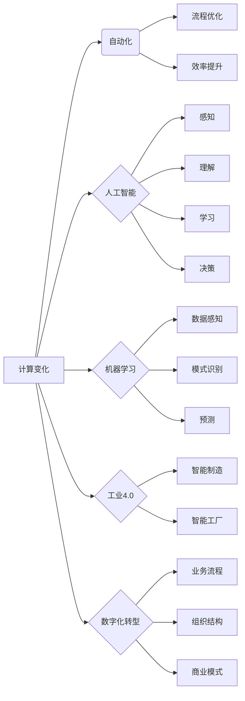

# 计算变化带来的自动化新机遇

> 关键词：计算变化，自动化，人工智能，机器学习，工业4.0，数字化转型，流程优化，效率提升

## 1. 背景介绍

随着信息技术的飞速发展，计算能力得到了前所未有的提升，云计算、大数据、人工智能等技术的广泛应用，为自动化领域带来了前所未有的机遇。计算变化正以前所未有的速度和深度改变着各行各业的生产方式、运营模式和商业模式。本文将探讨计算变化带来的自动化新机遇，分析其核心概念、原理、操作步骤，并探讨其在实际应用中的挑战和未来发展趋势。

## 2. 核心概念与联系

### 2.1 核心概念

- **计算变化**：指通过计算技术（如云计算、大数据、人工智能等）带来的技术变革和社会经济结构的调整。
- **自动化**：指利用机器或设备代替人工完成特定任务的过程。
- **人工智能（AI）**：指通过模拟、延伸和扩展人的智能，实现机器对数据的感知、理解、学习和决策。
- **机器学习（ML）**：指使计算机从数据中自动学习和提取模式，从而完成特定任务。
- **工业4.0**：指以数字化、网络化、智能化为特征的第四次工业革命。
- **数字化转型**：指企业通过应用数字化技术，实现业务流程、组织结构和商业模式的重构。

### 2.2 核心概念原理和架构的 Mermaid 流程图



### 2.3 核心概念联系

计算变化推动了人工智能和机器学习技术的发展，为自动化提供了强大的技术支持。工业4.0和数字化转型则是计算变化的典型应用场景，它们通过自动化、智能化改造传统产业，实现生产流程优化、效率提升和商业模式创新。

## 3. 核心算法原理 & 具体操作步骤

### 3.1 算法原理概述

自动化系统通常包括感知、决策、执行三个核心环节。计算变化带来的自动化新机遇，主要表现在以下三个方面：

- **感知**：利用传感器、摄像头等设备，实时采集环境信息，并通过机器学习算法进行分析和处理，实现对环境的智能感知。
- **决策**：根据感知到的信息，利用人工智能算法进行决策，指导执行系统的行动。
- **执行**：根据决策结果，通过机械臂、机器人等执行系统完成具体任务。

### 3.2 算法步骤详解

1. **数据采集与预处理**：通过传感器、摄像头等设备采集环境数据，并进行清洗、去噪、归一化等预处理操作。
2. **特征提取与选择**：从预处理后的数据中提取关键特征，并选择对任务影响最大的特征。
3. **模型训练**：利用机器学习算法，在训练数据上训练模型，使模型学会从数据中提取模式和知识。
4. **模型评估与优化**：在测试数据上评估模型性能，根据评估结果调整模型参数，优化模型性能。
5. **系统集成与部署**：将训练好的模型集成到自动化系统中，实现自动化的感知、决策和执行。

### 3.3 算法优缺点

**优点**：

- 提高效率：自动化系统可以24小时不间断工作，提高生产效率。
- 降低成本：自动化系统可以减少人工成本，降低运营成本。
- 提升质量：自动化系统可以减少人为错误，提高产品质量。
- 提高安全性：自动化系统可以替代危险工作，提高工作安全性。

**缺点**：

- 初始投资成本高：自动化系统需要购买设备、软件等，初始投资成本较高。
- 技术门槛高：自动化系统需要专业技术人员进行设计、开发、维护。
- 适应性强：自动化系统可能难以适应复杂多变的作业环境。

### 3.4 算法应用领域

自动化技术广泛应用于各个领域，如：

- 制造业：生产线自动化、机器人焊接、自动化检测等。
- 医疗行业：医疗设备自动化、远程医疗等。
- 交通行业：自动驾驶、智能交通管理等。
- 服务业：智能客服、智能安防等。

## 4. 数学模型和公式 & 详细讲解 & 举例说明

### 4.1 数学模型构建

自动化系统中的数学模型通常包括以下几种：

- **线性回归**：用于预测连续值。
- **逻辑回归**：用于预测离散值（如分类）。
- **神经网络**：用于复杂模式识别和决策。

### 4.2 公式推导过程

以线性回归为例，假设我们要预测一个连续值 $y$，其与特征 $x_1, x_2, \ldots, x_n$ 之间的关系可以表示为：

$$
y = \beta_0 + \beta_1 x_1 + \beta_2 x_2 + \ldots + \beta_n x_n + \epsilon
$$

其中，$\beta_0, \beta_1, \beta_2, \ldots, \beta_n$ 为模型参数，$\epsilon$ 为误差项。

### 4.3 案例分析与讲解

假设我们要预测一家工厂的月产量 $y$，根据历史数据，我们选择了两个特征 $x_1$（原材料库存）和 $x_2$（机器设备利用率）进行预测。通过线性回归模型，我们得到了以下模型：

$$
y = 1000 + 50x_1 + 20x_2
$$

如果当前原材料库存为100，机器设备利用率为80%，则我们可以预测该月的产量为：

$$
y = 1000 + 50 \times 100 + 20 \times 80 = 6600
$$

## 5. 项目实践：代码实例和详细解释说明

### 5.1 开发环境搭建

以下是使用Python和scikit-learn库进行线性回归的代码示例：

```python
from sklearn.linear_model import LinearRegression
import pandas as pd

# 加载数据
data = pd.read_csv('data.csv')
X = data[['原材料库存', '机器设备利用率']]
y = data['月产量']

# 创建模型
model = LinearRegression()

# 训练模型
model.fit(X, y)

# 预测
new_data = pd.DataFrame({'原材料库存': [100], '机器设备利用率': [80]})
y_pred = model.predict(new_data)
print('预测产量：', y_pred[0])
```

### 5.2 源代码详细实现

以上代码首先导入所需的库，然后加载数据，创建线性回归模型，训练模型，并使用模型对新的数据进行预测。

### 5.3 代码解读与分析

- `from sklearn.linear_model import LinearRegression`：导入线性回归模型。
- `import pandas as pd`：导入pandas库，用于数据操作。
- `data = pd.read_csv('data.csv')`：加载数据。
- `X = data[['原材料库存', '机器设备利用率']]`：提取特征。
- `y = data['月产量']`：提取目标变量。
- `model = LinearRegression()`：创建线性回归模型。
- `model.fit(X, y)`：训练模型。
- `new_data = pd.DataFrame({'原材料库存': [100], '机器设备利用率': [80]})`：创建新的数据。
- `y_pred = model.predict(new_data)`：使用模型预测产量。

### 5.4 运行结果展示

运行以上代码，将得到预测产量为6600的结果，与实际产量进行比较，可以评估模型性能。

## 6. 实际应用场景

### 6.1 制造业

在制造业中，自动化技术可以应用于以下场景：

- **智能车间**：通过传感器、机器人等设备，实现生产过程的自动化、智能化。
- **供应链管理**：利用大数据分析，优化供应链流程，降低库存成本。
- **质量检测**：通过机器视觉等技术，实现产品质量的自动检测。

### 6.2 医疗行业

在医疗行业中，自动化技术可以应用于以下场景：

- **智能诊断**：利用机器学习算法，辅助医生进行疾病诊断。
- **手术机器人**：在医生远程指导下，完成精细的手术操作。
- **药物研发**：利用自动化实验平台，提高药物研发效率。

### 6.3 交通行业

在交通行业中，自动化技术可以应用于以下场景：

- **自动驾驶**：利用人工智能技术，实现汽车的自动驾驶功能。
- **智能交通管理**：通过交通摄像头、传感器等设备，实现交通流量的智能管理。
- **无人机配送**：利用无人机进行快递配送，提高物流效率。

## 7. 工具和资源推荐

### 7.1 学习资源推荐

- 《机器学习》 - 周志华
- 《深度学习》 - Ian Goodfellow、Yoshua Bengio、Aaron Courville
- 《人工智能：一种现代的方法》 - Stuart Russell、Peter Norvig

### 7.2 开发工具推荐

- Python：一种易于学习、功能强大的编程语言。
- scikit-learn：Python机器学习库。
- TensorFlow：Google开源的深度学习框架。
- PyTorch：Facebook开源的深度学习框架。

### 7.3 相关论文推荐

- **自动驾驶**：Waymo、Tesla、Uber、Baidu
- **智能交通管理**：Kafka、Spark、Flink
- **机器人**：ROS、OpenAI、Boston Dynamics

## 8. 总结：未来发展趋势与挑战

### 8.1 研究成果总结

计算变化带来的自动化新机遇，为各行各业带来了巨大的变革。通过人工智能、机器学习等技术的应用，自动化系统可以更加智能、高效地完成任务，为企业和个人创造更大的价值。

### 8.2 未来发展趋势

- **更加智能化**：自动化系统将具备更强的自主学习、推理和决策能力。
- **更加高效**：自动化系统将更加高效地完成任务，降低人力成本，提高生产效率。
- **更加泛化**：自动化系统将能够适应更广泛的场景和应用。

### 8.3 面临的挑战

- **技术挑战**：自动化技术的发展需要突破诸多技术难题，如算法效率、模型鲁棒性、数据安全等。
- **伦理挑战**：自动化技术的发展引发了对就业、隐私等伦理问题的担忧。
- **法律挑战**：自动化技术的发展需要相应的法律法规进行规范。

### 8.4 研究展望

未来，计算变化将继续推动自动化技术的发展，为各行各业带来更多机遇。我们需要积极应对挑战，推动自动化技术向着更加智能、高效、安全、可靠的方向发展。

## 9. 附录：常见问题与解答

**Q1：什么是自动化？**

A：自动化是指利用机器或设备代替人工完成特定任务的过程。

**Q2：什么是人工智能？**

A：人工智能是指通过模拟、延伸和扩展人的智能，实现机器对数据的感知、理解、学习和决策。

**Q3：什么是机器学习？**

A：机器学习是指使计算机从数据中自动学习和提取模式，从而完成特定任务。

**Q4：自动化技术有哪些应用场景？**

A：自动化技术广泛应用于制造业、医疗行业、交通行业、服务业等各个领域。

**Q5：如何实现自动化？**

A：实现自动化需要通过以下步骤：
1. 数据采集与预处理
2. 特征提取与选择
3. 模型训练
4. 模型评估与优化
5. 系统集成与部署

**Q6：自动化技术有哪些优缺点？**

A：自动化技术的优点包括提高效率、降低成本、提升质量、提高安全性；缺点包括初始投资成本高、技术门槛高、适应性强。

**Q7：如何应对自动化技术带来的挑战？**

A：应对自动化技术带来的挑战需要从技术、伦理、法律等多个方面入手，推动自动化技术向着更加智能、高效、安全、可靠的方向发展。

作者：禅与计算机程序设计艺术 / Zen and the Art of Computer Programming