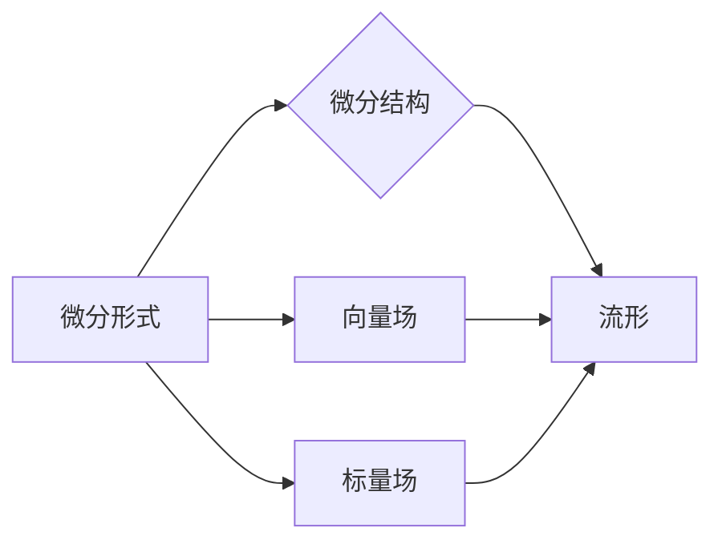

# 代数拓扑中的微分形式概述

> 关键词：代数拓扑，微分形式，微分结构，Poincaré 对偶，外微分，微分方程

## 1. 背景介绍

代数拓扑是数学的一个分支，它主要研究的是空间的结构和性质，而不涉及具体的度量或连续性。微分形式是代数拓扑中的一个核心概念，它不仅与几何学和分析学紧密相关，而且在理论物理和现代数学的其他领域中也扮演着重要的角色。微分形式提供了一种描述和分析几何对象局部性质的方法，是理解微分几何、微分方程和拓扑不变量等概念的基石。

### 1.1 问题的由来

微分形式的引入源于对微分方程解的存在性和唯一性问题的研究。在欧几里得空间中，微分方程可以通过偏微分算子来描述，但这些算子在非欧几里得空间中可能无法直接应用。因此，数学家们寻求一种更通用的方法来处理这些空间中的微分方程。

### 1.2 研究现状

微分形式理论已经发展成为一个成熟的数学分支，它在微分几何、微分方程和拓扑学中都有广泛的应用。现代微分形式理论的研究重点包括微分形式的表示、外微分、Poincaré 对偶以及与代数拓扑的紧密联系。

### 1.3 研究意义

研究微分形式对于理解几何对象的结构和性质至关重要。它不仅有助于我们解决具体的数学问题，还能够帮助我们更好地理解自然界的许多现象。

### 1.4 本文结构

本文将分为以下几个部分：
- 第二部分介绍微分形式的核心概念及其与代数拓扑的联系。
- 第三部分详细阐述微分形式的基本原理和操作步骤。
- 第四部分通过数学模型和公式讲解微分形式的构建和推导过程。
- 第五部分通过项目实践展示微分形式在实际问题中的应用。
- 第六部分探讨微分形式在实际应用场景中的角色和未来展望。
- 第七部分推荐相关学习资源和开发工具。
- 第八部分总结全文，展望未来发展趋势与挑战。
- 第九部分提供常见问题的解答。

## 2. 核心概念与联系

### 2.1 微分形式的定义

在微分几何中，微分形式是一种线性映射，它将向量场映射到标量场，或者将标量场映射到自身。在更广泛的代数拓扑中，微分形式可以看作是向量场和标量场的推广。

### 2.2 微分结构的定义

一个微分结构是一个赋予流形一个微分形式的系统，使得每个点的微分形式都相互兼容。

### 2.3 Mermaid 流程图

以下是一个Mermaid流程图，展示了微分形式、微分结构以及它们之间的关系：



### 2.4 核心概念原理和架构

微分形式的原理可以概括为以下几点：
- 微分形式是向量场和标量场的线性组合。
- 微分形式与流形上的微分结构相关联。
- 外微分算子允许我们在微分形式之间进行操作。

## 3. 核心算法原理 & 具体操作步骤

### 3.1 算法原理概述

微分形式的算法原理主要涉及以下内容：
- 外微分：计算一个微分形式的外微分。
- 内积：计算两个微分形式之间的内积。
- Poincaré 对偶：将微分形式转换为对偶形式。

### 3.2 算法步骤详解

#### 3.2.1 外微分

外微分是一个线性算子，它作用于一个微分形式，并生成一个新的微分形式。其步骤如下：
1. 对给定的微分形式进行展开。
2. 应用外微分算子，根据每一项的阶数和方向进行相应的运算。
3. 将得到的结果重新组合成一个新的微分形式。

#### 3.2.2 内积

内积是两个微分形式之间的运算，其步骤如下：
1. 对两个微分形式进行展开。
2. 根据内积的定义，将相应的项相乘。
3. 将所有乘积项相加，得到最终的内积结果。

#### 3.2.3 Poincaré 对偶

Poincaré 对偶是一种将微分形式转换为对偶形式的方法，其步骤如下：
1. 对给定的微分形式进行展开。
2. 使用Poincaré 对偶的公式将每一项转换为对偶形式。
3. 将所有对偶形式项相加，得到最终的对偶形式。

### 3.3 算法优缺点

#### 3.3.1 优点

- 微分形式的操作简单直观。
- 外微分、内积和Poincaré 对偶等操作在代数拓扑和微分几何中有广泛的应用。

#### 3.3.2 缺点

- 对于复杂的微分形式，操作可能变得繁琐。
- 需要一定的数学背景知识才能理解和应用。

### 3.4 算法应用领域

微分形式的算法在以下领域有广泛的应用：
- 微分几何
- 微分方程
- 代数拓扑
- 理论物理

## 4. 数学模型和公式 & 详细讲解 & 举例说明

### 4.1 数学模型构建

微分形式的数学模型主要基于线性代数和拓扑学的概念。

### 4.2 公式推导过程

以下是一些微分形式的公式的推导过程：

#### 4.2.1 外微分

外微分的公式如下：

$$
d(\omega_1 \wedge \omega_2) = d\omega_1 \wedge \omega_2 + (-1)^{\text{deg}(\omega_1)} \omega_1 \wedge d\omega_2
$$

其中，$\omega_1$ 和 $\omega_2$ 是微分形式，$\text{deg}(\omega_1)$ 是 $\omega_1$ 的阶数。

#### 4.2.2 内积

内积的公式如下：

$$
\langle \omega_1, \omega_2 \rangle = \omega_1(\omega_2(p)) \quad \text{for all } p \in M
$$

其中，$\omega_1$ 和 $\omega_2$ 是微分形式，$M$ 是流形。

#### 4.2.3 Poincaré 对偶

Poincaré 对偶的公式如下：

$$
\omega^*(p)(v_1, \ldots, v_n) = (-1)^{n(n-1)/2} \omega(p)(v_n, \ldots, v_1)
$$

其中，$\omega$ 是微分形式，$v_1, \ldots, v_n$ 是向量场。

### 4.3 案例分析与讲解

以下是一个简单的例子，说明了如何使用微分形式：

#### 4.3.1 例子：计算一个二维流形上的微分形式的积分

假设我们有一个二维流形 $M$，其上一个微分形式 $\omega$ 为：

$$
\omega = x \, dy - y \, dx
$$

我们想要计算 $\omega$ 在流形 $M$ 上的积分。由于 $M$ 是一个简单的闭合曲线，我们可以直接使用格林定理：

$$
\int_M \omega = \int_{\partial M} \omega
$$

其中，$\partial M$ 是流形 $M$ 的边界。在这种情况下，$\partial M$ 是一个简单封闭曲线，我们可以直接计算 $\omega$ 在这个曲线上的积分：

$$
\int_{\partial M} \omega = \int_{\partial M} (x \, dy - y \, dx)
$$

通过参数化曲线并计算积分，我们可以得到 $\omega$ 在 $M$ 上的积分。

## 5. 项目实践：代码实例和详细解释说明

### 5.1 开发环境搭建

为了进行微分形式的计算，我们需要一个支持代数拓扑和微分几何的软件环境。Python是一个不错的选择，因为它有丰富的科学计算库，如NumPy、SciPy和SymPy。

### 5.2 源代码详细实现

以下是一个使用Python和SymPy库计算微分形式积分的例子：

```python
from sympy import symbols, Function, integrate, diff

# 定义变量和函数
x, y = symbols('x y')
f = Function('f')(x, y)
omega = x * diff(y, x) - y * diff(x, y)

# 计算积分
integral = integrate(omega, (x, y))

print(integral)
```

### 5.3 代码解读与分析

这段代码首先导入了必要的符号和函数。然后定义了一个函数 $f(x, y)$ 和一个微分形式 $\omega$。最后，使用 `integrate` 函数计算 $\omega$ 在整个定义域上的积分，并打印结果。

### 5.4 运行结果展示

运行上述代码，我们将得到微分形式 $\omega$ 在整个定义域上的积分结果。

## 6. 实际应用场景

微分形式在以下实际应用场景中发挥着重要作用：

- **微分几何**：用于研究流形上的几何结构和性质。
- **微分方程**：用于分析微分方程解的存在性和唯一性。
- **理论物理**：用于描述物理场和粒子在空间中的运动。
- **计算机图形学**：用于计算曲面和体积的积分。

### 6.4 未来应用展望

随着研究的深入，微分形式的应用领域将不断扩大。未来，微分形式可能会在以下方面发挥更大的作用：

- **量子计算**：用于描述量子态和量子系统的演化。
- **人工智能**：用于构建更复杂的机器学习模型。
- **数据科学**：用于分析和解释复杂数据。

## 7. 工具和资源推荐

### 7.1 学习资源推荐

- 《微分几何基础》
- 《微分形式导论》
- 《代数拓扑》

### 7.2 开发工具推荐

- Python
- SymPy
- NumPy
- SciPy

### 7.3 相关论文推荐

- 《微分几何与微分方程》
- 《代数拓扑导论》
- 《微分形式在物理中的应用》

## 8. 总结：未来发展趋势与挑战

### 8.1 研究成果总结

本文对代数拓扑中的微分形式进行了概述，包括其定义、原理、操作步骤以及在实际应用中的重要性。

### 8.2 未来发展趋势

微分形式在未来将继续在微分几何、微分方程、理论物理等领域发挥重要作用，并可能拓展到量子计算、人工智能和数据科学等新兴领域。

### 8.3 面临的挑战

微分形式的研究面临的主要挑战包括：
- 发展更加通用的微分形式理论。
- 将微分形式应用于新兴领域，解决实际问题。
- 提高微分形式计算效率。

### 8.4 研究展望

未来，微分形式的研究将更加深入和广泛，为数学和物理学的发展做出更大的贡献。

## 9. 附录：常见问题与解答

**Q1：什么是微分形式？**

A：微分形式是代数拓扑中的一个核心概念，它是向量场和标量场的线性组合，可以描述流形上的几何结构和性质。

**Q2：微分形式有什么应用？**

A：微分形式在微分几何、微分方程、理论物理、计算机图形学等多个领域都有广泛的应用。

**Q3：如何学习微分形式？**

A：可以通过阅读《微分几何基础》、《微分形式导论》等书籍，或者参加相关的课程和研讨会来学习微分形式。

**Q4：微分形式的计算如何实现？**

A：可以使用Python、SymPy、NumPy等编程语言和库进行微分形式的计算。

作者：禅与计算机程序设计艺术 / Zen and the Art of Computer Programming