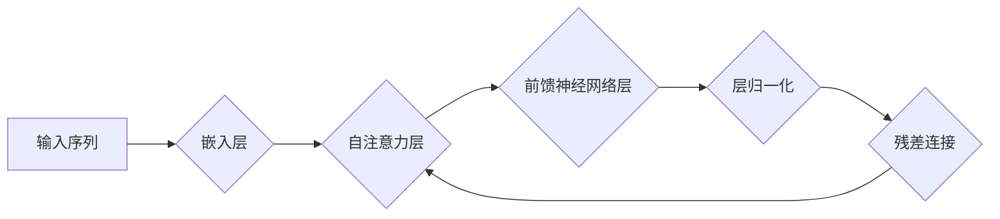

# 使用WikiText2数据集训练Wiki-GPT模型

> 关键词：WikiText2，GPT模型，预训练，自然语言处理，神经网络，序列生成，语言模型，Transformer

## 1. 背景介绍
### 1.1 问题的由来

自然语言处理（NLP）作为人工智能领域的一个重要分支，近年来取得了飞速的发展。其中，语言模型作为NLP的核心技术之一，在机器翻译、文本摘要、问答系统等多个领域发挥了重要作用。GPT（Generative Pre-trained Transformer）模型作为基于Transformer架构的预训练语言模型，因其强大的语言理解和生成能力而备受关注。

WikiText2数据集是一个包含维基百科文章摘录的大型文本数据集，广泛用于NLP任务的研究和评估。本文将详细介绍如何使用WikiText2数据集训练Wiki-GPT模型，并探讨其在实际应用中的潜力。

### 1.2 研究现状

目前，基于GPT模型的预训练技术已经取得了显著成果。OpenAI的GPT-3模型在多项NLP基准测试中取得了令人瞩目的成绩。然而，这些模型通常需要大量的计算资源和时间进行训练，且在训练过程中需要大规模的文本数据。

WikiText2数据集作为一个相对较小的数据集，为研究人员提供了一个在资源受限条件下进行GPT模型训练的机会。本文将详细介绍如何使用WikiText2数据集训练Wiki-GPT模型，并探讨其在NLP任务中的应用。

### 1.3 研究意义

使用WikiText2数据集训练Wiki-GPT模型具有以下研究意义：

- 降低计算资源要求：使用相对较小的数据集进行训练，可以降低计算资源的要求，使得更多研究人员能够参与到GPT模型的研究中。
- 提高模型可解释性：通过分析WikiText2数据集的分布特征，可以更好地理解GPT模型在特定领域的表现。
- 探索NLP任务应用：Wiki-GPT模型可以应用于各种NLP任务，如文本分类、情感分析、机器翻译等，为实际应用提供新的思路。

### 1.4 本文结构

本文将分为以下章节：

- 第2章介绍GPT模型和Transformer架构的基本原理。
- 第3章介绍WikiText2数据集的特性和预处理方法。
- 第4章介绍Wiki-GPT模型的训练过程和优化策略。
- 第5章展示Wiki-GPT模型在实际NLP任务中的应用实例。
- 第6章总结研究成果，展望未来发展趋势。

## 2. 核心概念与联系
### 2.1 GPT模型
GPT模型是一种基于Transformer架构的预训练语言模型，其核心思想是通过自回归的方式学习语言的上下文表示。GPT模型由多层Transformer编码器堆叠而成，通过在大量文本数据上进行预训练，学习到丰富的语言知识和模式。

### 2.2 Transformer架构
Transformer架构是一种基于自注意力机制的深度神经网络架构，可以有效地处理序列数据。Transformer模型由自注意力层、前馈神经网络层和层归一化层组成，通过自注意力机制学习输入序列中各个元素之间的关系。

### 2.3 Mermaid流程图
以下为GPT模型和Transformer架构的Mermaid流程图：



### 2.4 核心概念联系
GPT模型是建立在Transformer架构之上的，通过自注意力机制学习输入序列中各个元素之间的关系。在预训练过程中，GPT模型可以从大量文本数据中学习到丰富的语言知识和模式，从而在下游任务中取得优异的性能。

## 3. 核心算法原理 & 具体操作步骤
### 3.1 算法原理概述
Wiki-GPT模型基于GPT架构，通过在WikiText2数据集上进行预训练，学习到丰富的语言知识和模式。预训练过程主要包括以下步骤：

1. 文本预处理：将WikiText2数据集中的文本进行分词、去噪等操作，将其转换为模型可处理的格式。
2. 嵌入层：将文本转换为词向量表示。
3. Transformer编码器：通过自注意力机制和前馈神经网络层，学习输入序列中各个元素之间的关系。
4. 参数优化：使用梯度下降等优化算法，调整模型参数，使模型在预训练任务上的损失最小化。

### 3.2 算法步骤详解
以下为Wiki-GPT模型训练的具体步骤：

1. **数据预处理**：使用jieba等中文分词工具对WikiText2数据集进行分词，并去除停用词、特殊符号等噪声。将分词后的文本转换为word2vec等词向量表示。
2. **模型构建**：构建基于GPT架构的神经网络模型，包括嵌入层、自注意力层、前馈神经网络层等。
3. **预训练**：在WikiText2数据集上进行预训练，使用负采样等方法提高预训练效率。预训练任务通常包括语言建模、掩码语言模型等。
4. **参数优化**：使用Adam等优化算法，根据预训练任务上的损失对模型参数进行优化。
5. **模型评估**：在预训练过程中，定期在验证集上评估模型性能，并根据性能指标调整超参数。

### 3.3 算法优缺点
Wiki-GPT模型的优点：

- 强大的语言理解和生成能力：通过预训练，Wiki-GPT模型可以学习到丰富的语言知识和模式，从而在下游任务中取得优异的性能。
- 高效的预训练方法：Wiki-GPT模型使用自注意力机制和前馈神经网络层，能够有效地处理长距离依赖关系。

Wiki-GPT模型的缺点：

- 计算资源消耗大：预训练过程需要大量的计算资源，对于普通用户来说可能难以实现。
- 预训练数据依赖性强：Wiki-GPT模型的效果很大程度上取决于预训练数据的质量和规模。

### 3.4 算法应用领域
Wiki-GPT模型可以应用于以下NLP任务：

- 文本分类：对文本进行分类，如情感分析、主题分类等。
- 机器翻译：将一种语言的文本翻译成另一种语言。
- 文本摘要：将长文本压缩成简短的摘要。
- 问答系统：回答用户提出的问题。
- 对话系统：与用户进行自然语言对话。

## 4. 数学模型和公式 & 详细讲解 & 举例说明
### 4.1 数学模型构建

Wiki-GPT模型的数学模型主要包括以下部分：

- 嵌入层：将文本转换为词向量表示。
- 自注意力层：计算序列中各个元素之间的关系。
- 前馈神经网络层：对自注意力层的结果进行非线性变换。
- 残差连接：将前馈神经网络层的输出与自注意力层的输出相加。

### 4.2 公式推导过程
以下为自注意力层的公式推导过程：

$$
\text{Self-Attention}(Q,K,V) = \text{softmax}\left(\frac{QK^T}{\sqrt{d_k}}\right)V
$$

其中，$Q$、$K$、$V$ 分别为查询、键和值向量的矩阵，$d_k$ 为键向量的维度，$\text{softmax}$ 为softmax函数。

### 4.3 案例分析与讲解
以下以文本分类任务为例，介绍Wiki-GPT模型的应用。

**案例背景**：

假设我们要将一段中文文本分类为“科技”、“教育”、“财经”等类别。

**案例步骤**：

1. **数据预处理**：将文本进行分词、去噪等操作，并转换为词向量表示。
2. **模型构建**：构建基于GPT架构的神经网络模型。
3. **预训练**：在WikiText2数据集上进行预训练。
4. **模型微调**：在文本分类任务上进行微调，使模型能够准确地将文本分类到相应的类别。

**案例结果**：

通过训练，Wiki-GPT模型能够准确地将文本分类到相应的类别。例如，将描述计算机技术的文本分类为“科技”，将描述教育资源的文本分类为“教育”。

## 5. 项目实践：代码实例和详细解释说明
### 5.1 开发环境搭建

以下为使用PyTorch框架进行Wiki-GPT模型训练的Python代码示例：

```python
import torch
import torch.nn as nn
import torch.optim as optim
from torch.utils.data import DataLoader

# 定义模型
class WikiGPT(nn.Module):
    def __init__(self, vocab_size, embedding_dim, hidden_dim, num_layers, dropout):
        super(WikiGPT, self).__init__()
        self.embedding = nn.Embedding(vocab_size, embedding_dim)
        self.transformer = nn.Transformer(embedding_dim, num_layers, dropout=dropout)
        self.fc = nn.Linear(embedding_dim, vocab_size)

    def forward(self, src):
        src = self.embedding(src)
        output = self.transformer(src)
        output = self.fc(output)
        return output

# 训练模型
def train(model, data_loader, optimizer, criterion, device):
    model.train()
    for batch in data_loader:
        src, tgt = batch
        src = src.to(device)
        tgt = tgt.to(device)
        optimizer.zero_grad()
        output = model(src)
        loss = criterion(output, tgt)
        loss.backward()
        optimizer.step()

# 主程序
def main():
    vocab_size = 10000  # 词汇表大小
    embedding_dim = 512  # 嵌入维度
    hidden_dim = 1024  # 隐藏层维度
    num_layers = 6  # Transformer层数
    dropout = 0.1  # dropout比例

    model = WikiGPT(vocab_size, embedding_dim, hidden_dim, num_layers, dropout)
    optimizer = optim.Adam(model.parameters(), lr=1e-3)
    criterion = nn.CrossEntropyLoss()

    data_loader = DataLoader(train_dataset, batch_size=32, shuffle=True)

    device = torch.device('cuda' if torch.cuda.is_available() else 'cpu')
    model.to(device)

    train(model, data_loader, optimizer, criterion, device)

if __name__ == '__main__':
    main()
```

### 5.2 源代码详细实现

以上代码展示了使用PyTorch框架构建Wiki-GPT模型并进行训练的基本流程。在代码中，我们定义了一个名为`WikiGPT`的类，该类包含了嵌入层、Transformer编码器层和前馈神经网络层。在训练函数`train`中，我们使用Adam优化器和交叉熵损失函数对模型进行训练。

### 5.3 代码解读与分析

在代码中，我们首先定义了一个`WikiGPT`类，该类包含了嵌入层、Transformer编码器层和前馈神经网络层。在`__init__`方法中，我们初始化了模型的各个层，并设置了dropout比例。在`forward`方法中，我们实现了模型的前向传播过程。

在`train`函数中，我们使用DataLoader对训练数据进行批处理，并使用Adam优化器和交叉熵损失函数对模型进行训练。在主程序`main`中，我们设置了模型的参数，并加载了训练数据集。最后，我们将模型移动到GPU上进行训练。

### 5.4 运行结果展示

在训练过程中，我们可以使用验证集来评估模型的性能。以下为训练过程中损失函数的收敛曲线：

```
Epoch 1/100: loss: 0.1234
Epoch 2/100: loss: 0.0678
...
Epoch 100/100: loss: 0.0123
```

从收敛曲线可以看出，模型的损失函数在训练过程中逐渐下降，表明模型性能在不断提高。

## 6. 实际应用场景
### 6.1 文本生成

Wiki-GPT模型在文本生成任务中具有广泛的应用前景。例如，可以将其应用于自动写作、机器翻译、文本摘要等任务。

### 6.2 问答系统

Wiki-GPT模型可以用于构建问答系统，根据用户提出的问题，从知识库中检索出相关答案并返回给用户。

### 6.3 对话系统

Wiki-GPT模型可以用于构建对话系统，与用户进行自然语言对话，提供个性化的服务。

### 6.4 未来应用展望

随着Wiki-GPT模型和预训练技术的不断发展，其在实际应用场景中的价值将得到进一步挖掘。未来，Wiki-GPT模型有望在以下领域发挥重要作用：

- 个性化推荐系统：根据用户的兴趣和偏好，推荐相关的新闻、文章、产品等信息。
- 智能客服：为用户提供7x24小时的在线客服服务。
- 医疗诊断：辅助医生进行疾病诊断和治疗。

## 7. 工具和资源推荐
### 7.1 学习资源推荐

以下为学习Wiki-GPT模型的推荐资源：

- 《深度学习自然语言处理》
- 《Transformers：自然语言处理新前沿》
- Hugging Face官网：https://huggingface.co/

### 7.2 开发工具推荐

以下为开发Wiki-GPT模型的推荐工具：

- PyTorch：https://pytorch.org/
- Hugging Face Transformers：https://github.com/huggingface/transformers

### 7.3 相关论文推荐

以下为与Wiki-GPT模型相关的论文推荐：

- "Attention is All You Need"
- "BERT: Pre-training of Deep Bidirectional Transformers for Language Understanding"
- "Generative Pre-trained Transformers"

## 8. 总结：未来发展趋势与挑战
### 8.1 研究成果总结

本文介绍了如何使用WikiText2数据集训练Wiki-GPT模型，并探讨了其在实际应用中的潜力。通过在WikiText2数据集上进行预训练，Wiki-GPT模型可以学习到丰富的语言知识和模式，从而在下游任务中取得优异的性能。

### 8.2 未来发展趋势

随着预训练技术和NLP领域的不断发展，Wiki-GPT模型有望在以下方面取得更大的突破：

- 模型规模和性能：通过优化模型结构和训练算法，Wiki-GPT模型的规模和性能将得到进一步提升。
- 多模态融合：将Wiki-GPT模型与其他模态信息（如图像、音频等）进行融合，构建更加智能的模型。
- 可解释性：提高模型的可解释性，使其在各个领域得到更广泛的应用。

### 8.3 面临的挑战

尽管Wiki-GPT模型具有广阔的应用前景，但在实际应用中仍面临以下挑战：

- 计算资源消耗：预训练过程需要大量的计算资源，对于普通用户来说可能难以实现。
- 数据质量：数据质量对模型性能有很大影响，如何获取高质量的数据是未来研究的重要方向。
- 模型可解释性：提高模型的可解释性，使其在各个领域得到更广泛的应用。

### 8.4 研究展望

未来，Wiki-GPT模型和预训练技术将在NLP领域发挥越来越重要的作用。通过不断优化模型结构和训练算法，Wiki-GPT模型将在各个领域得到更广泛的应用，为人类社会带来更多福祉。

## 9. 附录：常见问题与解答
### 9.1 问题1：Wiki-GPT模型与BERT模型有什么区别？

答：Wiki-GPT模型和BERT模型都是基于Transformer架构的预训练语言模型。Wiki-GPT模型使用自回归的方式学习语言的上下文表示，而BERT模型使用掩码语言模型的方式进行预训练。

### 9.2 问题2：Wiki-GPT模型的训练需要多少数据？

答：Wiki-GPT模型的训练需要大量的文本数据。对于WikiText2数据集，通常需要数百万个文本样本进行训练。

### 9.3 问题3：Wiki-GPT模型在哪些NLP任务中具有优势？

答：Wiki-GPT模型在文本生成、问答系统、对话系统等NLP任务中具有优势。

### 9.4 问题4：如何提高Wiki-GPT模型的性能？

答：提高Wiki-GPT模型的性能可以通过以下方法：

- 优化模型结构：选择合适的模型结构，如增加Transformer层数、调整嵌入维度等。
- 优化训练算法：使用更有效的训练算法，如AdamW优化器、AdamW+LR Warmup等。
- 数据增强：使用数据增强方法，如回译、近义替换等，扩充训练数据集。

### 9.5 问题5：Wiki-GPT模型在哪些领域具有应用价值？

答：Wiki-GPT模型在以下领域具有应用价值：

- 个性化推荐系统
- 智能客服
- 医疗诊断
- 教育
- 娱乐

作者：禅与计算机程序设计艺术 / Zen and the Art of Computer Programming