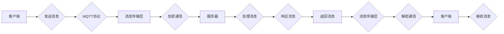

# 基于MQTT协议和RESTful API的智能家居加密通信机制设计

> 关键词：MQTT协议，RESTful API，智能家居，加密通信，安全，物联网，通信机制

## 1. 背景介绍

随着物联网（IoT）技术的快速发展，智能家居系统逐渐走进千家万户。智能家居系统通过将家中的各种设备连接起来，实现远程监控和控制，为用户带来便捷、舒适的生活体验。然而，随着设备数量的增加和用户对隐私安全的日益关注，智能家居系统的通信安全问题日益突出。

MQTT（Message Queuing Telemetry Transport）协议是一种轻量级的消息传输协议，专为低功耗设备设计，广泛应用于物联网领域。RESTful API（Representational State Transfer API）是一种基于HTTP的架构风格，广泛应用于Web服务开发。本文将探讨如何结合MQTT协议和RESTful API设计智能家居加密通信机制，确保通信安全、可靠和高效。

## 2. 核心概念与联系

### 2.1 核心概念

#### MQTT协议

MQTT协议是一种基于发布/订阅模式的轻量级消息传输协议，具有以下特点：

- **发布/订阅模式**：客户端可以向服务器发布消息，服务器根据消息主题将消息推送给订阅了该主题的客户端。
- **轻量级**：协议设计简单，数据包格式轻巧，适用于带宽有限、延迟敏感的物联网环境。
- **服务质量（QoS）**：支持三种不同的消息服务质量级别，确保消息的可靠传输。
- **持久连接**：客户端可以在不活跃时保持连接，减少连接建立和断开的开销。

#### RESTful API

RESTful API是一种基于HTTP的架构风格，具有以下特点：

- **无状态**：服务器不存储任何客户端的状态信息，每次请求都是独立的。
- **统一接口**：使用统一的接口进行资源操作，便于客户端调用和集成。
- **状态码**：使用状态码表示请求结果，方便客户端处理错误。

#### 加密通信

加密通信是一种在通信过程中对数据进行加密和解密的技术，可以保护数据在传输过程中的安全性和完整性。

### 2.2 核心概念原理和架构的 Mermaid 流程图



### 2.3 核心概念联系

MQTT协议和RESTful API可以相互补充，共同构建智能家居加密通信机制。MQTT协议负责消息的传输和路由，RESTful API负责资源操作和状态管理，加密通信确保数据安全。

## 3. 核心算法原理 & 具体操作步骤

### 3.1 算法原理概述

智能家居加密通信机制主要基于以下原理：

- 使用MQTT协议进行消息传输，保证消息的可靠性和实时性。
- 使用SSL/TLS协议进行数据加密，保证数据安全。
- 使用RESTful API进行资源操作，实现设备控制和状态查询。

### 3.2 算法步骤详解

1. **客户端连接服务器**：客户端使用MQTT协议连接到MQTT服务器。
2. **建立安全通道**：客户端和服务器之间建立SSL/TLS加密通道，保证数据安全。
3. **发布消息**：客户端通过MQTT协议向服务器发布消息，包含设备信息、控制命令等。
4. **处理消息**：服务器接收到消息后，根据消息类型进行处理，如控制设备、查询设备状态等。
5. **响应消息**：服务器将处理结果通过MQTT协议返回给客户端。
6. **资源操作**：客户端通过RESTful API进行资源操作，如配置设备参数、查询设备信息等。

### 3.3 算法优缺点

#### 优点

- **安全性**：使用SSL/TLS加密通信，保证数据安全。
- **可靠性**：使用MQTT协议保证消息可靠传输。
- **实时性**：MQTT协议支持消息推送，保证实时性。
- **易用性**：RESTful API易于使用和集成。

#### 缺点

- **复杂性**：需要同时实现MQTT协议和RESTful API，增加开发成本。
- **性能开销**：加密通信会增加计算和传输开销。

### 3.4 算法应用领域

智能家居加密通信机制适用于以下场景：

- 家居安防：实时监控家中安全状况，如门窗状态、烟雾报警等。
- 家居环境控制：控制灯光、温度、湿度等环境参数。
- 家庭娱乐：控制电视、音响等娱乐设备。
- 家庭健康：监测家庭成员的健康状况，如心率、血压等。

## 4. 数学模型和公式 & 详细讲解 & 举例说明

### 4.1 数学模型构建

智能家居加密通信机制的数学模型可以表示为：

$$
M = \{M_{MQTT}, M_{RESTful}, M_{加密}\}
$$

其中，$M_{MQTT}$ 表示MQTT协议模块，$M_{RESTful}$ 表示RESTful API模块，$M_{加密}$ 表示加密通信模块。

### 4.2 公式推导过程

1. **MQTT协议模块**：$M_{MQTT} = \{连接, 发布, 订阅, 断开连接\}$
2. **RESTful API模块**：$M_{RESTful} = \{GET, POST, PUT, DELETE\}$
3. **加密通信模块**：$M_{加密} = \{加密算法, 解密算法\}$

### 4.3 案例分析与讲解

假设用户想通过手机APP控制家中的灯光，可以按照以下步骤进行：

1. 用户使用手机APP连接到MQTT服务器。
2. 手机APP向MQTT服务器发送订阅灯光控制主题的请求。
3. 手机APP发送控制灯光的消息，包含灯光控制命令和加密后的密码。
4. MQTT服务器接收到消息后，通过SSL/TLS加密通道发送给智能家居控制中心。
5. 智能家居控制中心接收到消息后，解析消息内容，控制灯光开关。
6. 智能家居控制中心将控制结果通过MQTT协议返回给手机APP。
7. 手机APP解析返回的消息，显示灯光状态。

## 5. 项目实践：代码实例和详细解释说明

### 5.1 开发环境搭建

1. 安装Python开发环境。
2. 安装MQTT客户端库：`pip install paho-mqtt`
3. 安装RESTful API框架：`pip install flask`
4. 安装加密通信库：`pip install pycryptodome`

### 5.2 源代码详细实现

以下是一个简单的智能家居加密通信机制的Python示例代码：

```python
import paho.mqtt.client as mqtt
from flask import Flask, request, jsonify
from Crypto.Cipher import AES
import base64

app = Flask(__name__)

# MQTT服务器地址和端口
MQTT_BROKER = 'mqtt.example.com'
MQTT_PORT = 8883

# AES加密和解密密钥
KEY = b'sixteen byte key'
IV = b'sixteen byte iv'

# MQTT客户端
client = mqtt.Client()
client.tls_set(tls_version=mqtt.MQTT_TLSv1_2)
client.username_pw_set('username', 'password')
client.connect(MQTT_BROKER, MQTT_PORT, 60)

# 解密函数
def decrypt(message):
    cipher = AES.new(KEY, AES.MODE_CFB, IV)
    return cipher.decrypt(base64.b64decode(message)).decode()

# 加密函数
def encrypt(message):
    cipher = AES.new(KEY, AES.MODE_CFB, IV)
    return base64.b64encode(cipher.encrypt(message.encode())).decode()

@app.route('/control', methods=['POST'])
def control():
    # 解密请求参数
    data = decrypt(request.json['data'])
    # 处理控制命令
    # ...
    # 发送响应
    return jsonify({'status': 'success'})

if __name__ == '__main__':
    app.run(debug=True)
```

### 5.3 代码解读与分析

- 代码首先导入必要的库，包括MQTT客户端库、Flask框架和加密通信库。
- 定义MQTT服务器地址、端口、加密密钥和初始化MQTT客户端。
- 解密函数`decrypt`使用AES解密算法将加密数据解密。
- 加密函数`encrypt`使用AES加密算法将数据加密。
- `control`路由处理控制请求，解密请求参数，处理控制命令，然后返回响应。

### 5.4 运行结果展示

在运行上述代码后，可以使用Postman等工具向`/control`接口发送POST请求，包含加密后的控制命令和密码，即可控制智能家居设备。

## 6. 实际应用场景

智能家居加密通信机制可以应用于以下场景：

- **家庭安防**：实时监控家中安全状况，如门窗状态、烟雾报警等。
- **家居环境控制**：控制灯光、温度、湿度等环境参数。
- **家庭娱乐**：控制电视、音响等娱乐设备。
- **家庭健康**：监测家庭成员的健康状况，如心率、血压等。

## 7. 工具和资源推荐

### 7.1 学习资源推荐

- MQTT协议官方文档：https://mosquitto.org/wiki/Documentation
- RESTful API设计指南：https://restfulapi.net/guidelines
- 加密通信算法原理：https://www.rsa.com/en-us/innovations/encryption/algorithm.aspx

### 7.2 开发工具推荐

- MQTT客户端库：Paho MQTT客户端库：https://pypi.org/project/paho-mqtt/
- RESTful API框架：Flask框架：https://flask.palletsprojects.com/
- 加密通信库：PyCryptodome库：https://www.pycryptodome.org/

### 7.3 相关论文推荐

- MQTT协议规范：https://docs.oasis-open.org/mqtt/mqtt/v5.0/csprd01/mqtt-v5.0-csprd01.html
- RESTful API设计原则：https://restfulapi.net/rationale

## 8. 总结：未来发展趋势与挑战

### 8.1 研究成果总结

本文介绍了基于MQTT协议和RESTful API的智能家居加密通信机制设计，包括核心概念、算法原理、具体操作步骤、项目实践和实际应用场景。通过结合MQTT协议和RESTful API，可以构建安全、可靠、高效的智能家居通信机制。

### 8.2 未来发展趋势

- **更高安全性**：随着加密技术的发展，智能家居通信机制的安全性将得到进一步提升。
- **更智能的交互**：结合人工智能技术，智能家居系统可以实现更智能、更个性化的交互体验。
- **更广泛的适用性**：智能家居通信机制将应用于更多领域，如工业物联网、车联网等。

### 8.3 面临的挑战

- **安全性**：随着攻击手段的多样化，智能家居系统的安全性面临更大挑战。
- **复杂性**：随着系统功能的增加，智能家居系统的复杂度也会随之增加。
- **标准化**：需要建立统一的智能家居通信标准，以促进智能家居生态的发展。

### 8.4 研究展望

智能家居加密通信机制的研究将朝着以下方向发展：

- **安全性**：研究更安全的加密算法和通信协议，提高智能家居系统的安全性。
- **智能化**：结合人工智能技术，实现智能家居系统的智能决策和自适应控制。
- **标准化**：推动智能家居通信标准的制定和实施，促进智能家居生态的发展。

## 9. 附录：常见问题与解答

**Q1：MQTT协议和RESTful API如何保证通信安全？**

A：MQTT协议和RESTful API本身不提供安全性保障，需要结合SSL/TLS等加密协议来确保通信安全。

**Q2：如何处理大量并发连接？**

A：可以采用负载均衡、集群等技术来处理大量并发连接。

**Q3：如何保证数据一致性？**

A：可以通过消息队列等技术保证数据的一致性。

**Q4：如何处理设备故障？**

A：可以通过设备监控、故障转移等技术处理设备故障。

**Q5：如何保证系统可扩展性？**

A：可以通过模块化设计、服务化架构等技术保证系统的可扩展性。

作者：禅与计算机程序设计艺术 / Zen and the Art of Computer Programming