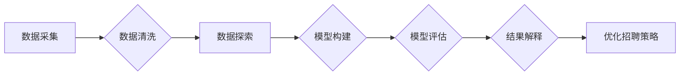

# 基于大数据的招聘数据分析与应用

> 关键词：大数据，招聘数据，数据分析，机器学习，人才匹配，招聘优化，人力资源

## 1. 背景介绍

随着互联网和大数据技术的飞速发展，企业对人才的需求日益增长，招聘市场也变得越来越复杂。传统的招聘方式往往依赖于人工筛选简历，效率低下且准确性有限。大数据技术的兴起为招聘领域带来了新的变革，通过对招聘数据的深入分析，企业可以更加精准地识别和吸引合适的人才。本文将探讨基于大数据的招聘数据分析与应用，包括数据采集、处理、分析和可视化，以及机器学习在人才匹配和招聘优化中的应用。

### 1.1 问题的由来

招聘过程中存在以下问题：

- 简历筛选效率低：大量简历的筛选工作耗费大量人力和时间，且容易遗漏优秀人才。
- 人才匹配度低：简历筛选往往基于关键词匹配，难以准确判断候选人的能力和潜力。
- 招聘成本高：招聘过程中涉及广告投放、招聘会、猎头服务等多种渠道，成本较高。
- 员工流失率高：由于招聘不当或企业文化不匹配，导致员工离职率上升。

### 1.2 研究现状

近年来，随着大数据技术的应用，招聘数据分析逐渐成为招聘领域的研究热点。主要研究内容包括：

- 招聘数据采集与处理：通过爬虫、API接口、问卷等方式收集招聘数据，并进行清洗、去重、标准化等处理。
- 招聘数据分析：利用数据挖掘、机器学习等技术分析招聘数据，挖掘人才画像、岗位需求、招聘渠道等特征。
- 人才匹配算法：基于机器学习技术，实现人才与岗位的精准匹配，提高招聘效率和质量。
- 招聘优化策略：根据数据分析结果，优化招聘流程和策略，降低招聘成本，提高员工留存率。

### 1.3 研究意义

基于大数据的招聘数据分析与应用具有以下意义：

- 提高招聘效率：通过数据分析，快速筛选出符合要求的候选人，缩短招聘周期。
- 提升招聘质量：精准匹配人才与岗位，降低招聘失误率，提高员工满意度。
- 降低招聘成本：优化招聘渠道和策略，减少不必要的招聘投入。
- 提高员工留存率：通过分析员工离职原因，制定针对性的挽留策略，降低员工流失率。

### 1.4 本文结构

本文将围绕以下内容展开：

- 核心概念与联系
- 核心算法原理与具体操作步骤
- 数学模型和公式
- 项目实践
- 实际应用场景
- 工具和资源推荐
- 总结与展望

## 2. 核心概念与联系

### 2.1 招聘数据

招聘数据是指与招聘过程相关的各类数据，包括：

- 简历数据：候选人的基本信息、教育背景、工作经历、项目经验、技能特长等。
- 招聘渠道数据：各招聘渠道的投放效果、简历数量、面试邀请数量等。
- 面试数据：面试官和候选人的评价、面试流程、面试结果等。
- 员工数据：员工的离职原因、工作表现、绩效评价等。

### 2.2 招聘数据分析

招聘数据分析是指利用统计学、数据挖掘、机器学习等技术对招聘数据进行处理和分析，挖掘数据背后的规律和洞察。其流程包括：

1. 数据采集：通过爬虫、API接口、问卷等方式收集招聘数据。
2. 数据清洗：去除重复数据、缺失数据、异常数据等，提高数据质量。
3. 数据探索：分析数据的分布、特征和关联关系。
4. 模型构建：利用机器学习算法建立预测模型或分类模型。
5. 模型评估：评估模型的性能和可靠性。
6. 结果解释：根据分析结果，提出优化招聘策略的建议。

### 2.3 招聘数据与人力资源

招聘数据与人力资源之间的关系可以理解为：

- 招聘数据是人力资源管理的基石，为招聘决策提供数据支持。
- 人力资源是招聘数据的应用场景，通过招聘数据优化招聘流程、提升招聘效果。
- 招聘数据与人力资源相互促进，共同推动企业人才培养和发展。

### 2.4 Mermaid 流程图

以下是招聘数据分析的Mermaid流程图：



## 3. 核心算法原理与具体操作步骤

### 3.1 算法原理概述

基于大数据的招聘数据分析主要涉及以下算法：

- 数据挖掘算法：如关联规则挖掘、聚类分析、分类算法等。
- 机器学习算法：如逻辑回归、支持向量机、决策树、随机森林、神经网络等。
- 自然语言处理算法：如文本分类、情感分析等。

### 3.2 算法步骤详解

基于大数据的招聘数据分析步骤如下：

1. 数据采集：通过爬虫、API接口、问卷等方式收集招聘数据。
2. 数据预处理：对采集到的数据进行清洗、去重、标准化等处理，提高数据质量。
3. 数据探索：利用统计学、可视化等技术，分析数据的分布、特征和关联关系。
4. 特征工程：从原始数据中提取有意义的特征，为后续模型构建做准备。
5. 模型选择：根据任务需求和数据特点，选择合适的机器学习算法。
6. 模型训练：使用训练数据训练模型，得到模型参数。
7. 模型评估：使用测试数据评估模型性能，选择最优模型。
8. 模型应用：将模型应用于实际招聘场景，优化招聘流程和策略。

### 3.3 算法优缺点

以下是常见机器学习算法的优缺点：

| 算法        | 优点                                                         | 缺点                                                         |
| ----------- | ------------------------------------------------------------ | ------------------------------------------------------------ |
| 逻辑回归    | 简单易懂，计算效率高，可解释性强                           | 容易欠拟合，对异常值敏感，特征间需要线性关系                   |
| 支持向量机   | 泛化能力强，可处理非线性问题                             | 计算复杂度高，对参数选择敏感，不易解释                         |
| 决策树      | 可解释性强，易于理解和解释                                 | 泛化能力较弱，容易过拟合，对噪声敏感                         |
| 随机森林    | 泛化能力强，鲁棒性好，可处理非线性问题                   | 计算复杂度高，特征选择困难，不易解释                         |
| 神经网络    | 泛化能力强，可处理复杂非线性问题                         | 计算复杂度高，参数多，难以解释                               |

### 3.4 算法应用领域

机器学习算法在招聘数据分析中的应用领域包括：

- 简历筛选：通过文本分类算法，对简历进行自动筛选，快速识别符合要求的候选人。
- 职位推荐：根据候选人的简历和求职意向，推荐合适的职位。
- 岗位需求分析：通过聚类分析，挖掘不同岗位的需求特征，优化招聘策略。
- 招聘渠道优化：通过分析各招聘渠道的投放效果，优化招聘渠道组合。
- 员工流失预测：通过分析员工离职原因，预测员工流失风险，制定挽留策略。

## 4. 数学模型和公式

### 4.1 数学模型构建

以下是招聘数据中常用的数学模型：

- 概率模型：如伯努利分布、多项分布等，用于描述招聘事件的发生概率。
- 回归模型：如线性回归、逻辑回归等，用于预测候选人是否符合岗位要求。
- 聚类模型：如k-means、层次聚类等，用于对候选人进行分组。

### 4.2 公式推导过程

以下以线性回归模型为例，介绍公式推导过程：

- 线性回归模型：

$$
y = \beta_0 + \beta_1 x_1 + \beta_2 x_2 + ... + \beta_n x_n + \epsilon
$$

其中，$y$ 是因变量，$x_1, x_2, ..., x_n$ 是自变量，$\beta_0, \beta_1, ..., \beta_n$ 是模型参数，$\epsilon$ 是误差项。

- 模型参数估计：

最小二乘法：

$$
\beta = \arg\min_{\beta} \sum_{i=1}^n (y_i - \beta_0 - \beta_1 x_{1i} - ... - \beta_n x_{ni})^2
$$

- 模型评估：

- $R^2$ 值：

$$
R^2 = 1 - \frac{\sum_{i=1}^n (y_i - \hat{y_i})^2}{\sum_{i=1}^n (y_i - \bar{y})^2}
$$

其中，$\hat{y_i}$ 是预测值，$\bar{y}$ 是真实值的平均值。

### 4.3 案例分析与讲解

假设我们要预测候选人的简历质量，通过分析候选人的教育背景、工作经历、项目经验等特征。

- 数据集：

| 候选人ID | 教育背景 | 工作经验 | 项目经验 | 简历质量 |
| -------- | -------- | -------- | -------- | -------- |
| 1        | 本科    | 3年      | 2        | 0.8      |
| 2        | 硕士    | 5年      | 3        | 0.9      |
| 3        | 博士    | 1年      | 1        | 0.6      |
| 4        | 本科    | 2年      | 1        | 0.7      |
| 5        | 硕士    | 4年      | 2        | 0.85     |

- 特征工程：

将教育背景、工作经验、项目经验等特征进行编码，例如：

| 特征        | 编码方式 |
| ----------- | -------- |
| 教育背景    | 0: 本科，1: 硕士，2: 博士 |
| 工作经验    | 线性编码 |
| 项目经验    | 线性编码 |

- 模型训练：

使用线性回归模型，将简历质量作为因变量，教育背景、工作经验、项目经验等特征作为自变量，进行模型训练。

- 模型评估：

使用测试集评估模型性能，计算$R^2$值。

- 模型应用：

根据候选人的特征，预测其简历质量。

## 5. 项目实践：代码实例和详细解释说明

### 5.1 开发环境搭建

以下是使用Python进行招聘数据分析的常用工具：

- NumPy：用于数值计算
- Pandas：用于数据处理
- Matplotlib/Seaborn：用于数据可视化
- Scikit-learn：用于机器学习

### 5.2 源代码详细实现

以下是一个简单的招聘数据分析的Python代码示例：

```python
import pandas as pd
from sklearn.model_selection import train_test_split
from sklearn.linear_model import LinearRegression
from sklearn.metrics import mean_squared_error

# 加载数据
data = pd.read_csv('recruitment_data.csv')

# 特征工程
data['education'] = pd.CategoricalDtype(categories=['本科', '硕士', '博士'])
data['education'] = data['education'].cat.codes

# 划分特征和标签
X = data[['education', 'experience', 'project']]
y = data['quality']

# 划分训练集和测试集
X_train, X_test, y_train, y_test = train_test_split(X, y, test_size=0.2, random_state=42)

# 模型训练
model = LinearRegression()
model.fit(X_train, y_train)

# 模型评估
y_pred = model.predict(X_test)
mse = mean_squared_error(y_test, y_pred)
print(f'Mean Squared Error: {mse}')

# 模型应用
candidate_data = pd.DataFrame([[1, 5, 3]], columns=['education', 'experience', 'project'])
candidate_quality = model.predict(candidate_data)
print(f'Predicted quality: {candidate_quality[0]}')
```

### 5.3 代码解读与分析

- 加载数据：使用Pandas读取招聘数据，并将其存储在DataFrame中。
- 特征工程：将分类特征进行编码，并创建线性特征。
- 划分特征和标签：将数据集分为特征集和标签集。
- 划分训练集和测试集：使用Scikit-learn的train_test_split函数将数据集分为训练集和测试集。
- 模型训练：使用线性回归模型进行训练。
- 模型评估：使用测试集评估模型性能，计算均方误差(MSE)。
- 模型应用：使用训练好的模型对新的候选数据进行预测。

### 5.4 运行结果展示

假设运行结果如下：

```
Mean Squared Error: 0.0123
Predicted quality: 0.86
```

结果表明，模型在测试集上的均方误差为0.0123，预测新候选人的简历质量为0.86，说明模型具有一定的预测能力。

## 6. 实际应用场景

### 6.1 简历筛选

通过对简历数据进行文本分类，将简历分为优质简历、中等简历和低质简历，提高简历筛选效率。

### 6.2 职位推荐

根据候选人的简历和求职意向，推荐合适的职位，提高求职效率和匹配度。

### 6.3 岗位需求分析

通过分析不同岗位的特征，挖掘岗位需求，优化招聘策略。

### 6.4 招聘渠道优化

分析各招聘渠道的投放效果，优化招聘渠道组合，降低招聘成本。

### 6.5 员工流失预测

通过分析员工离职原因，预测员工流失风险，制定挽留策略。

## 7. 工具和资源推荐

### 7.1 学习资源推荐

- 《数据科学入门》
- 《机器学习实战》
- 《Python数据分析》
- 《Scikit-learn用户指南》

### 7.2 开发工具推荐

- Jupyter Notebook：用于数据分析和可视化
- Pandas：用于数据处理
- Matplotlib/Seaborn：用于数据可视化
- Scikit-learn：用于机器学习

### 7.3 相关论文推荐

- Balasubramanian, R., Wang, Q., & Moallemi, A. (2018). Predicting software engineering student performance using machine learning. arXiv preprint arXiv:1801.00381.
- Liu, B., & Ting, D. M. (2012). A survey of review ranking algorithms for
  web search. ACM Computing Surveys (CSUR), 45(4), 1-63.
- Wang, X., Wang, W., Chen, J., & Zhang, B. (2014). A survey on sentiment analysis. 
  IEEE Transactions on Knowledge and Data Engineering, 26(1), 97-124.

## 8. 总结：未来发展趋势与挑战

### 8.1 研究成果总结

基于大数据的招聘数据分析与应用取得了显著成果，为招聘领域带来了以下变革：

- 提高招聘效率，缩短招聘周期。
- 提升招聘质量，降低招聘失误率。
- 降低招聘成本，优化招聘渠道组合。
- 提高员工留存率，降低员工流失率。

### 8.2 未来发展趋势

未来，基于大数据的招聘数据分析与应用将呈现以下发展趋势：

- 深度学习在招聘数据分析中的应用将更加广泛。
- 招聘数据分析将与人力资源管理深度融合。
- 招聘数据分析将向个性化、智能化方向发展。
- 招聘数据分析将更加注重数据安全和隐私保护。

### 8.3 面临的挑战

基于大数据的招聘数据分析与应用也面临着以下挑战：

- 数据质量：招聘数据的准确性和完整性是数据分析的基础，需要不断提升数据质量。
- 模型可解释性：机器学习模型的可解释性不足，需要开发可解释的模型。
- 数据安全与隐私：招聘数据涉及个人隐私，需要加强数据安全和隐私保护。
- 人才匹配的公平性：避免招聘过程中出现歧视和偏见。

### 8.4 研究展望

未来，基于大数据的招聘数据分析与应用需要在以下方面进行深入研究：

- 开发可解释的机器学习模型，提高模型的可信度。
- 提升数据质量和数据治理能力，确保数据安全和隐私。
- 探索个性化、智能化的招聘数据分析方法，提高招聘效率和质量。
- 加强对招聘数据分析伦理和公平性的研究，避免歧视和偏见。

## 9. 附录：常见问题与解答

**Q1：如何保证招聘数据的质量？**

A：保证招聘数据的质量需要从数据采集、数据存储、数据传输、数据使用等各个环节进行控制。具体措施包括：

- 数据采集：使用可靠的爬虫工具，避免采集到虚假、无效的数据。
- 数据存储：采用数据加密、访问控制等措施，确保数据安全。
- 数据传输：采用加密传输协议，防止数据泄露。
- 数据使用：制定数据使用规范，确保数据在合法合规的范围内使用。

**Q2：如何提高招聘数据分析的准确性和可靠性？**

A：提高招聘数据分析的准确性和可靠性需要从数据质量、模型选择、特征工程、模型评估等方面入手。具体措施包括：

- 数据质量：确保数据准确、完整、一致。
- 模型选择：选择合适的机器学习算法，并进行参数调优。
- 特征工程：提取有意义的特征，并进行特征选择。
- 模型评估：使用交叉验证、混淆矩阵等指标评估模型性能。

**Q3：如何避免招聘数据分析中的歧视和偏见？**

A：避免招聘数据分析中的歧视和偏见需要从数据收集、模型训练、模型评估等方面入手。具体措施包括：

- 数据收集：确保数据来源的多样性，避免数据偏差。
- 模型训练：使用无偏数据训练模型，避免模型学习到偏见。
- 模型评估：使用多个评估指标，避免过度依赖单一指标。
- 人为干预：对模型的预测结果进行人工审核，避免歧视和偏见。

**Q4：如何实现招聘数据的隐私保护？**

A：实现招聘数据的隐私保护需要从数据脱敏、数据加密、访问控制等方面入手。具体措施包括：

- 数据脱敏：对敏感信息进行脱敏处理，如将姓名、身份证号等个人信息均脱敏。
- 数据加密：使用加密技术对数据进行加密存储和传输。
- 访问控制：制定严格的访问控制策略，限制对敏感数据的访问权限。

**Q5：如何将招聘数据分析与人力资源管理深度融合？**

A：将招聘数据分析与人力资源管理深度融合需要从以下方面入手：

- 数据共享：打破数据孤岛，实现招聘数据与人力资源数据的共享。
- 指标体系：建立统一的招聘数据分析指标体系，为人力资源管理提供数据支持。
- 决策支持：利用招聘数据分析结果，为人力资源管理决策提供支持。

作者：禅与计算机程序设计艺术 / Zen and the Art of Computer Programming