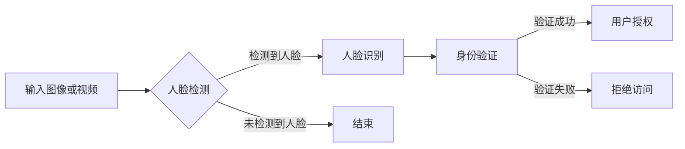

# 基于深度学习的人脸检测与识别系统设计与实现

> 关键词：人脸检测，人脸识别，深度学习，卷积神经网络，目标检测，神经网络架构，实时性，准确率，隐私保护

## 1. 背景介绍

随着计算机视觉技术的发展，人脸检测与识别技术已经成为了智能监控系统、智能手机、社交媒体等众多领域的核心技术。人脸检测与识别系统能够自动识别图像或视频中的人脸位置，并对检测到的人脸进行身份验证，具有非接触、高效、便捷等优点。本文将深入探讨基于深度学习的人脸检测与识别系统的设计与实现。

### 1.1 问题的由来

人脸检测与识别技术的研究始于20世纪70年代，早期主要采用传统的人工特征提取方法，如HOG（Histogram of Oriented Gradients）、LBP（Local Binary Patterns）等。这些方法在一定程度上能够识别人脸，但准确率和鲁棒性较差，难以适应复杂的环境和光照变化。

随着深度学习技术的兴起，基于深度学习的人脸检测与识别技术取得了显著的进展。深度学习模型能够自动学习图像特征，并能够有效地提取人脸特征，提高了识别准确率和鲁棒性。

### 1.2 研究现状

目前，基于深度学习的人脸检测与识别技术已经成为人工智能领域的研究热点。主要的研究方向包括：

- **人脸检测**：利用深度学习模型检测图像或视频中的人脸位置。
- **人脸识别**：在检测到人脸后，提取人脸特征并进行身份验证。
- **人脸属性识别**：识别人脸的年龄、性别、表情等属性。

### 1.3 研究意义

基于深度学习的人脸检测与识别技术具有以下意义：

- **提高安全性**：应用于智能监控系统，提高安全性。
- **提升用户体验**：应用于智能手机、社交媒体等，提升用户体验。
- **促进智能产业发展**：推动智能产业发展，创造新的应用场景。

### 1.4 本文结构

本文将按照以下结构进行论述：

- 第2章介绍人脸检测与识别的核心概念与联系。
- 第3章阐述核心算法原理与具体操作步骤。
- 第4章讲解数学模型和公式，并举例说明。
- 第5章展示项目实践：代码实例和详细解释说明。
- 第6章探讨实际应用场景。
- 第7章推荐相关工具和资源。
- 第8章总结未来发展趋势与挑战。
- 第9章提供常见问题与解答。

## 2. 核心概念与联系

### 2.1 核心概念

- **人脸检测**：在图像或视频中定位人脸的位置。
- **人脸识别**：识别图像或视频中的人脸身份。
- **深度学习**：一种通过学习大量数据来提取特征并进行预测的机器学习方法。
- **卷积神经网络**：一种特殊的深度学习模型，能够自动学习图像特征。

### 2.2 核心概念原理和架构的 Mermaid 流程图



## 3. 核心算法原理 & 具体操作步骤

### 3.1 算法原理概述

人脸检测与识别系统通常采用以下步骤：

1. **人脸检测**：使用深度学习模型检测图像或视频中的人脸位置。
2. **人脸对齐**：对检测到的人脸进行几何变换，使人脸朝向一致。
3. **人脸特征提取**：提取人脸特征，用于后续的识别或属性分析。
4. **人脸识别/属性识别**：使用深度学习模型进行人脸识别或属性识别。

### 3.2 算法步骤详解

#### 3.2.1 人脸检测

人脸检测通常采用以下步骤：

1. **预处理**：对输入图像或视频进行预处理，如缩放、归一化等。
2. **特征提取**：使用卷积神经网络提取图像特征。
3. **目标检测**：使用目标检测算法（如Faster R-CNN、SSD等）检测人脸位置。

#### 3.2.2 人脸对齐

人脸对齐通常采用以下步骤：

1. **人脸关键点检测**：使用深度学习模型检测人脸关键点。
2. **人脸姿态估计**：估计人脸姿态参数。
3. **几何变换**：根据姿态参数进行几何变换，使人脸朝向一致。

#### 3.2.3 人脸特征提取

人脸特征提取通常采用以下步骤：

1. **特征提取**：使用深度学习模型提取人脸特征。
2. **特征降维**：对提取的特征进行降维处理。

#### 3.2.4 人脸识别/属性识别

人脸识别/属性识别通常采用以下步骤：

1. **特征比对**：比较待识别人脸特征与数据库中的人脸特征。
2. **决策**：根据比对结果进行身份验证或属性识别。

### 3.3 算法优缺点

#### 优点

- **高准确率**：深度学习模型能够自动学习图像特征，具有较高的识别准确率。
- **鲁棒性强**：能够适应复杂的环境和光照变化。
- **实时性**：一些深度学习模型具有较好的实时性。

#### 缺点

- **计算量大**：深度学习模型需要大量的计算资源。
- **数据依赖性**：模型的性能依赖于训练数据的质量和数量。
- **隐私问题**：人脸识别技术涉及用户隐私，需要妥善处理。

### 3.4 算法应用领域

- **智能监控系统**
- **智能手机**
- **社交媒体**
- **金融安全**
- **医疗保健**

## 4. 数学模型和公式 & 详细讲解 & 举例说明

### 4.1 数学模型构建

#### 4.1.1 卷积神经网络（CNN）

卷积神经网络是一种特殊的深度学习模型，能够自动学习图像特征。其基本结构包括卷积层、池化层、全连接层等。

#### 4.1.2 目标检测算法

目标检测算法是一种能够检测图像或视频中目标位置的深度学习模型。常见的目标检测算法包括Faster R-CNN、SSD、YOLO等。

### 4.2 公式推导过程

#### 4.2.1 卷积层

卷积层的基本公式如下：

$$
\mathbf{h}(x) = \mathbf{W} \mathbf{x} + \mathbf{b}
$$

其中，$\mathbf{h}(x)$ 是输出特征图，$\mathbf{W}$ 是卷积核，$\mathbf{x}$ 是输入特征图，$\mathbf{b}$ 是偏置项。

#### 4.2.2 池化层

池化层的基本公式如下：

$$
\mathbf{p}(x) = \max\limits_{i \in \{1,2,...,k\}} \mathbf{x}_{i}
$$

其中，$\mathbf{p}(x)$ 是输出特征图，$\mathbf{x}$ 是输入特征图，$k$ 是池化窗口大小。

### 4.3 案例分析与讲解

以下以Faster R-CNN为例，讲解目标检测算法的原理。

Faster R-CNN是一种基于区域提议（Region Proposal）的目标检测算法。其基本步骤如下：

1. 使用RPN（Region Proposal Network）生成候选区域。
2. 对候选区域进行分类和回归，得到目标类别和位置信息。
3. 对检测到的目标进行非极大值抑制（NMS）处理。

## 5. 项目实践：代码实例和详细解释说明

### 5.1 开发环境搭建

以下是使用Python和TensorFlow搭建开发环境的基本步骤：

1. 安装TensorFlow和相关依赖库：
```bash
pip install tensorflow-gpu
pip install pillow
```
2. 下载预训练模型：
```bash
wget https://github.com/tensorflow/models/releases/download/object_detection/generic_model.ckpt
```
3. 准备数据集。

### 5.2 源代码详细实现

以下是一个使用Faster R-CNN进行人脸检测的简单示例：

```python
import cv2
import tensorflow as tf
from object_detection.utils import config_util
from object_detection.protos import pipeline_pb2

# 加载模型
pipeline_config = pipeline_pb2.TrainConfig()
config_util.get_config_file('path/to/pipeline.config', pipeline_config)
detection_model = tf.saved_model.load('path/to/model')

# 加载图像
image = cv2.imread('path/to/image.jpg')

# 进行人脸检测
 detections = detection_model(image)

# 解析检测结果
for detection in detections:
    print(detection)

# 显示检测结果
for detection in detections:
    boxes = detection['detection_boxes'].numpy()
    scores = detection['detection_scores'].numpy()
    classes = detection['detection_classes'].numpy()
    for box, score, cls in zip(boxes, scores, classes):
        if score > 0.5:
            print(f'Class: {cls}, Score: {score}')
            cv2.rectangle(image, (int(box[1]*image.shape[1]), int(box[0]*image.shape[0])), (int(box[3]*image.shape[1]), int(box[2]*image.shape[0])), (0, 255, 0), 2)

cv2.imshow('Detected Faces', image)
cv2.waitKey(0)
cv2.destroyAllWindows()
```

### 5.3 代码解读与分析

以上代码展示了使用Faster R-CNN进行人脸检测的完整流程：

1. 加载模型和配置文件。
2. 读取图像。
3. 使用模型进行人脸检测。
4. 解析检测结果，打印检测到的类别和置信度。
5. 在图像上绘制检测到的脸框。
6. 显示图像。

### 5.4 运行结果展示

运行上述代码，会在图像上显示检测到的人脸位置，并打印出对应的类别和置信度。

## 6. 实际应用场景

### 6.1 智能监控系统

基于深度学习的人脸检测与识别系统可以应用于智能监控系统，实现以下功能：

- **门禁控制**：只有授权人员才能进入特定区域。
- **异常行为检测**：检测到异常行为时进行报警。
- **人员统计**：统计进入特定区域的人数。

### 6.2 智能手机

基于深度学习的人脸检测与识别系统可以应用于智能手机，实现以下功能：

- **人脸解锁**：使用人脸识别技术解锁手机。
- **面部支付**：使用人脸识别技术进行支付。
- **自拍美颜**：根据人脸特征进行美颜处理。

### 6.3 社交媒体

基于深度学习的人脸检测与识别系统可以应用于社交媒体，实现以下功能：

- **人脸识别好友**：识别图像或视频中的人脸，并找到对应的社交媒体好友。
- **人脸编辑**：对图像或视频中的人脸进行编辑，如换脸、美颜等。

### 6.4 未来应用展望

随着深度学习技术的不断发展，基于深度学习的人脸检测与识别系统将在更多领域得到应用，如：

- **自动驾驶**：用于车辆识别和行人检测。
- **医疗影像分析**：用于病变检测和诊断。
- **人机交互**：用于手势识别和表情识别。

## 7. 工具和资源推荐

### 7.1 学习资源推荐

- 《深度学习》
- 《Python深度学习》
- TensorFlow官方文档

### 7.2 开发工具推荐

- TensorFlow
- PyTorch

### 7.3 相关论文推荐

- "Faster R-CNN: Towards Real-Time Object Detection with Region Proposal Networks"
- "You Only Look Once: Unified, Real-Time Object Detection"
- "YOLO9000: Better, Faster, Stronger"

## 8. 总结：未来发展趋势与挑战

### 8.1 研究成果总结

本文深入探讨了基于深度学习的人脸检测与识别系统的设计与实现。通过对核心算法原理的讲解、项目实践的演示，以及对实际应用场景的探讨，本文为读者提供了全面而深入的了解。

### 8.2 未来发展趋势

- **更轻量级模型**：降低模型的计算量和存储空间，提高实时性。
- **多模态融合**：结合图像、视频、音频等多模态信息，提高识别准确率。
- **隐私保护**：研究无标记人脸识别、差分隐私等技术，保护用户隐私。

### 8.3 面临的挑战

- **计算资源**：深度学习模型需要大量的计算资源。
- **数据标注**：高质量的数据标注需要大量人力和物力。
- **隐私保护**：人脸识别技术涉及用户隐私，需要妥善处理。

### 8.4 研究展望

随着深度学习技术的不断发展，基于深度学习的人脸检测与识别系统将在更多领域得到应用，为人类社会带来更多便利。同时，我们也需要关注隐私保护等问题，确保技术的发展符合伦理道德规范。

## 9. 附录：常见问题与解答

**Q1：人脸检测与识别技术的应用前景如何？**

A：人脸检测与识别技术具有广泛的应用前景，可以应用于智能监控系统、智能手机、社交媒体、金融安全、医疗保健等领域。

**Q2：如何提高人脸检测与识别的准确率？**

A：提高人脸检测与识别的准确率需要从以下几个方面入手：
- 使用高质量的训练数据。
- 选择合适的深度学习模型。
- 对模型进行优化和调参。
- 采用数据增强等技术。

**Q3：人脸识别技术如何保证用户隐私？**

A：为了保证用户隐私，可以采用以下技术：
- 无标记人脸识别。
- 差分隐私。
- 隐私保护模型。

**Q4：如何选择合适的人脸检测与识别模型？**

A：选择合适的人脸检测与识别模型需要考虑以下因素：
- 应用场景。
- 计算资源。
- 模型性能。

**Q5：人脸识别技术在哪些领域存在问题？**

A：人脸识别技术在以下领域存在问题：
- 误识别。
- 欺诈攻击。
- 用户隐私保护。

作者：禅与计算机程序设计艺术 / Zen and the Art of Computer Programming