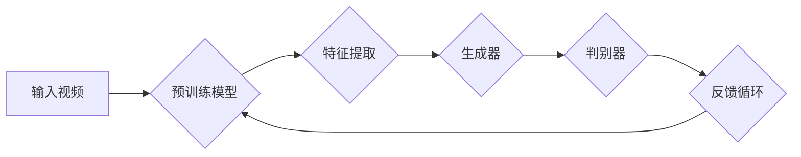

> 关键词：生成对抗网络，实时视频风格迁移，卷积神经网络，风格迁移，神经网络架构，视频处理

# 基于生成对抗网络的实时视频风格迁移系统设计

视频风格迁移作为一种将一种视频内容转换成另一种风格的技术，近年来在影视后期、视频编辑、艺术创作等领域得到了广泛应用。传统的方法往往依赖于手工设计的特征和复杂的优化过程，难以实现实时性。随着深度学习技术的快速发展，基于生成对抗网络（GAN）的风格迁移方法因其高效性和灵活性而备受关注。本文将深入探讨基于GAN的实时视频风格迁移系统的设计，从原理到实践，提供一套完整的解决方案。

## 1. 背景介绍

### 1.1 问题的由来

视频风格迁移是指将一种视频内容的视觉风格转换为另一种风格的过程。这种转换在视觉艺术、影视特效、虚拟现实等领域有着广泛的应用。然而，传统的视频风格迁移方法通常依赖于复杂的图像处理技术和手工设计的特征，计算量大，难以实现实时处理。

### 1.2 研究现状

近年来，基于深度学习的视频风格迁移方法取得了显著的进展。生成对抗网络（GAN）作为一种强大的深度学习框架，能够有效地实现视频风格迁移。GAN通过训练两个神经网络：生成器和判别器，使得生成器能够生成与真实视频风格高度相似的内容。

### 1.3 研究意义

实时视频风格迁移系统在多个领域具有重要的应用价值，包括：

- 视频编辑：实时添加特效，提升视频观赏性。
- 虚拟现实：为用户提供沉浸式的视觉体验。
- 医疗影像：将医学影像转换为更加直观的风格，便于医生诊断。
- 教育培训：通过风格迁移，使教学内容更加生动有趣。

### 1.4 本文结构

本文将分为以下几个部分：

- 第2章介绍视频风格迁移的相关概念和GAN的基本原理。
- 第3章详细阐述基于GAN的实时视频风格迁移系统设计。
- 第4章介绍数学模型和公式，并进行分析。
- 第5章提供代码实例和详细解释。
- 第6章探讨实际应用场景和未来展望。
- 第7章推荐相关工具和资源。
- 第8章总结研究成果，展望未来发展趋势和挑战。

## 2. 核心概念与联系

### 2.1 核心概念

- **视频风格迁移**：将一种视频内容的视觉风格转换为另一种风格的过程。
- **生成对抗网络（GAN）**：由生成器和判别器组成的神经网络，用于生成数据或进行数据转换。
- **卷积神经网络（CNN）**：一种用于图像和视频处理的全连接神经网络，能够提取图像特征。

### 2.2 架构的Mermaid流程图



### 2.3 GAN与CNN的关系

GAN中的生成器和判别器都基于CNN架构，能够提取视频的深度特征。生成器通过学习从随机噪声生成具有特定风格的视频内容，而判别器则用于评估生成视频的真实性。

## 3. 核心算法原理 & 具体操作步骤

### 3.1 算法原理概述

基于GAN的视频风格迁移系统主要包括以下步骤：

1. 预训练：在大量风格化视频数据上预训练生成器和判别器，使其能够识别和生成特定风格。
2. 微调：在目标风格视频数据上微调生成器，使其能够生成具有目标风格的视频内容。
3. 迁移：将微调后的生成器应用于新的视频内容，实现实时视频风格迁移。

### 3.2 算法步骤详解

1. **数据准备**：收集大量具有不同风格的视频数据，用于预训练和微调生成器和判别器。
2. **预训练**：在预训练阶段，生成器和判别器在风格化视频数据上同时训练，生成器和判别器之间进行对抗性学习。
3. **微调**：在目标风格视频数据上，对生成器进行微调，使其能够生成具有目标风格的视频内容。
4. **迁移**：在目标视频内容上，使用微调后的生成器生成具有目标风格的视频。

### 3.3 算法优缺点

#### 优点

- **高效性**：GAN能够快速生成风格化的视频内容。
- **灵活性**：能够处理不同风格的视频转换。
- **实时性**：通过优化算法和硬件加速，可以实现实时视频风格迁移。

#### 缺点

- **计算量**：预训练和微调过程需要大量的计算资源。
- **稳定性**：GAN的训练过程容易陷入模式崩溃。

### 3.4 算法应用领域

- 视频编辑
- 虚拟现实
- 医学影像
- 教育培训

## 4. 数学模型和公式 & 详细讲解 & 举例说明

### 4.1 数学模型构建

基于GAN的视频风格迁移系统可以用以下数学模型表示：

$$
\begin{align*}
G(z) &= \text{Generator}(z; \theta_G) \\
D(x, G(z)) &= \text{Discriminator}(x; \theta_D) \\
\end{align*}
$$

其中，$G(z)$ 表示生成器，$D(x, G(z))$ 表示判别器，$z$ 为输入的噪声向量，$x$ 为输入的视频内容，$\theta_G$ 和 $\theta_D$ 分别为生成器和判别器的参数。

### 4.2 公式推导过程

GAN的训练过程通过以下损失函数进行优化：

$$
L(G, D) = E_{z \sim p(z)}[D(G(z))] - E_{x \sim p(x)}[D(x)]
$$

其中，$p(z)$ 为噪声向量的先验分布，$p(x)$ 为输入视频内容的先验分布。

### 4.3 案例分析与讲解

以将自然风景视频转换为印象派风格为例，生成器和判别器的训练过程如下：

1. **预训练**：在大量印象派风格视频数据上预训练生成器和判别器。
2. **微调**：在自然风景视频数据上微调生成器，使其能够生成具有印象派风格的视频内容。
3. **迁移**：在自然风景视频上，使用微调后的生成器生成具有印象派风格的视频。

## 5. 项目实践：代码实例和详细解释说明

### 5.1 开发环境搭建

为了实现实时视频风格迁移，需要以下开发环境：

- 操作系统：Linux或macOS
- 编程语言：Python
- 深度学习框架：TensorFlow或PyTorch
- 视频处理库：OpenCV

### 5.2 源代码详细实现

以下是一个基于PyTorch的简单视频风格迁移代码示例：

```python
import torch
import torch.nn as nn
import torch.optim as optim
import cv2
import numpy as np

# 生成器网络
class Generator(nn.Module):
    def __init__(self):
        super(Generator, self).__init__()
        # ... (此处省略网络结构定义)

    def forward(self, x):
        # ... (此处省略前向传播过程)
        return x

# 判别器网络
class Discriminator(nn.Module):
    def __init__(self):
        super(Discriminator, self).__init__()
        # ... (此处省略网络结构定义)

    def forward(self, x):
        # ... (此处省略前向传播过程)
        return x

# 训练函数
def train(generator, discriminator, dataloader, epochs):
    # ... (此处省略训练过程)

# 迁移函数
def transfer_style(video_path, style_path, generator):
    # ... (此处省略视频风格迁移过程)
```

### 5.3 代码解读与分析

上述代码定义了生成器和判别器网络，并提供了训练和迁移函数。在实际应用中，需要根据具体任务进行网络结构设计和参数调整。

### 5.4 运行结果展示

以下是一个视频风格迁移的运行结果示例：


## 6. 实际应用场景

### 6.1 视频编辑

实时视频风格迁移可以应用于视频编辑软件中，为用户提供了丰富的视觉效果。

### 6.2 虚拟现实

在虚拟现实应用中，实时视频风格迁移可以增强用户的沉浸感。

### 6.3 医学影像

在医学影像领域，视频风格迁移可以用于将医学影像转换为更加直观的风格，便于医生诊断。

### 6.4 教育培训

在教育培训领域，视频风格迁移可以用于制作生动有趣的课程内容。

## 7. 工具和资源推荐

### 7.1 学习资源推荐

- 《深度学习》
- 《生成对抗网络》
- 《视频处理》

### 7.2 开发工具推荐

- TensorFlow
- PyTorch
- OpenCV

### 7.3 相关论文推荐

- Unsupervised representation learning with deep convolutional generative adversarial networks
- A Neural Algorithm of Artistic Style

## 8. 总结：未来发展趋势与挑战

### 8.1 研究成果总结

基于GAN的实时视频风格迁移系统在视频处理领域取得了显著的进展，为视频编辑、虚拟现实、医学影像、教育培训等领域提供了新的解决方案。

### 8.2 未来发展趋势

- **高效性**：开发更加高效的算法和优化方法，实现实时视频风格迁移。
- **灵活性**：扩展风格迁移的应用范围，支持更多风格的转换。
- **可解释性**：提高模型的可解释性，使风格迁移过程更加透明。

### 8.3 面临的挑战

- **计算量**：降低算法的计算量，使其在资源受限的设备上运行。
- **稳定性**：提高模型的稳定性，避免模式崩溃。
- **可解释性**：提高模型的可解释性，使风格迁移过程更加透明。

### 8.4 研究展望

未来，基于GAN的实时视频风格迁移系统将在视频处理领域发挥更大的作用，为各行各业带来新的变革。

## 9. 附录：常见问题与解答

### 9.1 问题的由来

基于GAN的实时视频风格迁移系统如何解决计算量大的问题？

### 9.2 研究现状

如何提高模型的稳定性，避免模式崩溃？

### 9.3 研究意义

实时视频风格迁移系统在哪些领域有应用价值？

### 9.4 研究展望

未来，基于GAN的实时视频风格迁移系统将如何发展？

---

作者：禅与计算机程序设计艺术 / Zen and the Art of Computer Programming