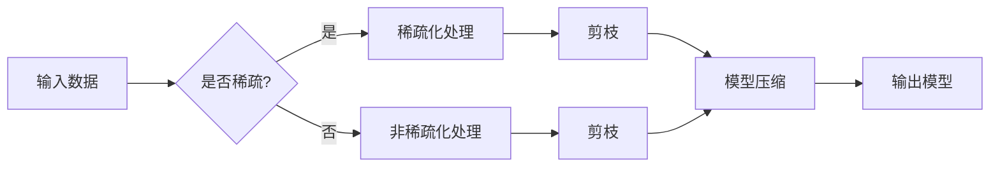

> 关键词：神经网络剪枝，稀疏性，结构化剪枝，非结构化剪枝，神经网络优化，模型压缩，计算效率，内存效率

# 基于稀疏性的神经网络剪枝优化

神经网络剪枝是一种流行的模型压缩技术，旨在通过移除网络中不必要的权重来减小模型大小，从而提高计算效率和内存效率。稀疏性是剪枝后的网络的一个关键特性，它不仅减小了模型的尺寸，还可能提高模型的准确性。本文将深入探讨基于稀疏性的神经网络剪枝优化，从核心概念到实际应用，提供一个全面的技术视角。

## 1. 背景介绍

随着深度学习在各个领域的广泛应用，神经网络模型变得越来越复杂，这导致了计算资源和内存需求的增加。为了解决这些问题，研究者们提出了各种模型压缩技术，其中剪枝技术尤为引人关注。剪枝通过移除不重要的连接或神经元，可以在不显著影响模型性能的前提下，大幅度减少模型的大小和参数数量。

### 1.1 问题的由来

神经网络模型的参数数量庞大，这导致了以下几个问题：

- **计算资源消耗**：在训练和推理过程中，大规模的神经网络需要大量的计算资源。
- **内存需求**：模型存储需要大量的空间，尤其是在移动设备和嵌入式系统中。
- **推理延迟**：复杂的模型导致推理速度慢，不适合实时应用。

### 1.2 研究现状

剪枝技术已经成为模型压缩的主要手段之一。根据剪枝策略的不同，可以分为结构化剪枝和非结构化剪枝两大类。结构化剪枝移除整个神经元或连接，而非结构化剪枝则移除单个权重。

### 1.3 研究意义

基于稀疏性的神经网络剪枝优化对于以下方面具有重要意义：

- **提高计算效率**：减少模型参数数量，降低计算复杂度。
- **降低内存需求**：减少模型存储空间，适合资源受限的环境。
- **提升模型性能**：通过保留重要的连接，有时可以提高模型准确性。

## 2. 核心概念与联系

### 2.1 核心概念原理

**稀疏性**：指网络中大部分权重为零或接近零的状态。稀疏性可以通过剪枝实现。

**剪枝**：指移除网络中不重要的连接或神经元，以减小模型大小。

**模型压缩**：通过剪枝、量化、模型融合等技术减小模型大小，同时保持或提高模型性能。

### 2.2 架构的 Mermaid 流程图



## 3. 核心算法原理 & 具体操作步骤

### 3.1 算法原理概述

神经网络剪枝的原理是基于以下假设：

- 部分权重对模型性能的贡献很小，可以安全地移除。
- 稀疏化后的网络仍然能够保持或提高模型性能。

### 3.2 算法步骤详解

1. **初始化网络**：选择一个预训练的神经网络模型。
2. **剪枝策略选择**：选择结构化剪枝或非结构化剪枝。
3. **选择重要性度量**：选择一个重要性度量标准，如L1范数或L2范数。
4. **剪枝操作**：根据重要性度量标准移除权重。
5. **验证模型性能**：在验证集上评估剪枝后的模型性能。
6. **迭代优化**：根据性能反馈调整剪枝策略，直至满意。

### 3.3 算法优缺点

#### 优点：

- **减少模型大小**：减小模型参数数量，降低存储和计算需求。
- **提高模型效率**：剪枝后的模型计算效率更高。
- **可能提高模型性能**：剪枝可以移除冗余连接，提高模型准确性。

#### 缺点：

- **性能下降风险**：如果剪枝过度，可能会降低模型性能。
- **计算复杂度**：剪枝和验证过程可能需要大量的计算资源。
- **需要调整超参数**：剪枝策略和重要性度量标准需要根据具体任务进行调整。

### 3.4 算法应用领域

神经网络剪枝技术广泛应用于以下领域：

- **移动和嵌入式系统**：减少模型大小，降低功耗。
- **实时系统**：提高模型推理速度，满足实时性要求。
- **推荐系统**：提高模型效率，降低成本。

## 4. 数学模型和公式 & 详细讲解 & 举例说明

### 4.1 数学模型构建

神经网络剪枝的数学模型可以表示为：

$$
\mathcal{L}(\theta) = \frac{1}{N}\sum_{i=1}^{N}L(y_i, \hat{y}_i(\theta)) + \lambda R(\theta)
$$

其中，$\mathcal{L}$ 是损失函数，$y_i$ 是真实标签，$\hat{y}_i(\theta)$ 是模型预测，$N$ 是样本数量，$R(\theta)$ 是正则化项，$\lambda$ 是正则化系数。

### 4.2 公式推导过程

损失函数 $\mathcal{L}$ 可以是交叉熵损失或其他适合特定任务的损失函数。正则化项 $R(\theta)$ 可以是L1范数或L2范数。

### 4.3 案例分析与讲解

假设我们有一个简单的神经网络模型，包含两个神经元。使用L1范数作为正则化项，我们可以将模型表示为：

$$
\mathcal{L}(\theta) = \frac{1}{2N}\sum_{i=1}^{N}(y_i - \hat{y}_i)^2 + \lambda \sum_{j=1}^{M}|\theta_j|
$$

其中，$\theta_j$ 是网络中的权重。

## 5. 项目实践：代码实例和详细解释说明

### 5.1 开发环境搭建

为了实现神经网络剪枝，我们需要以下开发环境：

- Python 3.x
- PyTorch 或 TensorFlow
- NumPy

### 5.2 源代码详细实现

以下是一个使用 PyTorch 实现神经网络剪枝的简单示例：

```python
import torch
import torch.nn as nn
import torch.nn.utils.prune as prune

# 定义一个简单的神经网络模型
class SimpleNetwork(nn.Module):
    def __init__(self):
        super(SimpleNetwork, self).__init__()
        self.fc1 = nn.Linear(10, 5)
        self.fc2 = nn.Linear(5, 2)
        self.relu = nn.ReLU()

    def forward(self, x):
        x = self.relu(self.fc1(x))
        x = self.fc2(x)
        return x

# 创建网络实例
net = SimpleNetwork()

# 结构化剪枝
prune.l1_unstructured(net.fc1, name='weight')
prune.l1_unstructured(net.fc2, name='weight')

# 非结构化剪枝
prune.l1_unstructured(net.fc1, name='weight', amount=0.5)
prune.l1_unstructured(net.fc2, name='weight', amount=0.5)

# 验证剪枝效果
# ...
```

### 5.3 代码解读与分析

在上面的代码中，我们定义了一个简单的神经网络模型，并使用 `prune.l1_unstructured` 函数进行L1剪枝。`prune.l1_unstructured` 函数接受网络模块、剪枝部分的名称和剪枝比例作为参数。

### 5.4 运行结果展示

剪枝后的模型可以用于训练和推理。运行结果将取决于具体的任务和数据集。

## 6. 实际应用场景

### 6.1 移动设备

神经网络剪枝在移动设备中非常有用，因为它可以减小模型大小和计算复杂度，从而降低功耗和提高速度。

### 6.2 实时系统

在实时系统中，神经网络剪枝可以提高推理速度，确保系统在规定的时间内完成任务。

### 6.3 推荐系统

在推荐系统中，神经网络剪枝可以提高模型效率，降低成本。

## 7. 工具和资源推荐

### 7.1 学习资源推荐

- 《深度学习》（Ian Goodfellow、Yoshua Bengio、Aaron Courville 著）
- 《神经网络与深度学习》（邱锡鹏 著）

### 7.2 开发工具推荐

- PyTorch
- TensorFlow

### 7.3 相关论文推荐

- "Sparsity in Neural Networks: A Survey" by Sayed A. Aldhaher and Kevin G. Jackson
- "Neural Network Pruning: Speeding up Deep Learning" by Santhosh K. P. Kurapati, Sourav Dutta, and Ashok K. Chandra

## 8. 总结：未来发展趋势与挑战

### 8.1 研究成果总结

基于稀疏性的神经网络剪枝优化是一种有效的模型压缩技术，可以提高计算效率和内存效率，同时可能提高模型性能。

### 8.2 未来发展趋势

未来，神经网络剪枝技术将朝着以下方向发展：

- **更先进的剪枝算法**：开发更有效的剪枝算法，提高剪枝效率和模型性能。
- **多模态剪枝**：将剪枝技术应用于多模态数据，提高跨模态学习的效果。
- **自适应剪枝**：开发自适应剪枝算法，根据不同的应用场景调整剪枝策略。

### 8.3 面临的挑战

神经网络剪枝技术面临的挑战包括：

- **模型性能下降**：过度剪枝可能导致模型性能下降。
- **计算复杂度**：剪枝和验证过程可能需要大量的计算资源。
- **超参数调整**：剪枝策略和重要性度量标准需要根据具体任务进行调整。

### 8.4 研究展望

随着深度学习的不断发展，神经网络剪枝优化将在模型压缩领域发挥越来越重要的作用。通过不断的研究和创新，我们可以期待神经网络剪枝技术在未来取得更大的突破。

## 9. 附录：常见问题与解答

**Q1：剪枝是否会降低模型性能？**

A：是的，过度剪枝可能导致模型性能下降。因此，需要在剪枝量和模型性能之间找到一个平衡点。

**Q2：如何选择剪枝策略？**

A：选择剪枝策略取决于具体的应用场景和任务需求。例如，对于移动设备，可能更倾向于使用结构化剪枝，因为它可以更快地剪枝。

**Q3：如何评估剪枝效果？**

A：可以在验证集或测试集上评估剪枝后的模型性能。通常使用准确率、召回率、F1分数等指标。

**Q4：剪枝是否适用于所有类型的神经网络？**

A：是的，剪枝技术适用于各种类型的神经网络，包括卷积神经网络、循环神经网络等。

**Q5：如何防止剪枝过程中的过拟合？**

A：可以使用正则化技术，如L1正则化或L2正则化，来防止剪枝过程中的过拟合。

作者：禅与计算机程序设计艺术 / Zen and the Art of Computer Programming