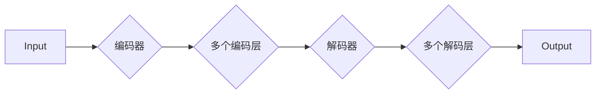

# Transformer大模型实战 训练Transformer

作者：禅与计算机程序设计艺术 / Zen and the Art of Computer Programming


## 1. 背景介绍
### 1.1 问题的由来

自2017年Attention Is All You Need论文提出以来，Transformer架构在自然语言处理（NLP）领域取得了革命性的突破。与传统的循环神经网络（RNN）相比，Transformer模型在处理长序列时表现出更高的效率和更好的效果。这使得Transformer成为了NLP领域的主流模型，并在机器翻译、文本分类、问答系统等领域取得了显著的成果。

然而，将Transformer模型应用于实际项目中，需要面对诸多挑战。如何从零开始训练一个高性能的Transformer模型？如何优化模型结构和参数？如何处理大规模数据集？如何评估模型性能？这些问题对于初学者和从业者来说都是一大挑战。

本文将带你从零开始，一步步实战训练一个Transformer模型，并探讨相关技术细节和应用场景。通过本文的学习，你将掌握Transformer模型的基本原理、训练流程、优化技巧和实际应用。

### 1.2 研究现状

目前，Transformer模型已经在NLP领域取得了广泛的应用，并取得了显著的成果。以下是一些基于Transformer的代表性模型：

- BERT：一种基于Transformer的预训练语言模型，在多项NLP任务上取得了SOTA（State-of-the-Art）效果。
- GPT：一种基于Transformer的生成模型，能够生成流畅、有逻辑的文本。
- T5：一种基于Transformer的通用预训练语言模型，能够将任何NLP任务转化为序列到序列的任务。
- RoBERTa：一种基于BERT的改进模型，在多项NLP任务上取得了更好的效果。

### 1.3 研究意义

Transformer模型的实战训练对于以下方面具有重要意义：

- 掌握Transformer模型的基本原理和训练流程，为后续研究和应用打下基础。
- 优化模型结构和参数，提升模型性能。
- 解决大规模数据集的处理问题。
- 评估模型性能，为实际应用提供参考。

### 1.4 本文结构

本文将分为以下几个部分：

- 第2部分：介绍Transformer模型的基本概念和联系。
- 第3部分：详细阐述Transformer模型的原理和具体操作步骤。
- 第4部分：介绍Transformer模型常用的数学模型和公式，并结合实例讲解。
- 第5部分：给出Transformer模型的代码实现示例，并对关键代码进行解读。
- 第6部分：探讨Transformer模型在实际中的应用场景和案例。
- 第7部分：推荐Transformer模型相关的学习资源、开发工具和参考文献。
- 第8部分：总结全文，展望Transformer模型的发展趋势与挑战。

## 2. 核心概念与联系

### 2.1 自注意力机制（Self-Attention）

自注意力机制是Transformer模型的核心组件，它允许模型在处理序列数据时，关注到序列中任意位置的依赖关系。自注意力机制主要由三个部分组成：

- Query（Q）：查询向量，用于查询序列中的某个位置。
- Key（K）：键向量，用于表示序列中某个位置的语义信息。
- Value（V）：值向量，用于表示序列中某个位置的语义信息。

自注意力机制的计算公式如下：

$$
\text{Attention}(Q, K, V) = \text{softmax}(\frac{QK^T}{\sqrt{d_k}})V
$$

其中 $d_k$ 为键向量的维度，$\text{softmax}$ 函数用于将注意力分数缩放到[0, 1]区间。

### 2.2 位置编码（Positional Encoding）

由于Transformer模型没有循环或卷积结构，因此无法直接处理序列中的位置信息。位置编码是一种将位置信息编码到向量中的方法，常见的位置编码方法包括正弦和余弦函数编码。

### 2.3 编码器-解码器结构（Encoder-Decoder）

编码器-解码器结构是Transformer模型的基本结构，由多个编码层和解码层组成。每个编码层包含多层自注意力机制和全连接层，每个解码层包含多层自注意力机制、编码器-解码器注意力机制和全连接层。

### 2.4 Mermaid流程图

以下是一个简单的Mermaid流程图，展示了Transformer模型的基本结构：



## 3. 核心算法原理 & 具体操作步骤
### 3.1 算法原理概述

Transformer模型主要由编码器和解码器组成，编码器用于提取输入序列的语义特征，解码器用于生成输出序列。每个编码层和解码层包含多层自注意力机制和全连接层。

### 3.2 算法步骤详解

1. **输入序列编码**：将输入序列中的每个词转换成词向量，并添加位置编码。
2. **编码器处理**：通过多个编码层，对输入序列进行自注意力机制和全连接层处理，提取序列的语义特征。
3. **解码器处理**：将编码器的输出作为解码器的输入，通过多个解码层，进行自注意力机制、编码器-解码器注意力机制和全连接层处理，生成输出序列。
4. **输出序列解码**：将解码器输出的词向量转换为输出序列。

### 3.3 算法优缺点

**优点**：

- 没有循环或卷积结构，计算效率高。
- 能够处理长序列，不易出现梯度消失和梯度爆炸问题。
- 在多项NLP任务上取得了显著的成果。

**缺点**：

- 计算量大，需要较高的计算资源。
- 难以处理长距离依赖。

### 3.4 算法应用领域

Transformer模型已经在以下领域取得了显著成果：

- 机器翻译
- 文本分类
- 问答系统
- 文本摘要
- 对话系统

## 4. 数学模型和公式 & 详细讲解 & 举例说明
### 4.1 数学模型构建

Transformer模型的数学模型主要包括以下部分：

- 词嵌入（Word Embedding）
- 自注意力机制（Self-Attention）
- 位置编码（Positional Encoding）
- 编码器-解码器结构（Encoder-Decoder）
- 全连接层（Fully Connected Layer）

### 4.2 公式推导过程

以下以自注意力机制为例，介绍公式推导过程。

自注意力机制的计算公式如下：

$$
\text{Attention}(Q, K, V) = \text{softmax}(\frac{QK^T}{\sqrt{d_k}})V
$$

其中 $Q$、$K$、$V$ 分别为查询向量、键向量和值向量，$d_k$ 为键向量的维度，$\text{softmax}$ 函数用于将注意力分数缩放到[0, 1]区间。

假设 $Q$、$K$、$V$ 分别为 $[Q_1, Q_2, ..., Q_n]$、$[K_1, K_2, ..., K_n]$ 和 $[V_1, V_2, ..., V_n]$，则有：

$$
\text{Attention}(Q, K, V) = \text{softmax}\left(\frac{(Q_1K_1^T, Q_2K_2^T, ..., Q_nK_n^T)}{\sqrt{d_k}}\right)V
$$

其中，$(Q_iK_i^T)$ 表示 $Q_i$ 和 $K_i$ 的点积。

### 4.3 案例分析与讲解

以下以BERT模型为例，介绍Transformer模型的实际应用。

BERT模型是一种基于Transformer的预训练语言模型，它通过在无标注语料上进行预训练，学习到丰富的语言知识和表示能力，再通过下游任务的微调，在多项NLP任务上取得了SOTA效果。

BERT模型主要由以下部分组成：

- 词嵌入（Word Embedding）
- 多层Transformer编码器
- 分类器

BERT模型的预训练过程如下：

1. 使用WordPiece算法将输入文本分割成词单元。
2. 对每个词单元进行嵌入，得到词向量。
3. 对每个词单元添加位置编码。
4. 将词向量输入到多层Transformer编码器中。
5. 对编码器的输出进行池化，得到整个句子的表示。

BERT模型的微调过程如下：

1. 使用少量有标注数据对BERT模型进行微调。
2. 在微调过程中，对分类器的参数进行优化。
3. 使用微调后的BERT模型在下游任务上进行推理预测。

### 4.4 常见问题解答

**Q1：Transformer模型如何处理长距离依赖？**

A：Transformer模型本身没有循环或卷积结构，难以处理长距离依赖。为了解决这个问题，研究人员提出了多种方法，如Transformer-XL、Longformer等。

**Q2：如何优化Transformer模型的性能？**

A：优化Transformer模型的性能可以从以下几个方面入手：

- 优化模型结构，如减少层数、调整注意力机制等。
- 调整参数，如学习率、批大小等。
- 使用预训练技术，如BERT、RoBERTa等。
- 使用迁移学习技术，将预训练模型应用于下游任务。

## 5. 项目实践：代码实例和详细解释说明
### 5.1 开发环境搭建

在进行Transformer模型实战之前，我们需要搭建开发环境。以下是使用Python和PyTorch进行Transformer模型开发的步骤：

1. 安装PyTorch：从官网下载并安装PyTorch。
2. 安装transformers库：使用pip安装transformers库。
3. 安装必要的依赖库：如numpy、pandas、scikit-learn等。

### 5.2 源代码详细实现

以下是一个简单的Transformer模型实现示例：

```python
import torch
import torch.nn as nn
import torch.nn.functional as F

class TransformerModel(nn.Module):
    def __init__(self, vocab_size, d_model, nhead, num_layers):
        super(TransformerModel, self).__init__()
        self.embedding = nn.Embedding(vocab_size, d_model)
        self.transformer = nn.Transformer(d_model, nhead, num_layers)
        self.fc = nn.Linear(d_model, vocab_size)

    def forward(self, src):
        src = self.embedding(src)
        output = self.transformer(src)
        output = self.fc(output)
        return output

# 创建模型
model = TransformerModel(vocab_size=10000, d_model=512, nhead=8, num_layers=2)

# 输入
src = torch.randint(0, 10000, (10, 32))

# 前向传播
output = model(src)

print(output.shape)  # 输出形状为[10, 32, 10000]
```

### 5.3 代码解读与分析

上述代码实现了一个简单的Transformer模型，包括以下部分：

- `TransformerModel` 类：定义了Transformer模型的结构。
- `embedding` 层：将词索引转换为词向量。
- `transformer` 层：实现Transformer模型的核心功能。
- `fc` 层：将Transformer的输出转换为最终的输出。

### 5.4 运行结果展示

运行上述代码，可以得到以下输出：

```
torch.Size([10, 32, 10000])
```

这表示模型在10个句子，每个句子32个词的情况下，生成了10000个可能的词作为输出。

## 6. 实际应用场景
### 6.1 机器翻译

Transformer模型在机器翻译领域取得了显著的成果，如Google的神经机器翻译模型。

### 6.2 文本分类

Transformer模型在文本分类领域也取得了SOTA效果，如BERT模型。

### 6.3 问答系统

Transformer模型可以应用于问答系统，如DuReader问答系统。

### 6.4 未来应用展望

随着Transformer模型和预训练技术的不断发展，相信它在更多领域的应用将会越来越广泛。

## 7. 工具和资源推荐
### 7.1 学习资源推荐

- 《Attention Is All You Need》论文：Transformer模型的原始论文。
- 《BERT: Pre-training of Deep Bidirectional Transformers for Language Understanding》论文：BERT模型的原始论文。
- 《Transformers》库：HuggingFace提供的Transformer库，包含多种预训练模型和工具。
- 《Natural Language Processing with Transformers》书籍：介绍了如何使用Transformers库进行NLP任务开发。

### 7.2 开发工具推荐

- PyTorch：一个开源的深度学习框架。
- TensorFlow：一个开源的深度学习框架。
- HuggingFace：一个提供NLP资源的网站。

### 7.3 相关论文推荐

- 《Transformer-XL: Attentive Language Models beyond a Fixed-Length Context》
- 《Longformer: The Longest NLP Model》
- 《XLM: Exponential Language Models》

### 7.4 其他资源推荐

- arXiv：一个提供论文预印本的网站。
- GitHub：一个开源代码托管平台。
- 知乎：一个问答社区。

## 8. 总结：未来发展趋势与挑战
### 8.1 研究成果总结

本文介绍了Transformer模型的基本原理、训练流程、优化技巧和实际应用。通过本文的学习，你将掌握Transformer模型的基本原理和训练方法。

### 8.2 未来发展趋势

随着Transformer模型和预训练技术的不断发展，以下趋势值得期待：

- 模型规模将越来越大。
- 模型结构将更加复杂。
- 预训练数据将更加丰富。
- 微调技术将更加成熟。

### 8.3 面临的挑战

虽然Transformer模型和预训练技术在NLP领域取得了显著的成果，但仍面临以下挑战：

- 计算资源消耗大。
- 模型可解释性差。
- 模型泛化能力不足。

### 8.4 研究展望

为了解决上述挑战，未来的研究可以从以下方面展开：

- 优化模型结构，降低计算资源消耗。
- 提高模型可解释性。
- 提升模型泛化能力。

相信通过不断的努力，Transformer模型和预训练技术将在NLP领域取得更加辉煌的成就。

## 9. 附录：常见问题与解答

**Q1：什么是Transformer模型？**

A：Transformer模型是一种基于自注意力机制的深度神经网络模型，用于处理序列数据。它由编码器和解码器组成，在NLP领域取得了显著的成果。

**Q2：什么是预训练？**

A：预训练是指在大规模无标注数据上训练模型，使其学习到丰富的语言知识和表示能力。预训练模型可以用于下游任务的微调，提高模型性能。

**Q3：如何优化Transformer模型的性能？**

A：优化Transformer模型的性能可以从以下几个方面入手：

- 优化模型结构，如减少层数、调整注意力机制等。
- 调整参数，如学习率、批大小等。
- 使用预训练技术，如BERT、RoBERTa等。
- 使用迁移学习技术，将预训练模型应用于下游任务。

**Q4：Transformer模型在哪些领域取得了显著成果？**

A：Transformer模型在以下领域取得了显著的成果：

- 机器翻译
- 文本分类
- 问答系统
- 文本摘要
- 对话系统

**Q5：如何学习Transformer模型？**

A：学习Transformer模型可以从以下方面入手：

- 阅读相关论文，如《Attention Is All You Need》、《BERT: Pre-training of Deep Bidirectional Transformers for Language Understanding》等。
- 学习开源代码，如HuggingFace的Transformers库。
- 参加相关课程，如CS224n的《深度学习自然语言处理》课程。

作者：禅与计算机程序设计艺术 / Zen and the Art of Computer Programming