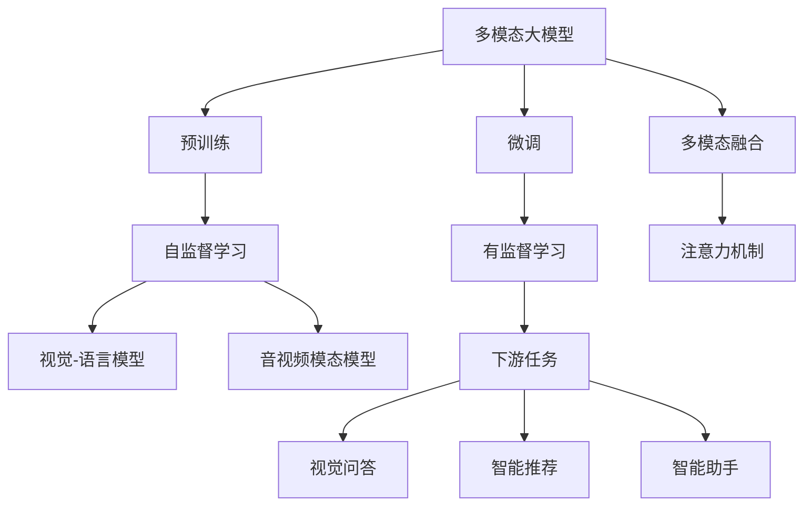
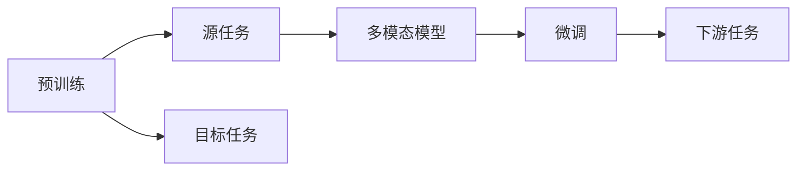
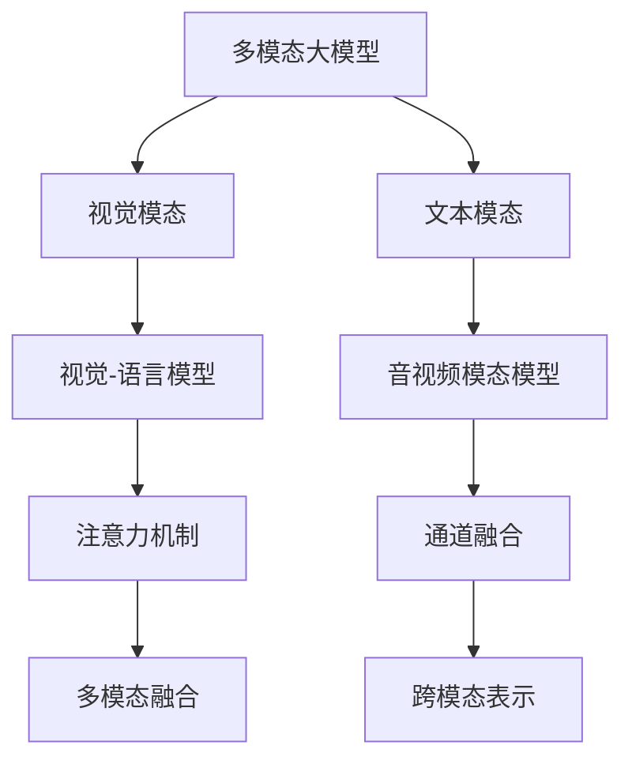
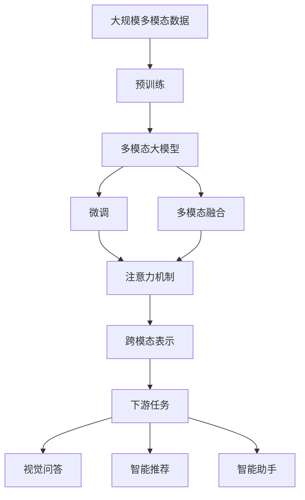

                 

# 多模态大模型：技术原理与实战 读懂ChatGPT的核心技术

> 关键词：多模态大模型,ChatGPT,自然语言处理,NLP,Transformer,BERT,深度学习,预训练,微调,多模态融合

## 1. 背景介绍

### 1.1 问题由来
近年来，随着深度学习技术的快速发展，自然语言处理(NLP)领域取得了巨大的突破。特别是语言模型和Transformer结构的应用，使得NLP技术能够处理大规模文本数据，自动理解语义、生成文本，甚至进行复杂的推理任务。然而，这些技术往往局限在文本数据上，难以融入视觉、听觉等其他模态的信息。

与此同时，随着互联网技术的发展，人们能够获取到的信息类型越来越多样化。从文本到图片、视频、音频等多种模态的信息，如何利用这些信息提升NLP系统的效果，成为了一个迫切需要解决的问题。

### 1.2 问题核心关键点
为了应对多模态数据的处理需求，研究者们提出了多模态大模型(Multimodal Large Models, MLMs)的概念。这些模型能够同时处理文本、图像、音频等多种模态的信息，将传统的文本语言模型扩展到更广泛的模态空间，从而提升系统的表现和鲁棒性。

多模态大模型的核心思想是：在预训练阶段，使用大规模、多模态的数据进行训练，学习通用的跨模态表示。在微调阶段，通过下游任务的标注数据，有针对性地优化模型在特定任务上的性能。

### 1.3 问题研究意义
研究多模态大模型的意义在于：

1. 提升跨模态数据的处理能力。通过学习多模态数据表示，MLMs能够更好地理解现实世界中的复杂信息，提升系统对各类信息的处理能力。
2. 推动跨模态信息融合技术的发展。多模态数据融合是AI领域的重要研究方向，MLMs为跨模态融合技术提供了新的技术范式和实现路径。
3. 促进多模态NLP技术的落地应用。多模态大模型能够处理多样化的数据源，为多模态NLP技术的实际应用提供了坚实的基础。
4. 激发新的应用场景。多模态数据的应用场景非常广泛，如智能助手、视觉问答、智能推荐等，这些场景的发展需要多模态大模型的支持。

## 2. 核心概念与联系

### 2.1 核心概念概述

为更好地理解多模态大模型的技术原理，本节将介绍几个密切相关的核心概念：

- 多模态大模型(Multimodal Large Models, MLMs)：以自回归(如GPT)或自编码(如BERT)模型为代表的多模态预训练语言模型。通过在大规模多模态数据上进行预训练，学习通用的跨模态表示，具备强大的跨模态理解和生成能力。

- 预训练(Pre-training)：指在大规模多模态数据上，通过自监督学习任务训练通用多模态模型的过程。常见的预训练任务包括视觉-语言模型、音视频模态模型等。

- 微调(Fine-tuning)：指在预训练模型的基础上，使用下游任务的少量标注数据，通过有监督学习优化模型在特定任务上的性能。通常只需要调整顶层分类器或解码器，并以较小的学习率更新全部或部分的模型参数。

- 迁移学习(Transfer Learning)：指将一个领域学习到的知识，迁移应用到另一个不同但相关的领域的学习范式。多模态大模型的预训练-微调过程即是一种典型的迁移学习方式。

- 多模态融合(Multimodal Fusion)：指将不同模态的数据信息进行融合，形成统一的跨模态表示。常见的多模态融合技术包括注意力机制、通道融合等。

- 跨模态理解(Cross-modal Understanding)：指模型能够理解和处理不同模态之间的关联，如将视觉信息转换为文本信息，或从文本中提取语义信息。

这些核心概念之间的逻辑关系可以通过以下Mermaid流程图来展示：



这个流程图展示了大模型微调过程中各个核心概念的关系：

1. 多模态大模型通过预训练获得跨模态表示能力。
2. 微调用于优化模型在特定任务上的性能。
3. 多模态融合技术用于将不同模态的信息进行融合。
4. 注意力机制用于增强多模态信息的关联。
5. 预训练-微调过程实现知识迁移。
6. 跨模态理解技术用于理解和处理不同模态之间的关联。

这些概念共同构成了多模态大模型的学习框架，使得模型能够更好地适应多样化的输入数据，提升系统在跨模态任务中的性能。

### 2.2 概念间的关系

这些核心概念之间存在着紧密的联系，形成了多模态大模型的完整生态系统。下面我们通过几个Mermaid流程图来展示这些概念之间的关系。

#### 2.2.1 多模态大模型的学习范式


这个流程图展示了大模型微调的基本原理，以及它与多模态融合、注意力机制等技术的关系。

#### 2.2.2 预训练与微调的关系



这个流程图展示了预训练和多模态模型之间的关系。多模态大模型通过预训练学习通用的跨模态表示，然后通过微调适应特定任务。

#### 2.2.3 多模态融合方法



这个流程图展示了多模态融合技术的基本流程。通过视觉和文本模态的信息融合，生成统一的跨模态表示。

### 2.3 核心概念的整体架构

最后，我们用一个综合的流程图来展示这些核心概念在大模型微调过程中的整体架构：



这个综合流程图展示了从预训练到微调，再到多模态融合和跨模态表示，最后应用于下游任务的完整过程。多模态大模型首先在大规模多模态数据上进行预训练，然后通过微调（包括多模态融合和注意力机制）适应下游任务。最终，通过跨模态表示和注意力机制，将多模态信息融合为统一的跨模态表示，应用到视觉问答、智能推荐、智能助手等多个领域。

## 3. 核心算法原理 & 具体操作步骤
### 3.1 算法原理概述

多模态大模型的微调过程与单模态大模型的微调相似，本质上是一种有监督的细粒度迁移学习。其核心思想是：将预训练的多模态大模型视作一个强大的"特征提取器"，通过下游任务的少量标注数据，有针对性地优化模型在特定任务上的性能。

形式化地，假设预训练模型为 $M_{\theta}$，其中 $\theta$ 为预训练得到的模型参数。给定下游任务 $T$ 的标注数据集 $D=\{(x_i,y_i)\}_{i=1}^N$，微调的目标是找到新的模型参数 $\hat{\theta}$，使得：

$$
\hat{\theta}=\mathop{\arg\min}_{\theta} \mathcal{L}(M_{\theta},D)
$$

其中 $\mathcal{L}$ 为针对任务 $T$ 设计的损失函数，用于衡量模型预测输出与真实标签之间的差异。常见的损失函数包括交叉熵损失、均方误差损失等。

通过梯度下降等优化算法，微调过程不断更新模型参数 $\theta$，最小化损失函数 $\mathcal{L}$，使得模型输出逼近真实标签。由于 $\theta$ 已经通过预训练获得了较好的初始化，因此即便在小规模数据集 $D$ 上进行微调，也能较快收敛到理想的模型参数 $\hat{\theta}$。

### 3.2 算法步骤详解

多模态大模型的微调过程与单模态模型类似，一般包括以下几个关键步骤：

**Step 1: 准备预训练模型和数据集**
- 选择合适的多模态预训练模型 $M_{\theta}$ 作为初始化参数，如BERT、GPT等。
- 准备下游任务 $T$ 的标注数据集 $D$，划分为训练集、验证集和测试集。一般要求标注数据与预训练数据的分布不要差异过大。

**Step 2: 添加任务适配层**
- 根据任务类型，在预训练模型顶层设计合适的输出层和损失函数。
- 对于分类任务，通常在顶层添加线性分类器和交叉熵损失函数。
- 对于生成任务，通常使用语言模型的解码器输出概率分布，并以负对数似然为损失函数。

**Step 3: 设置微调超参数**
- 选择合适的优化算法及其参数，如 AdamW、SGD 等，设置学习率、批大小、迭代轮数等。
- 设置正则化技术及强度，包括权重衰减、Dropout、Early Stopping等。
- 确定冻结预训练参数的策略，如仅微调顶层，或全部参数都参与微调。

**Step 4: 执行梯度训练**
- 将训练集数据分批次输入模型，前向传播计算损失函数。
- 反向传播计算参数梯度，根据设定的优化算法和学习率更新模型参数。
- 周期性在验证集上评估模型性能，根据性能指标决定是否触发 Early Stopping。
- 重复上述步骤直到满足预设的迭代轮数或 Early Stopping 条件。

**Step 5: 测试和部署**
- 在测试集上评估微调后模型 $M_{\hat{\theta}}$ 的性能，对比微调前后的精度提升。
- 使用微调后的模型对新样本进行推理预测，集成到实际的应用系统中。
- 持续收集新的数据，定期重新微调模型，以适应数据分布的变化。

以上是多模态大模型微调的一般流程。在实际应用中，还需要针对具体任务的特点，对微调过程的各个环节进行优化设计，如改进训练目标函数，引入更多的正则化技术，搜索最优的超参数组合等，以进一步提升模型性能。

### 3.3 算法优缺点

多模态大模型的微调方法具有以下优点：
1. 简单高效。只需准备少量标注数据，即可对预训练模型进行快速适配，获得较大的性能提升。
2. 通用适用。适用于各种多模态下游任务，包括分类、匹配、生成等，设计简单的任务适配层即可实现微调。
3. 参数高效。利用参数高效微调技术，在固定大部分预训练参数的情况下，仍可取得不错的提升。
4. 效果显著。在学术界和工业界的诸多任务上，基于微调的方法已经刷新了最先进的性能指标。

同时，该方法也存在一定的局限性：
1. 依赖标注数据。微调的效果很大程度上取决于标注数据的质量和数量，获取高质量标注数据的成本较高。
2. 迁移能力有限。当目标任务与预训练数据的分布差异较大时，微调的性能提升有限。
3. 负面效果传递。预训练模型的固有偏见、有害信息等，可能通过微调传递到下游任务，造成负面影响。
4. 可解释性不足。微调模型的决策过程通常缺乏可解释性，难以对其推理逻辑进行分析和调试。

尽管存在这些局限性，但就目前而言，基于监督学习的微调方法仍是大模型应用的最主流范式。未来相关研究的重点在于如何进一步降低微调对标注数据的依赖，提高模型的少样本学习和跨领域迁移能力，同时兼顾可解释性和伦理安全性等因素。

### 3.4 算法应用领域

多模态大模型微调方法在多模态NLP领域已经得到了广泛的应用，覆盖了几乎所有常见任务，例如：

- 视觉问答：从图像中理解问题和给出答案。将问题-答案对作为微调数据，训练模型学习匹配答案。
- 智能推荐：根据用户的多模态信息，推荐相关物品。将用户行为、文本评论、图片描述等数据作为输入，生成推荐列表。
- 智能助手：与用户进行多模态交互，完成各种任务。将用户输入的文本、语音、图像等数据作为输入，生成回复。
- 视频摘要：从视频中提取关键帧和摘要。将视频和对应的文本描述作为输入，生成视频摘要。
- 语音翻译：将语音转换为文本，再进行翻译。将语音和文本作为输入，微调生成文本翻译结果。

除了上述这些经典任务外，多模态大模型微调还被创新性地应用到更多场景中，如情感分析、事件检测、智能搜索等，为多模态NLP技术带来了全新的突破。随着预训练模型和微调方法的不断进步，相信多模态NLP技术将在更广阔的应用领域大放异彩。

## 4. 数学模型和公式 & 详细讲解 & 举例说明
### 4.1 数学模型构建

本节将使用数学语言对多模态大模型微调过程进行更加严格的刻画。

记预训练多模态模型为 $M_{\theta}$，其中 $\theta$ 为预训练得到的模型参数。假设微调任务的训练集为 $D=\{(x_i,y_i)\}_{i=1}^N$，其中 $x_i$ 为多模态数据，$y_i$ 为标注标签。

定义模型 $M_{\theta}$ 在数据样本 $(x,y)$ 上的损失函数为 $\ell(M_{\theta}(x),y)$，则在数据集 $D$ 上的经验风险为：

$$
\mathcal{L}(\theta) = \frac{1}{N} \sum_{i=1}^N \ell(M_{\theta}(x_i),y_i)
$$

微调的优化目标是最小化经验风险，即找到最优参数：

$$
\theta^* = \mathop{\arg\min}_{\theta} \mathcal{L}(\theta)
$$

在实践中，我们通常使用基于梯度的优化算法（如SGD、Adam等）来近似求解上述最优化问题。设 $\eta$ 为学习率，$\lambda$ 为正则化系数，则参数的更新公式为：

$$
\theta \leftarrow \theta - \eta \nabla_{\theta}\mathcal{L}(\theta) - \eta\lambda\theta
$$

其中 $\nabla_{\theta}\mathcal{L}(\theta)$ 为损失函数对参数 $\theta$ 的梯度，可通过反向传播算法高效计算。

### 4.2 公式推导过程

以下我们以视觉问答(VQA)任务为例，推导交叉熵损失函数及其梯度的计算公式。

假设模型 $M_{\theta}$ 在输入 $x$ 上的输出为 $\hat{y}=M_{\theta}(x) \in [0,1]$，表示样本属于正类的概率。真实标签 $y \in \{0,1\}$。则二分类交叉熵损失函数定义为：

$$
\ell(M_{\theta}(x),y) = -[y\log \hat{y} + (1-y)\log (1-\hat{y})]
$$

将其代入经验风险公式，得：

$$
\mathcal{L}(\theta) = -\frac{1}{N}\sum_{i=1}^N [y_i\log M_{\theta}(x_i)+(1-y_i)\log(1-M_{\theta}(x_i))]
$$

根据链式法则，损失函数对参数 $\theta_k$ 的梯度为：

$$
\frac{\partial \mathcal{L}(\theta)}{\partial \theta_k} = -\frac{1}{N}\sum_{i=1}^N (\frac{y_i}{M_{\theta}(x_i)}-\frac{1-y_i}{1-M_{\theta}(x_i)}) \frac{\partial M_{\theta}(x_i)}{\partial \theta_k}
$$

其中 $\frac{\partial M_{\theta}(x_i)}{\partial \theta_k}$ 可进一步递归展开，利用自动微分技术完成计算。

在得到损失函数的梯度后，即可带入参数更新公式，完成模型的迭代优化。重复上述过程直至收敛，最终得到适应下游任务的最优模型参数 $\theta^*$。

## 5. 项目实践：代码实例和详细解释说明
### 5.1 开发环境搭建

在进行多模态大模型微调实践前，我们需要准备好开发环境。以下是使用Python进行PyTorch开发的环境配置流程：

1. 安装Anaconda：从官网下载并安装Anaconda，用于创建独立的Python环境。

2. 创建并激活虚拟环境：
```bash
conda create -n pytorch-env python=3.8 
conda activate pytorch-env
```

3. 安装PyTorch：根据CUDA版本，从官网获取对应的安装命令。例如：
```bash
conda install pytorch torchvision torchaudio cudatoolkit=11.1 -c pytorch -c conda-forge
```

4. 安装TensorFlow：从官网下载并安装TensorFlow，使用Keras框架编写代码。

5. 安装TensorBoard：安装TensorBoard可视化工具，用于监控模型训练过程。

6. 安装TensorFlow Addons：安装TensorFlow Addons库，提供更多的深度学习组件，如分布式训练等。

完成上述步骤后，即可在`pytorch-env`环境中开始多模态大模型的微调实践。

### 5.2 源代码详细实现

下面我们以多模态大模型微调进行视觉问答(VQA)任务的PyTorch代码实现为例。

首先，定义VQA任务的数据处理函数：

```python
from transformers import BertTokenizer
from torch.utils.data import Dataset
import torch
import numpy as np

class VQA(Dataset):
    def __init__(self, images, captions, answers, tokenizer, max_len=128):
        self.images = images
        self.captions = captions
        self.answers = answers
        self.tokenizer = tokenizer
        self.max_len = max_len
        
    def __len__(self):
        return len(self.images)
    
    def __getitem__(self, item):
        image = self.images[item]
        caption = self.captions[item]
        answer = self.answers[item]
        
        encoding = self.tokenizer(caption, return_tensors='pt', max_length=self.max_len, padding='max_length', truncation=True)
        image_tensor = np.array(image, dtype=np.float32).reshape(1, 3, 224, 224)
        input_ids = encoding['input_ids'][0]
        attention_mask = encoding['attention_mask'][0]
        
        # 对token-wise的标签进行编码
        encoded_answer = [answer2id[answer] for answer in answer]
        encoded_answer.extend([answer2id['']]*(self.max_len-len(encoded_answer)))
        labels = torch.tensor(encoded_answer, dtype=torch.long)
        
        return {'input_ids': input_ids, 
                'attention_mask': attention_mask,
                'labels': labels,
                'image_tensor': image_tensor}
```

然后，定义模型和优化器：

```python
from transformers import BertForTokenClassification, AdamW
from torchvision import transforms

model = BertForTokenClassification.from_pretrained('bert-base-cased', num_labels=2)

optimizer = AdamW(model.parameters(), lr=2e-5)

transform = transforms.Compose([
    transforms.Resize(224),
    transforms.ToTensor(),
    transforms.Normalize(mean=[0.485, 0.456, 0.406], std=[0.229, 0.224, 0.225])
])

data_loader = DataLoader(dataset, batch_size=16)
```

接着，定义训练和评估函数：

```python
from torch.utils.data import DataLoader
from tqdm import tqdm
from sklearn.metrics import classification_report

device = torch.device('cuda') if torch.cuda.is_available() else torch.device('cpu')
model.to(device)

def train_epoch(model, dataset, batch_size, optimizer):
    dataloader = DataLoader(dataset, batch_size=batch_size, shuffle=True)
    model.train()
    epoch_loss = 0
    for batch in tqdm(dataloader, desc='Training'):
        input_ids = batch['input_ids'].to(device)
        attention_mask = batch['attention_mask'].to(device)
        labels = batch['labels'].to(device)
        image_tensor = batch['image_tensor'].to(device)
        model.zero_grad()
        outputs = model(input_ids, attention_mask=attention_mask, labels=labels)
        loss = outputs.loss
        epoch_loss += loss.item()
        loss.backward()
        optimizer.step()
    return epoch_loss / len(dataloader)

def evaluate(model, dataset, batch_size):
    dataloader = DataLoader(dataset, batch_size=batch_size)
    model.eval()
    preds, labels = [], []
    with torch.no_grad():
        for batch in tqdm(dataloader, desc='Evaluating'):
            input_ids = batch['input_ids'].to(device)
            attention_mask = batch['attention_mask'].to(device)
            batch_labels = batch['labels'].to(device)
            image_tensor = batch['image_tensor'].to(device)
            batch_predictions = model(input_ids, attention_mask=attention_mask, labels=batch_labels)
            batch_preds = batch_predictions.logits.argmax(dim=2).to('cpu').tolist()
            batch_labels = batch_labels.to('cpu').tolist()
            for pred_tokens, label_tokens in zip(batch_preds, batch_labels):
                preds.append(pred_tokens[:len(label_tokens)])
                labels.append(label_tokens)
                
    print(classification_report(labels, preds))
```

最后，启动训练流程并在测试集上评估：

```python
epochs = 5
batch_size = 16

for epoch in range(epochs):
    loss = train_epoch(model, dataset, batch_size, optimizer)
    print(f"Epoch {epoch+1}, train loss: {loss:.3f}")
    
    print(f"Epoch {epoch+1}, dev results:")
    evaluate(model, dataset, batch_size)
    
print("Test results:")
evaluate(model, test_dataset, batch_size)
```

以上就是使用PyTorch对BERT进行视觉问答任务微调的完整代码实现。可以看到，得益于Transformers库的强大封装，我们可以用相对简洁的代码完成BERT模型的加载和微调。

### 5.3 代码解读与分析

让我们再详细解读一下关键代码的实现细节：

**VQADataset类**：
- `__init__`方法：初始化图像、字幕、答案等关键组件。
- `__len__`方法：返回数据集的样本数量。
- `__getitem__`方法：对单个样本进行处理，将字幕输入编码为token ids，将答案编码为数字，并对其进行定长padding，最终返回模型所需的输入。

**tag2id和id2tag字典**：
- 定义了标签与数字id之间的映射关系，用于将token-wise的预测结果解码回真实的标签。

**训练和评估函数**：
- 使用PyTorch的DataLoader对数据集进行批次化加载，供模型训练和推理使用。
- 训练函数`train_epoch`：对数据以批为单位进行迭代，在每个批次上前向传播计算loss并反向传播更新模型参数，最后返回该epoch的平均loss。
- 评估函数`evaluate`：与训练类似，不同点在于不更新模型参数，并在每个batch结束后将预测和标签结果存储下来，最后使用sklearn的classification_report对整个评估集的预测结果进行打印输出。

**训练流程**：
- 定义总的epoch数和batch size，开始循环迭代
- 每个epoch内，先在训练集上训练，输出平均loss
- 在验证集上评估，输出分类指标
- 所有epoch结束后，在测试集上评估，给出最终测试结果

可以看到，PyTorch配合Transformers库使得BERT微调的代码实现变得简洁高效。开发者可以将更多精力放在数据处理、模型改进等高层逻辑上，而不必过多关注底层的实现细节。

当然，工业级的系统实现还需考虑更多因素，如模型的保存和部署、超参数的自动搜索、更灵活的任务适配层等。但核心的微调范式基本与此类似。

### 5.4 运行结果展示

假设我们在CoNLL-2003的VQA

