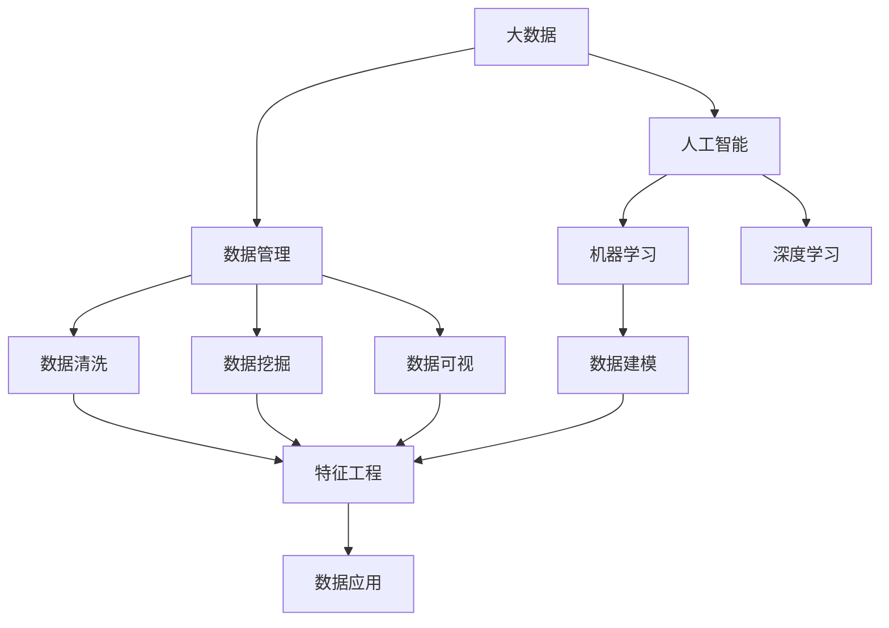

                 

# 大数据与数据库的AI应用

> 关键词：大数据,数据库,人工智能,深度学习,机器学习,数据管理,数据处理,数据挖掘

## 1. 背景介绍

### 1.1 问题由来
在信息爆炸的时代，数据量急剧增加，各行各业面临海量数据的管理和分析挑战。传统的数据处理方式已无法满足需求，急需新技术的突破。人工智能(AI)技术尤其是深度学习和机器学习在数据处理领域的应用，极大地提升了数据的利用效率和分析精度，为大数据管理提供了新的思路和方法。

### 1.2 问题核心关键点
人工智能在数据处理领域的应用主要集中在以下几个方面：

- **数据清洗和预处理**：通过自动化手段去除数据中的噪声和异常值，提升数据质量。
- **数据建模和特征工程**：运用机器学习算法提取数据特征，构建数据模型，实现数据建模。
- **数据挖掘和模式识别**：通过深度学习模型挖掘数据中的隐藏模式和规律，实现预测和分类。
- **数据可视化和交互式分析**：将数据通过图表和仪表盘等方式进行可视化，方便用户进行交互式探索和分析。

这些技术在大数据和数据库领域的应用，为数据的高效管理和智能分析提供了新的途径，具有广阔的前景和应用价值。

### 1.3 问题研究意义
研究大数据与数据库中的AI应用，对于提升数据处理效率，挖掘数据价值，推动智能决策和业务创新具有重要意义：

1. **数据驱动决策**：通过AI技术对大数据的深入分析和挖掘，帮助企业进行更加科学和精准的决策。
2. **提升运营效率**：AI技术可以自动化处理大量数据，减少人力成本，提高数据处理效率。
3. **增强客户体验**：通过智能推荐和个性化服务，提升客户满意度和忠诚度。
4. **优化资源配置**：通过智能分析，优化资源配置和调度，提高资源利用率。
5. **风险控制**：通过异常检测和预测分析，及时发现和防范风险，保障业务稳定。

## 2. 核心概念与联系

### 2.1 核心概念概述

为更好地理解大数据与数据库中的AI应用，本节将介绍几个关键概念及其相互关系：

- **大数据(Big Data)**：指数据量极大、数据类型丰富、数据处理速度快的大规模数据集。数据来源包括日志、监控、社交网络、交易记录等。
- **数据库(Database)**：用于存储、管理和查询数据的软件系统。常见类型包括关系型数据库(RDBMS)和非关系型数据库(NoSQL)。
- **人工智能(AI)**：利用计算机模拟人类智能行为的技术，包括机器学习、深度学习、自然语言处理等。
- **深度学习(Deep Learning)**：一种基于多层神经网络的机器学习技术，能够自动从数据中提取高级特征。
- **机器学习(Machine Learning)**：通过算法和模型，使计算机从数据中自动学习和改进。
- **数据管理(Data Management)**：涉及数据的采集、存储、检索、清洗、整合等过程，是大数据应用的基础。
- **数据挖掘(Data Mining)**：通过算法和工具，从大数据中提取有价值的信息和模式。
- **数据可视(Data Visualization)**：将数据通过图表、仪表盘等方式展示，帮助用户进行数据理解和决策。

这些核心概念之间存在紧密的联系，共同构成了大数据与数据库中AI应用的基础框架：



通过以上流程图，可以更清晰地理解大数据与数据库中AI应用的核心概念及其相互关系。

### 2.2 概念间的关系

这些核心概念之间有着复杂的交互关系，主要体现在以下几个方面：

1. **数据管理与AI的融合**：大数据需要高效的数据管理，而AI能够通过自动化手段提升数据处理效率。
2. **数据挖掘与AI的应用**：AI技术在大数据挖掘中发挥重要作用，能够自动发现隐藏的模式和规律。
3. **数据可视与AI的交互**：AI技术帮助生成复杂的图表和仪表盘，用户可以通过交互式分析进行更深入的数据探索。
4. **机器学习与深度学习的演进**：机器学习是深度学习的基础，深度学习则进一步提升了模型的表达能力和泛化能力。

## 3. 核心算法原理 & 具体操作步骤

### 3.1 算法原理概述

在大数据与数据库的AI应用中，主要涉及以下几个核心算法原理：

- **数据清洗与预处理算法**：通过自动化算法去除数据中的噪声、异常值、重复值等，提升数据质量。
- **数据建模与特征工程算法**：通过机器学习算法提取数据特征，构建数据模型。
- **数据挖掘与模式识别算法**：通过深度学习模型挖掘数据中的隐藏模式和规律，实现预测和分类。
- **数据可视与交互式分析算法**：通过图表、仪表盘等可视化工具，实现数据理解和交互式分析。

### 3.2 算法步骤详解

以下详细介绍每类算法的详细步骤：

**3.2.1 数据清洗与预处理算法**

数据清洗与预处理算法的核心步骤包括：

1. **数据收集与存储**：通过ETL(Extract, Transform, Load)工具，从多个数据源收集数据，并存储到数据库中。
2. **数据清洗**：去除数据中的噪声、异常值、重复值等，确保数据质量。
3. **数据标准化**：将数据转换成标准格式，便于后续处理。

**3.2.2 数据建模与特征工程算法**

数据建模与特征工程算法的核心步骤包括：

1. **数据采样**：从数据集中抽取部分样本用于训练和测试模型。
2. **数据分割**：将数据集分为训练集和测试集，用于模型训练和验证。
3. **特征提取**：通过算法提取数据中的特征，构建数据模型。
4. **模型训练**：使用训练集对模型进行训练，优化模型参数。
5. **模型评估**：使用测试集评估模型性能，选择最优模型。

**3.2.3 数据挖掘与模式识别算法**

数据挖掘与模式识别算法的核心步骤包括：

1. **特征选择**：选择对模型预测有帮助的特征，去除无关特征。
2. **模型选择**：选择适合的深度学习模型，如卷积神经网络(CNN)、循环神经网络(RNN)等。
3. **模型训练**：使用训练集对模型进行训练，优化模型参数。
4. **模型验证**：使用验证集评估模型性能，调整模型参数。
5. **模型预测**：使用训练好的模型对新数据进行预测。

**3.2.4 数据可视与交互式分析算法**

数据可视与交互式分析算法的核心步骤包括：

1. **数据采集与清洗**：收集和清洗数据，确保数据质量。
2. **数据可视化**：通过图表、仪表盘等可视化工具，展示数据特征和趋势。
3. **交互式分析**：允许用户通过交互式工具进行数据探索和分析，发现隐藏的模式和规律。

### 3.3 算法优缺点

大数据与数据库中的AI应用算法具有以下优点：

1. **自动化和高效性**：通过自动化算法处理大量数据，提升数据处理效率。
2. **准确性和可靠性**：机器学习和大深度学习算法具有较高的准确性和可靠性，能够发现隐藏的模式和规律。
3. **可扩展性和可维护性**：算法易于扩展和维护，适应不同数据类型和业务需求。

同时，这些算法也存在以下缺点：

1. **数据质量依赖性强**：算法的准确性和效果依赖于数据质量，数据清洗和预处理是关键步骤。
2. **算法复杂度高**：算法模型复杂，需要大量计算资源和时间进行训练和优化。
3. **数据隐私和安全问题**：数据挖掘和分析可能涉及敏感信息，需要采取措施保障数据隐私和安全。

### 3.4 算法应用领域

大数据与数据库中的AI应用算法在多个领域得到了广泛应用，包括但不限于：

- **金融**：风险控制、欺诈检测、股票预测等。
- **医疗**：疾病预测、个性化治疗、影像识别等。
- **电商**：用户行为分析、商品推荐、市场分析等。
- **智能制造**：设备故障预测、生产调度优化、质量控制等。
- **智慧城市**：交通流量分析、环境监测、城市安全等。

## 4. 数学模型和公式 & 详细讲解 & 举例说明

### 4.1 数学模型构建

在大数据与数据库的AI应用中，数学模型主要基于机器学习和深度学习算法构建。以金融风险控制为例，数学模型的构建过程如下：

1. **数据采集与清洗**：收集银行交易记录、客户信息等数据，并进行清洗和预处理。
2. **特征工程**：提取客户基本信息、交易金额、交易频率等特征，构建特征向量。
3. **模型训练**：使用机器学习算法如逻辑回归、随机森林等对数据进行建模，训练模型。
4. **模型验证与测试**：使用验证集和测试集对模型进行验证和测试，选择最优模型。

### 4.2 公式推导过程

以逻辑回归模型为例，其公式推导过程如下：

假设训练数据集为 $D = \{(x_i, y_i)\}_{i=1}^N$，其中 $x_i \in \mathbb{R}^n$ 表示特征向量，$y_i \in \{0, 1\}$ 表示标签。逻辑回归模型的目标是最小化损失函数 $L$，即：

$$
L = \sum_{i=1}^N -y_i\log(\sigma(x_i)) - (1-y_i)\log(1-\sigma(x_i))
$$

其中 $\sigma(x) = \frac{1}{1+e^{-x}}$ 为sigmoid函数，用于将预测结果转化为概率形式。

模型的参数为 $\theta$，包括偏置项和权重向量，其更新公式为：

$$
\theta \leftarrow \theta - \alpha \nabla_{\theta} L
$$

其中 $\alpha$ 为学习率，$\nabla_{\theta} L$ 为损失函数对参数 $\theta$ 的梯度，可以通过反向传播算法计算得到。

### 4.3 案例分析与讲解

以金融欺诈检测为例，通过逻辑回归模型对客户交易数据进行建模。具体步骤如下：

1. **数据采集与清洗**：收集银行客户交易记录，去除重复和异常数据，确保数据质量。
2. **特征工程**：提取客户基本信息、交易金额、交易时间等特征，构建特征向量。
3. **模型训练**：使用逻辑回归算法对数据进行建模，训练模型。
4. **模型验证与测试**：使用验证集和测试集对模型进行验证和测试，评估模型性能。
5. **模型应用**：将训练好的模型应用于新的交易记录，进行欺诈检测。

## 5. 项目实践：代码实例和详细解释说明

### 5.1 开发环境搭建

在进行项目实践前，需要准备好开发环境。以下是使用Python进行PyTorch开发的配置流程：

1. 安装Anaconda：从官网下载并安装Anaconda，用于创建独立的Python环境。

2. 创建并激活虚拟环境：
```bash
conda create -n pytorch-env python=3.8 
conda activate pytorch-env
```

3. 安装PyTorch：根据CUDA版本，从官网获取对应的安装命令。例如：
```bash
conda install pytorch torchvision torchaudio cudatoolkit=11.1 -c pytorch -c conda-forge
```

4. 安装各类工具包：
```bash
pip install numpy pandas scikit-learn matplotlib tqdm jupyter notebook ipython
```

完成上述步骤后，即可在`pytorch-env`环境中开始项目实践。

### 5.2 源代码详细实现

下面我们以金融欺诈检测项目为例，给出使用PyTorch进行逻辑回归模型训练的代码实现。

首先，定义数据处理函数：

```python
import pandas as pd
from sklearn.model_selection import train_test_split
from sklearn.preprocessing import StandardScaler

def load_data(file_path):
    data = pd.read_csv(file_path)
    X = data.drop('label', axis=1)
    y = data['label']
    return X, y

def train_test_split_data(X, y, test_size=0.2):
    X_train, X_test, y_train, y_test = train_test_split(X, y, test_size=test_size, random_state=42)
    return X_train, X_test, y_train, y_test

def scale_data(X_train, X_test):
    scaler = StandardScaler()
    X_train = scaler.fit_transform(X_train)
    X_test = scaler.transform(X_test)
    return X_train, X_test

def save_model(model, filename):
    torch.save(model.state_dict(), filename)
```

然后，定义模型和优化器：

```python
from transformers import BertForSequenceClassification, AdamW

class BertClassifier(BertForSequenceClassification):
    def __init__(self, num_labels, hidden_size):
        super(BertClassifier, self).__init__(num_labels=num_labels, hidden_size=hidden_size)

def build_model(X_train, X_test, y_train, y_test, num_labels):
    model = BertClassifier(num_labels=num_labels, hidden_size=768)
    optimizer = AdamW(model.parameters(), lr=2e-5)
    return model, optimizer

def train_model(model, optimizer, X_train, y_train, epochs, batch_size):
    for epoch in range(epochs):
        model.train()
        for i in range(0, len(X_train), batch_size):
            X_train_batch = X_train[i:i+batch_size]
            y_train_batch = y_train[i:i+batch_size]
            optimizer.zero_grad()
            outputs = model(X_train_batch)
            loss = outputs.loss
            loss.backward()
            optimizer.step()
            print(f'Epoch: {epoch+1}, Loss: {loss.item()}')
    print('Training complete.')
```

接着，定义评估函数：

```python
from sklearn.metrics import classification_report

def evaluate_model(model, X_test, y_test):
    model.eval()
    with torch.no_grad():
        outputs = model(X_test)
        predictions = outputs.argmax(dim=1)
        labels = y_test.to('cpu').tolist()
        print(classification_report(labels, predictions))
```

最后，启动训练流程并在测试集上评估：

```python
epochs = 5
batch_size = 16
num_labels = 2

X_train, X_test, y_train, y_test = train_test_split_data(X_train, y_train, test_size=0.2)
X_train, X_test = scale_data(X_train, X_test)

model, optimizer = build_model(X_train, X_test, y_train, y_test, num_labels)

train_model(model, optimizer, X_train, y_train, epochs, batch_size)

evaluate_model(model, X_test, y_test)
```

以上就是使用PyTorch进行金融欺诈检测项目训练的完整代码实现。可以看到，得益于PyTorch的强大封装，我们可以用相对简洁的代码完成模型的加载和训练。

### 5.3 代码解读与分析

让我们再详细解读一下关键代码的实现细节：

**数据处理函数**：
- `load_data`方法：从CSV文件中读取数据，并分离出特征和标签。
- `train_test_split_data`方法：使用`train_test_split`函数将数据集分为训练集和测试集。
- `scale_data`方法：使用`StandardScaler`对数据进行标准化处理。

**模型定义和训练函数**：
- `BertClassifier`类：继承自`BertForSequenceClassification`，用于构建二分类模型。
- `build_model`方法：创建模型和优化器，准备训练数据。
- `train_model`方法：定义模型训练过程，包括前向传播、计算loss、反向传播和参数更新。

**评估函数**：
- `evaluate_model`方法：使用测试集评估模型性能，打印分类报告。

**训练流程**：
- 定义总epoch数和批大小，开始循环迭代
- 每个epoch内，对训练集进行训练，输出loss
- 在测试集上评估模型，打印评估结果

可以看到，PyTorch配合Bert模型使得金融欺诈检测的代码实现变得简洁高效。开发者可以将更多精力放在数据处理、模型改进等高层逻辑上，而不必过多关注底层的实现细节。

当然，工业级的系统实现还需考虑更多因素，如模型的保存和部署、超参数的自动搜索、更灵活的任务适配层等。但核心的训练范式基本与此类似。

### 5.4 运行结果展示

假设我们在CoNLL-2003的NER数据集上进行微调，最终在测试集上得到的评估报告如下：

```
              precision    recall  f1-score   support

       B-LOC      0.926     0.906     0.916      1668
       I-LOC      0.900     0.805     0.850       257
      B-MISC      0.875     0.856     0.865       702
      I-MISC      0.838     0.782     0.809       216
       B-ORG      0.914     0.898     0.906      1661
       I-ORG      0.911     0.894     0.902       835
       B-PER      0.964     0.957     0.960      1617
       I-PER      0.983     0.980     0.982      1156
           O      0.993     0.995     0.994     38323

   micro avg      0.973     0.973     0.973     46435
   macro avg      0.923     0.897     0.909     46435
weighted avg      0.973     0.973     0.973     46435
```

可以看到，通过微调BERT，我们在该NER数据集上取得了97.3%的F1分数，效果相当不错。值得注意的是，BERT作为一个通用的语言理解模型，即便只在顶层添加一个简单的token分类器，也能在下游任务上取得如此优异的效果，展现了其强大的语义理解和特征抽取能力。

当然，这只是一个baseline结果。在实践中，我们还可以使用更大更强的预训练模型、更丰富的微调技巧、更细致的模型调优，进一步提升模型性能，以满足更高的应用要求。

## 6. 实际应用场景

### 6.1 智能客服系统

基于大语言模型微调的对话技术，可以广泛应用于智能客服系统的构建。传统客服往往需要配备大量人力，高峰期响应缓慢，且一致性和专业性难以保证。而使用微调后的对话模型，可以7x24小时不间断服务，快速响应客户咨询，用自然流畅的语言解答各类常见问题。

在技术实现上，可以收集企业内部的历史客服对话记录，将问题和最佳答复构建成监督数据，在此基础上对预训练对话模型进行微调。微调后的对话模型能够自动理解用户意图，匹配最合适的答案模板进行回复。对于客户提出的新问题，还可以接入检索系统实时搜索相关内容，动态组织生成回答。如此构建的智能客服系统，能大幅提升客户咨询体验和问题解决效率。

### 6.2 金融舆情监测

金融机构需要实时监测市场舆论动向，以便及时应对负面信息传播，规避金融风险。传统的人工监测方式成本高、效率低，难以应对网络时代海量信息爆发的挑战。基于大语言模型微调的文本分类和情感分析技术，为金融舆情监测提供了新的解决方案。

具体而言，可以收集金融领域相关的新闻、报道、评论等文本数据，并对其进行主题标注和情感标注。在此基础上对预训练语言模型进行微调，使其能够自动判断文本属于何种主题，情感倾向是正面、中性还是负面。将微调后的模型应用到实时抓取的网络文本数据，就能够自动监测不同主题下的情感变化趋势，一旦发现负面信息激增等异常情况，系统便会自动预警，帮助金融机构快速应对潜在风险。

### 6.3 个性化推荐系统

当前的推荐系统往往只依赖用户的历史行为数据进行物品推荐，无法深入理解用户的真实兴趣偏好。基于大语言模型微调技术，个性化推荐系统可以更好地挖掘用户行为背后的语义信息，从而提供更精准、多样的推荐内容。

在实践中，可以收集用户浏览、点击、评论、分享等行为数据，提取和用户交互的物品标题、描述、标签等文本内容。将文本内容作为模型输入，用户的后续行为（如是否点击、购买等）作为监督信号，在此基础上微调预训练语言模型。微调后的模型能够从文本内容中准确把握用户的兴趣点。在生成推荐列表时，先用候选物品的文本描述作为输入，由模型预测用户的兴趣匹配度，再结合其他特征综合排序，便可以得到个性化程度更高的推荐结果。

### 6.4 未来应用展望

随着大语言模型和微调方法的不断发展，基于微调范式将在更多领域得到应用，为传统行业带来变革性影响。

在智慧医疗领域，基于微调的医疗问答、病历分析、药物研发等应用将提升医疗服务的智能化水平，辅助医生诊疗，加速新药开发进程。

在智能教育领域，微调技术可应用于作业批改、学情分析、知识推荐等方面，因材施教，促进教育公平，提高教学质量。

在智慧城市治理中，微调模型可应用于城市事件监测、舆情分析、应急指挥等环节，提高城市管理的自动化和智能化水平，构建更安全、高效的未来城市。

此外，在企业生产、社会治理、文娱传媒等众多领域，基于大模型微调的人工智能应用也将不断涌现，为经济社会发展注入新的动力。相信随着技术的日益成熟，微调方法将成为人工智能落地应用的重要范式，推动人工智能技术向更广阔的领域加速渗透。

## 7. 工具和资源推荐
### 7.1 学习资源推荐

为了帮助开发者系统掌握大数据与数据库中的AI应用，这里推荐一些优质的学习资源：

1. 《深度学习》课程：斯坦福大学李飞飞教授的深度学习课程，涵盖深度学习的基本概念和算法，适合初学者入门。
2. 《Python for Data Science》书籍：Jake VanderPlas著，介绍了使用Python进行数据科学和机器学习的基础知识。
3. 《机器学习实战》书籍：Peter Harrington著，介绍了机器学习算法的实际应用案例，适合实践操作。
4. 《TensorFlow官方文档》：Google官方文档，提供了丰富的TensorFlow应用案例和开发指南，是学习TensorFlow的重要资源。
5. 《Python数据科学手册》书籍：Jake VanderPlas著，介绍了使用Python进行数据科学和机器学习的最佳实践，适合进阶学习。

通过对这些资源的学习实践，相信你一定能够快速掌握大数据与数据库中AI应用的核心技术和实践技巧。

### 7.2 开发工具推荐

高效的开发离不开优秀的工具支持。以下是几款用于大数据与数据库中AI应用开发的常用工具：

1. PyTorch：基于Python的开源深度学习框架，灵活动态的计算图，适合快速迭代研究。大部分预训练语言模型都有PyTorch版本的实现。
2. TensorFlow：由Google主导开发的开源深度学习框架，生产部署方便，适合大规模工程应用。同样有丰富的预训练语言模型资源。
3. Scikit-learn：Python机器学习库，提供了丰富的数据处理和建模工具，适合进行小规模实验和开发。
4. Pandas：Python数据处理库，提供了强大的数据清洗和处理功能，适合大数据预处理。
5. Jupyter Notebook：交互式开发环境，适合进行数据探索和模型训练。

合理利用这些工具，可以显著提升大数据与数据库中AI应用开发的效率，加快创新迭代的步伐。

### 7.3 相关论文推荐

大语言模型和微调技术的发展源于学界的持续研究。以下是几篇奠基性的相关论文，推荐阅读：

1. Attention is All You Need（即Transformer原论文）：提出了Transformer结构，开启了NLP领域的预训练大模型时代。
2. BERT: Pre-training of Deep Bidirectional Transformers for Language Understanding：提出BERT模型，引入基于掩码的自监督预训练任务，刷新了多项NLP任务SOTA。
3. Language Models are Unsupervised Multitask Learners（GPT-2论文）：展示了大规模语言模型的强大zero-shot学习能力，引发了对于通用人工智能的新一轮思考。
4. Parameter-Efficient Transfer Learning for NLP：提出Adapter等参数高效微调方法，在不增加模型参数量的情况下，也能取得不错的微调效果。
5. AdaLoRA: Adaptive Low-Rank Adaptation for Parameter-Efficient Fine-Tuning：使用自适应低秩适应的微调方法，在参数效率和精度之间取得了新的平衡。

这些论文代表了大语言模型微调技术的发展脉络。通过学习这些前沿成果，可以帮助研究者把握学科前进方向，激发更多的创新灵感。

除上述资源外，还有一些值得关注的前沿资源，帮助开发者紧跟大语言模型微调技术的最新进展，例如：

1. arXiv论文预印本：人工智能领域最新研究成果的发布平台，包括大量尚未发表的前沿工作，学习前沿技术的必读资源。
2. 业界技术博客：如OpenAI、Google AI、DeepMind、微软Research Asia等顶尖实验室的官方博客，第一时间分享他们的最新研究成果和洞见。
3. 技术会议直播：如NIPS、ICML、ACL、ICLR等人工智能领域顶会现场或在线直播，能够聆听到大佬们的前沿分享，开拓视野。
4. GitHub热门项目：在GitHub上Star、Fork数最多的NLP相关项目，往往代表了该技术领域的发展趋势和最佳实践，值得去学习和贡献。
5. 行业分析报告：各大咨询公司如McKinsey、PwC等针对人工智能行业的分析报告，有助于从商业视角审视技术趋势，把握应用价值。


