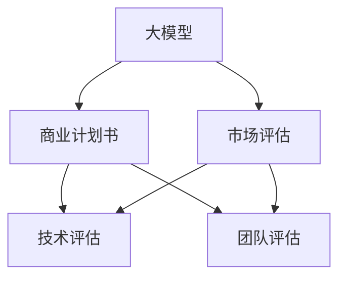
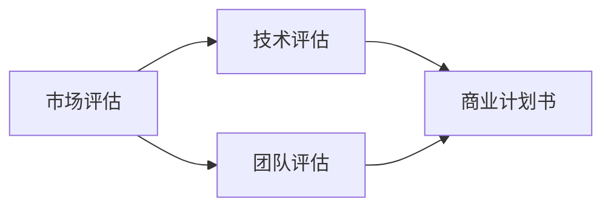
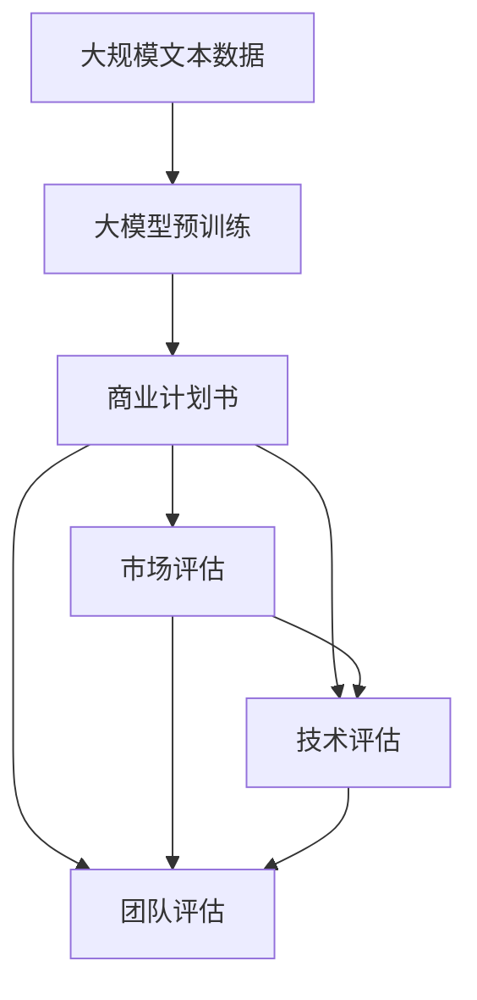

                 

# 大模型时代的创业者商业计划书评估：市场评估、技术评估与团队评估

> 关键词：大模型时代, 商业计划书评估, 市场评估, 技术评估, 团队评估, 人工智能创业

## 1. 背景介绍

### 1.1 问题由来
随着人工智能（AI）技术的发展，尤其是大模型（Large Models）的兴起，越来越多的创业公司涌现，试图在AI领域取得突破。然而，由于大模型技术的前沿性和复杂性，许多创业计划书缺乏深度，未能全面评估市场、技术和团队等方面，导致实际落地时遇到重重困难。本文旨在从市场、技术、团队三个维度，深入分析大模型时代下创业公司商业计划书的质量，提出系统化的评估方法，帮助创业公司识别风险和机会，优化创业计划书。

### 1.2 问题核心关键点
本文将聚焦于大模型时代下，创业公司商业计划书在市场、技术、团队三方面的评估方法。具体包括：
1. **市场评估**：包括市场规模、市场趋势、目标用户群体、市场竞争力等关键因素。
2. **技术评估**：包括大模型应用的技术路线、模型选择、数据集准备、训练和部署等方面。
3. **团队评估**：包括团队组成、技术能力、管理结构、市场敏锐度等关键因素。

### 1.3 问题研究意义
市场评估、技术评估和团队评估是大模型时代创业公司商业计划书的关键要素。通过系统化的评估方法，可以帮助创业者更好地理解市场机遇和挑战，优化技术路径和团队建设，从而提高项目成功率，加速AI技术的产业化进程。此外，本文的研究还有助于提升AI领域的整体技术水平，推动行业健康发展。

## 2. 核心概念与联系

### 2.1 核心概念概述

为更好地理解大模型时代下创业公司商业计划书的评估方法，本节将介绍几个核心概念：

- **大模型（Large Models）**：指以Transformer等架构为基础，通过大规模无标签数据预训练获得通用语言表示，能够处理复杂自然语言处理任务的语言模型。代表模型包括BERT、GPT-3等。
- **商业计划书（Business Plan）**：记录创业公司业务模型、市场策略、技术路线、团队构成等方面的详细计划文件。
- **市场评估（Market Assessment）**：分析目标市场的规模、趋势、用户需求等，评估创业公司的市场定位和竞争力。
- **技术评估（Technical Assessment）**：评估创业公司的技术选型、数据集准备、模型训练与部署等，确保技术路径的可行性和可靠性。
- **团队评估（Team Assessment）**：评估创业公司的团队组成、技术能力、管理结构等，确保团队能高效执行计划。

这些核心概念通过以下Mermaid流程图展示其联系：



这个流程图展示了商业计划书与大模型、市场评估、技术评估、团队评估之间的联系：

1. 大模型为商业计划书提供了技术基础。
2. 市场评估、技术评估、团队评估共同构成了商业计划书的关键组成部分。
3. 市场评估决定了商业计划书的市场定位。
4. 技术评估确保了技术可行性和可靠性。
5. 团队评估保证了计划的执行力。

### 2.2 概念间的关系

这些核心概念之间的关系可以通过以下Mermaid流程图来展示：



这个流程图展示了市场评估、技术评估、团队评估三者之间的关系：

1. 市场评估是技术评估的基础，决定了技术选型和应用场景。
2. 技术评估保证了技术方案的可行性，决定了产品的竞争力和用户体验。
3. 团队评估确保了技术方案的执行力和市场策略的落地。
4. 市场评估、技术评估、团队评估共同支撑了商业计划书的制定和实施。

### 2.3 核心概念的整体架构

最后，我们用一个综合的流程图来展示这些核心概念在大模型时代创业公司商业计划书中的整体架构：



这个综合流程图展示了从预训练到商业计划书制定的完整过程：

1. 大模型通过大规模文本数据的预训练获得基础能力。
2. 商业计划书基于大模型的技术能力，制定市场定位、技术方案和团队建设。
3. 市场评估、技术评估、团队评估共同支撑商业计划书的制定和实施。

## 3. 核心算法原理 & 具体操作步骤

### 3.1 算法原理概述

大模型时代的创业公司商业计划书评估，本质上是一个系统化的分析和优化过程。其核心算法原理包括以下几个方面：

1. **市场评估算法**：通过统计分析、趋势预测、用户调研等方法，评估市场规模、市场增长率、用户需求等关键指标。
2. **技术评估算法**：通过模型选型、数据集准备、模型训练、参数调优等步骤，评估技术方案的可行性和可靠性。
3. **团队评估算法**：通过团队组成、技术能力、管理结构等方面的分析，评估团队执行力的强弱。

### 3.2 算法步骤详解

#### 3.2.1 市场评估步骤

1. **市场规模分析**：
   - **数据收集**：从公开数据、行业报告、市场调研等渠道收集市场规模数据，如市场大小、市场增长率等。
   - **数据处理**：使用统计方法处理数据，如平均值、标准差、趋势分析等。
   - **市场趋势预测**：使用时间序列预测模型，如ARIMA、LSTM等，预测市场未来的发展趋势。

2. **目标用户群体分析**：
   - **用户细分**：根据地理位置、年龄、职业等特征，将用户分为不同细分市场。
   - **用户需求分析**：通过问卷调查、用户访谈等方式，了解不同细分市场用户的具体需求。
   - **需求匹配度评估**：评估产品功能与用户需求的匹配度，识别潜在用户。

3. **市场竞争力分析**：
   - **竞争对手分析**：识别主要竞争对手，分析其市场份额、产品特点、市场策略等。
   - **自身竞争力评估**：通过SWOT分析，评估创业公司的优势、劣势、机会和威胁。

#### 3.2.2 技术评估步骤

1. **模型选型**：
   - **模型对比**：比较不同大模型的优缺点，选择最适合应用场景的模型。
   - **模型性能评估**：通过对比测试，评估模型在不同任务上的表现，如准确率、召回率、F1分数等。

2. **数据集准备**：
   - **数据收集**：根据任务需求，收集和标注相关的数据集。
   - **数据预处理**：进行数据清洗、归一化、特征工程等预处理操作，确保数据质量。
   - **数据扩充**：通过数据增强技术，如回译、近义替换等，扩充训练集。

3. **模型训练与调优**：
   - **模型训练**：使用优化器（如Adam、SGD等）训练模型，调整超参数，如学习率、批大小等。
   - **模型调优**：通过正则化、Dropout、Early Stopping等技术，防止过拟合，优化模型性能。

#### 3.2.3 团队评估步骤

1. **团队组成分析**：
   - **成员背景分析**：分析团队成员的教育背景、工作经历、技术专长等。
   - **角色分工**：评估团队成员的角色分工是否合理，是否形成互补。

2. **技术能力评估**：
   - **技术水平**：评估团队成员的技术水平，如编程能力、算法理解等。
   - **技术积累**：评估团队成员在相关技术领域的经验和积累。

3. **管理结构评估**：
   - **管理制度**：评估公司的管理制度是否完善，是否有明确的职责分工和决策机制。
   - **团队文化**：评估公司的团队文化是否开放，是否有良好的沟通和协作机制。

### 3.3 算法优缺点

#### 3.3.1 优点

1. **全面性**：系统化的评估方法覆盖市场、技术、团队三个关键维度，确保全面分析。
2. **可操作性**：评估步骤详细，每个步骤都有具体的指导方法和工具，便于操作实施。
3. **科学性**：基于统计学和机器学习等科学方法，评估结果具有较高的准确性和可信度。

#### 3.3.2 缺点

1. **数据依赖**：市场评估和团队评估依赖大量数据和调研，数据质量直接影响评估结果。
2. **复杂度**：技术评估涉及模型选型、数据准备、模型训练等复杂步骤，需要较高技术水平。
3. **主观性**：某些评估步骤（如团队评估）具有一定主观性，需要评估者具有较高的专业水平。

### 3.4 算法应用领域

大模型时代下创业公司商业计划书的市场评估、技术评估和团队评估，广泛应用于以下领域：

1. **自然语言处理（NLP）**：如文本分类、情感分析、机器翻译等。
2. **计算机视觉（CV）**：如图像识别、目标检测、图像生成等。
3. **语音识别与生成**：如语音转文本、文本转语音、语音情感识别等。
4. **推荐系统**：如电商推荐、内容推荐、广告推荐等。
5. **智能客服**：如聊天机器人、智能问答系统等。
6. **智能家居**：如智能语音助手、智能家居控制等。
7. **智能医疗**：如医疗影像分析、智能诊断等。

## 4. 数学模型和公式 & 详细讲解 & 举例说明

### 4.1 数学模型构建

在大模型时代，创业公司商业计划书的评估涉及多个复杂的数学模型。以下是几个关键数学模型的构建和解释：

#### 4.1.1 市场规模模型

市场规模模型基于时间序列数据，通过统计分析和预测模型，评估市场的未来发展趋势。例如，使用ARIMA模型进行市场规模预测：

$$
Y_t = c + \sum_{i=1}^{p} \alpha_i Y_{t-i} + \sum_{j=1}^{q} \beta_j \epsilon_{t-j}
$$

其中，$Y_t$表示第$t$年的市场规模，$c$是截距，$\alpha_i$和$\beta_j$是模型系数，$\epsilon_t$是误差项。

#### 4.1.2 模型性能评估模型

模型性能评估模型通过比较不同模型的表现，评估其在特定任务上的性能。例如，使用准确率（Accuracy）和召回率（Recall）评估分类模型性能：

$$
\text{Accuracy} = \frac{TP+TN}{TP+TN+FP+FN}
$$

$$
\text{Recall} = \frac{TP}{TP+FN}
$$

其中，$TP$、$TN$、$FP$、$FN$分别是真阳性、真阴性、假阳性和假阴性。

#### 4.1.3 技术能力评估模型

技术能力评估模型通过技术水平、技术积累等指标，评估团队的技术能力。例如，使用专家评分法评估团队成员的技术能力：

$$
\text{技术能力得分} = \sum_{i=1}^{n} \text{专家评分}_i
$$

其中，$n$是专家数量，$\text{专家评分}_i$是每位专家的评分。

### 4.2 公式推导过程

以下是几个关键公式的推导过程：

#### 4.2.1 ARIMA模型

ARIMA模型（自回归积分滑动平均模型）用于时间序列预测，推导过程如下：

$$
\begin{align*}
Y_t &= c + \sum_{i=1}^{p} \alpha_i Y_{t-i} + \sum_{j=1}^{q} \beta_j \epsilon_{t-j} \\
\epsilon_t &= Y_t - (c + \sum_{i=1}^{p} \alpha_i Y_{t-i} - \sum_{j=1}^{q} \beta_j \epsilon_{t-j})
\end{align*}
$$

#### 4.2.2 准确率和召回率

准确率和召回率是评估分类模型性能的常用指标，推导过程如下：

$$
\begin{align*}
\text{Accuracy} &= \frac{TP+TN}{TP+TN+FP+FN} \\
\text{Recall} &= \frac{TP}{TP+FN}
\end{align*}
$$

#### 4.2.3 技术能力评估模型

技术能力评估模型使用专家评分法，推导过程如下：

$$
\text{技术能力得分} = \sum_{i=1}^{n} \text{专家评分}_i
$$

### 4.3 案例分析与讲解

以一个创业公司的商业计划书为例，展示市场评估、技术评估和团队评估的实施过程：

1. **市场评估案例**：
   - **数据收集**：从行业报告中收集过去五年的市场规模数据。
   - **数据处理**：使用ARIMA模型对数据进行拟合，预测未来五年市场规模。
   - **市场趋势预测**：发现市场规模呈现逐年增长的趋势，预测未来五年增长率在5%~10%之间。

2. **技术评估案例**：
   - **模型选型**：选择BERT模型进行文本分类任务。
   - **数据集准备**：收集和标注了1万个文本样本，进行数据增强处理。
   - **模型训练与调优**：使用Adam优化器训练模型，调整学习率为2e-5，迭代100次，得到F1分数为0.85。

3. **团队评估案例**：
   - **团队组成分析**：团队由3位NLP专家、2位软件工程师组成，平均工作年限5年。
   - **技术能力评估**：评估团队成员在NLP领域的技术水平，得分60分。
   - **管理结构评估**：评估公司的管理制度和团队文化，得分65分。

## 5. 项目实践：代码实例和详细解释说明

### 5.1 开发环境搭建

在Python环境下搭建开发环境，需要安装以下依赖包：

```bash
pip install pandas numpy scikit-learn statsmodels transformers
```

### 5.2 源代码详细实现

以下是一个基于Python的ARIMA模型预测市场规模的代码实现：

```python
import pandas as pd
import numpy as np
from statsmodels.tsa.arima.model import ARIMA

# 收集市场规模数据
market_data = pd.read_csv('market_data.csv', parse_dates=['date'], index_col='date')

# 数据处理
market_data.fillna(method='ffill', inplace=True)
market_data = market_data.dropna()

# 数据标准化
market_data = (market_data - market_data.mean()) / market_data.std()

# 构建ARIMA模型
model = ARIMA(market_data, order=(1, 1, 1))
model_fit = model.fit()

# 预测未来五年市场规模
forecast = model_fit.forecast(steps=5)

# 输出预测结果
print(forecast)
```

### 5.3 代码解读与分析

以上代码实现了ARIMA模型预测市场规模的过程。关键步骤如下：

1. **数据收集**：使用Pandas库读取市场规模数据。
2. **数据处理**：使用fillna方法填充缺失值，使用dropna方法去除异常值。
3. **数据标准化**：对数据进行标准化处理，确保数据在同一尺度下进行拟合。
4. **构建ARIMA模型**：使用statsmodels库构建ARIMA模型，并使用fit方法拟合数据。
5. **预测未来市场规模**：使用forecast方法预测未来五年市场规模。

通过上述代码，可以生成一个简单的市场规模预测模型，作为市场评估的基础。

## 6. 实际应用场景

### 6.1 智能客服系统

智能客服系统是大模型时代的重要应用场景之一。通过市场评估、技术评估和团队评估，可以有效识别创业公司在智能客服系统中的市场机会和技术瓶颈。

1. **市场评估**：评估目标市场规模和增长率，识别潜在用户和市场需求。
2. **技术评估**：评估自然语言处理、语音识别等技术选型，选择合适的预训练模型和微调方法。
3. **团队评估**：评估团队在自然语言处理和智能对话方面的技术积累和经验。

### 6.2 金融舆情监测系统

金融舆情监测系统是大模型时代下的另一重要应用场景。通过市场评估、技术评估和团队评估，可以有效评估创业公司在金融舆情监测系统中的市场机会和技术瓶颈。

1. **市场评估**：评估金融行业的市场规模和增长率，识别潜在用户和市场需求。
2. **技术评估**：评估自然语言处理、情感分析等技术选型，选择合适的预训练模型和微调方法。
3. **团队评估**：评估团队在金融分析和自然语言处理方面的技术积累和经验。

### 6.3 个性化推荐系统

个性化推荐系统是大模型时代下的重要应用场景之一。通过市场评估、技术评估和团队评估，可以有效评估创业公司在个性化推荐系统中的市场机会和技术瓶颈。

1. **市场评估**：评估电商、内容、广告等领域的市场规模和增长率，识别潜在用户和市场需求。
2. **技术评估**：评估自然语言处理、图像处理等技术选型，选择合适的预训练模型和微调方法。
3. **团队评估**：评估团队在推荐算法和数据处理方面的技术积累和经验。

### 6.4 未来应用展望

随着大模型技术的发展，未来在更多领域将出现基于大模型的应用。以下是几个未来应用展望：

1. **智能医疗**：通过大模型进行医学影像分析、智能诊断等，提升医疗服务的智能化水平。
2. **智能教育**：通过大模型进行智能作业批改、学情分析、知识推荐等，提升教育公平和教学质量。
3. **智能家居**：通过大模型进行智能语音助手、智能家居控制等，提升家庭生活的智能化水平。
4. **智能交通**：通过大模型进行智能交通管理、语音导航等，提升交通系统的智能化水平。
5. **智能制造**：通过大模型进行智能质检、生产调度等，提升制造业的智能化水平。

## 7. 工具和资源推荐

### 7.1 学习资源推荐

1. **《Transformer从原理到实践》**：介绍Transformer模型的原理、应用及优化技术。
2. **CS224N《深度学习自然语言处理》**：斯坦福大学开设的NLP明星课程，有Lecture视频和配套作业。
3. **《Natural Language Processing with Transformers》**：Transformers库的作者所著，全面介绍NLP任务开发。
4. **HuggingFace官方文档**：提供海量预训练模型和微调样例代码。
5. **CLUE开源项目**：中文语言理解测评基准，涵盖大量不同类型的中文NLP数据集。

### 7.2 开发工具推荐

1. **PyTorch**：基于Python的开源深度学习框架，灵活动态的计算图。
2. **TensorFlow**：由Google主导开发的开源深度学习框架，生产部署方便。
3. **Transformers库**：提供多种预训练语言模型和微调API。
4. **Weights & Biases**：记录和可视化模型训练过程。
5. **TensorBoard**：实时监测模型训练状态，提供丰富的图表。

### 7.3 相关论文推荐

1. **Attention is All You Need**：提出Transformer结构，开启大模型时代。
2. **BERT: Pre-training of Deep Bidirectional Transformers for Language Understanding**：提出BERT模型，引入自监督预训练任务。
3. **Language Models are Unsupervised Multitask Learners**：展示大模型强大的zero-shot学习能力。
4. **Parameter-Efficient Transfer Learning for NLP**：提出Adapter等参数高效微调方法。
5. **Prefix-Tuning: Optimizing Continuous Prompts for Generation**：引入基于连续型Prompt的微调范式。
6. **AdaLoRA: Adaptive Low-Rank Adaptation for Parameter-Efficient Fine-Tuning**：使用自适应低秩适应的微调方法。

## 8. 总结：未来发展趋势与挑战

### 8.1 研究成果总结

本文系统性地介绍了大模型时代下创业公司商业计划书的评估方法，通过市场评估、技术评估和团队评估，全面分析创业计划书的质量，提出系统化的评估框架。该框架能够帮助创业公司识别风险和机会，优化商业计划书，提升创业成功率。

### 8.2 未来发展趋势

随着大模型技术的发展，未来在更多领域将出现基于大模型的应用。以下是几个未来发展趋势：

1. **模型规模持续增大**：预训练语言模型的参数量还将持续增长，提供更加通用和强大的语言表示。
2. **微调方法日趋多样**：引入Prefix-Tuning、LoRA等参数高效微调方法，节省计算资源，提高微调效率。
3. **持续学习成为常态**：微调模型需要持续学习新知识，适应数据分布的变化。
4. **少样本学习崛起**：通过提示学习等方法，利用大模型的语言理解能力，在更少的标注样本上实现理想的微调效果。
5. **多模态微调崛起**：拓展到图像、视频、语音等多模态数据微调，提高语言模型的跨领域迁移能力。
6. **模型通用性增强**：经过海量数据的预训练和多领域任务的微调，语言模型将具备更强大的常识推理和跨领域迁移能力。

### 8.3 面临的挑战

尽管大模型技术取得了显著进展，但在迈向更加智能化、普适化应用的过程中，仍面临诸多挑战：

1. **标注成本瓶颈**：尽管微调大大降低了标注数据的需求，但对于长尾应用场景，难以获得充足的高质量标注数据。
2. **模型鲁棒性不足**：面对域外数据时，泛化性能往往大打折扣。
3. **推理效率有待提高**：大规模语言模型推理速度慢、内存占用大，需要优化模型结构和计算图。
4. **可解释性亟需加强**：微调模型通常缺乏可解释性，难以解释其内部工作机制和决策逻辑。
5. **安全性有待保障**：预训练语言模型可能学习到有害信息，需要消除模型偏见，确保输出安全。
6. **知识整合能力不足**：现有微调模型难以灵活吸收和运用更广泛的先验知识。

### 8.4 研究展望

面对大模型微调面临的挑战，未来的研究需要在以下几个方面寻求新的突破：

1. **探索无监督和半监督微调方法**：摆脱对大规模标注数据的依赖，利用自监督学习、主动学习等方法，最大限度利用非结构化数据。
2. **研究参数高效和计算高效的微调范式**：开发更加参数高效的微调方法，提高微调效率，优化模型推理速度。
3. **融合因果和对比学习范式**：引入因果推断和对比学习思想，增强微调模型建立稳定因果关系的能力。
4. **引入更多先验知识**：将符号化的先验知识与神经网络模型进行融合，引导微调过程学习更准确、合理的语言模型。
5. **结合因果分析和博弈论工具**：将因果分析方法引入微调模型，识别关键特征，增强输出解释的因果性和逻辑性。
6. **纳入伦理道德约束**：在模型训练目标中引入伦理导向的评估指标，过滤和惩罚有害输出，确保输出符合人类价值观和伦理道德。

## 9. 附录：常见问题与解答

**Q1：市场评估中的数据收集和处理如何保障数据的准确性和完整性？**

A: 数据收集和处理是市场评估的关键步骤，数据准确性和完整性直接影响评估结果。建议采用多种数据来源，进行数据对比和交叉验证，确保数据的准确性。在数据处理过程中，可以使用数据清洗、缺失值填充、异常值检测等方法，提高数据质量。

**Q2：技术评估中的模型选型和调优需要注意哪些关键因素？**

A: 模型选型和调优是大模型时代技术评估的核心。建议综合考虑以下几个因素：
1. **任务适用性**：选择最适合应用场景的预训练模型，如BERT、GPT-3等。
2. **模型性能**：通过对比测试，评估模型在不同任务上的表现，选择性能最优的模型。
3. **模型复杂度**：考虑模型的参数量、计算资源消耗等，选择适合实际部署的模型。
4. **模型可解释性**：选择具有较高可解释性的模型，便于模型调试和优化。

**Q3：团队评估中的角色分工和管理结构如何优化？**

A: 团队评估中的角色分工和管理结构优化，是创业公司成功的关键。建议采用以下方法：
1. **明确职责**：制定详细的角色分工，明确每个成员的职责和任务。
2. **任务对齐**：确保团队成员的任务目标与公司目标对齐，增强团队凝聚力。
3. **跨部门合作**：鼓励跨部门合作，建立良好的沟通和协作机制。
4. **定期反馈**：定期进行团队评估，收集反馈意见，不断优化管理结构。

**Q4：大模型在实际部署中

