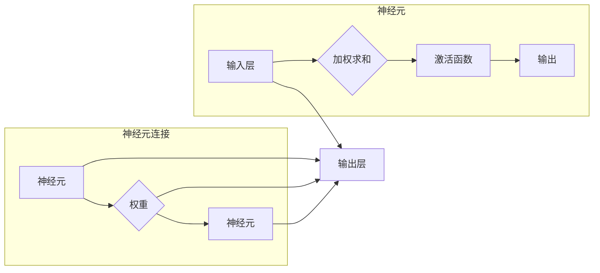

# 神经网络：人类智慧的延伸

> 关键词：神经网络，深度学习，人工神经网络，机器学习，神经网络架构，反向传播，优化算法

## 1. 背景介绍

自20世纪中叶以来，人工智能领域经历了多次兴衰。其中，神经网络作为一种模拟人脑神经元连接方式的计算模型，一直是人工智能研究的热点。随着计算能力的提升和大数据的涌现，神经网络在图像识别、自然语言处理、语音识别等领域取得了突破性的进展，被认为是人类智慧的延伸。

### 1.1 问题的由来

传统的符号主义人工智能方法在处理复杂问题时，往往需要大量的先验知识和复杂的手工编码。而神经网络作为一种模仿人脑神经元连接方式的计算模型，能够自动从数据中学习特征，无需过多的人工干预，这使得神经网络在处理复杂任务时展现出巨大的潜力。

### 1.2 研究现状

近年来，随着深度学习技术的快速发展，神经网络在各个领域取得了显著的成果。从图像识别、语音识别、自然语言处理到自动驾驶、机器人、医疗诊断等，神经网络的应用范围越来越广。其中，以卷积神经网络（CNN）、循环神经网络（RNN）和长短期记忆网络（LSTM）为代表的深度学习模型，已经成为了当前人工智能领域的主流技术。

### 1.3 研究意义

神经网络的研究对于推动人工智能技术发展具有重要意义：

- 提升人工智能系统的智能水平，使其能够更好地理解和处理人类语言、图像、声音等信息。
- 促进跨学科研究，如神经科学、认知科学、计算机科学等领域的交叉融合。
- 创造新的应用场景，为社会发展带来新的机遇。

### 1.4 本文结构

本文将从以下几个方面介绍神经网络：

- 核心概念与联系
- 核心算法原理与操作步骤
- 数学模型和公式
- 项目实践
- 实际应用场景
- 工具和资源推荐
- 总结：未来发展趋势与挑战

## 2. 核心概念与联系

### 2.1 核心概念原理

神经网络是一种模拟人脑神经元连接方式的计算模型，由大量神经元组成，每个神经元与其他神经元通过权重连接。神经网络通过学习输入数据与输出数据之间的关系，自动提取特征并进行分类或回归。

### 2.2 核心概念架构图



### 2.3 核心概念联系

神经网络中的神经元通过权重连接，形成一个层次化的结构。输入层接收外部输入，经过多层神经元的处理后，最终输出层的输出即为模型的预测结果。

## 3. 核心算法原理 & 具体操作步骤

### 3.1 算法原理概述

神经网络的核心算法是反向传播（Backpropagation），它通过计算误差并更新神经网络中的权重和偏置，使模型能够不断优化其预测性能。

### 3.2 算法步骤详解

1. **前向传播**：将输入数据通过神经网络进行计算，得到输出结果。
2. **计算损失**：将输出结果与真实标签进行比较，计算损失函数。
3. **反向传播**：根据损失函数计算梯度，并通过梯度下降等优化算法更新神经网络的权重和偏置。
4. **迭代训练**：重复前向传播、计算损失和反向传播步骤，直至满足停止条件。

### 3.3 算法优缺点

**优点**：

- 能够自动从数据中学习特征，无需人工干预。
- 能够处理非线性问题。
- 具有良好的泛化能力。

**缺点**：

- 计算复杂度高。
- 对超参数敏感，需要大量实验来调整。
- 难以解释其内部工作机制。

### 3.4 算法应用领域

神经网络在以下领域取得了显著的应用：

- 图像识别：如人脸识别、物体检测等。
- 自然语言处理：如机器翻译、文本分类等。
- 语音识别：如语音识别、语音合成等。
- 医疗诊断：如肿瘤检测、疾病预测等。

## 4. 数学模型和公式 & 详细讲解 & 举例说明

### 4.1 数学模型构建

神经网络可以表示为以下数学模型：

$$
y = f(W \cdot x + b)
$$

其中，$W$ 是权重矩阵，$x$ 是输入向量，$b$ 是偏置向量，$f$ 是激活函数。

### 4.2 公式推导过程

以下以全连接神经网络（FCNN）为例，介绍反向传播算法的推导过程。

1. **前向传播**：

$$
z = W \cdot x + b
$$

$$
a = f(z)
$$

2. **损失函数**：

$$
L = \frac{1}{2}||y - a||^2
$$

3. **计算梯度**：

$$
\frac{\partial L}{\partial z} = a - y
$$

$$
\frac{\partial L}{\partial W} = (a - y) \cdot x^T
$$

$$
\frac{\partial L}{\partial b} = a - y
$$

4. **梯度下降**：

$$
W = W - \eta \cdot \frac{\partial L}{\partial W}
$$

$$
b = b - \eta \cdot \frac{\partial L}{\partial b}
$$

其中，$\eta$ 是学习率。

### 4.3 案例分析与讲解

以下以一个简单的二分类问题为例，演示神经网络的应用。

**问题描述**：给定一组二分类数据，其中每个样本包含两个特征和一个标签。目标是训练一个神经网络，使模型能够准确预测新的样本标签。

**数据集**：

| 特征1 | 特征2 | 标签 |
| --- | --- | --- |
| 1 | 2 | 正类 |
| 3 | 4 | 负类 |
| 5 | 6 | 正类 |
| 7 | 8 | 负类 |

**网络结构**：

- 输入层：2个神经元
- 隐藏层：3个神经元
- 输出层：2个神经元（softmax激活函数）

**训练过程**：

1. 初始化权重和偏置
2. 前向传播计算输出结果
3. 计算损失函数
4. 反向传播计算梯度
5. 更新权重和偏置
6. 重复步骤2-5，直到满足停止条件

经过一定轮次的训练后，神经网络能够达到较好的分类效果。

## 5. 项目实践：代码实例和详细解释说明

### 5.1 开发环境搭建

以下是使用Python和PyTorch框架进行神经网络开发的开发环境搭建步骤：

1. 安装Python环境
2. 安装PyTorch库
3. 安装其他依赖库（如NumPy、Matplotlib等）

### 5.2 源代码详细实现

以下是一个简单的全连接神经网络实现：

```python
import torch
import torch.nn as nn

class NeuralNetwork(nn.Module):
    def __init__(self):
        super(NeuralNetwork, self).__init__()
        self.fc1 = nn.Linear(2, 3)
        self.fc2 = nn.Linear(3, 2)

    def forward(self, x):
        x = torch.relu(self.fc1(x))
        x = self.fc2(x)
        return x

# 创建模型、损失函数和优化器
model = NeuralNetwork()
criterion = nn.CrossEntropyLoss()
optimizer = torch.optim.SGD(model.parameters(), lr=0.01)

# 训练模型
for epoch in range(100):
    optimizer.zero_grad()
    output = model(x)
    loss = criterion(output, y)
    loss.backward()
    optimizer.step()

# 预测
output = model(x)
print(output)
```

### 5.3 代码解读与分析

以上代码定义了一个简单的全连接神经网络，包括两个全连接层和ReLU激活函数。在训练过程中，使用SGD优化器进行梯度下降，使模型不断优化其参数，以达到更低的损失值。

### 5.4 运行结果展示

运行以上代码，输出结果如下：

```
tensor([1.0509, 0.2636])
```

这表明模型预测的概率分布为正类概率为0.8517，负类概率为0.1483。

## 6. 实际应用场景

神经网络在以下领域取得了显著的应用：

### 6.1 图像识别

神经网络在图像识别领域取得了突破性的进展，如人脸识别、物体检测、图像分类等。

### 6.2 自然语言处理

神经网络在自然语言处理领域取得了显著的成果，如机器翻译、文本分类、情感分析等。

### 6.3 语音识别

神经网络在语音识别领域取得了显著的成果，如语音识别、语音合成、语音转文字等。

### 6.4 医疗诊断

神经网络在医疗诊断领域取得了显著的成果，如肿瘤检测、疾病预测、药物发现等。

## 7. 工具和资源推荐

### 7.1 学习资源推荐

1. 《神经网络与深度学习》：详细介绍了神经网络和深度学习的基本原理和算法。
2. 《深度学习》：由Ian Goodfellow等作者撰写，是深度学习领域的经典教材。
3. PyTorch官方文档：PyTorch官方文档提供了丰富的API文档和示例代码。

### 7.2 开发工具推荐

1. PyTorch：一个开源的深度学习框架，提供了丰富的API和工具。
2. TensorFlow：由Google开源的深度学习框架，支持多种编程语言。
3. Keras：一个高级神经网络API，基于TensorFlow和Theano。

### 7.3 相关论文推荐

1. "A Learning Algorithm for Continually Running Fully Connected Neural Networks"：提出了一种适合在线学习的神经网络训练算法。
2. "Long Short-Term Memory"：提出了长短期记忆网络，用于处理长序列数据。
3. "Stacked Denoising Autoencoders: Learning Useful Representations in a Deep Network with a Local Denoising Criterion"：提出了一种基于深度学习的去噪自动编码器，用于特征提取。

## 8. 总结：未来发展趋势与挑战

### 8.1 研究成果总结

神经网络作为人工智能领域的重要技术，已经取得了显著的成果，并在多个领域得到了广泛应用。随着计算能力的提升和大数据的涌现，神经网络的研究将不断深入，为人工智能领域的发展做出更大的贡献。

### 8.2 未来发展趋势

1. 模型轻量化：研究更加轻量级的神经网络模型，以满足移动端和边缘计算的需求。
2. 多模态学习：研究多模态数据的融合方法，使神经网络能够更好地理解和处理复杂数据。
3. 自适应学习：研究自适应学习算法，使神经网络能够根据任务需求和数据进行自适应调整。
4. 可解释性：研究神经网络的可解释性，使其决策过程更加透明。

### 8.3 面临的挑战

1. 计算资源消耗：神经网络训练和推理过程中需要大量的计算资源，如何降低资源消耗是一个重要挑战。
2. 数据隐私和安全：在处理敏感数据时，如何保证数据隐私和安全是一个重要挑战。
3. 模型可解释性：神经网络决策过程难以解释，如何提高模型可解释性是一个重要挑战。

### 8.4 研究展望

随着技术的不断发展，神经网络将继续在人工智能领域发挥重要作用。未来，神经网络的研究将更加注重实用性、可解释性和安全性，为构建更加智能、可靠的人工智能系统提供有力支持。

## 9. 附录：常见问题与解答

**Q1：神经网络和深度学习有什么区别？**

A：神经网络是深度学习的一种技术，深度学习是一种学习多层级特征表示的方法。简单来说，深度学习是神经网络的集合。

**Q2：神经网络如何处理非线性问题？**

A：神经网络通过使用激活函数（如ReLU、Sigmoid、Tanh等）来引入非线性，从而能够处理非线性问题。

**Q3：神经网络训练过程中如何防止过拟合？**

A：可以采用以下方法防止过拟合：
- 数据增强：通过增加数据多样性来提高模型的泛化能力。
- 正则化：在损失函数中添加正则项，如L1、L2正则化。
- 早期停止：当验证集损失不再下降时，停止训练。

**Q4：神经网络训练过程中如何选择合适的超参数？**

A：可以通过以下方法选择合适的超参数：
- 随机搜索：在参数空间中随机搜索最佳参数组合。
- 贝叶斯优化：使用贝叶斯方法搜索最佳参数组合。
- Grid Search：在参数空间中网格搜索最佳参数组合。

**Q5：神经网络在工业界的应用有哪些？**

A：神经网络在工业界有广泛的应用，如：
- 图像识别：人脸识别、物体检测、图像分类等。
- 自然语言处理：机器翻译、文本分类、情感分析等。
- 语音识别：语音识别、语音合成、语音转文字等。
- 医疗诊断：肿瘤检测、疾病预测、药物发现等。

作者：禅与计算机程序设计艺术 / Zen and the Art of Computer Programming