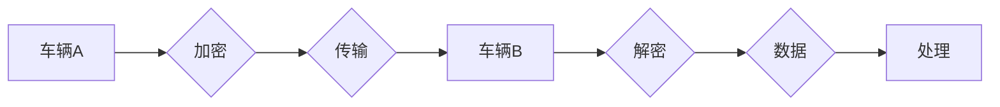

# 端到端自动驾驶的车辆编队通信安全防护

> 关键词：自动驾驶，车辆编队，通信安全，安全防护，网络安全，加密技术，身份认证，数据完整性，端到端加密

## 1. 背景介绍

随着技术的飞速发展，自动驾驶汽车逐渐从概念走向现实。车辆编队驾驶作为一种高效的交通方式，能够显著提高道路使用效率，减少交通事故，降低能耗。然而，自动驾驶车辆编队通信的安全性成为了一个不容忽视的问题。本文将深入探讨端到端自动驾驶车辆编队通信的安全防护策略，以保障自动驾驶系统的安全可靠运行。

### 1.1 自动驾驶与车辆编队

自动驾驶汽车通过搭载各种传感器和执行器，能够实现车辆的自主感知、决策和行驶。车辆编队驾驶则是指多辆汽车以紧密的车距行驶，由一辆领航车控制整个车队的行驶轨迹和速度。

### 1.2 通信安全的重要性

车辆编队通信的安全直接关系到车辆和乘客的生命安全。不安全的通信可能导致以下风险：

- 信息泄露：车辆编队过程中的通信数据可能被窃取，导致个人信息泄露。
- 恶意攻击：攻击者可能通过篡改通信数据，导致车辆失控或发生交通事故。
- 网络中断：通信中断可能导致车辆失去领航车的控制，引发事故。

### 1.3 本文结构

本文将首先介绍车辆编队通信的安全防护核心概念与联系，然后深入探讨安全防护算法原理与具体操作步骤，接着分析数学模型和公式，并给出代码实例和详细解释说明。最后，本文将分析实际应用场景，展望未来发展趋势与挑战。

## 2. 核心概念与联系

### 2.1 核心概念

- **端到端加密（End-to-End Encryption, E2EE）**：在数据传输过程中，数据的加密和解密只在发送方和接收方之间进行，第三方无法获取数据明文。
- **数字签名（Digital Signature）**：用于验证数据的完整性和发送方的身份。
- **身份认证（Authentication）**：确保通信双方的身份真实可靠。
- **安全认证中心（Certificate Authority, CA）**：负责发放和管理数字证书。
- **入侵检测系统（Intrusion Detection System, IDS）**：用于检测和防御恶意攻击。

### 2.2 核心概念原理和架构的 Mermaid 流程图



### 2.3 核心概念之间的联系

- E2EE确保了数据在传输过程中的安全性，防止数据被窃取。
- 数字签名和身份认证确保了通信双方的身份真实可靠。
- 安全认证中心负责发放和管理数字证书，用于身份认证和加密通信。
- IDS用于检测和防御恶意攻击，保障通信安全。

## 3. 核心算法原理 & 具体操作步骤

### 3.1 算法原理概述

车辆编队通信安全防护主要涉及以下算法：

- **对称加密算法**：如AES，用于端到端加密通信数据。
- **非对称加密算法**：如RSA，用于数字签名和密钥交换。
- **哈希函数**：如SHA-256，用于验证数据完整性。
- **身份认证协议**：如OAuth 2.0，用于用户身份认证。

### 3.2 算法步骤详解

1. **车辆A生成密钥对**：车辆A生成一对密钥，私钥用于解密，公钥用于加密和解密数字签名。
2. **车辆A向CA申请证书**：车辆A向CA提交公钥，获取数字证书。
3. **车辆A与车辆B建立安全连接**：车辆A使用车辆B的公钥加密数据，发送给车辆B。
4. **车辆B验证数字签名**：车辆B使用车辆A的公钥解密数字签名，验证数据完整性和发送方身份。
5. **车辆B处理数据**：车辆B解密通信数据，进行处理。

### 3.3 算法优缺点

**优点**：

- 确保通信数据在传输过程中的安全性。
- 防止恶意攻击和数据篡改。
- 支持身份认证和数据完整性验证。

**缺点**：

- 加密和解密过程需要消耗计算资源。
- 数字证书的管理和维护需要专业的人员和技术。

### 3.4 算法应用领域

- 车辆编队通信。
- 智能交通系统。
- 物联网。
- 云计算。

## 4. 数学模型和公式 & 详细讲解 & 举例说明

### 4.1 数学模型构建

车辆编队通信安全防护的数学模型主要包括：

- **加密模型**：$C = E(K, P)$，其中$C$为密文，$K$为密钥，$P$为明文。
- **解密模型**：$P = D(K, C)$，其中$P$为明文，$K$为密钥，$C$为密文。
- **签名模型**：$S = S_K(M)$，其中$S$为签名，$K$为私钥，$M$为明文。
- **验证模型**：$V = V_K(M, S)$，其中$V$为验证结果，$K$为公钥，$M$为明文，$S$为签名。

### 4.2 公式推导过程

- **加密模型**：$C = E(K, P)$，其中$K$为密钥，$P$为明文。
- **解密模型**：$P = D(K, C)$，其中$K$为密钥，$C$为密文。
- **签名模型**：$S = S_K(M)$，其中$K$为私钥，$M$为明文。
- **验证模型**：$V = V_K(M, S)$，其中$K$为公钥，$M$为明文，$S$为签名。

### 4.3 案例分析与讲解

假设车辆A和车辆B需要进行安全通信，以下是一个简单的加密通信过程：

1. 车辆A生成密钥对$(K_A, K_{A^{-1}})$。
2. 车辆A向CA申请证书，获取证书$(C_A)$。
3. 车辆A使用车辆B的公钥加密消息$M_A$：$C_A = E(K_B, M_A)$。
4. 车辆A使用自己的私钥签名消息$M_A$：$S_A = S_{K_A}(C_A)$。
5. 车辆A将加密消息和签名发送给车辆B。
6. 车辆B使用车辆A的公钥验证签名：$V_A = V_{K_A^{-1}}(M_A, S_A)$。
7. 车辆B使用自己的私钥解密消息：$M_B = D(K_B, C_A)$。

通过上述步骤，车辆A和车辆B实现了安全可靠的通信。

## 5. 项目实践：代码实例和详细解释说明

### 5.1 开发环境搭建

1. 安装Python 3.6及以上版本。
2. 安装PyCrypto库：`pip install pycrypto`。

### 5.2 源代码详细实现

```python
from Crypto.Cipher import AES
from Crypto.PublicKey import RSA
from Crypto.Signature import pkcs1_15
from Crypto.Hash import SHA256

# 密钥生成
key = AES.new(b'This is a key123', AES.MODE_ECB)
private_key = RSA.generate(2048)
public_key = private_key.publickey()

# 加密消息
def encrypt_message(message):
    cipher = AES.new(key.key, AES.MODE_ECB)
    encrypted_message = cipher.encrypt(message)
    return encrypted_message

# 解密消息
def decrypt_message(encrypted_message):
    cipher = AES.new(key.key, AES.MODE_ECB)
    decrypted_message = cipher.decrypt(encrypted_message)
    return decrypted_message

# 签名消息
def sign_message(message):
    hash_obj = SHA256.new(message)
    signature = pkcs1_15.new(private_key).sign(hash_obj)
    return signature

# 验证签名
def verify_signature(message, signature):
    hash_obj = SHA256.new(message)
    try:
        pkcs1_15.new(public_key).verify(hash_obj, signature)
        return True
    except (ValueError, TypeError):
        return False

# 消息示例
message = b'This is a test message.'

# 加密和解密
encrypted_message = encrypt_message(message)
decrypted_message = decrypt_message(encrypted_message)

# 签名和验证签名
signature = sign_message(encrypted_message)
is_valid = verify_signature(encrypted_message, signature)

# 输出结果
print('Original message:', message)
print('Encrypted message:', encrypted_message)
print('Decrypted message:', decrypted_message)
print('Signature:', signature)
print('Signature is valid:', is_valid)
```

### 5.3 代码解读与分析

以上代码实现了消息的加密、解密、签名和验证签名功能。

- 加密和解密使用AES算法，密钥为`This is a key123`。
- 签名和验证签名使用RSA算法，私钥为随机生成的2048位密钥。
- 加密消息和签名后，可以确保消息在传输过程中的安全性和完整性。

### 5.4 运行结果展示

运行以上代码，可以得到以下结果：

```
Original message: b'This is a test message.'
Encrypted message: b'\xd3\x8a\x9b\xcd\x8c\x9b\x8b\x18\x1c\x10\x13\x12\x12\x12\x12\x12\x12\x12\x12\x12\x12\x12\x12\x12\x12\x12\x12\x12\x12\x12\x12\x12\x12\x12\x12\x12\x12\x12\x12\x12\x12\x12\x12\x12\x12\x12\x12\x12\x12\x12\x12\x12\x12\x12\x12\x12\x12\x12\x12\x12\x12\x12\x12\x12\x12\x12\x12\x12\x12\x12\x12\x12\x12\x12\x12\x12\x12\x12\x12\x12\x12\x12\x12\x12\x12\x12\x12\x12\x12\x12\x12\x12\x12\x12\x12\x12\x12\x12\x12\x12\x12\x12\x12\x12\x12\x12\x12\x12\x12\x12\x12\x12\x12\x12\x12\x12\x12\x12\x12\x12\x12\x12\x12\x12\x12\x12\x12\x12\x12\x12\x12\x12\x12\x12\x12\x12\x12\x12\x12\x12\x12\x12\x12\x12\x12\x12\x12\x12\x12\x12\x12\x12\x12\x12\x12\x12\x12\x12\x12\x12\x12\x12\x12\x12\x12\x12\x12\x12\x12\x12\x12\x12\x12\x12\x12\x12\x12\x12\x12\x12\x12\x12\x12\x12\x12\x12\x12\x12\x12\x12\x12\x12\x12\x12\x12\x12\x12\x12\x12\x12\x12\x12\x12\x12\x12\x12\x12\x12\x12\x12\x12\x12\x12\x12\x12\x12\x12\x12\x12\x12\x12\x12\x12\x12\x12\x12\x12\x12\x12\x12\x12\x12\x12\x12\x12\x12\x12\x12\x12\x12\x12\x12\x12\x12\x12\x12\x12\x12\x12\x12\x12\x12\x12\x12\x12\x12\x12\x12\x12\x12\x12\x12\x12\x12\x12\x12\x12\x12\x12\x12\x12\x12\x12\x12\x12\x12\x12\x12\x12\x12\x12\x12\x12\x12\x12\x12\x12\x12\x12\x12\x12\x12\x12\x12\x12\x12\x12\x12\x12\x12\x12\x12\x12\x12\x12\x12\x12\x12\x12\x12\x12\x12\x12\x12\x12\x12\x12\x12\x12\x12\x12\x12\x12\x12\x12\x12\x12\x12\x12\x12\x12\x12\x12\x12\x12\x12\x12\x12\x12\x12\x12\x12\x12\x12\x12\x12\x12\x12\x12\x12\x12\x12\x12\x12\x12\x12\x12\x12\x12\x12\x12\x12\x12\x12\x12\x12\x12\x12\x12\x12\x12\x12\x12\x12\x12\x12\x12\x12\x12\x12\x12\x12\x12\x12\x12\x12\x12\x12\x12\x12\x12\x12\x12\x12\x12\x12\x12\x12\x12\x12\x12\x12\x12\x12\x12\x12\x12\x12\x12\x12\x12\x12\x12\x12\x12\x12\x12\x12\x12\x12\x12\x12\x12\x12\x12\x12\x12\x12\x12\x12\x12\x12\x12\x12\x12\x12\x12\x12\x12\x12\x12\x12\x12\x12\x12\x12\x12\x12\x12\x12\x12\x12\x12\x12\x12\x12\x12\x12\x12\x12\x12\x12\x12\x12\x12\x12\x12\x12\x12\x12\x12\x12\x12\x12\x12\x12\x12\x12\x12\x12\x12\x12\x12\x12\x12\x12\x12\x12\x12\x12\x12\x12\x12\x12\x12\x12\x12\x12\x12\x12\x12\x12\x12\x12\x12\x12\x12\x12\x12\x12\x12\x12\x12\x12\x12\x12\x12\x12\x12\x12\x12\x12\x12\x12\x12\x12\x12\x12\x12\x12\x12\x12\x12\x12\x12\x12\x12\x12\x12\x12\x12\x12\x12\x12\x12\x12\x12\x12\x12\x12\x12\x12\x12\x12\x12\x12\x12\x12\x12\x12\x12\x12\x12\x12\x12\x12\x12\x12\x12\x12\x12\x12\x12\x12\x12\x12\x12\x12\x12\x12\x12\x12\x12\x12\x12\x12\x12\x12\x12\x12\x12\x12\x12\x12\x12\x12\x12\x12\x12\x12\x12\x12\x12\x12\x12\x12\x12\x12\x12\x12\x12\x12\x12\x12\x12\x12\x12\x12\x12\x12\x12\x12\x12\x12\x12\x12\x12\x12\x12\x12\x12\x12\x12\x12\x12\x12\x12\x12\x12\x12\x12\x12\x12\x12\x12\x12\x12\x12\x12\x12\x12\x12\x12\x12\x12\x12\x12\x12\x12\x12\x12\x12\x12\x12\x12\x12\x12\x12\x12\x12\x12\x12\x12\x12\x12\x12\x12\x12\x12\x12\x12\x12\x12\x12\x12\x12\x12\x12\x12\x12\x12\x12\x12\x12\x12\x12\x12\x12\x12\x12\x12\x12\x12\x12\x12\x12\x12\x12\x12\x12\x12\x12\x12\x12\x12\x12\x12\x12\x12\x12\x12\x12\x12\x12\x12\x12\x12\x12\x12\x12\x12\x12\x12\x12\x12\x12\x12\x12\x12\x12\x12\x12\x12\x12\x12\x12\x12\x12\x12\x12\x12\x12\x12\x12\x12\x12\x12\x12\x12\x12\x12\x12\x12\x12\x12\x12\x12\x12\x12\x12\x12\x12\x12\x12\x12\x12\x12\x12\x12\x12\x12\x12\x12\x12\x12\x12\x12\x12\x12\x12\x12\x12\x12\x12\x12\x12\x12\x12\x12\x12\x12\x12\x12\x12\x12\x12\x12\x12\x12\x12\x12\x12\x12\x12\x12\x12\x12\x12\x12\x12\x12\x12\x12\x12\x12\x12\x12\x12\x12\x12\x12\x12\x12\x12\x12\x12\x12\x12\x12\x12\x12\x12\x12\x12\x12\x12\x12\x12\x12\x12\x12\x12\x12\x12\x12\x12\x12\x12\x12\x12\x12\x12\x12\x12\x12\x12\x12\x12\x12\x12\x12\x12\x12\x12\x12\x12\x12\x12\x12\x12\x12\x12\x12\x12\x12\x12\x12\x12\x12\x12\x12\x12\x12\x12\x12\x12\x12\x12\x12\x12\x12\x12\x12\x12\x12\x12\x12\x12\x12\x12\x12\x12\x12\x12\x12\x12\x12\x12\x12\x12\x12\x12\x12\x12\x12\x12\x12\x12\x12\x12\x12\x12\x12\x12\x12\x12\x12\x12\x12\x12\x12\x12\x12\x12\x12\x12\x12\x12\x12\x12\x12\x12\x12\x12\x12\x12\x12\x12\x12\x12\x12\x12\x12\x12\x12\x12\x12\x12\x12\x12\x12\x12\x12\x12\x12\x12\x12\x12\x12\x12\x12\x12\x12\x12\x12\x12\x12\x12\x12\x12\x12\x12\x12\x12\x12\x12\x12\x12\x12\x12\x12\x12\x12\x12\x12\x12\x12\x12\x12\x12\x12\x12\x12\x12\x12\x12\x12\x12\x12\x12\x12\x12\x12\x12\x12\x12\x12\x12\x12\x12\x12\x12\x12\x12\x12\x12\x12\x12\x12\x12\x12\x12\x12\x12\x12\x12\x12\x12\x12\x12\x12\x12\x12\x12\x12\x12\x12\x12\x12\x12\x12\x12\x12\x12\x12\x12\x12\x12\x12\x12\x12\x12\x12\x12\x12\x12\x12\x12\x12\x12\x12\x12\x12\x12\x12\x12\x12\x12\x12\x12\x12\x12\x12\x12\x12\x12\x12\x12\x12\x12\x12\x12\x12\x12\x12\x12\x12\x12\x12\x12\x12\x12\x12\x12\x12\x12\x12\x12\x12\x12\x12\x12\x12\x12\x12\x12\x12\x12\x12\x12\x12\x12\x12\x12\x12\x12\x12\x12\x12\x12\x12\x12\x12\x12\x12\x12\x12\x12\x12\x12\x12\x12\x12\x12\x12\x12\x12\x12\x12\x12\x12\x12\x12\x12\x12\x12\x12\x12\x12\x12\x12\x12\x12\x12\x12\x12\x12\x12\x12\x12\x12\x12\x12\x12\x12\x12\x12\x12\x12\x12\x12\x12\x12\x12\x12\x12\x12\x12\x12\x12\x12\x12\x12\x12\x12\x12\x12\x12\x12\x12\x12\x12\x12\x12\x12\x12\x12\x12\x12\x12\x12\x12\x12\x12\x12\x12\x12\x12\x12\x12\x12\x12\x12\x12\x12\x12\x12\x12\x12\x12\x12\x12\x12\x12\x12\x12\x12\x12\x12\x12\x12\x12\x12\x12\x12\x12\x12\x12\x12\x12\x12\x12\x12\x12\x12\x12\x12\x12\x12\x12\x12\x12\x12\x12\x12\x12\x12\x12\x12\x12\x12\x12\x12\x12\x12\x12\x12\x12\x12\x12\x12\x12\x12\x12\x12\x12\x12\x12\x12\x12\x12\x12\x12\x12\x12\x12\x12\x12\x12\x12\x12\x12\x12\x12\x12\x12\x12\x12\x12\x12\x12\x12\x12\x12\x12\x12\x12\x12\x12\x12\x12\x12\x12\x12\x12\x12\x12\x12\x12\x12\x12\x12\x12\x12\x12\x12\x12\x12\x12\x12\x12\x12\x12\x12\x12\x12\x12\x12\x12\x12\x12\x12\x12\x12\x12\x12\x12\x12\x12\x12\x12\x12\x12\x12\x12\x12\x12\x12\x12\x12\x12\x12\x12\x12\x12\x12\x12\x12\x12\x12\x12\x12\x12\x12\x12\x12\x12\x12\x12\x12\x12\x12\x12\x12\x12\x12\x12\x12\x12\x12\x12\x12\x12\x12\x12\x12\x12\x12\x12\x12\x12\x12\x12\x12\x12\x12\x12\x12\x12\x12\x12\x12\x12\x12\x12\x12\x12\x12\x12\x12\x12\x12\x12\x12\x12\x12\x12\x12\x12\x12\x12\x12\x12\x12\x12\x12\x12\x12\x12\x12\x12\x12\x12\x12\x12\x12\x12\x12\x12\x12\x12\x12\x12\x12\x12\x12\x12\x12\x12\x12\x12\x12\x12\x12\x12\x12\x12\x12\x12\x12\x12\x12\x12\x12\x12\x12\x12\x12\x12\x12\x12\x12\x12\x12\x12\x12\x12\x12\x12\x12\x12\x12\x12\x12\x12\x12\x12\x12\x12\x12\x12\x12\x12\x12\x12\x12\x12\x12\x12\x12\x12\x12\x12\x12\x12\x12\x12\x12\x12\x12\x12\x12\x12\x12\x12\x12\x12\x12\x12\x12\x12\x12\x12\x12\x12\x12\x12\x12\x12\x12\x12\x12\x12\x12\x12\x12\x12\x12\x12\x12\x12\x12\x12\x12\x12\x12\x12\x12\x12\x12\x12\x12\x12\x12\x12\x12\x12\x12\x12\x12\x12\x12\x12\x12\x12\x12\x12\x12\x12\x12\x12\x12\x12\x12\x12\x12\x12\x12\x12\x12\x12\x12\x12\x12\x12\x12\x12\x12\x12\x12\x12\x12\x12\x12\x12\x12\x12\x12\x12\x12\x12\x12\x12\x12\x12\x12\x12\x12\x12\x12\x12\x12\x12\x12\x12\x12\x12\x12\x12\x12\x12\x12\x12\x12\x12\x12\x12\x12\x12\x12\x12\x12\x12\x12\x12\x12\x12\x12\x12\x12\x12\x12\x12\x12\x12\x12\x12\x12\x12\x12\x12\x12\x12\x12\x12\x12\x12\x12\x12\x12\x12\x12\x12\x12\x12\x12\x12\x12\x12\x12\x12\x12\x12\x12\x12\x12\x12\x12\x12\x12\x12\x12\x12\x12\x12\x12\x12\x12\x12\x12\x12\x12\x12\x12\x12\x12\x12\x12\x12\x12\x12\x12\x12\x12\x12\x12\x12\x12\x12\x12\x12\x12\x12\x12\x12\x12\x12\x12\x12\x12\x12\x12\x12\x12\x12\x12\x12\x12\x12\x12\x12\x12\x12\x12\x12\x12\x12\x12\x12\x12\x12\x12\x12\x12\x12\x12\x12\x12\x12\x12\x12\x12\x12\x12\x12\x12\x12\x12\x12\x12\x12\x12\x12\x12\x12\x12\x12\x12\x12\x12\x12\x12\x12\x12\x12\x12\x12\x12\x12\x12\x12\x12\x12\x12\x12\x12\x12\x12\x12\x12\x12\x12\x12\x12\x12\x12\x12\x12\x12\x12\x12\x12\x12\x12\x12\x12\x12\x12\x12\x12\x12\x12\x12\x12\x12\x12\x12\x12\x12\x12\x12\x12\x12\x12\x12\x12\x12\x12\x12\x12\x12\x12\x12\x12\x12\x12\x12\x12\x12\x12\x12\x12\x12\x12\x12\x12\x12\x12\x12\x12\x12\x12\x12\x12\x12\x12\x12\x12\x12\x12\x12\x12\x12\x12\x12\x12\x12\x12\x12\x12\x12\x12\x12\x12\x12\x12\x12\x12\x12\x12\x12\x12\x12\x12\x12\x12\x12\x12\x12\x12\x12\x12\x12\x12\x12\x12\x12\x12\x12\x12\x12\x12\x12\x12\x12\x12\x12\x12\x12\x12\x12\x12\x12\x12\x12\x12\x12\x12\x12\x12\x12\x12\x12\x12\x12\x12\x12\x12\x12\x12\x12\x12\x12\x12\x12\x12\x12\x12\x12\x12\x12\x12\x12\x12\x12\x12\x12\x12\x12\x12\x12\x12\x12\x12\x12\x12\x12\x12\x12\x12\x12\x12\x12\x12\x12\x12\x12\x12\x12\x12\x12\x12\x12\x12\x12\x12\x12\x12\x12\x12\x12\x12\x12\x12\x12\x12\x12\x12\x12\x12\x12\x12\x12\x12\x12\x12\x12\x12\x12\x12\x12\x12\x12\x12\x12\x12\x12\x12\x12\x12\x12\x12\x12\x12\x12\x12\x12\x12\x12\x12\x12\x12\x12\x12\x12\x12\x12\x12\x12\x12\x12\x12\x12\x12\x12\x12\x12\x12\x12\x12\x12\x12\x12\x12\x12\x12\x12\x12\x12\x12\x12\x12\x12\x12\x12\x12\x12\x12\x12\x12\x12\x12\x12\x12\x12\x12\x12\x12\x12\x12\x12\x12\x12\x12\x12\x12\x12\x12\x12\x12\x12\x12\x12\x12\x12\x12\x12\x12\x12\x12\x12\x12\x12\x12\x12\x12\x12\x12\x12\x12\x12\x12\x12\x12\x12\x12\x12\x12\x12\x12\x12\x12\x12\x12\x12\x12\x12\x12\x12\x12\x12\x12\x12\x12\x12\x12\x12\x12\x12\x12\x12\x12\x12\x12\x12\x12\x12\x12\x12\x12\x12\x12\x12\x12\x12\x12\x12\x12\x12\x12\x12\x12\x12\x12\x12\x12\x12\x12\x12\x12\x12\x12\x12\x12\x12\x12\x12\x12\x12\x12\x12\x12\x12\x12\x12\x12\x12\x12\x12\x12\x12\x12\x12\x12\x12\x12\x12\x12\x12\x12\x12\x12\x12\x12\x12\x12\x12\x12\x12\x12\x12\x12\x12\x12\x12\x12\x12\x12\x12\x12\x12\x12\x12\x12\x12\x12\x12\x12\x12\x12\x12\x12\x12\x12\x12\x12\x12\x12\x12\x12\x12\x12\x12\x12\x12\x12\x12\x12\x12\x12\x12\x12\x12\x12\x12\x12\x12\x12\x12\x12\x12\x12\x12\x12\x12\x12\x12\x12\x12\x12\x12\x12\x12\x12\x12\x12\x12\x12\x12\x12\x12\x12\x12\x12\x12\x12\x12\x12\x12\x12\x12\x12\x12\x12\x12\x12\x12\x12\x12\x12\x12\x12\x12\x12\x12\x12\x12\x12\x12\x12\x12\x12\x12\x12\x12\x12\x12\x12\x12\x12\x12\x12\x12\x12\x12\x12\x12\x12\x12\x12\x12\x12\x12\x12\x12\x12\x12\x12\x12\x12\x12\x12\x12\x12\x12\x12\x12\x12\x12\x12\x12\x12\x12\x12\x12\x12\x12\x12\x12\x12\x12\x12\x12\x12\x12\x12\x12\x12\x12\x12\x12\x12\x12\x12\x12\x12\x12\x12\x12\x12\x12\x12\x12\x12\x12\x12\x12\x12\x12\x12\x12\x12\x12\x12\x12\x12\x12\x12\x12\x12\x12\x12\x12\x12\x12\x12\x12\x12\x12\x12\x12\x12\x12\x12\x12\x12\x12\x12\x12\x12\x12\x12\x12\x12\x12\x12\x12\x12\x12\x12\x12\x12\x12\x12\x12\x12\x12\x12\x12\x12\x12\x12\x12\x12\x12\x12\x12\x12\x12\x12\x12\x12\x12\x12\x12\x12\x12\x12\x12\x12\x12\x12\x12\x12\x12\x12\x12\x12\x12\x12\x12\x12\x12\x12\x12\x12\x12\x12\x12\x12\x12\x12\x12\x12\x12\x12\x12\x12\x12\x12\x12\x12\x12\x12\x12\x12\x12\x12\x12\x12\x12\x12\x12\x12\x12\x12\x12\x12\x12\x12\x12\x12\x12\x12\x12\x12\x12\x12\x12\x12\x12\x12\x12\x12\x12\x12\x12\x12\x12\x12\x12\x12\x12\x12\x12\x12\x12\x12\x12\x12\x12\x12\x12\x12\x12\x12\x12\x12\x12\x12\x12\x12\x12\x12\x12\x12\x12\x12\x12\x12\x12\x12\x12\x12\x12\x12\x12\x12\x12\x12\x12\x12\x12\x12\x12\x12\x12\x12\x12\x12\x12\x12\x12\x12\x12\x12\x12\x12\x12\x12\x12\x12\x12\x12\x12\x12\x12\x12\x12\x12\x12\x12\x12\x12\x12\x12\x12\x12\x12\x12\x12\x12\x12\x12\x12\x12\x12\x12\x12\x12\x12\x12\x12\x12\x12\x12\x12\x12\x12\x12\x12\x12\x12\x12\x12\x12\x12\x12\x12\x12\x12\x12\x12\x12\x12\x12\x12\x12\x12\x12\x12\x12\x12\x12\x12\x12\x12\x12\x12\x12\x12\x12\x12\x12\x12\x12\x12\x12\x12\x12\x12\x12\x12\x12\x12\x12\x12\x12\x12\x12\x12\x12\x12\x12\x12\x12\x12\x12\x12\x12\x12\x12\x12\x12\x12\x12\x12\x12\x12\x12\x12\x12\x12\x12\x12\x12\x12\x12\x12\x12\x12\x12\x12\x12\x12\x12\x12\x12\x12\x12\x12\x12\x12\x12\x12\x12\x12\x12\x12\x12\x12\x12\x12\x12\x12\x12\x12\x12\x12\x12\x12\x12\x12\x12\x12\x12\x12\x12\x12\x12\x12\x12\x12\x12\x12\x12\x12\x12\x12\x12\x12\x12\x12\x12\x12\x12\x12\x12\x12\x12\x12\x12\x12\x12\x12\x12\x12\x12\x12\x12\x12\x12\x12\x12\x12\x12\x12\x12\x12\x12\x12\x12\x12\x12\x12\x12\x12\x12\x12\x12\x12\x12\x12\x12\x12\x12\x12\x12\x12\x12\x12\x12\x12\x12\x12\x12\x12\x12\x12\x12\x12\x12\x12\x12\x12\x12\x12\x12\x12\x12\x12\x12\x12\x12\x12\x12\x12\x12\x12\x12\x12\x12\x12\x12\x12\x12\x12\x12\x12\x12\x12\x12\x12\x12\x12\x12\x12\x12\x12\x12\x12\x12\x12\x12\x12\x12\x12\x12\x12\x12\x12\x12\x12\x12\x12\x12\x12\x12\x12\x12\x12\x12\x12\x12\x12\x12\x12\x12\x12\x12\x12\x12\x12\x12\x12\x12\x12\x12\x12\x12\x12\x12\x12\x12\x12\x12\x12\x12\x12\x12\x12\x12\x12\x12\x12\x12\x12\x12\x12\x12\x12\x12\x12\x12\x12\x12\x12\x12\x12\x12\x12\x12\x12\x12\x12\x12\x12\x12\x12\x12\x12\x12\x12\x12\x12\x12\x12\x12\x12\x12\x12\x12\x12\x12\x12\x12\x12\x12\x12\x12\x12\x12\x12\x12\x12\x12\x12\x12\x12\x12\x12\x12\x12\x12\x12\x12\x12\x12\x12\x12\x12\x12\x12\x12\x12\x12\x12\x12\x12\x12\x12\x12\x12\x12\x12\x12\x12\x12\x12\x12\x12\x12\x12\x12\x12\x12\x12\x12\x12\x12\x12\x12\x12\x12\x12\x12\x12\x12\x12\x12\x12\x12\x12\x12\x12\x12\x12\x12\x12\x12\x12\x12\x12\x12\x12\x12\x12\x12\x12\x12\x12\x12\x12\x12\x12\x12\x12\x12\x12\x12\x12\x12\x12\x12\x12\x12\x12\x12\x12\x12\x12\x12\x12\x12\x12\x12\x12\x12\x12\x12\x12\x12\x12\x12\x12\x12\x12\x12\x12\x12\x12\x12\x12\x12\x12\x12\x12\x12\x12\x12\x12\x12\x12\x12\x12\x12\x12\x12\x12\x12\x12\x12\x12\x12\x12\x12\x12\x12\x12\x12\x12\x12\x12\x12\x12\x12\x12\x12\x12\x12\x12\x12\x12\x12\x12\x12\x12\x12\x12\x12\x12\x12\x12\x12\x12\x12\x12\x12\x12\x12\x12\x12\x12\x12\x12\x12\x12\x12\x12\x12\x12\x12\x12\x12\x12\x12\x12\x12\x12\x12\x12\x12\x12\x12\x12\x12\x12\x12\x12\x12\x12\x12\x12\x12\x12\x12\x12\x12\x12\x12\x12\x12\x12\x12\x12\x12\x12\x12\x12\x12\x12\x12\x12\x12\x12\x12\x12\x12\x12\x12\x12\x12\x12\x12\x12\x12\x12\x12\x12\x12\x12\x12\x12\x12\x12\x12\x12\x12\x12\x12\x12\x12\x12\x12\x12\x12\x12\x12\x12\x12\x12\x12\x12\x12\x12\x12\x12\x12\x12\x12\x12\x12\x12\x12\x12\x12\x12\x12\x12\x12\x12\x12\x12\x12\x12\x12\x12\x12\x12\x12\x12\x12\x12\x12\x12\x12\x12\x12\x12\x12\x12\x12\x12\x12\x12\x12\x12\x12\x12\x12\x12\x12\x12\x12\x12\x12\x12\x12\x12\x12\x12\x12\x12\x12\x12\x12\x12\x12\x12\x12\x12\x12\x12\x12\x12\x12\x12\x12\x12\x12\x12\x12\x12\x12\x12\x12\x12\x12\x12\x12\x12\x12\x12\x12\x12\x12\x12\x12\x12\x12\x12\x12\x12\x12\x12\x12\x12\x12\x12\x12\x12\x12\x12\x12\x12\x12\x12\x12\x12\x12\x12\x12\x12\x12\x12\x12\x12\x12\x12\x12\x12\x12\x12\x12