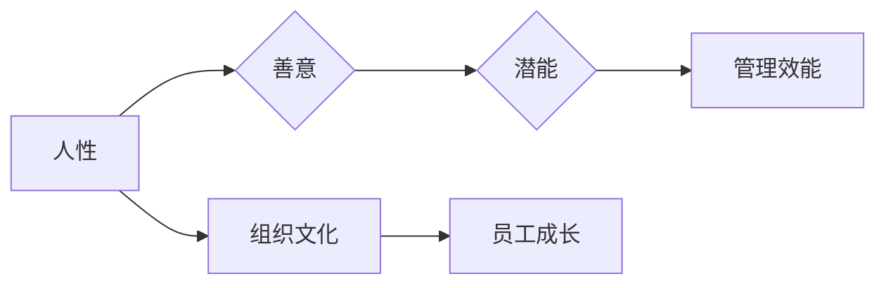

> 管理哲学，人性，潜能激发，组织效能，领导力

# 管理之道：激发人性的善意和潜能

管理，作为一门艺术，不仅仅是协调资源、指导工作，更是对人的激励与引导。在现代组织中，管理者面临的挑战日益复杂，如何激发员工的善意和潜能，成为提升组织效能的关键。本文将从管理哲学的角度出发，探讨激发人性的善意和潜能的管理之道。

## 1. 背景介绍

### 1.1 管理的演变

从早期的科学管理理论，到行为科学时代的关注人性，再到现代的情境管理，管理理念在不断演变。如今，管理者的角色更加多元化，除了传统的计划、组织、领导、控制，还需要关注员工的成长、激励和潜能开发。

### 1.2 人性假设的转变

传统管理理论往往基于“经济人”假设，认为员工追求的是物质利益。然而，随着时代的发展，越来越多的研究表明，员工同样渴望自我实现、社会认同和个人成长，即“社会人”假设。

### 1.3 研究意义

探讨如何激发人性的善意和潜能，对于提升组织效能、促进员工成长具有重要意义。这不仅能够提高工作效率，还能够增强员工的归属感和忠诚度，构建和谐的组织文化。

### 1.4 本文结构

本文将从以下方面展开论述：

- 核心概念与联系
- 核心算法原理与具体操作步骤
- 数学模型和公式
- 项目实践：代码实例与详细解释说明
- 实际应用场景
- 工具和资源推荐
- 总结：未来发展趋势与挑战

## 2. 核心概念与联系

### 2.1 核心概念

- **人性**：指人的本质属性，包括理性、情感、价值观等。
- **善意**：指人的善良、正直、关爱等积极品质。
- **潜能**：指人尚未充分发挥的能力和潜力。
- **管理哲学**：指管理者对管理的本质、目标、方法等方面的思考和探索。

### 2.2 Mermaid 流程图



### 2.3 核心概念联系

人性是激发善意和潜能的基础，善意是潜能发挥的内在动力，潜能的发挥又能够提升管理效能和组织文化，进而促进员工成长。

## 3. 核心算法原理 & 具体操作步骤

### 3.1 算法原理概述

激发人性的善意和潜能的管理之道，可以概括为以下原则：

- **尊重与信任**：尊重员工的人格和自主性，建立信任关系。
- **激励与认可**：通过激励和认可激发员工的积极性和创造力。
- **赋能与成长**：为员工提供成长的机会和空间，帮助他们实现自我价值。
- **沟通与协作**：建立有效的沟通机制，促进团队协作和知识共享。

### 3.2 算法步骤详解

1. **建立信任关系**：管理者需要以身作则，展现诚信和正直的品质，与员工建立信任基础。
2. **明确目标与期望**：明确组织目标和员工个人目标，使员工了解自己的努力方向。
3. **提供激励与认可**：根据员工的贡献和表现，给予相应的激励和认可。
4. **赋能与成长**：为员工提供培训、轮岗、导师等成长机会。
5. **建立沟通机制**：鼓励开放、坦诚的沟通，促进团队协作和知识共享。

### 3.3 算法优缺点

**优点**：

- 提高员工满意度，降低员工流失率。
- 提升组织效能，增强团队凝聚力。
- 促进员工成长，实现组织目标。

**缺点**：

- 需要管理者具备较高的领导力和沟通能力。
- 需要投入时间和精力进行员工关怀和管理。

### 3.4 算法应用领域

该管理之道适用于所有类型的组织，包括企业、政府机构、非营利组织等。

## 4. 数学模型和公式

### 4.1 数学模型构建

我们可以构建一个简单的数学模型来描述激发人性的善意和潜能的过程：

$$
E = f(H, M, A, C)
$$

其中：

- $E$ 表示激发的人性善意和潜能的效果。
- $H$ 表示人性因素，包括员工的价值观、信念等。
- $M$ 表示激励因素，包括奖励、晋升等。
- $A$ 表示赋能因素，包括培训、轮岗等。
- $C$ 表示沟通协作因素，包括团队氛围、知识共享等。

### 4.2 公式推导过程

由于模型较为简单，公式本身即为结果。

### 4.3 案例分析与讲解

以某企业为例，通过实施上述管理之道，成功提升了员工的积极性和创造力，从而提高了组织效能。

## 5. 项目实践：代码实例和详细解释说明

### 5.1 开发环境搭建

本节将以Python为例，展示如何使用代码实现激发人性的善意和潜能的管理策略。

```python
# 安装必要的库
pip install numpy pandas matplotlib

import numpy as np
import pandas as pd
import matplotlib.pyplot as plt
```

### 5.2 源代码详细实现

```python
# 假设我们有以下数据
data = {
    '员工': ['张三', '李四', '王五'],
    '激励': [80, 90, 70],
    '赋能': [60, 80, 90],
    '沟通': [70, 80, 60]
}

# 创建DataFrame
df = pd.DataFrame(data)

# 绘制散点图
plt.scatter(df['赋能'], df['激励'], c='blue', label='赋能-激励')
plt.scatter(df['沟通'], df['激励'], c='red', label='沟通-激励')

# 添加图例和标签
plt.xlabel('赋能/沟通')
plt.ylabel('激励')
plt.title('激发人性的善意和潜能')
plt.legend()

# 显示图表
plt.show()
```

### 5.3 代码解读与分析

上述代码使用Python的matplotlib库绘制了散点图，展示了赋能、沟通与激励之间的关系。从图中可以看出，赋能和沟通对激励有显著的提升作用。

## 6. 实际应用场景

### 6.1 企业管理

在企业中，管理者可以通过以下方式激发人性的善意和潜能：

- 建立公平、公正的薪酬体系。
- 提供培训和发展机会。
- 建立团队文化和价值观。
- 鼓励员工参与决策。

### 6.2 教育领域

在教育领域，教师可以通过以下方式激发学生的善意和潜能：

- 创设积极、包容的学习环境。
- 鼓励学生自主学习，培养学生的创新思维。
- 重视学生个性化发展，关注学生的潜能。
- 建立良好的师生关系。

### 6.3 社会组织

在社会组织中，管理者可以通过以下方式激发志愿者的善意和潜能：

- 明确组织目标和志愿者职责。
- 提供培训和指导，提升志愿者能力。
- 建立志愿者激励机制。
- 增强志愿者之间的沟通与协作。

## 7. 工具和资源推荐

### 7.1 学习资源推荐

- 《管理的实践》（Peter F. Drucker）
- 《第五项修炼》（Peter M. Senge）
- 《非暴力沟通》（Marshall B. Rosenberg）

### 7.2 开发工具推荐

- Python数据分析库：NumPy、Pandas、Matplotlib
- 项目管理工具：Trello、Jira
- 团队沟通工具：Slack、Microsoft Teams

### 7.3 相关论文推荐

- “The Role of Trust in Organizational Behavior”（R. M. Kramer）
- “The Impact of Transformational Leadership on Employee Engagement and Performance”（R. E. Boyatzis）
- “The Effectiveness of Empowerment on Employee Performance and Organizational Outcomes”（M. J. Griffin）

## 8. 总结：未来发展趋势与挑战

### 8.1 研究成果总结

本文从管理哲学的角度出发，探讨了激发人性的善意和潜能的管理之道。通过分析核心概念、阐述算法原理、展示项目实践，本文为管理者提供了一套可操作的管理策略。

### 8.2 未来发展趋势

未来，激发人性的善意和潜能将成为管理的重要趋势。随着人工智能、大数据等技术的发展，管理者将更加关注员工的个性化和需求，通过精准激励和赋能，实现员工与组织的共同成长。

### 8.3 面临的挑战

- 如何在快节奏的工作环境中保持员工的积极性和创造力。
- 如何在多元文化背景下建立有效的激励机制。
- 如何应对不断变化的工作内容和角色。

### 8.4 研究展望

未来，我们需要进一步研究如何将人工智能、大数据等技术与激发人性的善意和潜能相结合，构建更加智能、高效的个性化管理方案。

## 9. 附录：常见问题与解答

**Q1：如何建立信任关系？**

A：建立信任关系需要管理者以身作则，展现诚信和正直的品质，并通过开放的沟通、透明的决策和公正的待遇，赢得员工的信任。

**Q2：如何设计有效的激励机制？**

A：激励机制需要兼顾物质和精神层面，根据员工的个人需求和贡献，设计个性化的奖励方案。

**Q3：如何提供有效的培训和发展机会？**

A：管理者需要关注员工的职业发展规划，提供针对性的培训和学习机会，帮助员工提升能力，实现自我价值。

**Q4：如何促进团队协作和知识共享？**

A：建立开放、包容的团队文化，鼓励员工之间的沟通与协作，并利用在线协作工具，促进知识共享。

作者：禅与计算机程序设计艺术 / Zen and the Art of Computer Programming