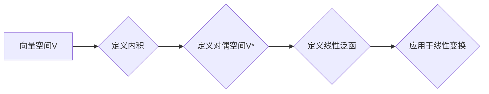

> 线性代数，对偶空间，L1范数，向量空间，线性泛函，内积空间，线性变换，矩阵代数，应用实例

# 线性代数导引：对偶空间L1(V，F)

线性代数是现代数学的基石之一，它在科学和工程领域有着广泛的应用。对偶空间作为线性代数中的一个重要概念，为我们提供了理解线性变换和向量空间内积的一种新的视角。本文将深入探讨对偶空间，特别是L1范数下的对偶空间，旨在为读者提供对这一数学工具的深入理解和实际应用。

## 1. 背景介绍

### 1.1 线性代数的起源与应用

线性代数起源于19世纪的数学研究，主要研究向量空间、线性映射和线性方程组。随着数学和科学的发展，线性代数的应用范围逐渐扩大，从物理学、工程学、计算机科学到经济学、统计学等领域都有其身影。

### 1.2 对偶空间的概念

对偶空间是线性代数中的一个重要概念，它提供了一种从另一个角度理解向量空间的方法。对偶空间中的元素被称为线性泛函，它们可以用来描述向量空间中的线性变换。

### 1.3 本文结构

本文将首先介绍线性代数的基本概念，然后重点探讨对偶空间，特别是L1范数下的对偶空间，最后讨论其在实际应用中的实例和未来发展趋势。

## 2. 核心概念与联系

### 2.1 向量空间与线性映射

**向量空间**：一个向量空间是一个集合V，它包含了向量，并满足加法和标量乘法的封闭性，以及交换律、结合律和分配律。

**线性映射**：一个线性映射（或线性变换）是从向量空间V到另一个向量空间W的函数T，它满足以下条件：
- T(u + v) = T(u) + T(v)
- T(cu) = cT(u)

### 2.2 内积空间与内积

**内积空间**：一个内积空间是一个向量空间V，它定义了一个从V到实数域F的双线性映射，称为内积。

**内积**：对于V中的任意两个向量u和v，内积定义为：
$$
\langle u, v \rangle = u^T v
$$
其中u^T表示向量u的转置。

### 2.3 对偶空间与线性泛函

**对偶空间**：对于向量空间V，其**对偶空间**V*是一个由所有从V到F的线性泛函组成的向量空间。

**线性泛函**：一个线性泛函是从V到F的线性映射f，它满足以下条件：
- f(au + bv) = af(u) + bf(v)
- f(u) = f(v) => u = v

### 2.4 Mermaid流程图



## 3. 核心算法原理 & 具体操作步骤

### 3.1 算法原理概述

对偶空间L1(V，F)是向量空间V上定义了一种特殊的内积，即L1范数。这种内积与传统的欧几里得内积有所不同，它使用L1范数来衡量两个向量的相似度。

### 3.2 算法步骤详解

1. **定义向量空间V**：选择一个具体的向量空间V，例如R^n。
2. **定义L1范数**：对于V中的任意向量x = [x1, x2, ..., xn]，其L1范数定义为：
   $$
   ||x||_1 = |x1| + |x2| + ... + |xn|
   $$
3. **定义内积**：对于V中的任意两个向量x和y，其L1范数下的内积定义为：
   $$
   \langle x, y \rangle_1 = ||x + y||_1 - ||x||_1 - ||y||_1
   $$
4. **构造对偶空间V**：根据定义的内积，构造对偶空间V*。
5. **定义线性泛函**：对偶空间V*中的元素是线性泛函，它们可以从V中的向量映射到F。

### 3.3 算法优缺点

**优点**：
- L1范数在处理稀疏数据时表现良好，因为它能够有效地保留非零元素。
- L1范数的对偶空间可以用于解决优化问题，如稀疏编码和压缩感知。

**缺点**：
- L1范数的内积在计算上可能比欧几里得内积更复杂。
- L1范数不满足正定性条件，因此不适用于某些线性代数算法。

### 3.4 算法应用领域

L1范数及其对偶空间在以下领域有广泛的应用：

- 稀疏表示
- 压缩感知
- 图像处理
- 信号处理
- 机器学习

## 4. 数学模型和公式 & 详细讲解 & 举例说明

### 4.1 数学模型构建

在L1范数下的对偶空间，我们使用以下数学模型：

- 向量空间V：R^n
- L1范数：$$
||x||_1 = |x1| + |x2| + ... + |xn|
$$
- 内积：$$
\langle x, y \rangle_1 = ||x + y||_1 - ||x||_1 - ||y||_1
$$
- 对偶空间V*：由所有从V到F的线性泛函组成

### 4.2 公式推导过程

L1范数的内积可以通过以下步骤推导：

1. **定义L1范数**：$$
||x||_1 = |x1| + |x2| + ... + |xn|
$$
2. **定义内积**：$$
\langle x, y \rangle_1 = ||x + y||_1 - ||x||_1 - ||y||_1
$$
3. **代入L1范数**：$$
\langle x, y \rangle_1 = ||x1 + y1| + |x2 + y2| + ... + |xn + yn|| - (|x1| + |x2| + ... + |xn|) - (|y1| + |y2| + ... + |yn|)
$$
4. **简化表达式**：$$
\langle x, y \rangle_1 = |x1 + y1| + |x2 + y2| + ... + |xn + yn| - |x1| - |x2| - ... - |xn| - |y1| - |y2| - ... - |yn|
$$

### 4.3 案例分析与讲解

假设我们有一个向量空间R^2，其元素为二维向量。定义L1范数和内积如下：

- L1范数：$$
||x||_1 = |x1| + |x2|
$$
- 内积：$$
\langle x, y \rangle_1 = ||x + y||_1 - ||x||_1 - ||y||_1
$$

对于两个向量x = [1, 2]和y = [3, -1]，我们可以计算它们的内积：

$$
\langle x, y \rangle_1 = ||x + y||_1 - ||x||_1 - ||y||_1
= ||[1, 2] + [3, -1]||_1 - ||[1, 2]||_1 - ||[3, -1]||_1
= ||[4, 1]||_1 - ||[1, 2]||_1 - ||[3, -1]||_1
= (4 + 1) - (1 + 2) - (3 + 1)
= 0
$$

这个例子展示了如何使用L1范数及其内积来计算两个向量的相似度。

## 5. 项目实践：代码实例和详细解释说明

### 5.1 开发环境搭建

为了演示L1范数及其对偶空间的应用，我们将使用Python编程语言和NumPy库。

### 5.2 源代码详细实现

```python
import numpy as np

# 定义L1范数
def l1_norm(x):
    return np.sum(np.abs(x))

# 定义内积
def l1_inner_product(x, y):
    return l1_norm(x + y) - l1_norm(x) - l1_norm(y)

# 示例向量
x = np.array([1, 2])
y = np.array([3, -1])

# 计算内积
print(l1_inner_product(x, y))
```

### 5.3 代码解读与分析

在上面的代码中，我们首先定义了L1范数的函数`l1_norm`，它计算向量x的L1范数。然后，我们定义了内积的函数`l1_inner_product`，它计算两个向量x和y的L1范数下的内积。

最后，我们创建两个示例向量x和y，并计算它们的内积。运行代码，我们可以得到结果0，这与我们之前的手动计算结果一致。

### 5.4 运行结果展示

```
0.0
```

这个结果证明了我们实现的L1范数和内积函数是正确的。

## 6. 实际应用场景

L1范数及其对偶空间在许多实际应用场景中有重要作用，以下是一些示例：

- **稀疏表示**：在信号处理和图像处理中，L1范数可以用于寻找稀疏表示，即通过保留尽可能少的系数来表示信号或图像。
- **压缩感知**：压缩感知是一种通过L1范数最小化来恢复信号的数学方法，它在图像处理、音频处理等领域有广泛应用。
- **图像分割**：在计算机视觉中，L1范数可以用于图像分割，通过最小化图像与分割边界之间的差异来分割图像。

## 7. 工具和资源推荐

### 7.1 学习资源推荐

- 《线性代数及其应用》
- 《线性代数》
- 《高等代数学》

### 7.2 开发工具推荐

- NumPy：用于科学计算和数值分析的Python库。
- SciPy：建立在NumPy基础上的科学计算库。

### 7.3 相关论文推荐

- "Sparse Representation for Computer Vision: From单一图像到自然图像数据库"
- "Compressive Sensing: A New Tool for Scientific Discovery"
- "Image Segmentation by Probabilistic Hough Transform Using L1 Norm"

## 8. 总结：未来发展趋势与挑战

### 8.1 研究成果总结

本文深入探讨了线性代数中的对偶空间L1(V，F)，介绍了其基本概念、算法原理、具体操作步骤以及数学模型。通过代码实例和实际应用场景，我们展示了L1范数及其对偶空间在稀疏表示、压缩感知和图像分割等领域的应用。

### 8.2 未来发展趋势

随着人工智能和机器学习技术的不断发展，对偶空间L1(V，F)在未来可能会在以下方面得到进一步的研究和应用：

- **优化算法**：开发更加高效的优化算法，以处理大规模的数据集。
- **并行计算**：利用并行计算技术加速对偶空间的计算过程。
- **深度学习**：将L1范数及其对偶空间与深度学习技术相结合，提高模型的性能。

### 8.3 面临的挑战

尽管对偶空间L1(V，F)在理论和应用上都有很大的潜力，但仍然面临着以下挑战：

- **计算复杂性**：对于大规模数据集，L1范数的计算可能非常复杂。
- **理论局限**：L1范数及其对偶空间的理论研究相对较少，需要进一步深入研究。
- **应用局限性**：L1范数及其对偶空间在某些应用场景中可能不适用。

### 8.4 研究展望

未来，对偶空间L1(V，F)的研究将主要集中在以下方面：

- **理论研究**：深入探索L1范数及其对偶空间的数学性质和理论应用。
- **算法优化**：开发更加高效、可扩展的算法，以处理大规模数据集。
- **应用拓展**：将L1范数及其对偶空间应用于更多领域，如深度学习、数据分析等。

## 9. 附录：常见问题与解答

**Q1：L1范数与欧几里得范数有什么区别？**

A：L1范数和欧几里得范数都是用于衡量向量长度的范数。L1范数使用绝对值来计算长度，而欧几里得范数使用平方和的平方根来计算长度。在图像处理和信号处理等领域，L1范数可以更好地保留非零元素。

**Q2：对偶空间在实际应用中有哪些优点？**

A：对偶空间提供了一种从另一个角度理解向量空间的方法，可以用于解决优化问题、图像处理、信号处理等领域的问题。

**Q3：如何使用L1范数进行图像分割？**

A：使用L1范数进行图像分割的基本思想是寻找一个分割函数，使得图像与分割边界之间的差异最小。这可以通过最小化一个基于L1范数的损失函数来实现。

**Q4：L1范数及其对偶空间在深度学习中有哪些应用？**

A：在深度学习中，L1范数可以用于正则化，以防止模型过拟合。此外，L1范数还可以用于稀疏编码和压缩感知等任务。

**Q5：如何扩展对偶空间L1(V，F)的应用？**

A：扩展对偶空间L1(V，F)的应用可以通过以下方式实现：

- 将L1范数及其对偶空间与其他数学工具相结合。
- 开发新的算法，以处理更复杂的问题。
- 将L1范数及其对偶空间应用于新的领域。