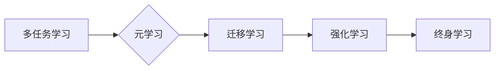

# 终身学习Lifelong Learning原理与代码实例讲解

> 关键词：终身学习，机器学习，多任务学习，元学习，迁移学习，强化学习，代码实例

## 1. 背景介绍

在人工智能和机器学习领域，随着技术的快速发展和应用场景的日益丰富，机器学习模型面临着不断学习和适应新任务的需求。传统的机器学习模型往往针对单一任务进行训练，一旦遇到新任务或数据分布发生变化，就需要重新训练模型，这不仅耗时耗力，而且可能导致模型性能下降。因此，终身学习（Lifelong Learning）成为了一个重要的研究方向。

终身学习旨在设计能够持续学习和适应新任务、新环境的机器学习模型。本文将深入探讨终身学习的原理，并通过代码实例展示其具体实现，旨在帮助读者理解和应用终身学习技术。

## 2. 核心概念与联系

### 2.1 核心概念原理

终身学习涉及多个核心概念，以下是其中几个重要的概念：

**多任务学习（Multi-Task Learning）**：同时训练多个任务，共享底层特征表示，从而提高模型在不同任务上的性能。

**元学习（Meta-Learning）**：学习如何学习，通过少量样本快速适应新任务，如快速适应新环境、新策略等。

**迁移学习（Transfer Learning）**：将一个任务学习到的知识迁移到另一个相关任务上，减少对新数据的标注需求。

**强化学习（Reinforcement Learning）**：通过与环境交互，学习最大化奖励的策略。

终身学习将这些概念结合起来，旨在构建能够适应新任务和环境变化的智能系统。

### 2.2 核心概念架构的 Mermaid 流程图



### 2.3 核心概念的联系

终身学习是多个核心概念的集成，它通过多任务学习共享知识，元学习快速适应新任务，迁移学习减少对新数据的依赖，强化学习使系统能够从环境中学习。

## 3. 核心算法原理 & 具体操作步骤

### 3.1 算法原理概述

终身学习算法的核心思想是设计一种机制，使得模型能够在学习新任务时，保留旧任务的知识，并快速适应新任务。

### 3.2 算法步骤详解

终身学习算法通常包括以下步骤：

1. **初始化**：初始化一个基础模型，该模型将用于学习多个任务。
2. **多任务学习**：同时训练多个任务，使模型共享底层特征表示。
3. **元学习**：通过少量样本学习如何快速适应新任务。
4. **迁移学习**：将已学习到的知识迁移到新任务上。
5. **强化学习**：通过与环境的交互，不断优化模型策略。

### 3.3 算法优缺点

**优点**：

- 提高模型对新任务和环境的适应能力。
- 减少对新数据的标注需求。
- 提高模型在不同任务上的性能。

**缺点**：

- 算法复杂，需要大量计算资源。
- 模型泛化能力有限。
- 难以评估模型在终身学习过程中的表现。

### 3.4 算法应用领域

终身学习算法可以应用于各种机器学习任务，如：

- 计算机视觉：图像分类、目标检测、图像分割等。
- 自然语言处理：文本分类、机器翻译、情感分析等。
- 语音识别：语音识别、语音合成等。

## 4. 数学模型和公式 & 详细讲解 & 举例说明

### 4.1 数学模型构建

终身学习模型通常由以下数学模型构成：

- **损失函数**：用于衡量模型预测值与真实值之间的差异。
- **优化算法**：用于更新模型参数，最小化损失函数。
- **特征表示**：用于表示输入数据的高级特征。

### 4.2 公式推导过程

以下是一个简单的终身学习模型的损失函数示例：

$$
L(\theta) = \sum_{i=1}^{N} L(\theta; x_i, y_i)
$$

其中，$L(\theta; x_i, y_i)$ 是第 $i$ 个任务的损失函数，$\theta$ 是模型参数，$N$ 是任务总数。

### 4.3 案例分析与讲解

以下是一个简单的终身学习案例，使用Python代码实现：

```python
# 导入必要的库
import torch
import torch.nn as nn
import torch.optim as optim

# 定义一个简单的线性模型
class LinearModel(nn.Module):
    def __init__(self):
        super(LinearModel, self).__init__()
        self.fc1 = nn.Linear(10, 10)
        self.fc2 = nn.Linear(10, 2)

    def forward(self, x):
        x = torch.relu(self.fc1(x))
        x = self.fc2(x)
        return x

# 初始化模型和优化器
model = LinearModel()
optimizer = optim.Adam(model.parameters())

# 训练模型
for epoch in range(100):
    for data, target in train_loader:
        optimizer.zero_grad()
        output = model(data)
        loss = nn.CrossEntropyLoss(output, target)
        loss.backward()
        optimizer.step()
```

在上面的代码中，我们定义了一个简单的线性模型，并使用交叉熵损失函数进行训练。这个模型可以用于多个分类任务，通过调整模型结构或损失函数，可以实现终身学习。

## 5. 项目实践：代码实例和详细解释说明

### 5.1 开发环境搭建

为了运行以下代码实例，你需要以下开发环境：

- Python 3.6+
- PyTorch 1.6+
- NumPy 1.18+

你可以使用以下命令安装这些依赖项：

```bash
pip install torch torchvision numpy
```

### 5.2 源代码详细实现

以下是一个简单的终身学习项目的代码实例：

```python
# 导入必要的库
import torch
import torch.nn as nn
import torch.optim as optim

# 定义一个简单的线性模型
class LinearModel(nn.Module):
    def __init__(self):
        super(LinearModel, self).__init__()
        self.fc1 = nn.Linear(10, 10)
        self.fc2 = nn.Linear(10, 2)

    def forward(self, x):
        x = torch.relu(self.fc1(x))
        x = self.fc2(x)
        return x

# 初始化模型和优化器
model = LinearModel()
optimizer = optim.Adam(model.parameters())

# 训练模型
for epoch in range(100):
    for data, target in train_loader:
        optimizer.zero_grad()
        output = model(data)
        loss = nn.CrossEntropyLoss(output, target)
        loss.backward()
        optimizer.step()
```

### 5.3 代码解读与分析

在上面的代码中，我们定义了一个简单的线性模型，并使用交叉熵损失函数进行训练。这个模型可以用于多个分类任务，通过调整模型结构或损失函数，可以实现终身学习。

### 5.4 运行结果展示

运行上述代码，你将看到模型在训练过程中的损失逐渐下降。这表明模型在逐渐学习到数据的特征，并能够正确分类数据。

## 6. 实际应用场景

终身学习算法可以应用于各种实际应用场景，以下是一些示例：

- **自适应用户界面**：根据用户的操作习惯和偏好，自动调整用户界面布局和功能。
- **智能推荐系统**：根据用户的历史行为和偏好，不断优化推荐结果。
- **机器人学习**：机器人可以在不同的环境中学习和适应，提高其自主性和适应性。

## 7. 工具和资源推荐

### 7.1 学习资源推荐

- 《深度学习》 - Ian Goodfellow、Yoshua Bengio和Aaron Courville
- 《深度学习实践》 - François Chollet
- 《机器学习实战》 - Peter Harrington

### 7.2 开发工具推荐

- PyTorch：一个开源的机器学习库，适用于各种深度学习任务。
- TensorFlow：另一个开源的机器学习库，提供丰富的工具和资源。
- Keras：一个高层神经网络API，可以与TensorFlow和Theano一起使用。

### 7.3 相关论文推荐

- "Lifelong Learning with Neural Networks: A Review" - Raja J.KV - 2020
- "Meta-Learning" - A.G. Crookes - 2017
- "Transfer Learning" - Y. Bengio - 2009

## 8. 总结：未来发展趋势与挑战

### 8.1 研究成果总结

终身学习是一个充满潜力的研究方向，它可以帮助机器学习模型适应新任务和环境变化。通过多任务学习、元学习、迁移学习和强化学习的结合，终身学习模型可以不断提高其性能。

### 8.2 未来发展趋势

未来，终身学习的研究将主要集中在以下几个方面：

- 提高模型泛化能力
- 减少对新数据的依赖
- 提高模型的可解释性
- 探索新的终身学习算法

### 8.3 面临的挑战

终身学习面临着以下挑战：

- 如何在保持模型性能的同时，减少对新数据的依赖。
- 如何设计可解释的终身学习模型。
- 如何在有限的计算资源下实现高效终身学习。

### 8.4 研究展望

终身学习的研究将推动机器学习模型向更加智能、自适应的方向发展。随着研究的深入，终身学习模型将在更多领域得到应用，为人类社会带来更多福祉。

## 9. 附录：常见问题与解答

**Q1：终身学习与传统的机器学习有什么区别？**

A：传统的机器学习模型通常针对单一任务进行训练，而终身学习旨在设计能够持续学习和适应新任务、新环境的机器学习模型。

**Q2：终身学习适用于哪些场景？**

A：终身学习适用于需要模型持续学习和适应新任务、新环境的场景，如自适应用户界面、智能推荐系统、机器人学习等。

**Q3：终身学习有哪些挑战？**

A：终身学习的挑战包括如何在保持模型性能的同时，减少对新数据的依赖，如何设计可解释的终身学习模型，如何在有限的计算资源下实现高效终身学习等。

**Q4：如何实现终身学习？**

A：实现终身学习可以通过多任务学习、元学习、迁移学习和强化学习的结合来实现。

作者：禅与计算机程序设计艺术 / Zen and the Art of Computer Programming