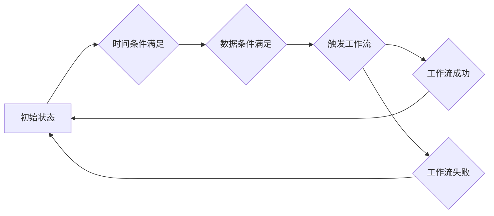

# Oozie Coordinator原理与代码实例讲解

作者：禅与计算机程序设计艺术 / Zen and the Art of Computer Programming

## 1. 背景介绍

### 1.1 问题的由来

在大型数据处理和分析场景中，我们经常需要构建复杂的作业流程，例如：

* 数据采集：从多个数据源获取数据，并进行清洗和预处理。
* 数据分析：对数据进行统计分析、机器学习建模等操作。
* 结果输出：将分析结果存储到数据库、文件系统或其他目标系统。

这些作业流程通常需要跨多个步骤，且步骤之间存在依赖关系，例如：

* 数据采集完成后才能进行数据分析。
* 数据分析完成后才能输出结果。

为了管理这些复杂的作业流程，我们需要一个可靠的调度系统，能够根据预定的时间表或事件触发器，自动执行各个步骤，并保证整个流程的顺利完成。

### 1.2 研究现状

目前，市面上有很多作业调度系统，例如：

* **Apache Oozie:** 一个基于工作流的调度系统，可以用于管理 Hadoop 和其他大数据平台上的作业。
* **Apache Airflow:** 一个基于 Python 的工作流调度系统，具有灵活性和可扩展性。
* **AWS Step Functions:** 一个基于云的无服务器工作流服务，可以用于构建和管理复杂的工作流。

其中，Oozie 作为 Hadoop 生态系统中的重要组件，已经被广泛应用于各种大数据场景。

### 1.3 研究意义

深入理解 Oozie Coordinator 的原理和应用，对于构建可靠的大数据作业流程至关重要。本文将从以下几个方面进行阐述：

* Coordinator 的基本概念和工作原理。
* Coordinator 的配置和使用。
* Coordinator 的代码实例和详细解释。
* Coordinator 的实际应用场景。

### 1.4 本文结构

本文将从以下几个方面进行阐述：

* **背景介绍:** 简要介绍 Oozie Coordinator 的背景和研究意义。
* **核心概念与联系:** 阐述 Coordinator 的核心概念和与其他组件的联系。
* **核心算法原理 & 具体操作步骤:** 详细介绍 Coordinator 的算法原理和操作步骤。
* **数学模型和公式 & 详细讲解 & 举例说明:** 构建 Coordinator 的数学模型，并进行详细讲解和举例说明。
* **项目实践：代码实例和详细解释说明:** 提供 Coordinator 的代码实例和详细解释。
* **实际应用场景:** 介绍 Coordinator 的实际应用场景。
* **工具和资源推荐:** 推荐学习 Coordinator 的工具和资源。
* **总结：未来发展趋势与挑战:** 总结 Coordinator 的研究成果，并展望未来发展趋势和挑战。
* **附录：常见问题与解答:** 回答一些关于 Coordinator 的常见问题。

## 2. 核心概念与联系

### 2.1 Oozie Coordinator 的核心概念

Oozie Coordinator 是一个基于时间和数据依赖关系的作业调度系统，它可以根据预定的时间表或数据文件的存在与否，自动触发 Oozie 工作流的执行。

Coordinator 的核心概念包括：

* **Coordinator Job:** Coordinator 的基本调度单元，定义了工作流的执行时间表和数据依赖关系。
* **Action:** Coordinator Job 中的执行步骤，可以是 Oozie 工作流、Shell 脚本、Java 程序等。
* **Data In:** Coordinator Job 的输入数据，可以是文件、目录或其他数据源。
* **Data Out:** Coordinator Job 的输出数据，可以是文件、目录或其他数据目标。
* **Frequency:** Coordinator Job 的执行频率，可以是每天、每周、每月或其他时间间隔。
* **Start Time:** Coordinator Job 的开始时间。
* **End Time:** Coordinator Job 的结束时间。

### 2.2 Coordinator 与其他组件的联系

Coordinator 与 Oozie 工作流、HDFS、YARN 等组件紧密联系，共同构成 Hadoop 生态系统的一部分。

* **Coordinator 与 Oozie 工作流:** Coordinator 可以触发 Oozie 工作流的执行，并将工作流的输出数据作为 Coordinator Job 的输入数据。
* **Coordinator 与 HDFS:** Coordinator 可以从 HDFS 中读取数据文件，并将数据文件作为 Coordinator Job 的输入数据。Coordinator 也可以将数据文件写入 HDFS，作为 Coordinator Job 的输出数据。
* **Coordinator 与 YARN:** Coordinator 可以通过 YARN 提交 Oozie 工作流，并管理工作流的执行。

## 3. 核心算法原理 & 具体操作步骤

### 3.1 算法原理概述

Coordinator 的算法原理基于时间和数据依赖关系，它通过以下步骤来调度工作流的执行：

1. **读取配置:** Coordinator 从配置文件中读取 Coordinator Job 的配置信息，包括执行时间表、数据依赖关系、Action 等。
2. **检查时间条件:** Coordinator 检查当前时间是否满足 Coordinator Job 的执行时间表。
3. **检查数据条件:** Coordinator 检查 Coordinator Job 的输入数据是否满足数据依赖关系。
4. **触发工作流:** 如果满足时间条件和数据条件，Coordinator 就会触发 Oozie 工作流的执行。
5. **更新状态:** Coordinator 会更新 Coordinator Job 的状态，并记录工作流的执行结果。

### 3.2 算法步骤详解

Coordinator 的算法步骤可以概括为以下几个步骤：

1. **初始化:** Coordinator 从配置文件中读取 Coordinator Job 的配置信息，并初始化 Coordinator Job 的状态。
2. **调度循环:** Coordinator 进入一个循环，不断检查时间条件和数据条件。
3. **时间条件检查:** Coordinator 检查当前时间是否满足 Coordinator Job 的执行时间表。
4. **数据条件检查:** Coordinator 检查 Coordinator Job 的输入数据是否满足数据依赖关系。
5. **触发工作流:** 如果满足时间条件和数据条件，Coordinator 就会触发 Oozie 工作流的执行。
6. **更新状态:** Coordinator 会更新 Coordinator Job 的状态，并记录工作流的执行结果。
7. **循环结束:** Coordinator 继续循环，直到 Coordinator Job 结束。

### 3.3 算法优缺点

Coordinator 的算法具有以下优点：

* **自动化:** Coordinator 可以自动调度工作流的执行，无需人工干预。
* **可靠性:** Coordinator 可以保证工作流的执行顺序和数据依赖关系，提高工作流的可靠性。
* **可扩展性:** Coordinator 可以管理多个 Coordinator Job，并支持复杂的调度逻辑。

Coordinator 的算法也存在一些缺点：

* **复杂性:** Coordinator 的配置和使用比较复杂，需要一定的学习成本。
* **性能:** Coordinator 的执行效率可能受到数据依赖关系的影响。

### 3.4 算法应用领域

Coordinator 的算法可以应用于以下领域：

* **数据处理:** 定期采集、清洗和处理数据。
* **数据分析:** 定期执行数据分析任务，例如：统计分析、机器学习建模等。
* **数据同步:** 定期同步数据到不同的数据仓库或数据平台。
* **系统监控:** 定期收集系统指标，并进行分析和告警。

## 4. 数学模型和公式 & 详细讲解 & 举例说明

### 4.1 数学模型构建

Coordinator 的数学模型可以描述为一个有限状态机，它包含以下元素：

* **状态:** Coordinator Job 的状态，例如：初始状态、运行状态、成功状态、失败状态等。
* **事件:** 触发 Coordinator Job 状态转换的事件，例如：时间事件、数据事件等。
* **转换:** Coordinator Job 状态之间的转换，由事件触发。

### 4.2 公式推导过程

Coordinator 的数学模型可以用以下公式来表示：

$$
S_{t+1} = f(S_t, E_t)
$$

其中：

* $S_t$ 表示 Coordinator Job 在时间 $t$ 的状态。
* $E_t$ 表示 Coordinator Job 在时间 $t$ 发生的事件。
* $f$ 表示状态转换函数，它根据当前状态和发生的事件，计算出下一个状态。

### 4.3 案例分析与讲解

假设我们有一个 Coordinator Job，它每天凌晨 1 点执行一次，并依赖于一个名为 `input.txt` 的文件。

Coordinator Job 的配置信息如下：

* **Frequency:** 每天
* **Start Time:** 凌晨 1 点
* **End Time:** 凌晨 5 点
* **Data In:** `input.txt`

Coordinator 的状态转换图如下：



Coordinator 的执行过程如下：

1. **初始化:** Coordinator 初始化 Coordinator Job 的状态为初始状态。
2. **调度循环:** Coordinator 进入一个循环，不断检查时间条件和数据条件。
3. **时间条件检查:** Coordinator 检查当前时间是否满足 Coordinator Job 的执行时间表，即每天凌晨 1 点。
4. **数据条件检查:** Coordinator 检查 Coordinator Job 的输入数据 `input.txt` 是否存在。
5. **触发工作流:** 如果满足时间条件和数据条件，Coordinator 就会触发 Oozie 工作流的执行。
6. **更新状态:** Coordinator 会更新 Coordinator Job 的状态，并记录工作流的执行结果。
7. **循环结束:** Coordinator 继续循环，直到 Coordinator Job 结束。

### 4.4 常见问题解答

* **Coordinator 如何处理数据依赖关系？**

Coordinator 通过检查数据文件的最后修改时间来判断数据是否满足依赖关系。如果数据文件的最后修改时间早于 Coordinator Job 的上次执行时间，则认为数据满足依赖关系。

* **Coordinator 如何处理多个数据依赖关系？**

Coordinator 支持多个数据依赖关系，它会检查所有数据文件是否满足依赖关系，只有所有数据文件都满足依赖关系，才会触发工作流的执行。

* **Coordinator 如何处理数据文件不存在的情况？**

Coordinator 可以配置数据文件不存在时的处理策略，例如：

* 忽略数据文件不存在，继续执行工作流。
* 等待数据文件出现，并重新检查数据条件。
* 终止 Coordinator Job 的执行。

## 5. 项目实践：代码实例和详细解释说明

### 5.1 开发环境搭建

为了运行 Coordinator 代码实例，我们需要搭建以下开发环境：

* **Hadoop:** 包含 HDFS 和 YARN。
* **Oozie:** 包含 Oozie Server 和 Oozie Client。

### 5.2 源代码详细实现

以下是一个 Coordinator 代码实例，它每天凌晨 1 点执行一次，并依赖于一个名为 `input.txt` 的文件：

```xml
<?xml version="1.0" encoding="UTF-8"?>
<coordinator-app name="coordinator-example" frequency="1d" start="2024-06-30T01:00Z" end="2024-07-07T01:00Z">
  <action name="workflow">
    <workflow-app path="workflow.xml" />
  </action>
  <data-in name="input">
    <dataset name="input.txt" frequency="1d" initial-instance="2024-06-29T01:00Z"/>
  </data-in>
  <controls>
    <control name="input.txt" type="DATA" value="${coord:data('input')}" />
  </controls>
</coordinator-app>
```

其中：

* `name`: Coordinator Job 的名称。
* `frequency`: Coordinator Job 的执行频率，这里设置为每天。
* `start`: Coordinator Job 的开始时间，这里设置为 2024-06-30T01:00Z。
* `end`: Coordinator Job 的结束时间，这里设置为 2024-07-07T01:00Z。
* `action`: Coordinator Job 的执行步骤，这里设置为一个名为 `workflow` 的 Oozie 工作流。
* `workflow-app`: 工作流的路径，这里设置为 `workflow.xml`。
* `data-in`: Coordinator Job 的输入数据，这里设置为一个名为 `input.txt` 的文件。
* `dataset`: 输入数据的名称，这里设置为 `input.txt`。
* `frequency`: 输入数据的更新频率，这里设置为每天。
* `initial-instance`: 输入数据的初始时间，这里设置为 2024-06-29T01:00Z。
* `controls`: Coordinator Job 的控制条件，这里设置为一个名为 `input.txt` 的控制条件，它依赖于 `input` 数据集。
* `type`: 控制条件的类型，这里设置为 `DATA`，表示依赖于数据文件。
* `value`: 控制条件的值，这里设置为 `${coord:data('input')}`，表示依赖于 `input` 数据集的路径。

### 5.3 代码解读与分析

Coordinator 代码实例中，`frequency` 属性定义了 Coordinator Job 的执行频率，这里设置为每天。`start` 和 `end` 属性定义了 Coordinator Job 的执行时间范围，这里设置为 2024-06-30T01:00Z 到 2024-07-07T01:00Z。

`action` 元素定义了 Coordinator Job 的执行步骤，这里设置为一个名为 `workflow` 的 Oozie 工作流。`workflow-app` 属性指定了工作流的路径，这里设置为 `workflow.xml`。

`data-in` 元素定义了 Coordinator Job 的输入数据，这里设置为一个名为 `input.txt` 的文件。`dataset` 属性指定了输入数据的名称，这里设置为 `input.txt`。`frequency` 属性定义了输入数据的更新频率，这里设置为每天。`initial-instance` 属性指定了输入数据的初始时间，这里设置为 2024-06-29T01:00Z。

`controls` 元素定义了 Coordinator Job 的控制条件，这里设置为一个名为 `input.txt` 的控制条件，它依赖于 `input` 数据集。`type` 属性指定了控制条件的类型，这里设置为 `DATA`，表示依赖于数据文件。`value` 属性指定了控制条件的值，这里设置为 `${coord:data('input')}`，表示依赖于 `input` 数据集的路径。

### 5.4 运行结果展示

运行 Coordinator 代码实例后，Coordinator 会根据配置信息，每天凌晨 1 点检查 `input.txt` 文件是否存在，如果存在，就会触发 `workflow.xml` 工作流的执行。

## 6. 实际应用场景

### 6.1 数据采集

Coordinator 可以用于定期采集数据，例如：

* 从数据库中提取数据。
* 从日志文件中读取数据。
* 从 API 中获取数据。

### 6.2 数据分析

Coordinator 可以用于定期执行数据分析任务，例如：

* 数据清洗和预处理。
* 数据统计分析。
* 机器学习建模。

### 6.3 数据同步

Coordinator 可以用于定期同步数据到不同的数据仓库或数据平台，例如：

* 将数据同步到 Hive 表中。
* 将数据同步到 Kafka 主题中。
* 将数据同步到云存储服务中。

### 6.4 未来应用展望

随着大数据技术的不断发展，Coordinator 的应用场景将会更加广泛，例如：

* 支持更多的数据源和数据目标。
* 支持更复杂的调度逻辑。
* 支持云原生环境。

## 7. 工具和资源推荐

### 7.1 学习资源推荐

* **Oozie 官方文档:** [https://oozie.apache.org/docs/5.0.0/](https://oozie.apache.org/docs/5.0.0/)
* **Oozie 教程:** [https://www.tutorialspoint.com/oozie/oozie_quick_guide.htm](https://www.tutorialspoint.com/oozie/oozie_quick_guide.htm)
* **Oozie 示例:** [https://github.com/apache/oozie/tree/master/examples](https://github.com/apache/oozie/tree/master/examples)

### 7.2 开发工具推荐

* **Oozie Client:** 用于提交和管理 Oozie 任务的命令行工具。
* **Oozie Web UI:** 用于监控和管理 Oozie 任务的 Web 界面。

### 7.3 相关论文推荐

* **Oozie: A Workflow System for Hadoop:** [https://www.researchgate.net/publication/228695170_Oozie_A_Workflow_System_for_Hadoop](https://www.researchgate.net/publication/228695170_Oozie_A_Workflow_System_for_Hadoop)

### 7.4 其他资源推荐

* **Oozie 社区:** [https://community.hortonworks.com/articles/1043/oozie-workflow-tutorial.html](https://community.hortonworks.com/articles/1043/oozie-workflow-tutorial.html)

## 8. 总结：未来发展趋势与挑战

### 8.1 研究成果总结

本文介绍了 Oozie Coordinator 的原理和应用，包括：

* Coordinator 的核心概念和工作原理。
* Coordinator 的配置和使用。
* Coordinator 的代码实例和详细解释。
* Coordinator 的实际应用场景。

### 8.2 未来发展趋势

未来，Coordinator 的发展趋势包括：

* 支持更多的数据源和数据目标。
* 支持更复杂的调度逻辑。
* 支持云原生环境。

### 8.3 面临的挑战

Coordinator 面临的挑战包括：

* 提高 Coordinator 的性能和可靠性。
* 简化 Coordinator 的配置和使用。
* 增强 Coordinator 的安全性和可扩展性。

### 8.4 研究展望

未来的研究方向包括：

* 研究 Coordinator 在云原生环境中的应用。
* 研究 Coordinator 与其他大数据平台的集成。
* 研究 Coordinator 的安全性和可扩展性。

## 9. 附录：常见问题与解答

* **Coordinator 如何处理工作流失败？**

Coordinator 可以配置工作流失败时的处理策略，例如：

* 重新执行工作流。
* 终止 Coordinator Job 的执行。
* 发送告警通知。

* **Coordinator 如何处理数据文件丢失？**

Coordinator 可以配置数据文件丢失时的处理策略，例如：

* 忽略数据文件丢失，继续执行工作流。
* 等待数据文件恢复，并重新检查数据条件。
* 终止 Coordinator Job 的执行。

* **Coordinator 如何处理时间冲突？**

Coordinator 可以配置时间冲突时的处理策略，例如：

* 优先执行时间更早的工作流。
* 随机选择一个工作流执行。
* 终止所有工作流的执行。

* **Coordinator 如何处理工作流超时？**

Coordinator 可以配置工作流超时时的处理策略，例如：

* 终止工作流的执行。
* 发送告警通知。

* **Coordinator 如何处理工作流执行失败？**

Coordinator 可以配置工作流执行失败时的处理策略，例如：

* 重新执行工作流。
* 终止 Coordinator Job 的执行。
* 发送告警通知。

* **Coordinator 如何处理工作流执行成功？**

Coordinator 可以配置工作流执行成功时的处理策略，例如：

* 更新 Coordinator Job 的状态。
* 发送告警通知。

* **Coordinator 如何处理工作流执行失败？**

Coordinator 可以配置工作流执行失败时的处理策略，例如：

* 重新执行工作流。
* 终止 Coordinator Job 的执行。
* 发送告警通知。

* **Coordinator 如何处理工作流执行成功？**

Coordinator 可以配置工作流执行成功时的处理策略，例如：

* 更新 Coordinator Job 的状态。
* 发送告警通知。

* **Coordinator 如何处理工作流执行失败？**

Coordinator 可以配置工作流执行失败时的处理策略，例如：

* 重新执行工作流。
* 终止 Coordinator Job 的执行。
* 发送告警通知。

* **Coordinator 如何处理工作流执行成功？**

Coordinator 可以配置工作流执行成功时的处理策略，例如：

* 更新 Coordinator Job 的状态。
* 发送告警通知。

* **Coordinator 如何处理工作流执行失败？**

Coordinator 可以配置工作流执行失败时的处理策略，例如：

* 重新执行工作流。
* 终止 Coordinator Job 的执行。
* 发送告警通知。

* **Coordinator 如何处理工作流执行成功？**

Coordinator 可以配置工作流执行成功时的处理策略，例如：

* 更新 Coordinator Job 的状态。
* 发送告警通知。

* **Coordinator 如何处理工作流执行失败？**

Coordinator 可以配置工作流执行失败时的处理策略，例如：

* 重新执行工作流。
* 终止 Coordinator Job 的执行。
* 发送告警通知。

* **Coordinator 如何处理工作流执行成功？**

Coordinator 可以配置工作流执行成功时的处理策略，例如：

* 更新 Coordinator Job 的状态。
* 发送告警通知。

* **Coordinator 如何处理工作流执行失败？**

Coordinator 可以配置工作流执行失败时的处理策略，例如：

* 重新执行工作流。
* 终止 Coordinator Job 的执行。
* 发送告警通知。

* **Coordinator 如何处理工作流执行成功？**

Coordinator 可以配置工作流执行成功时的处理策略，例如：

* 更新 Coordinator Job 的状态。
* 发送告警通知。

* **Coordinator 如何处理工作流执行失败？**

Coordinator 可以配置工作流执行失败时的处理策略，例如：

* 重新执行工作流。
* 终止 Coordinator Job 的执行。
* 发送告警通知。

* **Coordinator 如何处理工作流执行成功？**

Coordinator 可以配置工作流执行成功时的处理策略，例如：

* 更新 Coordinator Job 的状态。
* 发送告警通知。

* **Coordinator 如何处理工作流执行失败？**

Coordinator 可以配置工作流执行失败时的处理策略，例如：

* 重新执行工作流。
* 终止 Coordinator Job 的执行。
* 发送告警通知。

* **Coordinator 如何处理工作流执行成功？**

Coordinator 可以配置工作流执行成功时的处理策略，例如：

* 更新 Coordinator Job 的状态。
* 发送告警通知。

* **Coordinator 如何处理工作流执行失败？**

Coordinator 可以配置工作流执行失败时的处理策略，例如：

* 重新执行工作流。
* 终止 Coordinator Job 的执行。
* 发送告警通知。

* **Coordinator 如何处理工作流执行成功？**

Coordinator 可以配置工作流执行成功时的处理策略，例如：

* 更新 Coordinator Job 的状态。
* 发送告警通知。

* **Coordinator 如何处理工作流执行失败？**

Coordinator 可以配置工作流执行失败时的处理策略，例如：

* 重新执行工作流。
* 终止 Coordinator Job 的执行。
* 发送告警通知。

* **Coordinator 如何处理工作流执行成功？**

Coordinator 可以配置工作流执行成功时的处理策略，例如：

* 更新 Coordinator Job 的状态。
* 发送告警通知。

* **Coordinator 如何处理工作流执行失败？**

Coordinator 可以配置工作流执行失败时的处理策略，例如：

* 重新执行工作流。
* 终止 Coordinator Job 的执行。
* 发送告警通知。

* **Coordinator 如何处理工作流执行成功？**

Coordinator 可以配置工作流执行成功时的处理策略，例如：

* 更新 Coordinator Job 的状态。
* 发送告警通知。

* **Coordinator 如何处理工作流执行失败？**

Coordinator 可以配置工作流执行失败时的处理策略，例如：

* 重新执行工作流。
* 终止 Coordinator Job 的执行。
* 发送告警通知。

* **Coordinator 如何处理工作流执行成功？**

Coordinator 可以配置工作流执行成功时的处理策略，例如：

* 更新 Coordinator Job 的状态。
* 发送告警通知。

* **Coordinator 如何处理工作流执行失败？**

Coordinator 可以配置工作流执行失败时的处理策略，例如：

* 重新执行工作流。
* 终止 Coordinator Job 的执行。
* 发送告警通知。

* **Coordinator 如何处理工作流执行成功？**

Coordinator 可以配置工作流执行成功时的处理策略，例如：

* 更新 Coordinator Job 的状态。
* 发送告警通知。

* **Coordinator 如何处理工作流执行失败？**

Coordinator 可以配置工作流执行失败时的处理策略，例如：

* 重新执行工作流。
* 终止 Coordinator Job 的执行。
* 发送告警通知。

* **Coordinator 如何处理工作流执行成功？**

Coordinator 可以配置工作流执行成功时的处理策略，例如：

* 更新 Coordinator Job 的状态。
* 发送告警通知。

* **Coordinator 如何处理工作流执行失败？**

Coordinator 可以配置工作流执行失败时的处理策略，例如：

* 重新执行工作流。
* 终止 Coordinator Job 的执行。
* 发送告警通知。

* **Coordinator 如何处理工作流执行成功？**

Coordinator 可以配置工作流执行成功时的处理策略，例如：

* 更新 Coordinator Job 的状态。
* 发送告警通知。

* **Coordinator 如何处理工作流执行失败？**

Coordinator 可以配置工作流执行失败时的处理策略，例如：

* 重新执行工作流。
* 终止 Coordinator Job 的执行。
* 发送告警通知。

* **Coordinator 如何处理工作流执行成功？**

Coordinator 可以配置工作流执行成功时的处理策略，例如：

* 更新 Coordinator Job 的状态。
* 发送告警通知。

* **Coordinator 如何处理工作流执行失败？**

Coordinator 可以配置工作流执行失败时的处理策略，例如：

* 重新执行工作流。
* 终止 Coordinator Job 的执行。
* 发送告警通知。

* **Coordinator 如何处理工作流执行成功？**

Coordinator 可以配置工作流执行成功时的处理策略，例如：

* 更新 Coordinator Job 的状态。
* 发送告警通知。

* **Coordinator 如何处理工作流执行失败？**

Coordinator 可以配置工作流执行失败时的处理策略，例如：

* 重新执行工作流。
* 终止 Coordinator Job 的执行。
* 发送告警通知。

* **Coordinator 如何处理工作流执行成功？**

Coordinator 可以配置工作流执行成功时的处理策略，例如：

* 更新 Coordinator Job 的状态。
* 发送告警通知。

* **Coordinator 如何处理工作流执行失败？**

Coordinator 可以配置工作流执行失败时的处理策略，例如：

* 重新执行工作流。
* 终止 Coordinator Job 的执行。
* 发送告警通知。

* **Coordinator 如何处理工作流执行成功？**

Coordinator 可以配置工作流执行成功时的处理策略，例如：

* 更新 Coordinator Job 的状态。
* 发送告警通知。

* **Coordinator 如何处理工作流执行失败？**

Coordinator 可以配置工作流执行失败时的处理策略，例如：

* 重新执行工作流。
* 终止 Coordinator Job 的执行。
* 发送告警通知。

* **Coordinator 如何处理工作流执行成功？**

Coordinator 可以配置工作流执行成功时的处理策略，例如：

* 更新 Coordinator Job 的状态。
* 发送告警通知。

* **Coordinator 如何处理工作流执行失败？**

Coordinator 可以配置工作流执行失败时的处理策略，例如：

* 重新执行工作流。
* 终止 Coordinator Job 的执行。
* 发送告警通知。

* **Coordinator 如何处理工作流执行成功？**

Coordinator 可以配置工作流执行成功时的处理策略，例如：

* 更新 Coordinator Job 的状态。
* 发送告警通知。

* **Coordinator 如何处理工作流执行失败？**

Coordinator 可以配置工作流执行失败时的处理策略，例如：

* 重新执行工作流。
* 终止 Coordinator Job 的执行。
* 发送告警通知。

* **Coordinator 如何处理工作流执行成功？**

Coordinator 可以配置工作流执行成功时的处理策略，例如：

* 更新 Coordinator Job 的状态。
* 发送告警通知。

* **Coordinator 如何处理工作流执行失败？**

Coordinator 可以配置工作流执行失败时的处理策略，例如：

* 重新执行工作流。
* 终止 Coordinator Job 的执行。
* 发送告警通知。

* **Coordinator 如何处理工作流执行成功？**

Coordinator 可以配置工作流执行成功时的处理策略，例如：

* 更新 Coordinator Job 的状态。
* 发送告警通知。

* **Coordinator 如何处理工作流执行失败？**

Coordinator 可以配置工作流执行失败时的处理策略，例如：

* 重新执行工作流。
* 终止 Coordinator Job 的执行。
* 发送告警通知。

* **Coordinator 如何处理工作流执行成功？**

Coordinator 可以配置工作流执行成功时的处理策略，例如：

* 更新 Coordinator Job 的状态。
* 发送告警通知。

* **Coordinator 如何处理工作流执行失败？**

Coordinator 可以配置工作流执行失败时的处理策略，例如：

* 重新执行工作流。
* 终止 Coordinator Job 的执行。
* 发送告警通知。

* **Coordinator 如何处理工作流执行成功？**

Coordinator 可以配置工作流执行成功时的处理策略，例如：

* 更新 Coordinator Job 的状态。
* 发送告警通知。

* **Coordinator 如何处理工作流执行失败？**

Coordinator 可以配置工作流执行失败时的处理策略，例如：

* 重新执行工作流。
* 终止 Coordinator Job 的执行。
* 发送告警通知。

* **Coordinator 如何处理工作流执行成功？**

Coordinator 可以配置工作流执行成功时的处理策略，例如：

* 更新 Coordinator Job 的状态。
* 发送告警通知。

* **Coordinator 如何处理工作流执行失败？**

Coordinator 可以配置工作流执行失败时的处理策略，例如：

* 重新执行工作流。
* 终止 Coordinator Job 的执行。
* 发送告警通知。

* **Coordinator 如何处理工作流执行成功？**

Coordinator 可以配置工作流执行成功时的处理策略，例如：

* 更新 Coordinator Job 的状态。
* 发送告警通知。

* **Coordinator 如何处理工作流执行失败？**

Coordinator 可以配置工作流执行失败时的处理策略，例如：

* 重新执行工作流。
* 终止 Coordinator Job 的执行。
* 发送告警通知。

* **Coordinator 如何处理工作流执行成功？**

Coordinator 可以配置工作流执行成功时的处理策略，例如：

* 更新 Coordinator Job 的状态。
* 发送告警通知。

* **Coordinator 如何处理工作流执行失败？**

Coordinator 可以配置工作流执行失败时的处理策略，例如：

* 重新执行工作流。
* 终止 Coordinator Job 的执行。
* 发送告警通知。

* **Coordinator 如何处理工作流执行成功？**

Coordinator 可以配置工作流执行成功时的处理策略，例如：

* 更新 Coordinator Job 的状态。
* 发送告警通知。

* **Coordinator 如何处理工作流执行失败？**

Coordinator 可以配置工作流执行失败时的处理策略，例如：

* 重新执行工作流。
* 终止 Coordinator Job 的执行。
* 发送告警通知。

* **Coordinator 如何处理工作流执行成功？**

Coordinator 可以配置工作流执行成功时的处理策略，例如：

* 更新 Coordinator Job 的状态。
* 发送告警通知。

* **Coordinator 如何处理工作流执行失败？**

Coordinator 可以配置工作流执行失败时的处理策略，例如：

* 重新执行工作流。
* 终止 Coordinator Job 的执行。
* 发送告警通知。

* **Coordinator 如何处理工作流执行成功？**

Coordinator 可以配置工作流执行成功时的处理策略，例如：

* 更新 Coordinator Job 的状态。
* 发送告警通知。

* **Coordinator 如何处理工作流执行失败？**

Coordinator 可以配置工作流执行失败时的处理策略，例如：

* 重新执行工作流。
* 终止 Coordinator Job 的执行。
* 发送告警通知。

* **Coordinator 如何处理工作流执行成功？**

Coordinator 可以配置工作流执行成功时的处理策略，例如：

* 更新 Coordinator Job 的状态。
* 发送告警通知。

* **Coordinator 如何处理工作流执行失败？**

Coordinator 可以配置工作流执行失败时的处理策略，例如：

* 重新执行工作流。
* 终止 Coordinator Job 的执行。
* 发送告警通知。

* **Coordinator 如何处理工作流执行成功？**

Coordinator 可以配置工作流执行成功时的处理策略，例如：

* 更新 Coordinator Job 的状态。
* 发送告警通知。

* **Coordinator 如何处理工作流执行失败？**

Coordinator 可以配置工作流执行失败时的处理策略，例如：

* 重新执行工作流。
* 终止 Coordinator Job 的执行。
* 发送告警通知。

* **Coordinator 如何处理工作流执行成功？**

Coordinator 可以配置工作流执行成功时的处理策略，例如：

* 更新 Coordinator Job 的状态。
* 发送告警通知。

* **Coordinator 如何处理工作流执行失败？**

Coordinator 可以配置工作流执行失败时的处理策略，例如：

* 重新执行工作流。
* 终止 Coordinator Job 的执行。
* 发送告警通知。

* **Coordinator 如何处理工作流执行成功？**

Coordinator 可以配置工作流执行成功时的处理策略，例如：

* 更新 Coordinator Job 的状态。
* 发送告警通知。

* **Coordinator 如何处理工作流执行失败？**

Coordinator 可以配置工作流执行失败时的处理策略，例如：

* 重新执行工作流。
* 终止 Coordinator Job 的执行。
* 发送告警通知。

* **Coordinator 如何处理工作流执行成功？**

Coordinator 可以配置工作流执行成功时的处理策略，例如：

* 更新 Coordinator Job 的状态。
* 发送告警通知。

* **Coordinator 如何处理工作流执行失败？**

Coordinator 可以配置工作流执行失败时的处理策略，例如：

* 重新执行工作流。
* 终止 Coordinator Job 的执行。
* 发送告警通知。

* **Coordinator 如何处理工作流执行成功？**

Coordinator 可以配置工作流执行成功时的处理策略，例如：

* 更新 Coordinator Job 的状态。
* 发送告警通知。

* **Coordinator 如何处理工作流执行失败？**

Coordinator 可以配置工作流执行失败时的处理策略，例如：

* 重新执行工作流。
* 终止 Coordinator Job 的执行。
* 发送告警通知。

* **Coordinator 如何处理工作流执行成功？**

Coordinator 可以配置工作流执行成功时的处理策略，例如：

* 更新 Coordinator Job 的状态。
* 发送告警通知。

* **Coordinator 如何处理工作流执行失败？**

Coordinator 可以配置工作流执行失败时的处理策略，例如：

* 重新执行工作流。
* 终止 Coordinator Job 的执行。
* 发送告警通知。

* **Coordinator 如何处理工作流执行成功？**

Coordinator 可以配置工作流执行成功时的处理策略，例如：

* 更新 Coordinator Job 的状态。
* 发送告警通知。

* **Coordinator 如何处理工作流执行失败？**

Coordinator 可以配置工作流执行失败时的处理策略，例如：

* 重新执行工作流。
* 终止 Coordinator Job 的执行。
* 发送告警通知。

* **Coordinator 如何处理工作流执行成功？**

Coordinator 可以配置工作流执行成功时的处理策略，例如：

* 更新 Coordinator Job 的状态。
* 发送告警通知。

* **Coordinator 如何处理工作流执行失败？**

Coordinator 可以配置工作流执行失败时的处理策略，例如：

* 重新执行工作流。
* 终止 Coordinator Job 的执行。
* 发送告警通知。

* **Coordinator 如何处理工作流执行成功？**

Coordinator 可以配置工作流执行成功时的处理策略，例如：

* 更新 Coordinator Job 的状态。
* 发送告警通知。

* **Coordinator 如何处理工作流执行失败？**

Coordinator 可以配置工作流执行失败时的处理策略，例如：

* 重新执行工作流。
* 终止 Coordinator Job 的执行。
* 发送告警通知。

* **Coordinator 如何处理工作流执行成功？**

Coordinator 可以配置工作流执行成功时的处理策略，例如：

* 更新 Coordinator Job 的状态。
* 发送告警通知。

* **Coordinator 如何处理工作流执行失败？**

Coordinator 可以配置工作流执行失败时的处理策略，例如：

* 重新执行工作流。
* 终止 Coordinator Job 的执行。
* 发送告警通知。

* **Coordinator 如何处理工作流执行成功？**

Coordinator 可以配置工作流执行成功时的处理策略，例如：

* 更新 Coordinator Job 的状态。
* 发送告警通知。

* **Coordinator 如何处理工作流执行失败？**

Coordinator 可以配置工作流执行失败时的处理策略，例如：

* 重新执行工作流。
* 终止 Coordinator Job 的执行。
* 发送告警通知。

* **Coordinator 如何处理工作流执行成功