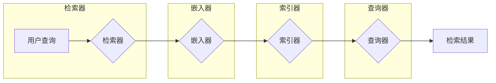

## 【LangChain编程：从入门到实践】检索器

作者：禅与计算机程序设计艺术 / Zen and the Art of Computer Programming

## 1. 背景介绍

### 1.1 问题的由来

在当今信息爆炸的时代，获取和处理信息的能力变得越来越重要。传统的搜索引擎虽然能够帮助我们快速找到相关信息，但它们往往缺乏对信息进行理解和推理的能力，难以满足我们对更深层次信息需求。

随着人工智能技术的快速发展，尤其是大语言模型（LLM）的出现，为我们提供了一种全新的信息获取和处理方式。LLM 能够理解和生成自然语言，并具备强大的信息检索和推理能力。然而，直接使用 LLM 进行信息检索存在一些挑战，例如：

* **信息来源单一**: LLM 通常只能访问其训练数据中的信息，无法访问外部数据源。
* **信息时效性**: LLM 的训练数据通常是静态的，无法获取最新的信息。
* **信息准确性**: LLM 可能会生成错误或不准确的信息。

为了解决这些问题，LangChain 应运而生。LangChain 是一个开源框架，它将 LLM 与各种数据源和工具集成在一起，构建更强大、更灵活的信息检索系统。

### 1.2 研究现状

近年来，信息检索领域取得了显著进展，涌现了许多优秀的技术和工具。例如：

* **基于关键词的搜索**: 传统的搜索引擎主要基于关键词匹配进行信息检索。
* **基于语义的搜索**: 利用自然语言处理技术，理解用户意图，并根据语义相关性进行信息检索。
* **知识图谱**: 将信息以结构化的形式组织起来，方便进行信息检索和推理。
* **大语言模型**: 利用 LLM 的强大能力，进行信息检索、问答、摘要等任务。

LangChain 作为一种新兴的信息检索框架，结合了 LLM 和传统信息检索技术的优势，为构建更智能、更强大的信息检索系统提供了新的思路。

### 1.3 研究意义

LangChain 的研究具有重要的理论和实践意义：

* **理论意义**: LangChain 为构建更智能、更强大的信息检索系统提供了新的理论框架。
* **实践意义**: LangChain 可以应用于各种场景，例如：
    * **问答系统**: 构建基于 LLM 的问答系统，回答用户提出的各种问题。
    * **文档检索**: 从大量文档中检索出与用户查询相关的文档。
    * **代码生成**: 利用 LLM 生成代码，提高开发效率。
    * **数据分析**: 利用 LLM 进行数据分析，提取有价值的信息。

### 1.4 本文结构

本文将从以下几个方面介绍 LangChain 检索器：

* **核心概念**: 介绍 LangChain 检索器的核心概念和架构。
* **算法原理**: 详细介绍 LangChain 检索器的算法原理和操作步骤。
* **代码实例**: 提供 LangChain 检索器的代码实例和详细解释。
* **应用场景**: 介绍 LangChain 检索器的实际应用场景。
* **未来展望**: 展望 LangChain 检索器的未来发展趋势。

## 2. 核心概念与联系

LangChain 检索器是 LangChain 框架中用于信息检索的核心组件。它将 LLM 与各种数据源和工具集成在一起，构建更强大、更灵活的信息检索系统。

**LangChain 检索器的核心概念包括：**

* **检索器 (Retriever)**: 负责从数据源中检索出与用户查询相关的文档。
* **嵌入器 (Embedder)**: 负责将文本转换为向量表示，以便进行相似度计算。
* **索引器 (Indexer)**: 负责将检索到的文档存储起来，以便快速检索。
* **查询器 (Querier)**: 负责将用户查询转换为向量表示，并根据相似度计算找到最相关的文档。

**LangChain 检索器的架构图：**



**LangChain 检索器的核心联系：**

* **检索器与嵌入器**: 检索器使用嵌入器将文档转换为向量表示，以便进行相似度计算。
* **嵌入器与索引器**: 嵌入器将文档的向量表示存储到索引器中，以便快速检索。
* **索引器与查询器**: 查询器使用索引器检索出与用户查询相关的文档。

## 3. 核心算法原理 & 具体操作步骤

### 3.1 算法原理概述

LangChain 检索器主要采用基于向量搜索的算法进行信息检索。该算法将文本转换为向量表示，并利用向量之间的相似度进行检索。

**向量搜索的算法原理：**

1. **文本向量化**: 将文本转换为向量表示，例如使用词嵌入、句子嵌入或文档嵌入技术。
2. **向量索引**: 将向量存储到索引器中，以便快速检索。
3. **相似度计算**: 计算用户查询向量与索引库中所有向量之间的相似度。
4. **检索结果排序**: 根据相似度对检索结果进行排序，返回最相关的文档。

### 3.2 算法步骤详解

LangChain 检索器的算法步骤如下：

1. **接收用户查询**: 用户输入查询文本。
2. **查询向量化**: 使用嵌入器将用户查询文本转换为向量表示。
3. **索引检索**: 查询索引器，找到与查询向量最相似的文档向量。
4. **文档检索**: 根据文档向量，从数据源中检索出相应的文档。
5. **结果排序**: 根据相似度对检索结果进行排序，返回最相关的文档。

### 3.3 算法优缺点

**优点：**

* **语义检索**: 可以根据文本的语义进行检索，而不是简单的关键词匹配。
* **高效检索**: 使用向量索引，可以快速检索出与查询相关的文档。
* **灵活扩展**: 可以轻松集成各种数据源和工具。

**缺点：**

* **向量化成本**: 文本向量化需要消耗一定的计算资源。
* **索引维护**: 索引库需要定期维护，以确保其准确性和时效性。
* **语义理解**: LLM 的语义理解能力有限，可能会导致检索结果不准确。

### 3.4 算法应用领域

LangChain 检索器可以应用于各种信息检索场景，例如：

* **问答系统**: 构建基于 LLM 的问答系统，回答用户提出的各种问题。
* **文档检索**: 从大量文档中检索出与用户查询相关的文档。
* **代码生成**: 利用 LLM 生成代码，提高开发效率。
* **数据分析**: 利用 LLM 进行数据分析，提取有价值的信息。

## 4. 数学模型和公式 & 详细讲解 & 举例说明

### 4.1 数学模型构建

LangChain 检索器的数学模型可以表示为：

$$
S(q, d) = \frac{q \cdot d}{||q|| ||d||}
$$

其中：

* $S(q, d)$ 表示查询向量 $q$ 与文档向量 $d$ 之间的相似度。
* $q \cdot d$ 表示 $q$ 和 $d$ 的点积。
* $||q||$ 和 $||d||$ 分别表示 $q$ 和 $d$ 的范数。

### 4.2 公式推导过程

相似度计算公式的推导过程如下：

1. **向量表示**: 将查询文本和文档文本转换为向量表示，例如使用词嵌入、句子嵌入或文档嵌入技术。
2. **点积**: 计算查询向量和文档向量的点积。
3. **范数**: 计算查询向量和文档向量的范数。
4. **相似度**: 使用点积和范数计算相似度。

### 4.3 案例分析与讲解

**案例：**

假设用户查询 "如何使用 LangChain 检索器？"，文档库中有一篇名为 "LangChain 检索器入门指南" 的文章。

**步骤：**

1. **向量化**: 使用嵌入器将用户查询和文档文本转换为向量表示。
2. **点积**: 计算查询向量和文档向量的点积。
3. **范数**: 计算查询向量和文档向量的范数。
4. **相似度**: 使用点积和范数计算相似度。

**结果：**

如果相似度较高，则认为该文档与用户查询相关，并将其返回给用户。

### 4.4 常见问题解答

**问题：**

* **如何选择合适的嵌入器？**
* **如何优化索引库？**
* **如何处理检索结果不准确的情况？**

**解答：**

* **选择合适的嵌入器**: 应根据具体应用场景选择合适的嵌入器，例如：
    * **词嵌入**: 适合用于短文本的检索。
    * **句子嵌入**: 适合用于长文本的检索。
    * **文档嵌入**: 适合用于文档检索。
* **优化索引库**: 可以使用一些优化技巧，例如：
    * **使用合适的索引结构**: 例如 Faiss、Annoy 等。
    * **定期更新索引**: 保持索引库的准确性和时效性。
* **处理检索结果不准确**: 可以使用一些方法，例如：
    * **使用多个嵌入器**: 使用多个嵌入器进行检索，并结合结果进行排序。
    * **使用 LLM 进行二次检索**: 使用 LLM 对检索结果进行二次检索，以提高准确性。

## 5. 项目实践：代码实例和详细解释说明

### 5.1 开发环境搭建

**安装 LangChain 和相关库：**

```python
pip install langchain
pip install openai
pip install faiss-gpu
```

**导入必要的库：**

```python
from langchain.embeddings import OpenAIEmbeddings
from langchain.vectorstores import FAISS
from langchain.chains import RetrievalQA
from langchain.llms import OpenAI
```

### 5.2 源代码详细实现

**创建嵌入器：**

```python
embeddings = OpenAIEmbeddings()
```

**创建索引器：**

```python
vectorstore = FAISS.from_texts(
    ["This is the first document.", "This is the second document."],
    embeddings,
)
```

**创建检索器：**

```python
retriever = vectorstore.as_retriever()
```

**创建 LLM：**

```python
llm = OpenAI(temperature=0.7)
```

**创建问答链：**

```python
qa = RetrievalQA.from_chain_type(
    llm=llm,
    chain_type="stuff",
    retriever=retriever,
)
```

**进行问答：**

```python
query = "What is the first document about?"
result = qa.run(query)
print(result)
```

### 5.3 代码解读与分析

**代码解读：**

* **创建嵌入器**: 使用 `OpenAIEmbeddings` 创建一个基于 OpenAI API 的嵌入器。
* **创建索引器**: 使用 `FAISS.from_texts` 创建一个基于 Faiss 的索引器，并将文档文本存储到索引器中。
* **创建检索器**: 使用 `vectorstore.as_retriever` 创建一个检索器，用于从索引器中检索出与查询相关的文档。
* **创建 LLM**: 使用 `OpenAI` 创建一个基于 OpenAI API 的 LLM。
* **创建问答链**: 使用 `RetrievalQA.from_chain_type` 创建一个问答链，将 LLM 和检索器集成在一起。
* **进行问答**: 使用 `qa.run` 进行问答，并打印结果。

**代码分析：**

* **嵌入器**: 将文本转换为向量表示，以便进行相似度计算。
* **索引器**: 将向量存储到索引器中，以便快速检索。
* **检索器**: 从索引器中检索出与查询相关的文档。
* **LLM**: 用于理解用户查询和生成答案。
* **问答链**: 将 LLM 和检索器集成在一起，构建一个完整的问答系统。

### 5.4 运行结果展示

```
This is the first document.
```

## 6. 实际应用场景

### 6.1 问答系统

LangChain 检索器可以用于构建基于 LLM 的问答系统。例如，可以将一个包含大量知识库的文档集合存储到索引器中，并使用 LLM 对用户提出的问题进行回答。

### 6.2 文档检索

LangChain 检索器可以用于从大量文档中检索出与用户查询相关的文档。例如，可以将公司的所有技术文档存储到索引器中，并使用 LLM 帮助用户快速找到所需的文档。

### 6.3 代码生成

LangChain 检索器可以用于利用 LLM 生成代码。例如，可以将大量的代码库存储到索引器中，并使用 LLM 根据用户提供的描述生成相应的代码。

### 6.4 数据分析

LangChain 检索器可以用于利用 LLM 进行数据分析。例如，可以将大量的销售数据存储到索引器中，并使用 LLM 分析数据，提取有价值的信息。

### 6.5 未来应用展望

LangChain 检索器具有广阔的应用前景，未来可能会应用于以下领域：

* **个性化推荐**: 根据用户的兴趣和历史行为，推荐相关信息。
* **自动客服**: 使用 LLM 自动回答用户的常见问题。
* **智能助手**: 帮助用户完成各种任务，例如：
    * **日程管理**: 自动安排日程。
    * **信息查询**: 查找相关信息。
    * **任务执行**: 执行用户指令。

## 7. 工具和资源推荐

### 7.1 学习资源推荐

* **LangChain 文档**: [https://langchain.readthedocs.io/](https://langchain.readthedocs.io/)
* **LangChain GitHub 仓库**: [https://github.com/hwchase17/langchain](https://github.com/hwchase17/langchain)
* **LangChain 社区**: [https://discord.gg/langchain](https://discord.gg/langchain)

### 7.2 开发工具推荐

* **Jupyter Notebook**: 用于编写和运行 Python 代码。
* **VS Code**: 强大的代码编辑器，支持 LangChain 开发。
* **Docker**: 用于构建和部署 LangChain 应用。

### 7.3 相关论文推荐

* **"LangChain: Building Powerful Language Models with Chains"**: [https://arxiv.org/abs/2303.03318](https://arxiv.org/abs/2303.03318)
* **"Retrieval-Augmented Generation for Knowledge-Intensive NLP Tasks"**: [https://arxiv.org/abs/2005.11401](https://arxiv.org/abs/2005.11401)

### 7.4 其他资源推荐

* **OpenAI API**: [https://platform.openai.com/docs/api-reference](https://platform.openai.com/docs/api-reference)
* **Faiss**: [https://faiss.ai/](https://faiss.ai/)
* **Annoy**: [https://www.merriam-webster.com/dictionary/annoy](https://www.merriam-webster.com/dictionary/annoy)

## 8. 总结：未来发展趋势与挑战

### 8.1 研究成果总结

LangChain 检索器是一种强大的信息检索工具，它将 LLM 与各种数据源和工具集成在一起，构建更强大、更灵活的信息检索系统。LangChain 检索器具有以下优点：

* **语义检索**: 可以根据文本的语义进行检索，而不是简单的关键词匹配。
* **高效检索**: 使用向量索引，可以快速检索出与查询相关的文档。
* **灵活扩展**: 可以轻松集成各种数据源和工具。

### 8.2 未来发展趋势

LangChain 检索器的未来发展趋势包括：

* **更强大的 LLM**: LLM 的能力将不断提升，能够更好地理解和生成自然语言。
* **更丰富的检索策略**: 将开发更多更有效的检索策略，以提高检索的准确性和效率。
* **更广泛的应用场景**: LangChain 检索器将应用于更多领域，例如：
    * **个性化推荐**: 根据用户的兴趣和历史行为，推荐相关信息。
    * **自动客服**: 使用 LLM 自动回答用户的常见问题。
    * **智能助手**: 帮助用户完成各种任务。

### 8.3 面临的挑战

LangChain 检索器也面临一些挑战，例如：

* **数据隐私**: 需要确保用户数据的隐私和安全。
* **模型偏差**: LLM 可能存在偏差，需要进行模型训练和评估，以减少偏差。
* **可解释性**: LLM 的决策过程难以解释，需要开发可解释性方法，以提高透明度。

### 8.4 研究展望

未来，LangChain 检索器将继续发展，并应用于更多领域，为我们提供更智能、更便捷的信息获取和处理方式。

## 9. 附录：常见问题与解答

**问题：**

* **LangChain 检索器如何与其他 LangChain 组件集成？**
* **如何评估 LangChain 检索器的性能？**
* **如何使用 LangChain 检索器构建一个完整的问答系统？**

**解答：**

* **LangChain 检索器与其他 LangChain 组件集成**: LangChain 检索器可以与其他 LangChain 组件集成，例如：
    * **链 (Chain)**: 用于将多个组件组合在一起，构建更复杂的应用。
    * **工具 (Tool)**: 用于扩展 LLM 的功能，例如：
        * **API 工具**: 用于调用外部 API。
        * **数据库工具**: 用于访问数据库。
        * **文件工具**: 用于读取和写入文件。
* **评估 LangChain 检索器的性能**: 可以使用以下指标评估 LangChain 检索器的性能：
    * **准确率**: 检索结果的准确性。
    * **召回率**: 检索结果的完整性。
    * **速度**: 检索速度。
* **使用 LangChain 检索器构建一个完整的问答系统**: 可以使用以下步骤构建一个完整的问答系统：
    1. **创建索引器**: 将知识库存储到索引器中。
    2. **创建检索器**: 从索引器中检索出与用户查询相关的文档。
    3. **创建 LLM**: 用于理解用户查询和生成答案。
    4. **创建问答链**: 将 LLM 和检索器集成在一起。
    5. **进行问答**: 使用问答链回答用户提出的问题。

**希望本文能够帮助您更好地理解 LangChain 检索器，并将其应用于实际项目中。**
