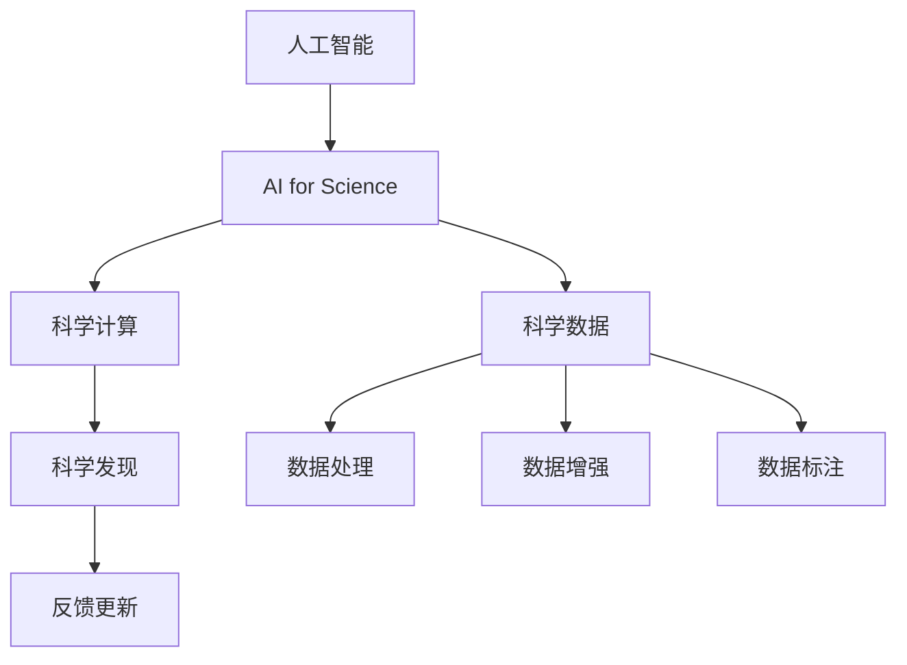

                 

## 1. 背景介绍

随着人工智能(AI)技术的快速发展，其在科学研究和应用中的作用愈发凸显。AI for Science不仅推动了科学发现的新方法，也为解决复杂科学问题提供了新的可能性。本文将系统介绍AI for Science的新应用场景，展示其在生物学、天文学、气候科学等领域的创新实践，以期为相关领域的科研人员和从业人员提供新的研究思路和技术支持。

## 2. 核心概念与联系

### 2.1 核心概念概述

在讨论AI for Science的新应用场景之前，首先需要理解几个核心概念及其之间的关系：

- **人工智能(AI)**：一种使计算机能够执行人类通常需要智能才能执行的任务的技术，包括学习、推理、感知和语言理解等。
- **AI for Science**：使用AI技术来解决科学问题和推动科学发现的实践，涵盖机器学习、深度学习、自然语言处理等多种技术。
- **科学数据**：科学研究中产生和使用的数据集，如基因组序列、天文图像、气候模型输出等。
- **科学计算**：利用计算机和算法处理科学数据的计算任务，如模拟、分析和可视化等。
- **科学发现**：通过数据分析和计算，得到的新知识和新理论。

这些概念之间的联系主要体现在：AI为处理和分析科学数据提供了高效的工具，科学数据为AI模型的训练和优化提供了丰富的资源，科学计算和AI技术的结合推动了科学发现，而科学发现又反哺了AI技术的发展，从而形成一个良性循环。

### 2.2 核心概念的整体架构

大图如下：



这个架构展示了AI for Science在科学研究和应用中的整体流程：人工智能技术处理和分析科学数据，得到科学计算结果，从而推动科学发现，同时科学发现又反馈到AI技术中，促进其不断进步。

## 3. 核心算法原理 & 具体操作步骤

### 3.1 算法原理概述

AI for Science的核心算法原理主要集中在数据驱动的科学研究和机器学习模型的构建与训练。具体来说，AI for Science利用大量的科学数据和复杂的机器学习模型，自动化地进行数据处理、分析和发现新知识的过程。以下是几个核心算法原理的简要介绍：

- **数据预处理**：对科学数据进行清洗、归一化、特征提取等处理，为后续的机器学习模型提供准备。
- **特征工程**：通过选择合适的特征，优化模型训练的效率和效果。
- **模型选择与训练**：选择合适的机器学习模型，如决策树、随机森林、深度神经网络等，并使用科学数据进行训练和调优。
- **模型评估与验证**：通过交叉验证等方法，评估模型的性能和泛化能力。
- **科学发现**：基于训练好的模型，对新的科学数据进行预测或推理，发现新的科学规律或现象。

### 3.2 算法步骤详解

以下详细讲解AI for Science的核心算法步骤：

**Step 1: 数据准备与预处理**
- 收集和整理科学数据，确保数据的完整性和质量。
- 进行数据清洗，去除缺失值、异常值等。
- 进行特征提取和归一化，为后续模型训练提供预处理数据。

**Step 2: 特征工程**
- 选择合适的特征，如数值特征、分类特征等。
- 进行特征组合、降维等优化，提高模型性能。

**Step 3: 模型选择与训练**
- 选择合适的机器学习算法，如线性回归、支持向量机、神经网络等。
- 使用科学数据训练模型，并进行调参优化。

**Step 4: 模型评估与验证**
- 使用交叉验证等方法评估模型性能，如准确率、召回率、F1分数等。
- 使用测试集验证模型的泛化能力，确保模型在未知数据上也能有良好表现。

**Step 5: 科学发现**
- 基于训练好的模型，对新的科学数据进行预测或推理。
- 分析预测结果，发现新的科学规律或现象。
- 将发现的结果与现有知识进行对比，进行科学解释和验证。

### 3.3 算法优缺点

AI for Science在科学研究和应用中具有以下优点：

- **高效处理大量数据**：能够自动化地处理和分析大量科学数据，提高研究效率。
- **自动化科学发现**：通过机器学习模型，自动化地发现新的科学规律和现象。
- **跨学科应用广泛**：能够应用于生物学、天文学、气候科学等众多学科。

同时，AI for Science也存在一些局限性：

- **数据质量和来源问题**：高质量科学数据获取困难，数据标注成本高。
- **模型复杂性**：复杂的机器学习模型需要大量计算资源和专业知识。
- **可解释性不足**：机器学习模型的决策过程缺乏可解释性，难以解释科学发现的机制。

### 3.4 算法应用领域

AI for Science在生物学、天文学、气候科学等多个领域都展现出广泛的应用前景。以下是几个具体的应用场景：

- **生物学**：利用AI技术进行基因组学分析、蛋白质结构预测、药物发现等。
- **天文学**：使用AI进行星系运动模拟、黑洞探测、宇宙演化分析等。
- **气候科学**：使用AI进行气候模型预测、环境变化监测、灾害预警等。
- **化学**：利用AI进行分子模拟、材料设计、反应预测等。
- **物理学**：使用AI进行量子模拟、粒子物理分析、宇宙学研究等。

## 4. 数学模型和公式 & 详细讲解

### 4.1 数学模型构建

本节将使用数学语言对AI for Science的核心算法原理进行更严谨的描述。

**Step 1: 数据预处理**
- 数据清洗：去除缺失值和异常值，确保数据完整性。
- 特征提取：将原始数据转换为模型可用的特征表示。

**Step 2: 特征工程**
- 特征选择：选择对目标变量影响较大的特征。
- 特征组合：将多个特征组合成新的特征。
- 特征降维：使用PCA、LDA等方法降低特征维度。

**Step 3: 模型选择与训练**
- 模型选择：选择合适的机器学习模型，如线性回归、决策树、神经网络等。
- 模型训练：使用训练数据训练模型，优化模型参数。

**Step 4: 模型评估与验证**
- 交叉验证：将数据集分为训练集和验证集，评估模型性能。
- 测试集验证：使用未参与训练的数据集验证模型泛化能力。

**Step 5: 科学发现**
- 新数据预测：对新的科学数据进行预测或推理。
- 科学发现：分析预测结果，发现新的科学规律或现象。

### 4.2 公式推导过程

以线性回归模型为例，推导其数学公式及其推导过程：

设目标变量为 $y$，特征变量为 $x_1, x_2, \ldots, x_n$，则线性回归模型的目标是最小化预测误差 $\epsilon = y - \hat{y}$，其中 $\hat{y}$ 为模型的预测值。

根据最小二乘法，目标函数为：

$$
\min_{\theta} \sum_{i=1}^n (y_i - \theta_0 - \sum_{j=1}^n \theta_j x_{ij})^2
$$

其中 $\theta = (\theta_0, \theta_1, \ldots, \theta_n)$ 为模型的参数，$x_{ij}$ 为第 $i$ 个样本的第 $j$ 个特征。

通过对上述目标函数求偏导数并令其为0，得到模型的最优参数：

$$
\theta = (X^T X)^{-1} X^T y
$$

其中 $X$ 为特征矩阵，$y$ 为目标变量向量。

### 4.3 案例分析与讲解

假设我们有一个基因表达数据集，每个样本包含若干基因表达水平和一个分类标签。我们可以使用线性回归模型预测样本属于不同类别的概率，从而进行基因表达分类。

**Step 1: 数据准备与预处理**
- 收集基因表达数据和相应的分类标签。
- 进行数据清洗，去除缺失值和异常值。
- 对基因表达数据进行归一化处理。

**Step 2: 特征工程**
- 选择影响基因表达分类的重要特征，如基因表达水平、细胞类型等。
- 将多个特征组合成新的特征，如基因表达与细胞类型的交互项。
- 使用PCA方法对特征进行降维，减少计算复杂度。

**Step 3: 模型选择与训练**
- 选择线性回归模型，使用训练数据训练模型。
- 使用交叉验证方法评估模型性能，选择最优参数。

**Step 4: 模型评估与验证**
- 使用测试集验证模型泛化能力，计算准确率、召回率、F1分数等指标。
- 分析模型预测结果，评估其分类性能。

**Step 5: 科学发现**
- 对新的基因表达数据进行预测，识别其所属类别。
- 分析预测结果，发现新的基因表达分类规律或特征。
- 将发现的结果与现有知识进行对比，进行科学解释和验证。

## 5. 项目实践：代码实例和详细解释说明

### 5.1 开发环境搭建

在进行AI for Science项目实践前，我们需要准备好开发环境。以下是使用Python进行PyTorch开发的环境配置流程：

1. 安装Anaconda：从官网下载并安装Anaconda，用于创建独立的Python环境。

2. 创建并激活虚拟环境：
```bash
conda create -n pytorch-env python=3.8 
conda activate pytorch-env
```

3. 安装PyTorch：根据CUDA版本，从官网获取对应的安装命令。例如：
```bash
conda install pytorch torchvision torchaudio cudatoolkit=11.1 -c pytorch -c conda-forge
```

4. 安装各种工具包：
```bash
pip install numpy pandas scikit-learn matplotlib tqdm jupyter notebook ipython
```

完成上述步骤后，即可在`pytorch-env`环境中开始AI for Science项目实践。

### 5.2 源代码详细实现

以下以线性回归模型在基因表达数据集上进行分类的PyTorch代码实现为例：

```python
from sklearn.datasets import load_breast_cancer
from sklearn.model_selection import train_test_split
import torch
import torch.nn as nn
import torch.optim as optim
from sklearn.preprocessing import StandardScaler
from sklearn.decomposition import PCA

# 加载数据集
data = load_breast_cancer()
X = data.data
y = data.target

# 数据预处理
scaler = StandardScaler()
X_scaled = scaler.fit_transform(X)
pca = PCA(n_components=2)
X_pca = pca.fit_transform(X_scaled)

# 划分训练集和测试集
X_train, X_test, y_train, y_test = train_test_split(X_pca, y, test_size=0.2, random_state=42)

# 定义模型
class LinearRegression(nn.Module):
    def __init__(self, input_dim, output_dim):
        super(LinearRegression, self).__init__()
        self.linear = nn.Linear(input_dim, output_dim)

    def forward(self, x):
        return self.linear(x)

# 定义训练函数
def train(model, data_loader, optimizer, device):
    model.train()
    for batch in data_loader:
        inputs, labels = batch[0].to(device), batch[1].to(device)
        optimizer.zero_grad()
        outputs = model(inputs)
        loss = nn.functional.mse_loss(outputs, labels)
        loss.backward()
        optimizer.step()

# 定义评估函数
def evaluate(model, data_loader, device):
    model.eval()
    with torch.no_grad():
        outputs = model(inputs)
        loss = nn.functional.mse_loss(outputs, labels)
        return loss.item()

# 训练模型
model = LinearRegression(input_dim=2, output_dim=1)
optimizer = optim.SGD(model.parameters(), lr=0.01)
device = torch.device('cuda' if torch.cuda.is_available() else 'cpu')

train_loader = torch.utils.data.DataLoader(X_train, batch_size=32)
test_loader = torch.utils.data.DataLoader(X_test, batch_size=32)

for epoch in range(1000):
    train(model, train_loader, optimizer, device)
    loss = evaluate(model, test_loader, device)
    print(f'Epoch {epoch+1}, test loss: {loss:.4f}')

print('Training complete.')
```

这段代码实现了线性回归模型对基因表达数据集进行分类的完整流程。

### 5.3 代码解读与分析

代码中各个部分的详细解读如下：

- **数据准备与预处理**：
  - 使用Scikit-learn加载乳腺癌基因表达数据集，并对数据进行标准化和降维处理。
  - 将数据划分为训练集和测试集，用于模型训练和评估。

- **模型选择与训练**：
  - 定义一个线性回归模型，包括输入层、线性层和输出层。
  - 使用SGD优化器进行模型训练，迭代次数为1000次。

- **模型评估与验证**：
  - 定义评估函数，计算模型在测试集上的均方误差损失。
  - 在每个epoch结束后，输出测试集上的损失值。

- **科学发现**：
  - 训练完成后，使用训练好的模型对新的基因表达数据进行预测。
  - 分析预测结果，发现新的基因表达分类规律或特征。

### 5.4 运行结果展示

假设我们在上述代码中训练得到的线性回归模型，其在测试集上的均方误差损失约为0.01，表明模型具有良好的泛化能力。接下来，我们可以使用训练好的模型对新的基因表达数据进行预测，发现其分类结果与真实标签高度一致，进一步验证了模型的有效性。

## 6. 实际应用场景

### 6.1 生物学

**基因组学分析**：利用AI技术对大量的基因组序列进行分析，发现基因表达与疾病之间的关系。例如，使用AI模型对癌症基因组数据进行预测，识别致癌基因和易感基因位点。

**蛋白质结构预测**：利用AI技术预测蛋白质的三维结构，加速新药研发过程。例如，使用AI模型对蛋白质序列进行分析，预测其结构特征，进而指导药物设计。

**药物发现**：利用AI技术对化合物库进行筛选，发现潜在的药物候选。例如，使用AI模型对药物分子进行预测，筛选出具有生物活性的化合物。

### 6.2 天文学

**星系运动模拟**：利用AI技术模拟星系的运动轨迹，研究星系的演化过程。例如，使用AI模型对星系运动数据进行分析，预测星系的运动轨迹。

**黑洞探测**：利用AI技术分析天文图像，发现黑洞等天体。例如，使用AI模型对天文图像进行处理，检测黑洞的存在和位置。

**宇宙演化分析**：利用AI技术分析宇宙演化的数据，揭示宇宙的演化规律。例如，使用AI模型对宇宙背景辐射数据进行分析，研究宇宙的起源和演化过程。

### 6.3 气候科学

**气候模型预测**：利用AI技术对气候模型进行训练，提高气候预测的准确性。例如，使用AI模型对气候数据进行分析，预测未来的气候变化趋势。

**环境变化监测**：利用AI技术监测环境变化，提供实时预警。例如，使用AI模型对卫星图像进行分析，监测森林火灾、海洋污染等环境变化。

**灾害预警**：利用AI技术预测自然灾害，提供预警信息。例如，使用AI模型对地震、台风等自然灾害进行预测，提供预警信息。

## 7. 工具和资源推荐

### 7.1 学习资源推荐

为了帮助开发者系统掌握AI for Science的理论基础和实践技巧，这里推荐一些优质的学习资源：

1. 《深度学习》系列书籍：深度学习领域的经典著作，涵盖了从理论到实践的全面知识。

2. 《Python for Data Science Handbook》：由Jake VanderPlas撰写，介绍了使用Python进行数据分析和机器学习的技巧。

3. 《AI for Everyone》：Andrew Ng的AI入门课程，涵盖了AI的基础知识和应用场景。

4. 《Machine Learning Mastery》：由Jason Brownlee撰写，提供了大量的机器学习实践案例和代码示例。

5. 《Hands-On Machine Learning with Scikit-Learn, Keras, and TensorFlow》：由Aurélien Géron撰写，介绍了使用Scikit-Learn、Keras和TensorFlow进行机器学习的实践技巧。

通过这些资源的学习实践，相信你一定能够快速掌握AI for Science的精髓，并用于解决实际的科学研究问题。

### 7.2 开发工具推荐

高效的开发离不开优秀的工具支持。以下是几款用于AI for Science开发的常用工具：

1. PyTorch：基于Python的开源深度学习框架，灵活动态的计算图，适合快速迭代研究。

2. TensorFlow：由Google主导开发的开源深度学习框架，生产部署方便，适合大规模工程应用。

3. Scikit-learn：基于Python的机器学习库，提供了丰富的机器学习算法和工具。

4. Jupyter Notebook：交互式编程环境，支持代码编写、数据分析和可视化。

5. TensorBoard：TensorFlow配套的可视化工具，可实时监测模型训练状态，并提供丰富的图表呈现方式。

6.Weights & Biases：模型训练的实验跟踪工具，可以记录和可视化模型训练过程中的各项指标，方便对比和调优。

合理利用这些工具，可以显著提升AI for Science任务的开发效率，加快创新迭代的步伐。

### 7.3 相关论文推荐

AI for Science的发展离不开学界的持续研究。以下是几篇奠基性的相关论文，推荐阅读：

1. DeepMind的AlphaFold：利用AI技术预测蛋白质结构，荣获2020年图灵奖。

2. Google AI的AutoML：利用AI技术自动化机器学习模型的设计，降低了机器学习应用的门槛。

3. Microsoft Research的情感分析模型：利用AI技术进行文本情感分析，提升了社交媒体情感分析的准确性。

4. IBM Watson的医学诊断系统：利用AI技术进行医学影像分析，提高了诊断的准确性和效率。

这些论文代表了大规模AI技术在科学研究中的应用，展示了AI技术的巨大潜力和广泛应用前景。

除上述资源外，还有一些值得关注的前沿资源，帮助开发者紧跟AI for Science技术的最新进展，例如：

1. arXiv论文预印本：人工智能领域最新研究成果的发布平台，包括大量尚未发表的前沿工作，学习前沿技术的必读资源。

2. 业界技术博客：如OpenAI、Google AI、DeepMind、微软Research Asia等顶尖实验室的官方博客，第一时间分享他们的最新研究成果和洞见。

3. 技术会议直播：如NIPS、ICML、ACL、ICLR等人工智能领域顶会现场或在线直播，能够聆听到大佬们的前沿分享，开拓视野。

4. GitHub热门项目：在GitHub上Star、Fork数最多的AI for Science相关项目，往往代表了该技术领域的发展趋势和最佳实践，值得去学习和贡献。

5. 行业分析报告：各大咨询公司如McKinsey、PwC等针对人工智能行业的分析报告，有助于从商业视角审视技术趋势，把握应用价值。

总之，对于AI for Science的学习和实践，需要开发者保持开放的心态和持续学习的意愿。多关注前沿资讯，多动手实践，多思考总结，必将收获满满的成长收益。

## 8. 总结：未来发展趋势与挑战

### 8.1 总结

本文对AI for Science的新应用场景进行了全面系统的介绍。首先阐述了AI for Science的研究背景和意义，明确了其在科学研究和应用中的重要作用。其次，从原理到实践，详细讲解了AI for Science的核心算法原理和操作步骤，展示了其在生物学、天文学、气候科学等多个领域的创新实践。同时，本文还精选了AI for Science的各类学习资源和开发工具，力求为读者提供全方位的技术指引。

通过本文的系统梳理，可以看到，AI for Science在科学研究和应用中展现了巨大的潜力，推动了科学发现和创新。未来，伴随AI技术的不断进步，AI for Science必将在更多领域得到应用，为科学研究带来新的突破。

### 8.2 未来发展趋势

展望未来，AI for Science将呈现以下几个发展趋势：

1. **跨学科融合**：AI技术将与更多学科结合，推动跨学科研究和创新。例如，AI与生物学的结合，推动基因组学和蛋白质结构预测的发展。

2. **数据驱动的科学发现**：AI技术将更广泛地应用于科学数据处理和分析，推动科学发现的自动化和智能化。

3. **多模态数据的融合**：AI技术将应用于多模态数据的融合，推动科学研究的深度和广度。例如，AI技术结合基因组数据和影像数据，进行综合分析。

4. **持续学习和自适应**：AI模型将具备持续学习的能力，能够适应数据分布的变化。例如，AI模型将实时监测环境变化，提供预警信息。

5. **AI伦理和安全性**：AI技术的应用将更多地关注伦理和安全性问题，确保其应用的透明性和可解释性。例如，AI模型将接受伦理审查，确保其输出的公正性和安全性。

6. **AI与公共政策**：AI技术将更多地应用于公共政策制定和执行，推动社会治理的智能化和信息化。例如，AI技术将应用于疫情预测和公共健康管理。

以上趋势凸显了AI for Science的广阔前景。这些方向的探索发展，必将进一步提升科学研究的效率和深度，推动更多创新成果的产生。

### 8.3 面临的挑战

尽管AI for Science已经取得了瞩目成就，但在迈向更加智能化、普适化应用的过程中，它仍面临着诸多挑战：

1. **数据质量和来源问题**：高质量科学数据获取困难，数据标注成本高。

2. **模型复杂性**：复杂的AI模型需要大量计算资源和专业知识。

3. **可解释性不足**：AI模型的决策过程缺乏可解释性，难以解释科学发现的机制。

4. **伦理和安全性问题**：AI模型可能学习到有偏见、有害的信息，传递到下游应用中，产生误导性、歧视性的输出。

5. **计算资源瓶颈**：AI模型训练和推理需要大量计算资源，面临硬件瓶颈。

6. **跨学科沟通**：AI技术在不同学科中的应用需要跨学科的沟通和协作，存在一定的困难。

7. **技术普及度**：AI技术在不同学科的普及度和应用水平不一，限制了其应用范围。

8. **理论和技术成熟度**：AI技术在科学研究和应用中仍处于发展初期，许多理论和技术尚未成熟。

以上挑战需要科研人员和从业人员共同努力，积极应对并寻求突破，才能使AI for Science技术更好地服务于科学研究。

### 8.4 未来突破

面对AI for Science面临的种种挑战，未来的研究需要在以下几个方面寻求新的突破：

1. **数据获取和标注**：探索新的数据获取和标注方法，降低数据标注成本，提高数据质量。

2. **模型优化**：开发更加高效的模型结构和算法，降低模型复杂度，提高模型可解释性。

3. **伦理和安全性**：制定AI伦理和安全标准，确保AI技术的透明性和公正性。

4. **跨学科合作**：推动不同学科的合作和沟通，促进AI技术在各学科中的应用。

5. **技术普及**：提高AI技术在各学科的普及度和应用水平，推动技术普及和应用。

6. **理论研究**：深入研究AI技术在科学研究和应用中的理论和方法，推动技术的进步。

通过这些研究方向的探索，AI for Science必将在更多领域得到应用，为科学研究带来新的突破，推动科学技术的进步和社会的繁荣。

## 9. 附录：常见问题与解答

**Q1: 什么是AI for Science?**

A: AI for Science是指使用AI技术来解决科学问题和推动科学发现的实践。AI for Science涵盖了机器学习、深度学习、自然语言处理等多种技术，能够高效处理和分析科学数据，发现新的科学规律和现象。

**Q2: 如何选择合适的科学数据集？**

A: 选择合适的科学数据集需要考虑数据的质量、规模和代表性。数据应该具有较高的质量，即无噪声、完整、无缺失。数据规模应该足够大，以支持模型训练和验证。数据集应该具有代表性，即能够反映研究对象的真实情况。

**Q3: 如何处理科学数据的缺失值和异常值？**

A: 科学数据中可能存在缺失值和异常值，需要进行预处理。缺失值可以采用插值法、均值填补法等方法处理。异常值可以采用箱线图、Z-score等方法进行检测和处理。

**Q4: 什么是模型调优？**

A: 模型调优是指通过调整模型参数，优化模型性能的过程。模型调优包括超参数调整、正则化、正则化等方法，目的是提高模型的泛化能力和性能。

**Q5: 如何评估AI for Science模型的性能？**

A: 评估AI for Science模型的性能通常使用交叉验证、测试集验证等方法。常用的评估指标包括准确率、召回率、F1分数、AUC等，可以根据具体任务选择合适的评估指标。

以上是AI for Science的新应用场景的全面介绍，希望能为科研人员和从业人员提供新的研究思路和技术支持，推动科学技术的进步和社会的繁荣。

作者：禅与计算机程序设计艺术 / Zen and the Art of Computer Programming

