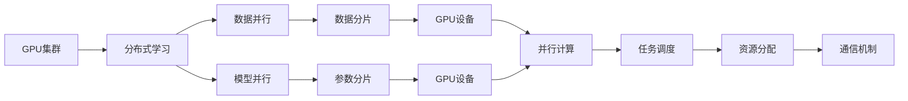

                 

# AI 大模型原理与应用：物理世界GPU集群建设问题

> 关键词：大模型, GPU集群, 高性能计算, AI训练, 分布式学习, 分布式训练, 数据并行, 模型并行

## 1. 背景介绍

随着人工智能技术的快速发展，大模型在大数据处理和复杂问题解决上展现了前所未有的能力。AI 大模型，如BERT, GPT-3, T5等，已经广泛应用于自然语言处理、计算机视觉、语音识别等多个领域，并取得显著成效。但与此同时，训练这些大模型的计算需求日益增加，单台计算机已难以满足。为了实现高效率、高并行度的计算，GPU 集群应运而生。

### 1.1 问题由来

AI 大模型的训练和推理通常涉及巨量的计算资源。由于模型参数众多，训练过程耗时较长，单台计算机的计算能力已不能满足需求。GPU 集群通过将计算任务分布到多个 GPU 上并行计算，可以有效提升计算效率，加速模型训练和推理。

### 1.2 问题核心关键点

GPU 集群的主要技术挑战在于如何合理分配任务、管理资源、提升效率。理想情况下，每个 GPU 的计算任务应均衡，保证资源利用率最大化，避免某台设备过载或闲置。GPU 集群系统的设计，包括任务调度、资源分配、通信机制等，直接影响了整体性能。

### 1.3 问题研究意义

构建高效的 GPU 集群系统，对于降低训练成本、加速AI模型开发，推动AI技术的普及和应用具有重要意义。通过GPU集群，可以支持更大规模的AI大模型训练，提升模型性能，加速商业化和落地应用。

## 2. 核心概念与联系

### 2.1 核心概念概述

- **GPU 集群**：由多个 GPU 构成的计算集群，用于处理大规模并行计算任务，加速AI模型的训练和推理。
- **分布式学习**：将训练任务分散到多个设备上进行，利用多台计算机同时计算，提高训练效率。
- **数据并行**：将数据集分散到多个设备上进行计算，每个 GPU 处理一部分数据。
- **模型并行**：将模型参数分散到多个设备上进行计算，每个 GPU 处理一部分参数。
- **NVIDIA CUDA**：NVIDIA开发的并行计算平台和编程模型，支持在GPU上进行高效的并行计算。
- **MPI（消息传递接口）**：用于消息传递和通信的标准接口，支持分布式计算。

这些核心概念之间存在紧密联系，共同构成了GPU集群系统的基础框架。GPU集群通过分布式学习和并行计算，实现了高效的大模型训练。

### 2.2 概念间的关系


通过以下Mermaid流程图展示GPU集群核心概念之间的关系：



这个流程图展示了大模型训练过程中，GPU集群各个核心概念的作用和关系。数据并行和模型并行将任务和参数分散到多个GPU设备上进行计算，任务调度和管理资源分配保证任务均衡，通信机制确保数据和参数在设备间高效传输。

## 3. 核心算法原理 & 具体操作步骤

### 3.1 算法原理概述

GPU集群训练大模型的基本原理是通过数据并行和模型并行，将训练任务分散到多个GPU设备上进行计算。具体而言，数据并行是将数据集分散到多个设备上进行并行计算，模型并行是将模型参数分散到多个设备上进行并行计算。这两种并行方式可以结合使用，进一步提升计算效率。

### 3.2 算法步骤详解

GPU集群训练大模型的步骤如下：

**Step 1: 准备数据集和计算资源**

1. 收集并标注训练数据集，分割成多个分片。
2. 准备计算资源，包括多个GPU设备、内存、存储等。

**Step 2: 数据并行计算**

1. 使用分布式数据存储系统，如Hadoop、Spark等，将数据集分片存储到各个GPU设备上。
2. 使用数据并行算法，如SGD、Adam等，在各个GPU设备上同时更新模型参数。

**Step 3: 模型并行计算**

1. 使用模型并行算法，如模型分片、参数分片等，将模型参数分片存储到各个GPU设备上。
2. 在各个GPU设备上同时计算模型参数，更新模型权重。

**Step 4: 任务调度与资源分配**

1. 使用任务调度算法，如Master-Worker、Multi-Worker等，分配任务到各个GPU设备上。
2. 使用资源分配算法，如静态分配、动态分配等，合理分配GPU资源，避免某台设备过载或闲置。

**Step 5: 通信与同步**

1. 使用通信机制，如MPI、CUDA等，确保数据和参数在设备间高效传输。
2. 使用同步机制，如AllReduce、Barrier等，确保各个GPU设备计算一致。

**Step 6: 模型评估与调整**

1. 在训练过程中，定期在验证集上评估模型性能。
2. 根据评估结果调整模型参数、学习率等，优化模型训练过程。

**Step 7: 模型保存与部署**

1. 保存训练好的模型，方便后续使用。
2. 将模型部署到实际应用中，进行推理预测。

### 3.3 算法优缺点

GPU集群训练大模型的优点包括：

- **高效并行**：通过分布式学习和并行计算，可以大幅提升训练效率，加速模型训练。
- **资源利用率高**：合理分配任务和资源，避免某台设备过载或闲置，提高资源利用率。
- **可扩展性强**：根据需要增加GPU设备，扩展集群规模，满足更大规模的计算需求。

缺点包括：

- **成本高**：GPU集群建设需要较高的硬件投入，维护成本也较高。
- **复杂度高**：集群系统设计和管理复杂，需要专业知识和技能。
- **通信开销大**：数据和参数在设备间传输，通信开销较大。

### 3.4 算法应用领域

GPU集群训练大模型广泛应用于以下几个领域：

- **自然语言处理**：如BERT、GPT-3等大模型，用于文本分类、情感分析、机器翻译等任务。
- **计算机视觉**：如ResNet、VGG等大模型，用于图像分类、物体检测、图像分割等任务。
- **语音识别**：如Wav2Vec2等大模型，用于语音识别、语音合成等任务。
- **推荐系统**：如Youtube、Amazon等推荐系统，使用大模型进行用户行为预测和推荐。
- **游戏和模拟**：如GTA5、Minecraft等游戏中使用大模型进行场景生成和渲染。

这些应用领域，由于计算需求量大，对GPU集群训练大模型具有较高依赖。

## 4. 数学模型和公式 & 详细讲解 & 举例说明

### 4.1 数学模型构建

假设我们有一张具有$N$个样本和$D$个特征的大数据集，使用GPU集群进行分布式训练。我们将数据集分割成$K$个分片，每个分片大小为$\frac{N}{K}$。在$M$个GPU设备上进行并行计算，每个设备计算一部分样本。

令$\theta$表示模型参数，$L(\theta)$表示损失函数。分布式训练的目标是最小化全局损失函数$\mathcal{L}(\theta)$：

$$
\mathcal{L}(\theta) = \frac{1}{M} \sum_{i=1}^{M} \frac{1}{N} \sum_{j=1}^{\frac{N}{K}} \ell(x_i, y_i, \theta)
$$

其中，$x_i$和$y_i$表示第$i$个GPU设备上的样本和标签，$\ell(x_i, y_i, \theta)$表示模型在当前设备上的损失函数。

### 4.2 公式推导过程

假设每个设备上的计算周期为$t$，总计算周期为$T$。每个设备的计算速度为$s$，总计算速度为$S$。每个设备上的样本大小为$n$，总样本大小为$N$。

则每个设备的并行计算速度为：

$$
s = \frac{n}{t}
$$

总并行计算速度为：

$$
S = \frac{N}{T}
$$

将总样本大小$N$和计算周期$T$代入上式，得到：

$$
S = \frac{N}{\sum_{i=1}^{M} t_i}
$$

其中$t_i$表示第$i$个设备的计算时间。

假设每个设备计算一部分样本，每个设备的样本大小为$\frac{N}{K}$。则每个设备的并行计算速度为：

$$
s = \frac{\frac{N}{K}}{t}
$$

总并行计算速度为：

$$
S = \frac{N}{\sum_{i=1}^{M} t_i}
$$

将总样本大小$N$和计算周期$T$代入上式，得到：

$$
S = \frac{N}{\sum_{i=1}^{M} t_i}
$$

### 4.3 案例分析与讲解

假设我们有一张具有$10000$个样本和$1000$个特征的大数据集，使用$8$个GPU设备进行分布式训练，每个设备计算一部分样本，每个设备的样本大小为$\frac{10000}{8}=1250$个样本。

令每个设备的计算速度为$0.5$次/秒，总计算速度为$S$。则有：

$$
S = \frac{10000}{t_1 + t_2 + \cdots + t_8}
$$

令每个设备的计算时间为$t_i=2$秒，则有：

$$
S = \frac{10000}{16} = 625 \text{次/秒}
$$

此时，如果每个设备每秒钟可以计算$50$个样本，则总并行计算速度为$625 \times 50 = 31250$个样本/秒。

通过并行计算，可以大幅提升计算效率，加速模型训练。同时，通过合理的资源分配和任务调度，可以避免某台设备过载或闲置，提高资源利用率。

## 5. 项目实践：代码实例和详细解释说明

### 5.1 开发环境搭建

**Step 1: 安装NVIDIA CUDA**

1. 下载NVIDIA CUDA安装程序，安装NVIDIA CUDA Toolkit。
2. 配置环境变量，使CUDA库路径添加到系统环境变量中。

**Step 2: 安装MPI**

1. 下载MPI安装程序，安装MPI库。
2. 配置环境变量，使MPI库路径添加到系统环境变量中。

**Step 3: 安装分布式训练框架**

1. 下载TensorFlow或PyTorch等分布式训练框架。
2. 安装并配置框架，使分布式训练模块正常工作。

### 5.2 源代码详细实现

**代码实现**

假设我们使用TensorFlow进行分布式训练，代码如下：

```python
import tensorflow as tf
import numpy as np

# 定义数据集和标签
x_train = np.random.randn(1000, 1000)
y_train = np.random.randint(0, 2, size=(1000,))

# 定义分布式计算图
with tf.distribute.Strategy.scope(tf.distribute.MirroredStrategy()) as strategy:
    # 定义模型
    model = tf.keras.Sequential([
        tf.keras.layers.Dense(64, activation='relu'),
        tf.keras.layers.Dense(1, activation='sigmoid')
    ])
    
    # 定义优化器
    optimizer = tf.keras.optimizers.Adam(learning_rate=0.01)
    
    # 定义分布式损失函数
    def distributed_loss_fn(labels):
        with strategy.scope():
            # 在每个设备上计算损失函数
            loss = tf.reduce_mean(tf.keras.losses.binary_crossentropy(labels, model(x_train)))
            return loss
    
    # 定义分布式训练步骤
    def distributed_train_step(x, y):
        with strategy.scope():
            # 在每个设备上计算损失函数
            loss = distributed_loss_fn(y)
            # 在每个设备上计算梯度
            gradients = strategy.extended.colocate_with(loss).collective_grads(loss)
            # 更新模型参数
            optimizer.apply_gradients(zip(gradients, model.trainable_variables))
    
    # 定义训练循环
    for epoch in range(10):
        for i in range(0, 1000, 128):
            x_batch = x_train[i:i+128]
            y_batch = y_train[i:i+128]
            distributed_train_step(x_batch, y_batch)
```

### 5.3 代码解读与分析

**代码解读**

上述代码中，我们使用了TensorFlow的分布式策略`MirroredStrategy`，将模型参数分布在多个GPU设备上。在每个设备上计算损失函数和梯度，并使用分布式优化器`Adam`更新模型参数。

具体而言，代码实现分为以下几个步骤：

1. 定义数据集和标签。
2. 定义分布式计算图。
3. 定义模型、优化器和损失函数。
4. 定义分布式训练步骤。
5. 定义训练循环。

通过分布式训练，可以高效地处理大规模数据集，加速模型训练。同时，通过合理的资源分配和任务调度，可以避免某台设备过载或闲置，提高资源利用率。

**分析**

通过以上代码实现，我们可以看到分布式训练的优势和挑战。

- **优势**：
  - 并行计算可以显著提升计算效率，加速模型训练。
  - 分布式优化器可以优化模型参数更新，提高训练效果。

- **挑战**：
  - 分布式训练需要较多的硬件投入和软件配置，成本较高。
  - 分布式训练需要合理分配任务和资源，避免某台设备过载或闲置。

## 6. 实际应用场景

### 6.1 智能客服系统

智能客服系统需要实时处理大量客户咨询，对计算效率要求较高。通过GPU集群训练大模型，可以加速智能客服系统建设，提升客户服务体验。

在实际应用中，我们可以将客户咨询数据分片存储到多个GPU设备上，使用分布式训练算法训练大模型，提取客户意图和情感，生成个性化回复。通过不断优化模型，提升智能客服系统的准确性和响应速度。

### 6.2 金融舆情监测

金融舆情监测需要实时处理海量文本数据，对计算效率要求较高。通过GPU集群训练大模型，可以加速金融舆情监测系统建设，提高市场监测效率。

在实际应用中，我们可以将金融新闻、评论等文本数据分片存储到多个GPU设备上，使用分布式训练算法训练大模型，实时监测市场舆情变化，及时预警风险。通过不断优化模型，提升金融舆情监测系统的准确性和实时性。

### 6.3 个性化推荐系统

个性化推荐系统需要实时处理用户行为数据，对计算效率要求较高。通过GPU集群训练大模型，可以加速个性化推荐系统建设，提升用户体验。

在实际应用中，我们可以将用户行为数据分片存储到多个GPU设备上，使用分布式训练算法训练大模型，生成个性化推荐结果。通过不断优化模型，提升个性化推荐系统的准确性和个性化程度。

### 6.4 未来应用展望

未来，GPU集群训练大模型的应用场景将更加广泛，主要体现在以下几个方面：

- **计算需求大的领域**：如计算机视觉、自然语言处理、语音识别等，将更多地采用分布式训练方式，提升计算效率。
- **实时性要求高的应用**：如实时推荐系统、实时舆情监测等，将更多地采用GPU集群训练大模型，满足实时性要求。
- **跨领域应用**：如智能交通、智能制造、智能医疗等，将更多地采用GPU集群训练大模型，提升应用效果。

随着计算资源和技术的不断进步，GPU集群训练大模型的应用场景将更加广泛，推动AI技术的进一步普及和应用。

## 7. 工具和资源推荐

### 7.1 学习资源推荐

- **NVIDIA官方文档**：提供NVIDIA CUDA和MPI的详细安装和使用指南，是学习和使用GPU集群的必备资源。
- **TensorFlow官方文档**：提供TensorFlow分布式训练的详细教程，是学习和使用TensorFlow的必备资源。
- **PyTorch官方文档**：提供PyTorch分布式训练的详细教程，是学习和使用PyTorch的必备资源。
- **相关论文和博客**：如《分布式深度学习：一种新范式》、《TensorFlow分布式训练教程》等，提供分布式训练的深入讲解和实践指导。

### 7.2 开发工具推荐

- **NVIDIA CUDA Toolkit**：用于NVIDIA GPU设备的安装和开发，提供丰富的GPU计算资源和工具。
- **MPI库**：用于分布式计算和通信，提供跨节点通信和数据交换的解决方案。
- **TensorFlow**：用于深度学习模型的分布式训练，提供高效、灵活的分布式计算框架。
- **PyTorch**：用于深度学习模型的分布式训练，提供高效、灵活的分布式计算框架。
- **Jupyter Notebook**：用于编写和执行分布式训练代码，提供丰富的数据可视化工具。

### 7.3 相关论文推荐

- **分布式深度学习：一种新范式**：介绍分布式深度学习的理论和实践，提供分布式计算的深入讲解和实践指导。
- **TensorFlow分布式训练教程**：提供TensorFlow分布式训练的详细教程，是学习和使用TensorFlow的必备资源。
- **PyTorch分布式训练教程**：提供PyTorch分布式训练的详细教程，是学习和使用PyTorch的必备资源。

## 8. 总结：未来发展趋势与挑战

### 8.1 研究成果总结

本文对GPU集群训练大模型的原理、操作步骤、数学模型和实际应用进行了详细讲解。通过分布式计算和并行计算，可以显著提升计算效率，加速模型训练。GPU集群训练大模型在智能客服系统、金融舆情监测、个性化推荐系统等领域具有重要应用价值。

### 8.2 未来发展趋势

未来，GPU集群训练大模型的发展趋势主要体现在以下几个方面：

- **计算资源更强大**：随着计算资源和技术的不断进步，GPU集群将支持更强大的计算能力，推动大模型训练效率的进一步提升。
- **分布式计算更高效**：分布式计算技术将更加成熟和高效，能够更好地适应大规模数据集和复杂模型的训练需求。
- **应用场景更广泛**：GPU集群训练大模型将在更多领域得到应用，推动AI技术的进一步普及和应用。

### 8.3 面临的挑战

尽管GPU集群训练大模型具有显著优势，但仍面临一些挑战：

- **计算资源成本高**：GPU集群建设需要较高的硬件投入，维护成本也较高。
- **分布式计算复杂度高**：分布式计算需要合理分配任务和资源，避免某台设备过载或闲置。
- **通信开销大**：数据和参数在设备间传输，通信开销较大。

### 8.4 研究展望

为了应对未来GPU集群训练大模型的挑战，未来的研究需要在以下几个方面进行探索：

- **资源优化技术**：开发更加高效的资源分配和任务调度算法，提高资源利用率。
- **通信优化技术**：开发更加高效的通信机制，降低通信开销。
- **模型并行技术**：开发更加高效的模型并行算法，提升并行计算效率。

总之，GPU集群训练大模型将在未来成为AI技术的重要范式，推动AI技术的进一步发展和应用。通过不断优化资源分配、任务调度和通信机制，可以有效提升计算效率，满足大规模数据集和复杂模型的训练需求。未来，随着计算资源和技术的不断进步，GPU集群训练大模型将在更多领域得到应用，推动AI技术的进一步普及和应用。

## 9. 附录：常见问题与解答

**Q1：GPU集群训练大模型是否适用于所有NLP任务？**

A: GPU集群训练大模型在自然语言处理、计算机视觉、语音识别等领域具有重要应用价值。但对于一些特定领域的任务，如医学、法律等，仅仅依靠通用语料预训练的模型可能难以很好地适应。此时需要在特定领域语料上进一步预训练，再进行微调，才能获得理想效果。

**Q2：GPU集群训练大模型的成本如何？**

A: GPU集群训练大模型的成本较高，主要包括硬件成本和维护成本。硬件成本包括GPU设备的购买和维护，维护成本包括集群系统运行和故障修复的费用。

**Q3：GPU集群训练大模型的复杂度如何？**

A: GPU集群训练大模型的复杂度较高，需要专业知识和技能。需要合理分配任务和资源，避免某台设备过载或闲置，同时需要优化通信和同步机制，保证数据和参数在设备间高效传输。

**Q4：GPU集群训练大模型是否适用于大规模数据集？**

A: GPU集群训练大模型适用于大规模数据集，可以有效提升计算效率，加速模型训练。但同时需要合理分配任务和资源，避免某台设备过载或闲置，保证计算效率。

**Q5：GPU集群训练大模型是否适用于实时性要求高的应用？**

A: GPU集群训练大模型适用于实时性要求高的应用，如实时推荐系统、实时舆情监测等。通过分布式计算和并行计算，可以满足实时性要求，提升应用效果。

总之，GPU集群训练大模型在自然语言处理、计算机视觉、语音识别等领域具有重要应用价值。通过合理分配任务和资源，可以有效提升计算效率，满足大规模数据集和复杂模型的训练需求。未来，随着计算资源和技术的不断进步，GPU集群训练大模型将在更多领域得到应用，推动AI技术的进一步普及和应用。

---

作者：禅与计算机程序设计艺术 / Zen and the Art of Computer Programming

