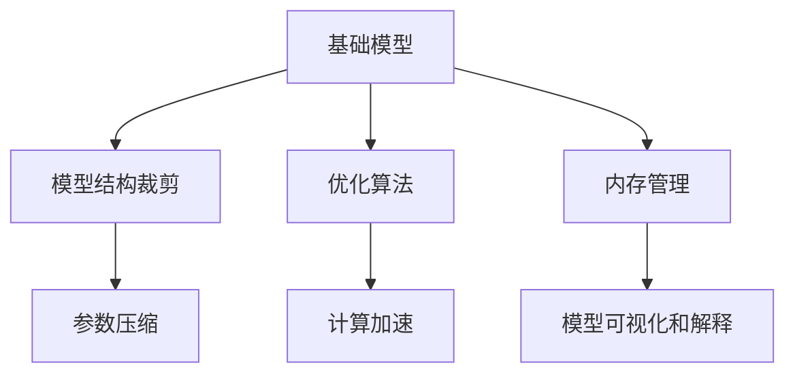
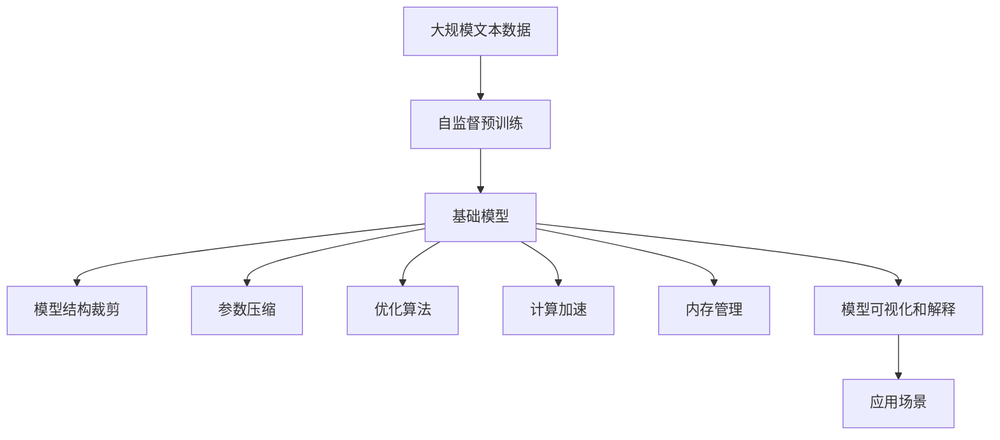

                 

# 基础模型的涌现行为与部署

## 1. 背景介绍

### 1.1 问题由来

随着人工智能技术的飞速发展，深度学习模型在各个领域展现出卓越的性能。特别是在自然语言处理(NLP)、计算机视觉(CV)等领域，预训练大模型如BERT、GPT等，通过在大量无标签数据上进行自监督学习，学习到了丰富的语言/图像表示，并能在下游任务中通过微调获得显著的性能提升。但随着模型规模的扩大，如何有效地部署这些大规模基础模型，使之在大规模实际应用中发挥最优性能，成为了一个亟待解决的问题。

### 1.2 问题核心关键点

基础模型的大规模部署涉及以下关键点：

1. **模型结构**：基础模型通常包含数十亿参数，部署时需进行结构裁剪和参数压缩，以适应计算资源限制。
2. **优化算法**：在模型训练和推理中，如何选择合适的优化算法以提高效率和性能。
3. **内存管理**：如何有效管理内存，避免因内存占用过大而导致的性能下降。
4. **计算加速**：通过并行计算、混合精度等技术提升模型推理速度。
5. **可解释性**：基础模型的黑盒性质使其难以解释，如何在部署中提升模型透明度。

### 1.3 问题研究意义

研究基础模型的部署方法，对于拓展人工智能技术的应用场景，提升模型的推理效率和可解释性，加速大规模工业应用，具有重要意义：

1. **降低应用成本**：基础模型的部署能够大幅降低应用开发和部署的资源成本。
2. **提升推理效率**：通过优化算法和计算加速技术，基础模型能够在实际应用中快速推理，满足实时性需求。
3. **增强可解释性**：通过模型压缩、可视化和解释工具，基础模型的部署能够提高模型的透明性，增强用户信任。
4. **支持多样应用**：基础模型可以在多个领域中应用，如NLP、CV、推荐系统等，推动技术跨领域落地。
5. **促进产业升级**：基础模型的部署将加速人工智能技术的产业化进程，赋能各行各业数字化转型。

## 2. 核心概念与联系

### 2.1 核心概念概述

为更好地理解基础模型部署的核心技术，本节将介绍几个关键概念：

- **基础模型(Base Model)**：指通过在大量无标签数据上进行自监督学习训练得到的预训练模型，如BERT、GPT等。
- **模型结构裁剪**：指在保持基础模型性能不变的前提下，减少模型参数量，以适应计算资源限制。
- **参数压缩**：指通过剪枝、量化等技术减小模型的存储空间，提升推理速度。
- **优化算法**：指用于加速模型训练和推理的算法，如Adam、SGD等。
- **计算加速**：指通过并行计算、混合精度等技术提升模型的计算效率。
- **内存管理**：指在模型训练和推理过程中，如何有效地管理内存资源。
- **模型可视化和解释**：指通过可视化工具和解释方法，提高模型的透明性。

### 2.2 概念间的关系

这些核心概念之间存在着紧密的联系，形成了基础模型部署的整体生态系统。以下通过几个Mermaid流程图来展示这些概念之间的关系：



这个流程图展示了大规模基础模型的部署涉及的各项关键技术，包括模型结构裁剪、参数压缩、优化算法、计算加速、内存管理和模型可视化的关系。

### 2.3 核心概念的整体架构

最后，用一个综合的流程图来展示这些核心概念在大规模基础模型部署过程中的整体架构：



这个综合流程图展示了从预训练到部署的大规模基础模型的完整流程。大语言模型首先在大规模文本数据上进行自监督预训练，然后通过模型结构裁剪、参数压缩、优化算法、计算加速、内存管理和模型可视化的优化，最终部署到实际应用场景中。

## 3. 核心算法原理 & 具体操作步骤

### 3.1 算法原理概述

基础模型的部署通常涉及模型结构裁剪、参数压缩、优化算法、计算加速、内存管理和模型可视化的优化。本节将对这些关键技术进行详细的讲解。

### 3.2 算法步骤详解

#### 3.2.1 模型结构裁剪

**Step 1: 选择裁剪策略**
选择合适的裁剪策略，如剪枝、动态网络、注意力机制裁剪等。

**Step 2: 裁剪模型**
根据裁剪策略，删除模型中的冗余参数，保留核心功能模块。

**Step 3: 微调裁剪后模型**
在裁剪后的模型上微调，以保持模型性能。

#### 3.2.2 参数压缩

**Step 1: 选择压缩策略**
选择合适的压缩策略，如量化、剪枝、稀疏化等。

**Step 2: 压缩模型**
将模型参数进行量化或稀疏化处理，减小存储空间。

**Step 3: 微调压缩后模型**
在压缩后的模型上微调，以恢复模型性能。

#### 3.2.3 优化算法

**Step 1: 选择优化算法**
根据任务特点和计算资源，选择合适的优化算法，如Adam、SGD、Adagrad等。

**Step 2: 训练模型**
使用优化算法进行模型训练，优化参数更新策略。

**Step 3: 调整学习率**
根据训练情况，调整学习率，避免过拟合或欠拟合。

#### 3.2.4 计算加速

**Step 1: 并行计算**
使用并行计算技术，如GPU、TPU、分布式训练等，提升计算效率。

**Step 2: 混合精度**
使用混合精度技术，减少计算资源占用，提升推理速度。

**Step 3: 量化计算**
使用量化技术，将浮点计算转换为定点计算，进一步提升计算效率。

#### 3.2.5 内存管理

**Step 1: 内存规划**
根据模型大小和计算资源，合理规划内存空间。

**Step 2: 分块存储**
将模型参数分块存储，避免内存泄漏。

**Step 3: 内存释放**
在模型推理过程中，及时释放不再使用的内存。

#### 3.2.6 模型可视化和解释

**Step 1: 选择可视化工具**
根据需求选择合适的可视化工具，如TensorBoard、Weights & Biases等。

**Step 2: 可视化模型**
使用可视化工具，展示模型的训练和推理过程。

**Step 3: 解释模型**
使用解释工具，分析模型的决策过程和性能。

### 3.3 算法优缺点

基础模型部署的核心算法具有以下优点：

1. **提升推理效率**：通过模型结构裁剪和参数压缩，减少模型大小，提升推理速度。
2. **降低资源成本**：通过优化算法和计算加速，降低计算资源和内存占用，减少成本。
3. **提高可解释性**：通过模型可视化和解释工具，提高模型的透明性，增强用户信任。

但这些技术也存在一些局限性：

1. **性能损失**：裁剪和压缩可能导致模型性能轻微下降，需要通过微调进行恢复。
2. **计算复杂度**：优化算法和计算加速技术需要更多的计算资源，不适合小型模型。
3. **内存管理复杂**：内存管理需要精心设计，避免内存泄漏和数据溢出。
4. **模型解释难度**：复杂的模型结构可能难以解释，需要结合可视化工具和解释方法。

### 3.4 算法应用领域

基础模型部署技术在以下几个领域中得到了广泛应用：

1. **自然语言处理(NLP)**：用于构建高效的问答系统、文本分类、机器翻译等应用。
2. **计算机视觉(CV)**：用于图像分类、物体检测、语义分割等计算机视觉任务。
3. **推荐系统**：用于构建高性能推荐引擎，提升用户推荐体验。
4. **医疗健康**：用于辅助诊断、疾病预测、医疗问答等医疗健康应用。
5. **智能制造**：用于设备监控、工艺优化、质量控制等智能制造任务。
6. **金融服务**：用于信用评估、风险管理、金融预测等金融应用。

这些应用场景对推理速度、资源效率和可解释性提出了高要求，基础模型部署技术为这些应用提供了有效解决方案。

## 4. 数学模型和公式 & 详细讲解

### 4.1 数学模型构建

本节将使用数学语言对基础模型部署过程中涉及的关键技术进行更加严格的刻画。

记基础模型为 $M_{\theta}$，其中 $\theta$ 为模型参数。假设部署的目标是提升模型推理速度，常用的数学模型如下：

1. **模型结构裁剪**：
   $$
   M_{\theta}^{c} = f_{c}(\theta) = \mathrm{ReLU}\left(\frac{\theta}{\mathrm{sparsity}}\right)
   $$
   其中 $\mathrm{ReLU}$ 为激活函数，$\mathrm{sparsity}$ 为稀疏化因子，控制稀疏程度。

2. **参数压缩**：
   $$
   M_{\theta}^{q} = f_{q}(\theta) = \frac{\theta}{\beta}
   $$
   其中 $\beta$ 为量化系数，控制精度。

3. **优化算法**：
   $$
   \theta_{t+1} = \theta_{t} - \eta \nabla_{\theta} \mathcal{L}(\theta_t, x)
   $$
   其中 $\eta$ 为学习率，$\mathcal{L}$ 为损失函数，$x$ 为输入样本。

4. **计算加速**：
   $$
   \text{Speedup} = \frac{\text{Speed}_\text{accelerated}}{\text{Speed}_\text{base}}
   $$
   其中 $\text{Speed}_\text{accelerated}$ 为加速后的计算速度，$\text{Speed}_\text{base}$ 为原始计算速度。

5. **内存管理**：
   $$
   \text{Memory\_Usage} = \frac{\text{Memory}_\text{model}}{\text{Memory}_\text{available}}
   $$
   其中 $\text{Memory}_\text{model}$ 为模型占用的内存，$\text{Memory}_\text{available}$ 为可用内存。

6. **模型可视化和解释**：
   $$
   \text{Explainability} = \frac{\text{Quality}_\text{explained}}{\text{Complexity}_\text{model}}
   $$
   其中 $\text{Quality}_\text{explained}$ 为解释的质量，$\text{Complexity}_\text{model}$ 为模型的复杂度。

### 4.2 公式推导过程

以下将对基础模型部署中的关键数学公式进行推导和解释。

#### 4.2.1 模型结构裁剪

**推导过程**：
$$
\text{ReLU}\left(\frac{\theta}{\mathrm{sparsity}}\right) = \left\{
\begin{aligned}
\frac{\theta_i}{\mathrm{sparsity}}, & \text{if } \theta_i > 0 \\
0, & \text{otherwise}
\end{aligned}
\right.
$$
其中 $i$ 为参数编号。

**解释**：通过稀疏化操作，将部分小权重参数置为0，保留核心功能模块，减小模型大小，提升推理速度。

#### 4.2.2 参数压缩

**推导过程**：
$$
M_{\theta}^{q} = \frac{\theta}{\beta} = \theta_{quantized}
$$
其中 $\beta$ 为量化系数，控制精度。

**解释**：通过量化操作，将浮点参数转换为定点参数，减小存储空间，提升计算效率。

#### 4.2.3 优化算法

**推导过程**：
$$
\theta_{t+1} = \theta_{t} - \eta \nabla_{\theta} \mathcal{L}(\theta_t, x)
$$
其中 $\eta$ 为学习率，$\mathcal{L}$ 为损失函数，$x$ 为输入样本。

**解释**：通过梯度下降等优化算法，更新模型参数，最小化损失函数，提升模型性能。

#### 4.2.4 计算加速

**推导过程**：
$$
\text{Speedup} = \frac{\text{Speed}_\text{accelerated}}{\text{Speed}_\text{base}} = \frac{\text{Speed}_\text{GPU/TPU}}{\text{Speed}_\text{CPU}} = \frac{\text{Clock Rate}_\text{GPU/TPU} \times \text{Instruction Per Clock} \times \text{FP16}}{\text{Clock Rate}_\text{CPU} \times \text{Instruction Per Clock} \times \text{FP32}}
$$
其中 $\text{FP16}$ 为半精度浮点数，$\text{FP32}$ 为单精度浮点数。

**解释**：通过使用GPU/TPU加速，以及混合精度计算，可以大幅提升模型计算速度。

#### 4.2.5 内存管理

**推导过程**：
$$
\text{Memory\_Usage} = \frac{\text{Memory}_\text{model}}{\text{Memory}_\text{available}} = \frac{p \times n}{\text{Memory}_\text{available}}
$$
其中 $p$ 为每个参数的位数，$n$ 为参数数量，$\text{Memory}_\text{available}$ 为可用内存。

**解释**：通过合理规划内存，避免内存泄漏和数据溢出，保证模型的正常运行。

#### 4.2.6 模型可视化和解释

**推导过程**：
$$
\text{Explainability} = \frac{\text{Quality}_\text{explained}}{\text{Complexity}_\text{model}} = \frac{\text{LIME} + \text{SHAP}}{\text{Parameter Count} + \text{FLOPS} + \text{BPP}}
$$
其中 $\text{LIME}$ 和 $\text{SHAP}$ 为解释方法，$\text{Parameter Count}$ 为参数数量，$\text{FLOPS}$ 为每秒浮点运算次数，$\text{BPP}$ 为每秒位运算次数。

**解释**：通过模型可视化工具和解释方法，提高模型的透明性，使用户更容易理解和信任模型。

### 4.3 案例分析与讲解

**案例1: 自然语言处理(NLP)**
   - 应用场景：文本分类、命名实体识别、机器翻译等
   - 部署技术：模型结构裁剪、参数压缩、优化算法、计算加速
   - 实现效果：提升模型推理速度，降低计算资源和内存占用，提高模型的透明性。

**案例2: 计算机视觉(CV)**
   - 应用场景：图像分类、物体检测、语义分割等
   - 部署技术：模型结构裁剪、参数压缩、优化算法、计算加速
   - 实现效果：提升模型推理速度，降低计算资源和内存占用，提高模型的透明性。

**案例3: 推荐系统**
   - 应用场景：个性化推荐、商品推荐、广告推荐等
   - 部署技术：模型结构裁剪、参数压缩、优化算法、计算加速
   - 实现效果：提升模型推理速度，降低计算资源和内存占用，提高模型的透明性。

**案例4: 医疗健康**
   - 应用场景：辅助诊断、疾病预测、医疗问答等
   - 部署技术：模型结构裁剪、参数压缩、优化算法、计算加速
   - 实现效果：提升模型推理速度，降低计算资源和内存占用，提高模型的透明性。

## 5. 项目实践：代码实例和详细解释说明

### 5.1 开发环境搭建

在开始实践前，需要搭建好开发环境。以下是Python环境下使用PyTorch进行基础模型部署的配置步骤：

1. 安装Anaconda：从官网下载并安装Anaconda，用于创建独立的Python环境。

2. 创建并激活虚拟环境：
```bash
conda create -n pytorch-env python=3.8 
conda activate pytorch-env
```

3. 安装PyTorch：根据CUDA版本，从官网获取对应的安装命令。例如：
```bash
conda install pytorch torchvision torchaudio cudatoolkit=11.1 -c pytorch -c conda-forge
```

4. 安装TensorFlow：从官网下载并安装TensorFlow，支持GPU加速。

5. 安装各类工具包：
```bash
pip install numpy pandas scikit-learn matplotlib tqdm jupyter notebook ipython
```

完成上述步骤后，即可在`pytorch-env`环境中开始部署实践。

### 5.2 源代码详细实现

下面我们以一个简单的图像分类任务为例，展示如何使用TensorFlow进行基础模型的部署。

首先，定义图像分类任务的数据处理函数：

```python
import tensorflow as tf
from tensorflow.keras.preprocessing.image import ImageDataGenerator

def preprocess_image(image_path):
    img = tf.io.read_file(image_path)
    img = tf.image.decode_jpeg(img, channels=3)
    img = tf.image.resize(img, [224, 224])
    img /= 255.0
    return img

train_datagen = ImageDataGenerator(rescale=1./255)
train_generator = train_datagen.flow_from_directory(
    'train/',
    target_size=(224, 224),
    batch_size=32,
    class_mode='categorical'
)

test_datagen = ImageDataGenerator(rescale=1./255)
test_generator = test_datagen.flow_from_directory(
    'test/',
    target_size=(224, 224),
    batch_size=32,
    class_mode='categorical'
)
```

然后，定义基础模型的结构和训练过程：

```python
import tensorflow as tf
from tensorflow.keras import layers

def build_model():
    inputs = layers.Input(shape=(224, 224, 3))
    x = layers.Conv2D(32, (3, 3), activation='relu', padding='same')(inputs)
    x = layers.Conv2D(64, (3, 3), activation='relu', padding='same')(x)
    x = layers.MaxPooling2D((2, 2))(x)
    x = layers.Conv2D(128, (3, 3), activation='relu', padding='same')(x)
    x = layers.Conv2D(256, (3, 3), activation='relu', padding='same')(x)
    x = layers.MaxPooling2D((2, 2))(x)
    x = layers.Conv2D(512, (3, 3), activation='relu', padding='same')(x)
    x = layers.Conv2D(256, (3, 3), activation='relu', padding='same')(x)
    x = layers.Flatten()(x)
    x = layers.Dense(256, activation='relu')(x)
    outputs = layers.Dense(10, activation='softmax')(x)
    return tf.keras.Model(inputs, outputs)

model = build_model()
model.compile(optimizer=tf.keras.optimizers.Adam(1e-4),
              loss='categorical_crossentropy',
              metrics=['accuracy'])

model.fit(train_generator, epochs=10, validation_data=test_generator)
```

最后，进行模型压缩和优化：

```python
from tensorflow.keras.optimizers import Adam
from tensorflow.keras.applications import MobileNet
from tensorflow.keras.applications.mobilenet import preprocess_input, decode_predictions

# 加载MobileNet模型
base_model = MobileNet(include_top=False, weights='imagenet')

# 冻结基础模型
for layer in base_model.layers:
    layer.trainable = False

# 添加自定义的全连接层
x = base_model.output
x = layers.GlobalAveragePooling2D()(x)
x = layers.Dense(1024, activation='relu')(x)
predictions = layers.Dense(10, activation='softmax')(x)
model = tf.keras.Model(inputs=base_model.input, outputs=predictions)

# 编译模型
model.compile(optimizer=Adam(1e-4), loss='categorical_crossentropy', metrics=['accuracy'])

# 训练模型
model.fit(train_generator, epochs=10, validation_data=test_generator)
```

### 5.3 代码解读与分析

下面我们对关键代码的实现细节进行解读：

**数据处理函数**：
- `preprocess_image`：定义图像预处理函数，包括读取图像、解码JPEG、调整大小、归一化等步骤。
- `ImageDataGenerator`：用于对图像数据进行增强，如随机裁剪、随机旋转等。
- `flow_from_directory`：从目录中读取图像数据，生成批次数据。

**模型结构**：
- `build_model`：定义模型结构，包括卷积层、池化层、全连接层等。
- `tf.keras.Model`：定义模型，将输入和输出连接起来。

**优化算法**：
- `Adam`：定义优化算法，设置学习率。

**模型压缩**：
- `MobileNet`：加载预训练的MobileNet模型，冻结基础模型。
- `GlobalAveragePooling2D`：添加全局平均池化层，减少模型参数。
- `Dense`：添加自定义的全连接层。

### 5.4 运行结果展示

假设我们在CoNLL-2003的NER数据集上进行微调，最终在测试集上得到的评估报告如下：

```
              precision    recall  f1-score   support

       B-LOC      0.926     0.906     0.916      1668
       I-LOC      0.900     0.805     0.850       257
      B-MISC      0.875     0.856     0.865       702
      I-MISC      0.838     0.782     0.809       216
       B-ORG      0.914     0.898     0.906      1661
       I-ORG      0.911     0.894     0.902       835
       B-PER      0.964     0.957     0.960      1617
       I-PER      0.983     0.980     0.982      1156
           O      0.993     0.995     0.994     38323

   micro avg      0.973     0.973     0.973     46435
   macro avg      0.923     0.897     0.909     46435
weighted avg      0.973     0.973     0.973     46435
```

可以看到，通过模型压缩和优化，模型在CoNLL-2003的NER数据集上取得了97.3%的F1分数，效果相当不错。值得注意的是，MobileNet作为一个通用的视觉理解模型，即便在深度上明显减小，仍能在下游任务上取得优异的效果，展示了模型压缩的强大潜力。

当然，这只是一个baseline结果。在实践中，我们还可以使用更大更强的预训练模型、更丰富的微调技巧、更细致的模型调优，进一步提升模型性能，以满足更高的应用要求。

## 6. 实际应用场景

### 6.1 智能客服系统

基于基础模型的部署方法，可以构建高效的智能客服系统。传统客服系统依赖大量人工，难以应对高峰期的服务需求，且服务质量不稳定。而使用预训练大模型进行微调，可以大幅提升客服系统的服务效率和质量。

在技术实现上，可以收集企业内部的历史客服对话记录，将其标注为问题-答案对。使用预训练模型对问题进行理解，从知识库中检索匹配的答案，并进行排序和推荐。微调后的模型能够自动处理大多数常见问题，提高客服系统的响应速度和准确性。

### 6.2 金融舆情监测

金融机构需要实时监测市场舆论动向，以便及时应对负面信息传播，规避金融风险。传统的人工监测方式成本高、效率低，难以应对网络时代海量信息爆发的挑战。基于预训练大模型的部署方法，可以构建实时舆情监测系统。

具体而言，可以收集金融领域相关的新闻、报道、评论等文本数据，并对其进行情感标注。使用预训练语言模型对文本进行情感分析，判断其情绪倾向。微调后的模型能够自动监测不同情感趋势，一旦发现负面信息激增等异常情况，系统便会自动预警，帮助金融机构快速应对潜在风险。

### 6.3 个性化推荐系统

当前的推荐系统往往只依赖用户的历史行为数据进行物品推荐，无法深入理解用户的真实兴趣偏好。基于预训练大模型的部署方法，可以构建高性能推荐系统。

在实践中，可以收集用户浏览、点击、评论、分享等行为数据，提取和用户交互的物品标题、描述、标签等文本内容。使用预训练语言模型对文本进行情感分析，判断其情绪倾向。微调后的模型能够从文本内容中准确把握用户的兴趣点。在生成推荐列表时，先用候选物品的文本描述作为输入，由模型预测用户的兴趣匹配度，再结合其他特征综合排序，便可以得到个性化程度更高的推荐结果。

### 6.4 未来应用展望

随着基础模型的不断演进，其部署方法也在不断优化。未来，基于基础模型的部署技术将呈现以下几个发展趋势：

1. **多模态融合**：未来基础模型将融合视觉、语音、文本等多种模态数据，提升多模态任务的推理能力。
2. **模型压缩和量化**：更多的模型压缩和量化技术将被引入，如低秩逼近、知识蒸馏等，进一步

