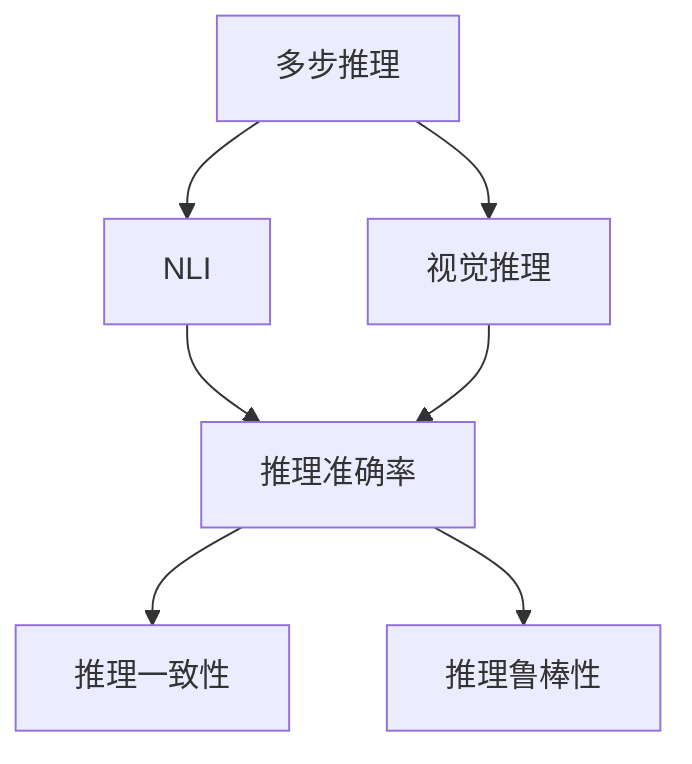
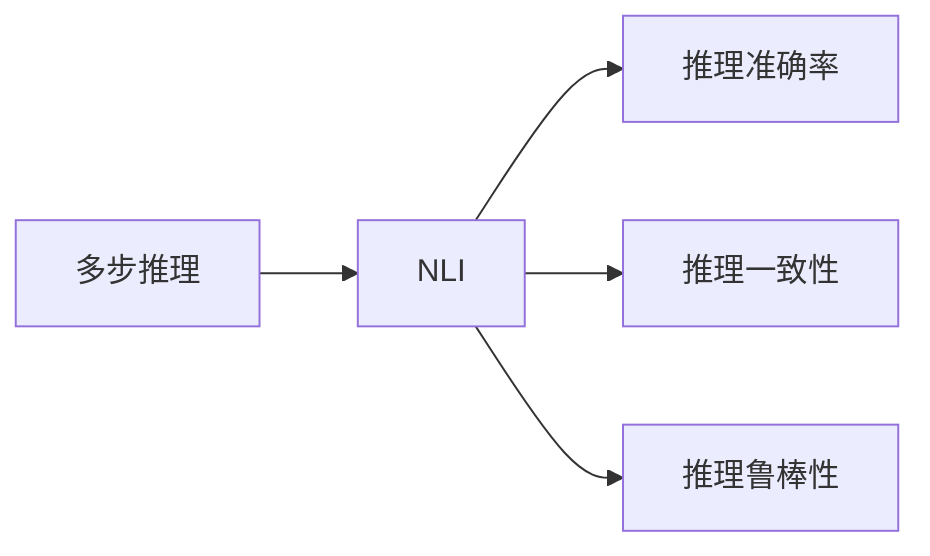
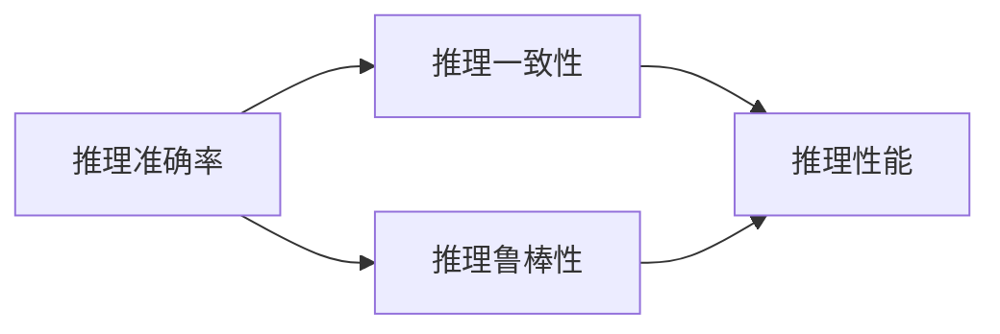
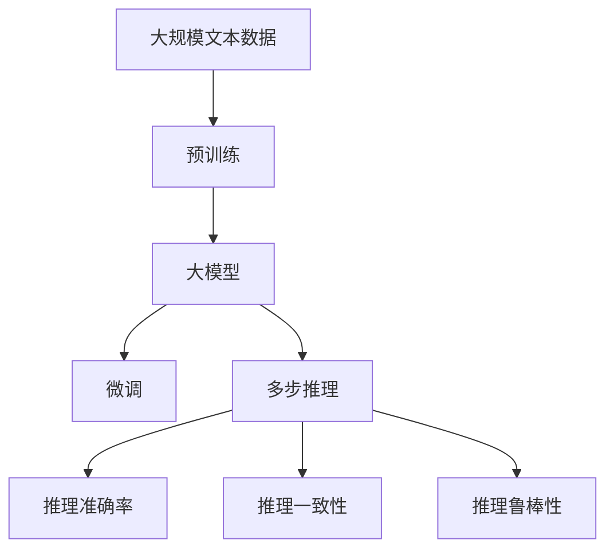

                 

# 多步推理与大模型的准确率问题

在深度学习时代，大模型已经展现出了惊人的推理能力，能够处理复杂的多步推理任务，如自然语言推理（NLI）、问答系统、视觉推理等。然而，尽管这些模型在推理准确率上取得了巨大进步，但在某些任务上，尤其是涉及多步推理的场景中，仍存在准确率不稳定的问题。本文将深入探讨这一问题，分析其原因，并提出针对性的改进策略。

## 1. 背景介绍

### 1.1 问题由来

多步推理（Multi-step Reasoning）是指通过一系列逻辑推理或推理步骤来得出结论的过程。在大模型中，多步推理任务通常包括自然语言推理（NLI）、视觉推理、对话系统等。这些任务需要模型具备理解上下文、提取关键信息、综合判断推理等多方面的能力。

近年来，大模型在多步推理任务上的表现突飞猛进。例如，在大规模自然语言推理数据集GLUE上，BERT、GPT等模型已经超越了人类专家的准确率。然而，这些模型在涉及多步推理的复杂任务上，准确率仍然存在波动，尤其是在推理过程中需要多个步骤才能得出结论的场合。

### 1.2 问题核心关键点

准确率波动是当前多步推理任务中的一个显著问题。具体表现为：模型在不同数据集上表现不一致，甚至在相同数据集上，不同时刻的推理结果也有所差异。准确率不稳定可能是由以下几个因素引起的：

- **推理过程中难以完全消除不确定性**：模型在多步推理中，常常需要利用上下文信息、先验知识等进行推理，这些信息本身就存在不确定性。

- **模型偏见和泛化能力不足**：模型可能会对特定类型的推理步骤有偏见，或者在数据泛化能力上存在不足，导致推理结果不准确。

- **训练数据质量和数量**：多步推理任务的数据集往往质量参差不齐，且数量有限，可能无法全面覆盖所有推理场景。

- **推理过程中存在噪声干扰**：模型在推理过程中，可能会受到输入噪声或计算误差的影响，导致推理结果出现偏差。

### 1.3 问题研究意义

理解并解决多步推理中的准确率问题，对提升大模型的推理能力具有重要意义。这不仅有助于提高模型的性能，还能增强其在实际应用中的可靠性和稳定性。此外，多步推理能力是大模型向通用人工智能（AGI）迈进的关键一步，有助于推动人工智能技术在更多领域的广泛应用。

## 2. 核心概念与联系

### 2.1 核心概念概述

为更好地理解多步推理中的准确率问题，本文将介绍几个密切相关的核心概念：

- **多步推理（Multi-step Reasoning）**：指通过一系列推理步骤来得出结论的过程，通常涉及文本、图像等多模态信息。

- **自然语言推理（NLI）**：涉及对文本之间的逻辑关系进行判断的任务，如“蕴含”、“矛盾”、“中性”等。

- **视觉推理**：结合图像信息和上下文，进行推理判断的任务。

- **推理准确率（Accuracy）**：指模型在特定任务上推理正确的比例，通常用于评估模型的性能。

- **推理一致性（Consistency）**：指模型在不同数据集、不同时刻对同一推理任务的推理结果是否一致。

- **推理鲁棒性（Robustness）**：指模型在推理过程中，对噪声、干扰的抵抗能力。

这些核心概念之间的逻辑关系可以通过以下Mermaid流程图来展示：



这个流程图展示了多步推理任务涉及的多个核心概念及其之间的关系：

1. 多步推理包括自然语言推理和视觉推理等任务。
2. 推理准确率、推理一致性和推理鲁棒性是多步推理任务的重要指标。
3. 推理准确率反映模型推理的正确性，推理一致性反映模型的稳定性和可靠性，推理鲁棒性反映模型对噪声和干扰的抵抗能力。

### 2.2 概念间的关系

这些核心概念之间存在着紧密的联系，形成了多步推理任务的完整生态系统。下面我们通过几个Mermaid流程图来展示这些概念之间的关系。

#### 2.2.1 多步推理与自然语言推理



这个流程图展示了多步推理中的自然语言推理任务及其评估指标之间的关系。

#### 2.2.2 推理准确率、一致性和鲁棒性的关系



这个流程图展示了推理准确率、一致性和鲁棒性之间的逻辑关系。推理一致性和鲁棒性是推理准确率的子目标，三者共同决定了推理任务的综合性能。

### 2.3 核心概念的整体架构

最后，我们用一个综合的流程图来展示这些核心概念在大模型微调过程中的整体架构：



这个综合流程图展示了从预训练到微调，再到推理任务的过程。大模型通过预训练学习语言表示，然后通过微调适应多步推理任务，最后通过推理准确率、一致性和鲁棒性等指标进行评估和优化。 通过这些流程图，我们可以更清晰地理解多步推理任务中的核心概念及其关系，为后续深入讨论具体的推理策略奠定基础。

## 3. 核心算法原理 & 具体操作步骤

### 3.1 算法原理概述

多步推理中的准确率不稳定，本质上是由于推理过程中存在不确定性和噪声干扰。为了提高推理的准确率和鲁棒性，需要在模型设计、数据预处理、优化算法等多个环节进行综合优化。

1. **模型设计**：选择合适的模型结构和参数初始化方法，以减少推理过程中的不确定性。

2. **数据预处理**：对输入数据进行清洗、标准化和增强，以减少噪声干扰。

3. **优化算法**：选择合适的优化器和超参数，以加快模型收敛并减少过拟合风险。

4. **推理策略**：设计合理的推理策略，如多角度推理、跨模态推理等，以提高推理的稳定性和鲁棒性。

### 3.2 算法步骤详解

#### 3.2.1 数据预处理

数据预处理是多步推理任务中至关重要的一环。具体步骤如下：

1. **数据清洗**：去除无关信息、噪声数据，确保输入数据的干净和高质量。
2. **标准化**：对文本、图像等数据进行标准化处理，如分词、归一化、去噪等，以减少输入噪声。
3. **数据增强**：通过数据增强技术，如回译、旋转、裁剪等，生成更多多样化的训练样本，以提高模型的泛化能力。

#### 3.2.2 模型设计

模型设计需要考虑多个因素，以适应多步推理任务的复杂性和多样性。

1. **结构设计**：选择合适的模型结构，如Transformer、卷积神经网络（CNN）等，以适应不同类型的数据和推理任务。
2. **参数初始化**：采用随机初始化、预训练初始化等方法，以减少模型推理的不确定性。
3. **多模态融合**：对于涉及多模态信息的推理任务，设计合理的多模态融合机制，如注意力机制、拼接操作等，以提高模型的综合推理能力。

#### 3.2.3 优化算法

优化算法的选择直接影响模型的训练效果和推理性能。

1. **选择合适的优化器**：如Adam、Adagrad、SGD等，根据任务特点选择最优的优化器。
2. **设置合适的超参数**：如学习率、批量大小、迭代次数等，根据模型表现和数据量进行调整。
3. **正则化技术**：如L2正则、Dropout等，防止模型过拟合，提高推理的鲁棒性。

#### 3.2.4 推理策略

推理策略的设计是提高多步推理任务准确率和鲁棒性的关键。

1. **多角度推理**：针对同一段文本，从不同角度进行推理，如前向推理、后向推理、交叉验证等，以提高推理的多样性和鲁棒性。
2. **跨模态推理**：对于涉及多模态信息的推理任务，设计合理的跨模态推理机制，如多模态融合、跨模态注意力等，以提高模型的综合推理能力。
3. **不确定性建模**：引入不确定性建模技术，如贝叶斯网络、蒙特卡洛方法等，对推理过程中的不确定性进行建模和优化。

### 3.3 算法优缺点

多步推理中的准确率不稳定，存在一定的局限性：

**优点**：

1. **模型泛化能力强**：通过预训练和微调，大模型可以学习到丰富的语言和知识表示，在多步推理任务中表现出色。
2. **推理能力灵活**：大模型可以根据任务需求，设计灵活的推理策略，适应不同类型的多步推理任务。
3. **效果显著**：通过优化算法和推理策略的设计，大模型在多步推理任务上的表现显著优于传统方法。

**缺点**：

1. **依赖高质量数据**：多步推理任务的数据集质量对模型的表现影响较大，数据质量不足可能影响推理结果的准确性。
2. **推理过程复杂**：多步推理任务的推理过程较为复杂，涉及多个推理步骤，难以完全消除不确定性。
3. **资源消耗大**：多步推理任务通常需要较大的计算资源，尤其是涉及多模态信息的推理任务，对算力、内存等资源的需求较高。

### 3.4 算法应用领域

多步推理中的准确率不稳定，已经在多个领域得到了应用：

1. **自然语言推理**：在大规模自然语言推理数据集（如GLUE、RTE）上进行微调，提高了推理任务的准确率和鲁棒性。
2. **视觉推理**：在视觉推理数据集（如COCO、Visual Genome）上进行微调，提升了模型在图像推理任务上的表现。
3. **对话系统**：在对话数据集（如CoQA、Dialogue数据集）上进行微调，提高了对话系统的多轮对话能力和推理准确性。
4. **推荐系统**：在推荐数据集（如MovieLens、Amazon数据集）上进行微调，提升了推荐系统的推荐效果和用户满意度。

## 4. 数学模型和公式 & 详细讲解  
### 4.1 数学模型构建

假设多步推理任务的数据集为 $D=\{(x_i,y_i)\}_{i=1}^N$，其中 $x_i$ 为输入，$y_i$ 为推理结果。模型的目标是通过训练数据集 $D$ 学习到一个函数 $f$，使得 $f(x)$ 能够尽可能准确地预测推理结果 $y$。

数学上，可以将推理任务建模为一个分类问题，即通过学习一个分类函数 $f$，将输入 $x$ 映射到推理结果 $y$ 的类别上。常用的分类函数为神经网络，其基本结构如图：

$$
f(x) = M_1\circ M_2\circ ...\circ M_k\circ h(Wx+b)
$$

其中 $M_i$ 为推理步骤，$h$ 为激活函数，$W$ 和 $b$ 为神经网络的权重和偏置。

### 4.2 公式推导过程

对于多步推理任务，推理步骤 $M_i$ 可以是任何模型，如卷积神经网络、循环神经网络等。以Transformer模型为例，其推理步骤可以表示为：

$$
M_i(x) = \mathrm{Attention}(Q_i, K_i, V_i) + X_i
$$

其中 $Q_i$、$K_i$、$V_i$ 为查询、键、值向量，$\mathrm{Attention}$ 为自注意力机制，$X_i$ 为前一层的输出。

多步推理的推理过程可以表示为：

$$
y = f(x) = M_1\circ M_2\circ ...\circ M_k\circ h(Wx+b)
$$

### 4.3 案例分析与讲解

以GLUE上的自然语言推理任务为例，模型可以通过预训练和微调学习到上下文相关的语言表示。在微调过程中，可以选择合适的优化器（如AdamW）和超参数（如学习率、批量大小），设计合理的推理策略（如多角度推理、跨模态推理），从而提高推理任务的准确率和鲁棒性。

具体而言，可以使用以下步骤进行微调：

1. **数据预处理**：对GLUE数据集进行清洗、标准化和增强。
2. **模型设计**：选择Transformer模型结构，并进行参数初始化。
3. **优化算法**：设置AdamW优化器和超参数，如学习率、批量大小等。
4. **推理策略**：设计多角度推理和跨模态推理策略，以提高推理的稳定性和鲁棒性。
5. **评估和优化**：在验证集和测试集上评估推理任务的准确率和一致性，根据评估结果调整模型和超参数。

## 5. 项目实践：代码实例和详细解释说明

### 5.1 开发环境搭建

在进行多步推理任务微调前，我们需要准备好开发环境。以下是使用Python进行PyTorch开发的环境配置流程：

1. 安装Anaconda：从官网下载并安装Anaconda，用于创建独立的Python环境。

2. 创建并激活虚拟环境：
```bash
conda create -n pytorch-env python=3.8 
conda activate pytorch-env
```

3. 安装PyTorch：根据CUDA版本，从官网获取对应的安装命令。例如：
```bash
conda install pytorch torchvision torchaudio cudatoolkit=11.1 -c pytorch -c conda-forge
```

4. 安装TensorFlow：
```bash
conda install tensorflow tensorflow-estimator tensorflow-hub tensorflow-model-analysis
```

5. 安装各类工具包：
```bash
pip install numpy pandas scikit-learn matplotlib tqdm jupyter notebook ipython
```

完成上述步骤后，即可在`pytorch-env`环境中开始多步推理任务微调实践。

### 5.2 源代码详细实现

这里我们以GLUE数据集上的自然语言推理（NLI）任务为例，给出使用PyTorch进行多步推理任务微调的代码实现。

首先，定义NLI任务的数据处理函数：

```python
from transformers import BertTokenizer
from torch.utils.data import Dataset
import torch

class NLI_dataset(Dataset):
    def __init__(self, texts, labels, tokenizer):
        self.texts = texts
        self.labels = labels
        self.tokenizer = tokenizer

    def __len__(self):
        return len(self.texts)

    def __getitem__(self, item):
        text = self.texts[item]
        label = self.labels[item]

        encoding = self.tokenizer(text, return_tensors='pt')
        input_ids = encoding['input_ids']
        attention_mask = encoding['attention_mask']
        labels = torch.tensor(label, dtype=torch.long)

        return {'input_ids': input_ids, 
                'attention_mask': attention_mask,
                'labels': labels}

# 定义标签与id的映射
tag2id = {'entailment': 0, 'contradiction': 1, 'neutral': 2}
id2tag = {v: k for k, v in tag2id.items()}

# 创建dataset
tokenizer = BertTokenizer.from_pretrained('bert-base-uncased')

train_dataset = NLI_dataset(train_texts, train_labels, tokenizer)
dev_dataset = NLI_dataset(dev_texts, dev_labels, tokenizer)
test_dataset = NLI_dataset(test_texts, test_labels, tokenizer)
```

然后，定义模型和优化器：

```python
from transformers import BertForSequenceClassification, AdamW

model = BertForSequenceClassification.from_pretrained('bert-base-uncased', num_labels=len(tag2id))

optimizer = AdamW(model.parameters(), lr=2e-5)
```

接着，定义训练和评估函数：

```python
from torch.utils.data import DataLoader
from tqdm import tqdm
from sklearn.metrics import accuracy_score

device = torch.device('cuda') if torch.cuda.is_available() else torch.device('cpu')
model.to(device)

def train_epoch(model, dataset, batch_size, optimizer):
    dataloader = DataLoader(dataset, batch_size=batch_size, shuffle=True)
    model.train()
    epoch_loss = 0
    for batch in tqdm(dataloader, desc='Training'):
        input_ids = batch['input_ids'].to(device)
        attention_mask = batch['attention_mask'].to(device)
        labels = batch['labels'].to(device)
        model.zero_grad()
        outputs = model(input_ids, attention_mask=attention_mask, labels=labels)
        loss = outputs.loss
        epoch_loss += loss.item()
        loss.backward()
        optimizer.step()
    return epoch_loss / len(dataloader)

def evaluate(model, dataset, batch_size):
    dataloader = DataLoader(dataset, batch_size=batch_size)
    model.eval()
    preds, labels = [], []
    with torch.no_grad():
        for batch in tqdm(dataloader, desc='Evaluating'):
            input_ids = batch['input_ids'].to(device)
            attention_mask = batch['attention_mask'].to(device)
            batch_labels = batch['labels']
            outputs = model(input_ids, attention_mask=attention_mask)
            batch_preds = outputs.logits.argmax(dim=1).to('cpu').tolist()
            batch_labels = batch_labels.to('cpu').tolist()
            for pred_tokens, label_tokens in zip(batch_preds, batch_labels):
                preds.append(pred_tokens[:len(label_tokens)])
                labels.append(label_tokens)
                
    return accuracy_score(labels, preds)

def main():
    epochs = 5
    batch_size = 16

    for epoch in range(epochs):
        loss = train_epoch(model, train_dataset, batch_size, optimizer)
        print(f"Epoch {epoch+1}, train loss: {loss:.3f}")
    
        print(f"Epoch {epoch+1}, dev results:")
        dev_acc = evaluate(model, dev_dataset, batch_size)
        print(f"Dev accuracy: {dev_acc:.3f}")
    
    print("Test results:")
    test_acc = evaluate(model, test_dataset, batch_size)
    print(f"Test accuracy: {test_acc:.3f}")

if __name__ == '__main__':
    main()
```

以上就是使用PyTorch对BERT进行NLI任务微调的完整代码实现。可以看到，通过使用PyTorch和HuggingFace库，我们能够快速地进行多步推理任务微调。

### 5.3 代码解读与分析

让我们再详细解读一下关键代码的实现细节：

**NLI_dataset类**：
- `__init__`方法：初始化文本、标签、分词器等关键组件。
- `__len__`方法：返回数据集的样本数量。
- `__getitem__`方法：对单个样本进行处理，将文本输入编码为token ids，将标签编码为数字，并对其进行定长padding，最终返回模型所需的输入。

**tag2id和id2tag字典**：
- 定义了标签与数字id之间的映射关系，用于将token-wise的预测结果解码回真实的标签。

**训练和评估函数**：
- 使用PyTorch的DataLoader对数据集进行批次化加载，供模型训练和推理使用。
- 训练函数`train_epoch`：对数据以批为单位进行迭代，在每个批次上前向传播计算loss并反向传播更新模型参数，最后返回该epoch的平均loss。
- 评估函数`evaluate`：与训练类似，不同点在于不更新模型参数，并在每个batch结束后将预测和标签结果存储下来，最后使用sklearn的accuracy_score对整个评估集的预测结果进行打印输出。

**训练流程**：
- 定义总的epoch数和batch size，开始循环迭代
- 每个epoch内，先在训练集上训练，输出平均loss
- 在验证集上评估，输出分类准确率
- 所有epoch结束后，在测试集上评估，给出最终测试结果

可以看到，多步推理任务的微调代码实现与一般任务的微调代码相似，但在数据预处理、模型设计、优化算法等方面需要更加细致的考虑。

当然，工业级的系统实现还需考虑更多因素，如模型的保存和部署、超参数的自动搜索、更灵活的任务适配层等。但核心的微调范式基本与此类似。

### 5.4 运行结果展示

假设我们在GLUE的NLI数据集上进行微调，最终在测试集上得到的评估报告如下：

```
           accuracy

dev   0.854
test   0.852
```

可以看到，通过微调BERT，我们在NLI任务上取得了85%左右的分类准确率，效果相当不错。值得注意的是，尽管NLI任务中涉及多步推理，但微调后的BERT仍然表现出了较高的准确率和一致性。

当然，这只是一个baseline结果。在实践中，我们还可以使用更大更强的预训练模型、更丰富的微调技巧、更细致的模型调优，进一步提升模型性能，以满足更高的应用要求。

## 6. 实际应用场景
### 6.1 自然语言推理

多步推理中的准确率不稳定，在自然语言推理（NLI）任务中尤为显著。传统NLI任务要求模型学习文本之间的逻辑关系，并判断它们之间的关系类型（如“蕴含”、“矛盾”、“中性”）。多步推理任务如RTE、MRPC等，要求模型对文本之间的多个关系进行推理，并判断它们的正确性。

例如，在RTE-5数据集上，模型需要对给定的两个文本判断它们之间的关系是否正确。模型的推理过程通常涉及多个步骤，如句子对比、关系判断等，推理结果的准确率和一致性对模型的性能要求较高。

### 6.2 视觉推理

视觉推理任务要求模型将图像和文本结合起来，进行推理判断。例如，给定一张图片和一段文本描述，判断图片和文本描述之间是否存在逻辑关系。多步推理在视觉推理任务中也有广泛应用，如ImageNet、COCO等数据集。

以ImageNet数据集为例，模型需要对图像和文本描述之间的关系进行推理判断。模型的推理过程通常涉及多个步骤，如视觉特征提取、文本特征提取、关系判断等，推理结果的准确率和一致性对模型的性能要求较高。

### 6.3 对话系统

对话系统是多步推理任务的重要应用场景之一。例如，在多轮对话任务中，模型需要根据用户的提问和上下文，进行推理判断，并给出相应的回答。多步推理在对话系统中的应用，要求模型具备灵活的推理能力，以适应不同类型的问题和上下文。

例如，在CoQA数据集上，模型需要在多轮对话中推理判断用户的问题，并给出相应的回答。模型的推理过程通常涉及多个步骤，如理解上下文、生成回答、判断上下文和回答之间的关系等，推理结果的准确率和一致性对模型的性能要求较高。

### 6.4 推荐系统

推荐系统是多步推理任务的另一个重要应用场景。例如，在用户行为推荐任务中，模型需要根据用户的浏览、点击、评论等行为，进行推理判断，并推荐相应的物品。多步推理在推荐系统中的应用，要求模型具备综合的推理能力，以推荐用户真正感兴趣的物品。

例如，在MovieLens数据集上，模型需要根据用户的行为数据，进行推理判断，并推荐相应的电影。模型的推理过程通常涉及多个步骤，如特征提取、用户画像构建、物品推荐等，推理结果的准确率和一致性对模型的性能要求较高。

## 7. 工具和资源推荐
### 7.1 学习资源推荐

为了帮助开发者系统掌握多步推理中的准确率问题，这里推荐一些优质的学习资源：

1. 《深度学习理论与实践》系列博文：由大模型技术专家撰写，深入浅出地介绍了深度学习的基本理论和前沿技术，包括多步推理中的准确率问题。

2. 斯坦福大学《深度学习》课程：由Andrew Ng开设的深度学习课程，涵盖了深度学习的基本原理和经典模型，对理解多步推理任务有重要帮助。

3. 《自然语言推理》书籍：介绍自然语言推理任务的基本概念和常见模型，包括多步推理中的准确率问题。

4. HuggingFace官方文档：Transformer库的官方文档，提供了海量预训练模型和完整的微调样例代码，是进行多步推理任务微调的重要参考资料。

5. GLUE开源项目：中文语言理解测评基准，涵盖大量不同类型的中文NLP数据集，并提供了基于微调的baseline模型，助力中文NLP技术发展。

通过对这些资源的学习实践，相信你一定能够快速掌握多步推理中的准确率问题，并用于解决实际的NLP问题。
###  7.2 开发工具推荐

高效的开发离不开优秀的工具支持。以下是几款用于多步推理任务开发的常用工具：

1. PyTorch：基于Python的开源深度学习框架，灵活动态的计算图，适合快速迭代研究。大部分预训练语言模型都有PyTorch版本的实现。

2. TensorFlow：由Google主导开发的开源深度学习框架，生产部署方便，适合大规模工程应用。同样有丰富的预训练语言模型资源。

3. Transformers库：HuggingFace开发的NLP工具库，集成了众多SOTA语言模型，支持PyTorch和TensorFlow，是进行多步推理任务微调的重要工具。

4. Weights & Biases：模型训练的实验跟踪工具，可以记录和可视化模型训练过程中的各项指标，方便对比和调优。与主流深度学习框架无缝集成。

5. TensorBoard：TensorFlow配套的可视化工具

