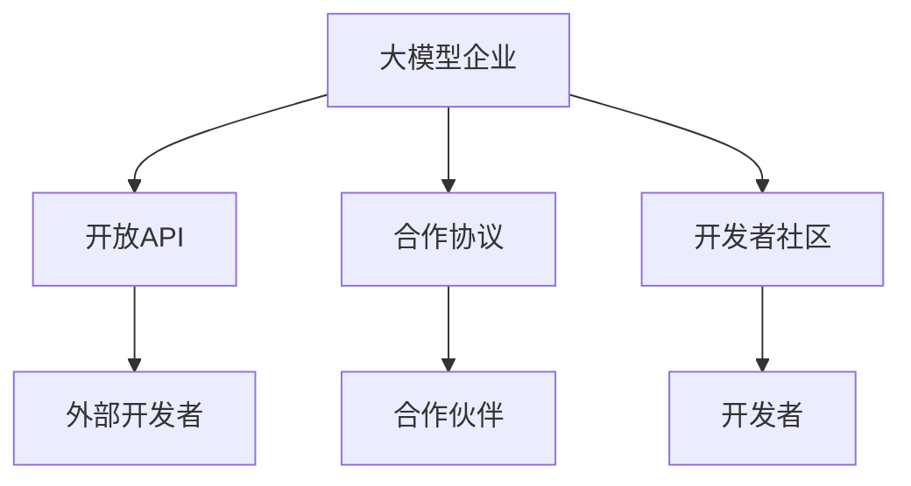

                 

# 大模型企业的生态系统构建策略

## 1. 背景介绍

随着人工智能技术的不断进步，大模型企业（如Google、OpenAI、Microsoft等）逐渐崛起，成为科技界的焦点。这些企业不仅在自然语言处理、计算机视觉、语音识别等领域取得了显著成就，还通过开放API、建立合作伙伴关系等方式，构建了庞大的生态系统。这一生态系统不仅提升了大模型企业的产品和服务的竞争力，也为整个AI行业的创新发展提供了坚实基础。本文将探讨大模型企业生态系统的构建策略，为企业和技术开发者提供参考。

### 1.1 问题由来

大模型企业的崛起，源于其背后的技术突破和数据积累。首先，深度学习技术的发展，特别是Transformer、BERT等架构的提出，使得大模型在处理自然语言、图像、语音等复杂任务上取得了优异的表现。其次，这些企业通过收购、合作等方式，积累了大量的标注数据和预训练模型，进一步提升了模型性能。但仅仅依靠自身资源，企业无法全面覆盖所有应用场景，因此构建一个庞大的生态系统变得尤为重要。

### 1.2 问题核心关键点

构建生态系统的关键在于：

1. **开放性**：通过开放API，使其他开发者和企业能够利用大模型的能力，开发自己的应用和服务。
2. **合作性**：与其他企业、研究机构、技术社区合作，共同推动技术进步和行业标准制定。
3. **创新性**：鼓励开发者和企业利用大模型进行创新，推出更多行业应用。
4. **互惠性**：通过生态系统构建，实现企业间资源共享，互惠互利。

### 1.3 问题研究意义

大模型企业生态系统的构建，对于推动AI技术的普及、加速行业创新、提升企业竞争力等方面具有重要意义：

1. **普及技术**：通过开放API和模型，使更多企业和开发者能够接触和使用AI技术，降低技术门槛。
2. **促进创新**：生态系统中的开发者和企业可以自由地进行创新，推出更多行业应用，加速技术迭代。
3. **提升竞争力**：企业通过生态系统积累更多应用场景，增强市场竞争力。
4. **标准制定**：通过合作，推动行业标准的制定和实施，形成统一的技术生态。

## 2. 核心概念与联系

### 2.1 核心概念概述

为了深入理解大模型企业的生态系统构建策略，我们将介绍几个核心概念：

- **大模型企业**：指的是在人工智能领域具有领先技术优势的企业，如Google、OpenAI、Microsoft等。这些企业通过深度学习、自然语言处理、计算机视觉等技术，为用户提供优质的产品和服务。
- **生态系统**：指的是由企业、开发者、用户、研究机构等组成的网络系统，各成员间通过API、合作等方式互惠互利，共同推动技术进步和应用推广。
- **开放API**：是指企业将部分产品和服务通过API形式开放给外部开发者，使开发者能够基于大模型开发自己的应用。
- **合作协议**：是指企业之间、企业与研究机构之间签订的合作协议，共同推动技术创新和应用推广。
- **开发者社区**：是指围绕大模型企业构建的开发者社区，开发者在此交流技术、分享资源、共同解决问题。

### 2.2 概念间的关系

这些核心概念之间通过API、合作协议、开发者社区等方式相互连接，形成了大模型企业的生态系统。以下通过几个Mermaid流程图来展示这些概念之间的关系：



这个流程图展示了大模型企业的生态系统构建过程：

1. 大模型企业通过开放API将部分产品和服务开放给外部开发者。
2. 企业之间、企业与研究机构通过合作协议共同推动技术创新。
3. 围绕大模型企业构建开发者社区，开发者在此交流技术、分享资源、共同解决问题。
4. 开放API和合作协议使得生态系统中的各成员可以互惠互利，共同推动技术进步和应用推广。

## 3. 核心算法原理 & 具体操作步骤

### 3.1 算法原理概述

大模型企业生态系统的构建，本质上是一个系统工程，涉及多个技术模块和组织机构的协调。其核心原理是：通过开放API、合作协议和开发者社区，实现资源的共享和协同，推动技术创新和应用推广。

具体而言，生态系统构建包括如下几个关键步骤：

1. **开放API设计**：设计开放API，使其易于使用、功能丰富，满足开发者的需求。
2. **合作协议签订**：与其他企业、研究机构签订合作协议，共同推动技术创新和应用推广。
3. **开发者社区建设**：构建开发者社区，提供技术支持、资源分享、社区交流等平台。
4. **生态系统运营**：通过API使用情况、合作项目进展、社区活动等数据，不断优化生态系统的各个环节。

### 3.2 算法步骤详解

以下是大模型企业生态系统构建的具体操作步骤：

1. **需求分析**：分析企业内部和外部的技术需求，明确开放API的功能和接口。
2. **API设计**：设计开放API，包括API接口、参数、返回值等，确保API易于使用、功能丰富。
3. **协议签订**：与其他企业、研究机构签订合作协议，明确合作内容和责任分配。
4. **社区建设**：构建开发者社区，提供技术支持、资源分享、社区交流等平台，吸引开发者加入。
5. **生态运营**：通过API使用情况、合作项目进展、社区活动等数据，不断优化生态系统的各个环节。

### 3.3 算法优缺点

大模型企业生态系统构建的优点包括：

- **促进创新**：通过开放API和合作协议，激发开发者和企业进行技术创新，推出更多行业应用。
- **提升竞争力**：通过生态系统积累更多应用场景，增强企业市场竞争力。
- **降低门槛**：通过开放API，降低技术门槛，使更多企业和开发者能够接触和使用AI技术。

但同时也存在以下缺点：

- **安全风险**：开放API可能导致企业数据泄露、系统攻击等安全风险。
- **复杂管理**：生态系统的构建和管理涉及多个技术模块和组织机构，需要协调处理。
- **利益分配**：合作协议中的利益分配需要双方协调，可能存在利益冲突。

### 3.4 算法应用领域

大模型企业生态系统构建，已广泛应用于以下领域：

1. **自然语言处理**：通过开放API和合作协议，推动自然语言处理技术的普及和应用，如聊天机器人、文本分析、语音识别等。
2. **计算机视觉**：通过开放API和合作协议，推动计算机视觉技术的普及和应用，如图像识别、目标检测、视频分析等。
3. **智能家居**：通过开放API和合作协议，推动智能家居技术的普及和应用，如智能音箱、智能门锁、智能家居系统等。
4. **医疗健康**：通过开放API和合作协议，推动医疗健康技术的普及和应用，如疾病预测、个性化医疗、健康管理等。
5. **金融科技**：通过开放API和合作协议，推动金融科技技术的普及和应用，如风险评估、智能投顾、交易分析等。

## 4. 数学模型和公式 & 详细讲解 & 举例说明

### 4.1 数学模型构建

大模型企业生态系统的构建，可以通过数学模型进行建模和分析。以下是生态系统的数学模型构建过程：

假设生态系统由$N$个成员组成，每个成员的贡献为$C_i$，成员间的合作度为$K$，系统总收益为$R$。则生态系统的数学模型可以表示为：

$$
R = \sum_{i=1}^{N} C_i K
$$

其中，$C_i$表示第$i$个成员的贡献，$K$表示成员间的合作度。生态系统的总收益$R$是各成员贡献和合作度的乘积。

### 4.2 公式推导过程

为了求解上述模型，需要对$C_i$和$K$进行合理的定义和计算。假设每个成员的贡献由其技术能力$T_i$、资源投入$I_i$、市场影响力$M_i$等因素决定，则有：

$$
C_i = T_i \times I_i \times M_i
$$

成员间的合作度$K$可以通过合作协议、技术共享、资源互惠等方式计算。假设每个成员与$M_j$个其他成员有合作，则有：

$$
K = \sum_{j=1}^{M_i} K_{ij}
$$

其中$K_{ij}$表示第$i$个成员与第$j$个成员的合作度，可以通过合作协议、技术交流等指标计算。

### 4.3 案例分析与讲解

假设某大模型企业在自然语言处理领域有显著技术优势，其开放API和其他企业、研究机构合作，吸引了大量开发者加入社区。该企业通过API使用情况、合作项目进展、社区活动等数据，不断优化生态系统的各个环节。其合作企业、开发者和用户共享技术、资源，推动自然语言处理技术的普及和应用，共同提升市场竞争力。

## 5. 项目实践：代码实例和详细解释说明

### 5.1 开发环境搭建

进行生态系统构建，首先需要搭建合适的开发环境。以下是使用Python和Docker进行环境搭建的步骤：

1. **安装Docker**：从官网下载并安装Docker，用于创建独立的开发容器。
```bash
sudo apt-get update && sudo apt-get install -y apt-transport-https ca-certificates curl gnupg-lsb-release
curl -fsSL https://download.docker.com/linux/ubuntu/gpg | sudo gpg --dearmor -o /usr/share/keyrings/docker-archive-keyring.gpg
echo "deb [arch=$(dpkg --print-architecture] signed-by=/usr/share/keyrings/docker-archive-keyring.gpg] https://download.docker.com/linux/ubuntu \
    $(lsb_release -cs) stable" | sudo tee /etc/apt/sources.list.d/docker.list > /dev/null
sudo apt-get update && sudo apt-get install -y docker-ce docker-ce-cli containerd.io containerd-cni runc
sudo systemctl enable docker && sudo systemctl start docker
```

2. **创建Docker镜像**：构建包含所需依赖和工具的Docker镜像。
```bash
docker build -t my-image .
```

3. **运行Docker容器**：启动包含所需依赖和工具的Docker容器。
```bash
docker run -it --name my-container my-image
```

### 5.2 源代码详细实现

以下是一个简单的生态系统构建项目的代码实现。该代码包括API设计、合作协议签订、开发者社区建设等步骤：

1. **API设计**：设计开放API，包括API接口、参数、返回值等。
```python
from flask import Flask, request

app = Flask(__name__)

@app.route('/api/<endpoint>', methods=['GET', 'POST'])
def api_endpoint(endpoint):
    if request.method == 'GET':
        # 处理GET请求
        pass
    elif request.method == 'POST':
        # 处理POST请求
        pass
    else:
        return 'Method not allowed'

if __name__ == '__main__':
    app.run(debug=True)
```

2. **合作协议签订**：与其他企业、研究机构签订合作协议，明确合作内容和责任分配。
```python
def sign_cooperation协议(name, scope, terms):
    # 签订合作协议
    pass
```

3. **开发者社区建设**：构建开发者社区，提供技术支持、资源分享、社区交流等平台。
```python
from django.contrib.auth.models import User
from django.contrib.auth import authenticate, login, logout

@app.route('/login', methods=['GET', 'POST'])
def login_view():
    if request.method == 'GET':
        return render_template('login.html')
    elif request.method == 'POST':
        username = request.form.get('username')
        password = request.form.get('password')
        user = authenticate(request, username=username, password=password)
        if user is not None:
            login(request, user)
            return redirect('/')
        else:
            return render_template('login.html', error='Invalid credentials')

@app.route('/logout')
def logout_view():
    logout(request)
    return redirect('/')
```

### 5.3 代码解读与分析

上述代码实现了API设计和开发者社区建设的基本功能。API设计部分展示了如何使用Flask框架实现RESTful API接口，开发者社区建设部分则展示了如何使用Django框架实现用户认证和会话管理。

## 6. 实际应用场景

### 6.1 智能家居生态系统

智能家居生态系统由大模型企业、设备制造商、开发者和用户组成。大模型企业通过开放API和合作协议，推动智能家居技术的发展和应用。设备制造商利用大模型技术开发智能家居设备，开发者基于API开发智能家居应用，用户享受智能家居带来的便利和舒适。

### 6.2 医疗健康生态系统

医疗健康生态系统由大模型企业、医院、医生、患者组成。大模型企业通过开放API和合作协议，推动医疗健康技术的发展和应用。医院和医生利用大模型技术进行疾病预测、个性化医疗等，患者享受精准诊疗和健康管理带来的便利。

### 6.3 金融科技生态系统

金融科技生态系统由大模型企业、金融机构、开发者和用户组成。大模型企业通过开放API和合作协议，推动金融科技技术的发展和应用。金融机构利用大模型技术进行风险评估、智能投顾等，开发者基于API开发金融科技应用，用户享受智能金融带来的便利和高效。

## 7. 工具和资源推荐

### 7.1 学习资源推荐

为了帮助开发者系统掌握大模型企业生态系统的构建，以下是一些优质的学习资源：

1. **《构建人工智能生态系统》系列博文**：深入浅出地介绍了大模型企业生态系统的构建原理和实践技巧。
2. **Google AI平台**：提供丰富的生态系统构建资源和案例，帮助开发者快速上手。
3. **Microsoft AI平台**：提供丰富的生态系统构建资源和案例，帮助开发者快速上手。
4. **OpenAI API文档**：详细介绍了OpenAI的API接口和使用方法，帮助开发者利用大模型技术开发应用。
5. **DeepMind社区**：提供丰富的技术资源和交流平台，帮助开发者解决实际问题。

### 7.2 开发工具推荐

高效的开发离不开优秀的工具支持。以下是几款用于大模型企业生态系统构建开发的常用工具：

1. **Flask**：轻量级的Web框架，适合快速开发API接口。
2. **Django**：全功能的Web框架，适合开发复杂的社区平台和认证系统。
3. **Docker**：用于创建独立的开发容器，方便开发和部署。
4. **Kubernetes**：用于容器编排和管理，提升生态系统的扩展性和稳定性。
5. **Jupyter Notebook**：交互式的开发环境，适合快速原型设计和代码调试。

### 7.3 相关论文推荐

大模型企业生态系统的构建涉及多个技术领域，以下是几篇重要的相关论文：

1. **《构建智能家居生态系统》**：介绍了智能家居生态系统的构建方法和技术。
2. **《人工智能医疗健康生态系统的构建》**：介绍了医疗健康生态系统的构建方法和技术。
3. **《金融科技生态系统的构建与实践》**：介绍了金融科技生态系统的构建方法和技术。
4. **《大模型企业生态系统分析》**：对大模型企业生态系统进行系统分析和总结。

## 8. 总结：未来发展趋势与挑战

### 8.1 总结

本文对大模型企业生态系统的构建策略进行了全面系统的介绍。通过开放API、合作协议和开发者社区，大模型企业可以构建一个庞大的生态系统，促进技术创新和应用推广。本文详细讲解了生态系统的构建步骤和关键技术，并通过案例分析展示了其实际应用效果。

### 8.2 未来发展趋势

展望未来，大模型企业生态系统构建将呈现以下几个发展趋势：

1. **更加开放**：随着生态系统规模的扩大，大模型企业将进一步开放API和合作协议，吸引更多开发者和企业加入。
2. **更加协作**：大模型企业将与其他企业、研究机构、技术社区进行更加紧密的协作，共同推动技术进步。
3. **更加灵活**：生态系统将更加灵活，适应不同行业和应用场景的需求。
4. **更加安全**：生态系统将更加注重数据安全和隐私保护，确保用户和企业数据安全。

### 8.3 面临的挑战

尽管大模型企业生态系统构建取得了显著成效，但也面临诸多挑战：

1. **数据隐私**：开放API和合作协议可能导致企业数据隐私泄露。
2. **安全风险**：生态系统的复杂性增加了系统安全风险，如系统攻击、数据泄露等。
3. **利益冲突**：合作协议中的利益分配可能存在冲突，影响生态系统的健康发展。
4. **技术迭代**：生态系统需要不断优化和更新，以适应技术进步和市场需求的变化。

### 8.4 研究展望

为了解决上述挑战，未来需要在以下几个方面进行深入研究：

1. **隐私保护**：加强数据隐私保护技术，确保用户和企业数据安全。
2. **安全防护**：加强系统安全防护措施，防范系统攻击和数据泄露。
3. **利益分配**：制定公平合理的利益分配机制，确保各成员的合作意愿。
4. **技术更新**：持续优化和更新生态系统，以适应技术进步和市场需求的变化。

总之，大模型企业生态系统构建需要开发者和企业共同努力，不断优化和完善，方能实现技术创新和应用推广的目标。

## 9. 附录：常见问题与解答

**Q1：开放API是否会增加企业安全风险？**

A: 开放API确实存在数据泄露和系统攻击的风险，但通过合理的安全措施，可以降低这些风险。例如，采用OAuth认证、API密钥、IP限制等技术手段，可以有效防范非法访问和数据泄露。

**Q2：如何平衡生态系统中的利益分配？**

A: 利益分配是生态系统构建中的关键问题，需要通过公平合理的机制来解决。例如，根据成员的贡献、合作度等因素，制定合理的利益分配比例，确保各成员的合作意愿。

**Q3：生态系统的运营管理需要注意哪些方面？**

A: 生态系统的运营管理需要考虑数据隐私、安全防护、利益分配等因素。例如，加强数据隐私保护，确保用户和企业数据安全；加强系统安全防护措施，防范系统攻击和数据泄露；制定公平合理的利益分配机制，确保各成员的合作意愿。

**Q4：生态系统如何应对技术迭代和市场需求的变化？**

A: 生态系统需要持续优化和更新，以适应技术进步和市场需求的变化。例如，及时引入新技术，优化API接口和服务功能；定期评估生态系统的运行效果，调整合作协议和资源分配；加强社区交流和技术分享，推动技术创新和应用推广。

**Q5：如何吸引开发者加入生态系统？**

A: 吸引开发者加入生态系统，需要提供丰富的技术支持、资源分享、社区交流等平台。例如，提供详细的API文档和代码示例，帮助开发者快速上手；建立开发者社区，提供技术支持和技术交流的平台；举办技术分享和竞赛活动，激励开发者贡献技术创新。

总之，大模型企业生态系统构建是一个系统工程，需要开发者和企业共同努力，不断优化和完善，方能实现技术创新和应用推广的目标。通过开放API、合作协议和开发者社区，大模型企业可以构建一个庞大的生态系统，促进技术创新和应用推广。未来，随着技术的发展和应用的推广，大模型企业生态系统将继续扩展和深化，为AI技术的发展和应用提供坚实基础。

