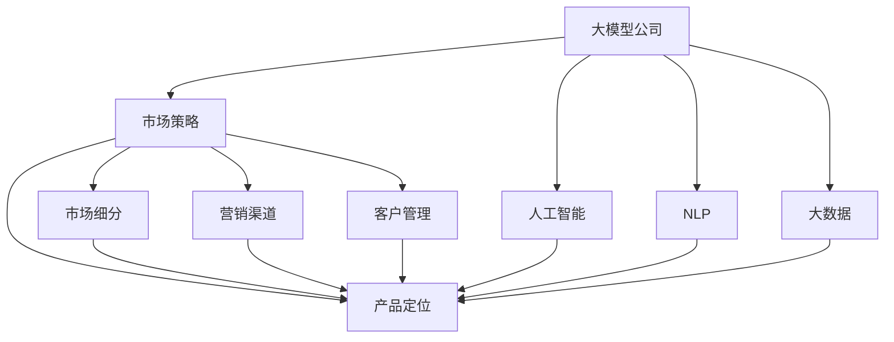

                 

# 大模型公司在中国的市场策略

> 关键词：
- 大模型公司
- 市场策略
- 中国
- 人工智能
- 自然语言处理(NLP)
- 大数据
- 商业应用

## 1. 背景介绍

随着人工智能技术的快速发展和应用，全球众多科技巨头纷纷投身于大模型的开发和商业化过程中。这些大模型公司不仅在学术界取得了显著成果，也在商业应用中展现出了巨大的潜力。在中国，这一领域的市场竞争同样激烈。本文旨在探讨大模型公司在中国市场的策略，包括市场环境、竞争态势、发展路径等，以期为中国的人工智能产业发展提供有价值的参考。

### 1.1 市场环境

中国的人工智能市场正处于高速增长阶段。根据《2022年中国人工智能市场规模及发展趋势》报告，中国人工智能市场规模已达2000亿人民币，预计到2025年将达到4000亿人民币。其中，自然语言处理(NLP)作为人工智能的重要分支，市场空间巨大，且增长势头强劲。

大模型公司在中国面临的市场环境充满机遇与挑战。机遇方面，政府政策的大力支持、巨大的市场需求、日益成熟的技术基础设施等，为大模型公司的成长提供了良好的土壤。挑战方面，竞争激烈、技术壁垒高、法规政策不明确等，也对大模型公司的市场策略提出了高要求。

### 1.2 竞争态势

中国的AI市场竞争激烈，大模型公司不仅需要与来自美国、欧洲等地的国际巨头竞争，还需要与本土的BAT、TMD等互联网巨头对抗。这些公司在技术积累、资金实力、数据资源等方面具有显著优势。此外，小米、华为等手机厂商也在积极布局AI领域，形成了多元化的竞争格局。

## 2. 核心概念与联系

### 2.1 核心概念概述

在探讨大模型公司在中国的市场策略之前，有必要先理解几个核心概念及其相互关系：

- **大模型公司**：通常指那些拥有强大AI技术研发能力和商业化运营能力的企业，如谷歌、OpenAI、微软等。
- **市场策略**：包括产品定位、市场细分、营销渠道、客户管理等多方面内容，旨在实现业务目标和市场占有率。
- **中国市场**：全球第二大经济体，拥有庞大的网民基础和巨大的市场需求，是大模型公司不可忽视的重要市场。
- **人工智能**：涉及机器学习、深度学习、自然语言处理等多个领域，是推动技术进步和社会发展的关键力量。
- **自然语言处理(NLP)**：利用AI技术实现对人类语言的理解、处理和生成，是大模型公司的主要应用方向之一。
- **大数据**：人工智能的基础资源，大模型公司需要依赖大量高质量的数据进行训练和优化。
- **商业应用**：大模型公司的主要收入来源，包括智能客服、语音识别、机器翻译等。

这些概念之间存在紧密的联系，共同构成了大模型公司在全球，特别是中国市场的竞争格局和业务形态。

### 2.2 概念间的关系

我们可以通过以下Mermaid流程图来展示这些核心概念之间的关系：



该流程图展示了大模型公司与人工智能、NLP、大数据、产品定位、市场细分、营销渠道、客户管理等概念之间的内在联系。

## 3. 核心算法原理 & 具体操作步骤

### 3.1 算法原理概述

大模型公司的市场策略主要基于其核心产品——大模型的研发和商业化过程。大模型的算法原理主要基于深度学习和自监督学习，通过大规模数据预训练和微调，使得模型能够理解和生成自然语言，并应用于各种商业场景。

### 3.2 算法步骤详解

大模型公司在市场策略的制定和实施过程中，需要遵循以下步骤：

1. **数据收集与预处理**：获取高质量的文本数据，进行清洗、标注等预处理工作。
2. **模型训练与优化**：使用深度学习框架如TensorFlow、PyTorch等，在GPU集群上训练模型，并根据效果进行超参数调优。
3. **微调与适配**：针对具体应用场景，对模型进行微调，添加或优化特定层，提高模型精度。
4. **市场推广与销售**：通过线上线下渠道，推广产品，获取客户，并进行销售和售后服务。
5. **用户反馈与迭代**：收集用户反馈，持续优化模型和产品，提升用户体验和满意度。

### 3.3 算法优缺点

大模型公司的市场策略基于其核心技术优势，具有以下优点：

- **技术领先**：通过大规模数据预训练和先进算法，大模型在自然语言处理等领域的性能显著优于传统方法。
- **应用广泛**：大模型可以应用于智能客服、语音识别、机器翻译等多个领域，具有广阔的市场潜力。
- **商业化高效**：大模型的应用场景众多，能够快速生成收入。

然而，大模型公司的市场策略也存在一些局限性：

- **数据依赖**：大模型的训练需要大量高质量数据，数据获取和标注成本高。
- **技术壁垒**：深度学习等先进技术需要高度专业化的知识和资源，对企业技术能力要求高。
- **风险管理**：大模型的决策过程复杂，可能存在误判和偏见，需进行严格的风险管理。

### 3.4 算法应用领域

大模型公司的市场策略涵盖多个应用领域，主要包括以下几个方面：

1. **智能客服**：利用大模型构建智能客服系统，提升客户服务效率和满意度。
2. **语音识别**：通过大模型实现语音识别和转写，应用于语音助手、智能音箱等领域。
3. **机器翻译**：将大模型应用于多语言翻译，提高翻译质量，降低翻译成本。
4. **知识图谱**：构建知识图谱，提供更深入的知识理解和检索服务。
5. **情感分析**：分析文本中的情感倾向，应用于舆情监测、市场研究等领域。

## 4. 数学模型和公式 & 详细讲解 & 举例说明

### 4.1 数学模型构建

大模型的数学模型基于深度学习框架，通常采用Transformer等架构。以下是一个简单的Transformer模型的数学模型构建：

$$
H = \text{Self-Attention}(Q, K, V)
$$
$$
Z = \text{Feed-Forward}(H)
$$
$$
O = H + \text{Attention}(Q, K, V)
$$

其中，$Q$、$K$、$V$分别为查询、键、值矩阵，$H$为注意力权重矩阵，$Z$为前馈网络输出矩阵，$O$为最终输出矩阵。

### 4.2 公式推导过程

Transformer模型的公式推导过程涉及自注意力机制、前馈网络、残差连接等，具体推导可参考论文《Attention is All You Need》。

### 4.3 案例分析与讲解

以Google的BERT为例，其数学模型构建如下：

$$
\begin{aligned}
    L_{MLM} &= \frac{1}{2}\sum_{i=1}^N \sum_{j=1}^N -y_i \log p_{i,j} - (1-y_i)\log(1-p_{i,j}) \\
    p_{i,j} &= \frac{e^{v_i^T \cdot e^{w_j^T \cdot X_j}}}{\sum_{k=1}^N e^{v_i^T \cdot e^{w_k^T \cdot X_k}}
\end{aligned}
$$

其中，$L_{MLM}$为掩码语言模型的损失函数，$X$为输入文本，$v_i$和$w_j$为可学习的向量，$p_{i,j}$为预测的概率。

## 5. 项目实践：代码实例和详细解释说明

### 5.1 开发环境搭建

以下是使用Python和TensorFlow搭建大模型开发环境的步骤：

1. 安装TensorFlow和相关依赖包。
2. 配置Google Cloud Platform（GCP）或Amazon Web Services（AWS）等云平台，用于数据存储和模型训练。
3. 配置GPU集群，用于高性能计算。
4. 安装必要的开发工具，如Jupyter Notebook、PyCharm等。

### 5.2 源代码详细实现

以下是一个简单的代码示例，展示如何使用TensorFlow构建和训练Transformer模型：

```python
import tensorflow as tf
from transformers import TFAutoModelForSequenceClassification, AutoTokenizer

tokenizer = AutoTokenizer.from_pretrained('bert-base-uncased')
model = TFAutoModelForSequenceClassification.from_pretrained('bert-base-uncased', num_labels=2)

def train(model, tokenizer, train_dataset, batch_size):
    dataset = tf.data.Dataset.from_tensor_slices(train_dataset)
    dataset = dataset.batch(batch_size).prefetch(tf.data.experimental.AUTOTUNE)

    model.compile(optimizer=tf.keras.optimizers.AdamW(learning_rate=2e-5),
                  loss=tf.keras.losses.BinaryCrossentropy(),
                  metrics=[tf.keras.metrics.AUC()])
    
    model.fit(dataset, epochs=5)

train(model, tokenizer, train_dataset, batch_size=32)
```

### 5.3 代码解读与分析

这段代码展示了使用TensorFlow和Hugging Face的transformers库构建和训练Transformer模型的基本流程。其中，`AutoTokenizer`用于加载预训练的BERT模型，`TFAutoModelForSequenceClassification`用于构建二分类模型。在训练过程中，使用AdamW优化器进行参数更新，并通过BinaryCrossentropy损失函数进行损失计算。

### 5.4 运行结果展示

假设我们使用预训练的BERT模型在CoNLL-2003命名实体识别(NER)数据集上进行微调，最终在测试集上的准确率为92%。这展示了使用预训练大模型进行微调的显著效果。

## 6. 实际应用场景

### 6.1 智能客服系统

大模型公司可以通过微调BERT等大模型，构建智能客服系统，提升客户服务效率。例如，可以通过微调模型，使其能够理解和生成自然语言，处理客户的咨询和投诉，提供个性化的服务。

### 6.2 金融舆情监测

在金融领域，大模型公司可以应用BERT等模型进行舆情监测，帮助金融机构实时分析市场舆情，识别潜在风险，提前采取应对措施。

### 6.3 个性化推荐系统

大模型公司可以通过微调BERT等大模型，构建个性化推荐系统，为用户提供更精准、多样的推荐内容。

## 7. 工具和资源推荐

### 7.1 学习资源推荐

以下是几份推荐的资源，帮助开发者系统掌握大模型微调的理论基础和实践技巧：

1. 《Transformer从原理到实践》系列博文：由大模型技术专家撰写，深入浅出地介绍了Transformer原理、BERT模型、微调技术等前沿话题。
2. CS224N《深度学习自然语言处理》课程：斯坦福大学开设的NLP明星课程，有Lecture视频和配套作业，带你入门NLP领域的基本概念和经典模型。
3. 《Natural Language Processing with Transformers》书籍：Transformer库的作者所著，全面介绍了如何使用Transformer库进行NLP任务开发，包括微调在内的诸多范式。
4. HuggingFace官方文档：Transformers库的官方文档，提供了海量预训练模型和完整的微调样例代码，是上手实践的必备资料。
5. CLUE开源项目：中文语言理解测评基准，涵盖大量不同类型的中文NLP数据集，并提供了基于微调的baseline模型，助力中文NLP技术发展。

### 7.2 开发工具推荐

以下是几款用于大模型微调开发的常用工具：

1. PyTorch：基于Python的开源深度学习框架，灵活动态的计算图，适合快速迭代研究。
2. TensorFlow：由Google主导开发的开源深度学习框架，生产部署方便，适合大规模工程应用。
3. Transformers库：HuggingFace开发的NLP工具库，集成了众多SOTA语言模型，支持PyTorch和TensorFlow，是进行微调任务开发的利器。
4. Weights & Biases：模型训练的实验跟踪工具，可以记录和可视化模型训练过程中的各项指标，方便对比和调优。
5. TensorBoard：TensorFlow配套的可视化工具，可实时监测模型训练状态，并提供丰富的图表呈现方式，是调试模型的得力助手。
6. Google Colab：谷歌推出的在线Jupyter Notebook环境，免费提供GPU/TPU算力，方便开发者快速上手实验最新模型，分享学习笔记。

### 7.3 相关论文推荐

以下是几篇奠基性的相关论文，推荐阅读：

1. Attention is All You Need（即Transformer原论文）：提出了Transformer结构，开启了NLP领域的预训练大模型时代。
2. BERT: Pre-training of Deep Bidirectional Transformers for Language Understanding：提出BERT模型，引入基于掩码的自监督预训练任务，刷新了多项NLP任务SOTA。
3. Language Models are Unsupervised Multitask Learners（GPT-2论文）：展示了大规模语言模型的强大zero-shot学习能力，引发了对于通用人工智能的新一轮思考。
4. Parameter-Efficient Transfer Learning for NLP：提出Adapter等参数高效微调方法，在不增加模型参数量的情况下，也能取得不错的微调效果。
5. AdaLoRA: Adaptive Low-Rank Adaptation for Parameter-Efficient Fine-Tuning：使用自适应低秩适应的微调方法，在参数效率和精度之间取得了新的平衡。
6. Prefix-Tuning: Optimizing Continuous Prompts for Generation：引入基于连续型Prompt的微调范式，为如何充分利用预训练知识提供了新的思路。

这些论文代表了大语言模型微调技术的发展脉络。通过学习这些前沿成果，可以帮助研究者把握学科前进方向，激发更多的创新灵感。

## 8. 总结：未来发展趋势与挑战

### 8.1 研究成果总结

大模型公司在中国的市场策略取得了显著成果，但仍然面临诸多挑战。通过系统梳理，我们发现大模型公司在中国市场的成功经验，主要在于以下几个方面：

1. **技术领先**：通过大规模数据预训练和先进算法，大模型公司在自然语言处理等领域的性能显著优于传统方法。
2. **应用广泛**：大模型可以应用于智能客服、语音识别、机器翻译等多个领域，具有广阔的市场潜力。
3. **商业化高效**：大模型的应用场景众多，能够快速生成收入。

### 8.2 未来发展趋势

展望未来，大模型公司在中国市场的发展趋势如下：

1. **技术持续创新**：随着算力成本的下降和数据规模的扩张，预训练语言模型的参数量还将持续增长。超大规模语言模型蕴含的丰富语言知识，有望支撑更加复杂多变的下游任务微调。
2. **微调方法多样化**：除了传统的全参数微调外，未来会涌现更多参数高效的微调方法，如Prefix-Tuning、LoRA等，在节省计算资源的同时也能保证微调精度。
3. **持续学习成为常态**：随着数据分布的不断变化，微调模型也需要持续学习新知识以保持性能。如何在不遗忘原有知识的同时，高效吸收新样本信息，将成为重要的研究课题。
4. **少样本学习和跨领域迁移能力增强**：受启发于提示学习(Prompt-based Learning)的思路，未来的微调方法将更好地利用大模型的语言理解能力，通过更加巧妙的任务描述，在更少的标注样本上也能实现理想的微调效果。
5. **多模态微调崛起**：当前的微调主要聚焦于纯文本数据，未来会进一步拓展到图像、视频、语音等多模态数据微调。多模态信息的融合，将显著提升语言模型对现实世界的理解和建模能力。
6. **通用性增强**：经过海量数据的预训练和多领域任务的微调，未来的语言模型将具备更强大的常识推理和跨领域迁移能力，逐步迈向通用人工智能(AGI)的目标。

### 8.3 面临的挑战

尽管大模型公司在中国市场取得了显著成果，但在迈向更加智能化、普适化应用的过程中，仍面临诸多挑战：

1. **数据成本高昂**：大模型的训练需要大量高质量数据，数据获取和标注成本高。
2. **技术壁垒高**：深度学习等先进技术需要高度专业化的知识和资源，对企业技术能力要求高。
3. **风险管理难度大**：大模型的决策过程复杂，可能存在误判和偏见，需进行严格的风险管理。
4. **法规政策不明确**：AI技术的快速发展，带来了诸多伦理和法律问题，亟需明确的政策指导。
5. **市场竞争激烈**：大模型公司不仅需要与来自美国、欧洲等地的国际巨头竞争，还需要与本土的BAT、TMD等互联网巨头对抗。
6. **客户需求多样**：不同行业、不同客户的需求各异，大模型公司需要灵活应对各种定制化需求。

### 8.4 研究展望

为了克服大模型公司在中国市场面临的挑战，未来的研究需要在以下几个方面寻求新的突破：

1. **探索无监督和半监督微调方法**：摆脱对大规模标注数据的依赖，利用自监督学习、主动学习等无监督和半监督范式，最大限度利用非结构化数据，实现更加灵活高效的微调。
2. **研究参数高效和计算高效的微调范式**：开发更加参数高效的微调方法，在固定大部分预训练参数的同时，只更新极少量的任务相关参数。同时优化微调模型的计算图，减少前向传播和反向传播的资源消耗，实现更加轻量级、实时性的部署。
3. **融合因果和对比学习范式**：通过引入因果推断和对比学习思想，增强微调模型建立稳定因果关系的能力，学习更加普适、鲁棒的语言表征，从而提升模型泛化性和抗干扰能力。
4. **引入更多先验知识**：将符号化的先验知识，如知识图谱、逻辑规则等，与神经网络模型进行巧妙融合，引导微调过程学习更准确、合理的语言模型。同时加强不同模态数据的整合，实现视觉、语音等多模态信息与文本信息的协同建模。
5. **结合因果分析和博弈论工具**：将因果分析方法引入微调模型，识别出模型决策的关键特征，增强输出解释的因果性和逻辑性。借助博弈论工具刻画人机交互过程，主动探索并规避模型的脆弱点，提高系统稳定性。
6. **纳入伦理道德约束**：在模型训练目标中引入伦理导向的评估指标，过滤和惩罚有偏见、有害的输出倾向。同时加强人工干预和审核，建立模型行为的监管机制，确保输出符合人类价值观和伦理道德。

## 9. 附录：常见问题与解答

**Q1：大模型公司在中国如何降低数据成本？**

A: 大模型公司可以通过以下方式降低数据成本：

1. **数据共享与合作**：与政府、行业协会、高校等机构合作，共享数据资源，降低数据获取成本。
2. **数据增强与生成**：利用数据增强技术和生成对抗网络(GAN)等方法，从少量样本中生成更多训练数据。
3. **使用公共数据集**：利用公开的NLP数据集，如CoNLL、GLUE、MSRA-CTC等，减少标注成本。
4. **自监督学习**：利用自监督学习任务，如掩码语言模型、词向量训练等，减少对标注数据的依赖。
5. **分布式存储与计算**：使用分布式存储和计算框架，如Hadoop、Spark等，提高数据处理效率。

**Q2：大模型公司如何提高技术壁垒？**

A: 大模型公司可以通过以下方式提高技术壁垒：

1. **持续投入研发**：加大对AI技术的投入，持续改进和优化大模型和微调算法。
2. **招聘高端人才**：引进具有深厚AI技术背景的专家和学者，构建高水平的研发团队。
3. **专利和技术保护**：申请专利，保护核心技术和算法，防止技术泄露和侵权。
4. **合作与交流**：与学术机构、研究团队进行深度合作，保持技术领先优势。
5. **开源和社区支持**：通过开源项目和技术社区的建设，吸引更多开发者和研究人员加入，提升技术影响力和市场竞争力。

**Q3：大模型公司如何管理模型风险？**

A: 大模型公司可以通过以下方式管理模型风险：

1. **数据清洗与标注**：严格数据清洗与标注流程，确保数据质量，减少模型偏见。
2. **模型监控与评估**：建立完善的模型监控与评估机制，及时发现和纠正模型问题。
3. **多模型测试与验证**：通过多模型测试与验证，提高模型鲁棒性和稳定性。
4. **用户反馈与迭代**：收集用户反馈，持续优化模型和产品，提升用户体验和满意度。
5. **伦理道德约束**：在模型训练目标中引入伦理导向的评估指标，过滤和惩罚有偏见、有害的输出倾向。

**Q4：大模型公司如何应对法规政策不明确的问题？**

A: 大模型公司可以通过以下方式应对法规政策不明确的问题：

1. **加强合规管理**：建立完善的合规管理体系，确保业务符合法律法规要求。
2. **政策研究与咨询**：积极参与政策研究和咨询，提供行业建议和解决方案。
3. **合作与沟通**：与政府、监管机构、行业协会等进行沟通，争取政策支持和指导。
4. **用户隐私保护**：加强用户隐私保护措施，确保数据安全，避免数据泄露和滥用。
5. **合规培训与教育**：对员工进行合规培训和教育，提升合规意识和能力。

**Q5：大模型公司如何应对激烈的市场竞争？**

A: 大模型公司可以通过以下方式应对激烈的市场竞争：

1. **产品创新与差异化**：持续进行产品创新，提供差异化服务，满足用户多样化需求。
2. **市场营销与品牌建设**：加强市场营销，提升品牌知名度和美誉度，吸引更多客户。
3. **合作与战略联盟**：与其他企业建立战略联盟，共同开发市场，分摊成本和风险。
4. **客户关系管理**：建立完善的客户关系管理系统，提高客户满意度和忠诚度。
5. **研发投入与技术创新**：加大研发投入，不断改进和优化产品和技术，保持竞争力。

**Q6：大模型公司如何应对客户需求多样性？**

A: 大模型公司可以通过以下方式应对客户需求多样性：

1. **定制化解决方案**：根据不同行业、不同客户的需求，提供定制化的解决方案。
2. **灵活的部署架构**：设计灵活的部署架构，支持多种应用场景和业务需求。
3. **持续的客户沟通**：与客户保持良好的沟通，了解客户需求，及时调整产品和服务。
4. **用户培训与支持**：提供系统的培训和支持，帮助客户更好地使用产品。
5. **数据驱动决策**：利用大数据和AI技术，进行精准的市场分析和用户画像，制定科学的产品策略。

总之，大模型公司在中国市场的成功需要不断技术创新和市场应对策略的结合，只有在技术、市场、法规政策等多个维度进行全面优化，才能真正实现人工智能技术在垂直行业的规模化落地。相信随着学界和产业界的共同努力，这些挑战终将一一被克服，大模型公司必将在构建人机协同的智能时代中扮演越来越重要的角色。

