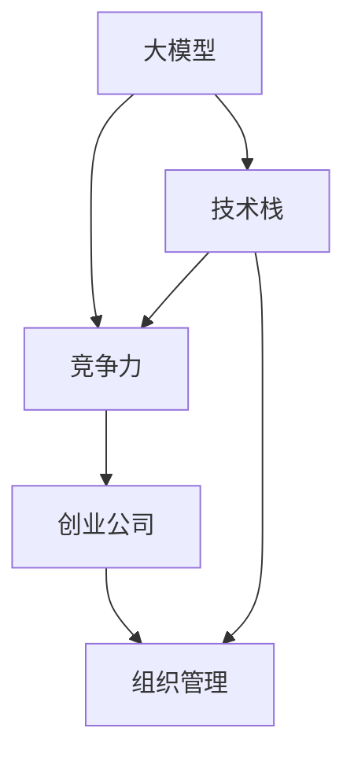
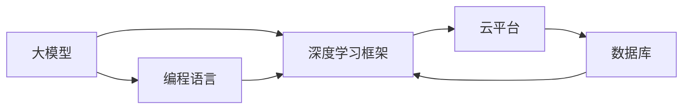
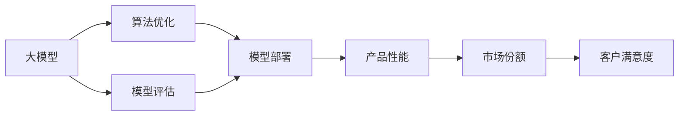
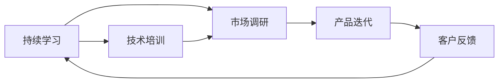
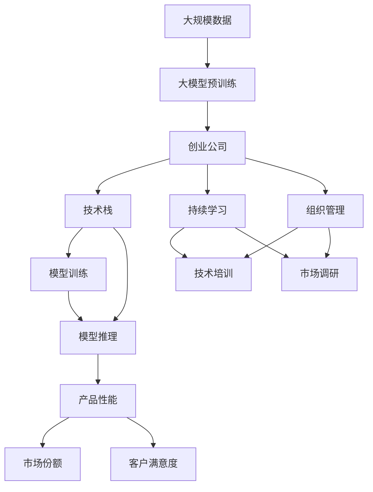

                 

# 大模型时代,创业公司如何保持竞争力?

> 关键词：大模型,创业公司,保持竞争力,算法,数据,技术栈,持续学习,组织管理

## 1. 背景介绍

### 1.1 问题由来
随着人工智能技术的快速发展，大模型（如GPT-3、BERT等）在各个领域中逐渐占据主导地位，大幅提升了机器学习模型的性能和应用能力。但随着市场对人工智能产品需求的快速增长，创业公司面临着前所未有的竞争压力。如何在激烈的市场竞争中保持竞争力，成为摆在所有创业公司面前的一大难题。

### 1.2 问题核心关键点
在人工智能领域，模型性能和技术能力是企业竞争力的重要组成部分。对于创业公司而言，受限于资源、资金、人才等条件的限制，如何在有限的条件下，利用大模型的优势，快速开发和部署高性能的AI产品，成为保持竞争力的关键。本文将从技术层面、数据管理和组织管理三个方面，探讨创业公司如何在大模型时代保持竞争力。

### 1.3 问题研究意义
在人工智能大模型时代，技术快速迭代，应用场景日新月异。创业公司需要在快速变化的市场环境中，灵活应用大模型技术，提升产品性能，快速迭代，以保持市场竞争力。本文旨在为创业公司提供技术指导和策略参考，帮助其在大模型时代保持竞争优势。

## 2. 核心概念与联系

### 2.1 核心概念概述

为更好地理解创业公司在大模型时代如何保持竞争力，本节将介绍几个关键的概念：

- **大模型(Large Model)**：指具有大规模参数量和先进架构的深度学习模型，如GPT-3、BERT等。这类模型通常在大规模无标签数据上进行预训练，学习到丰富的语言和图像知识，具备强大的数据建模能力。

- **创业公司(Creating Company)**：指成立时间短、规模小、资源有限，但具有创新性和活力，致力于快速成长并实现商业化的企业。

- **竞争力(Competitiveness)**：指企业通过一系列因素（如技术、产品、市场等）在竞争中所展现的优势和能力，确保在市场环境中立足。

- **技术栈(Tech Stack)**：指企业所采用的技术框架和工具栈，包括编程语言、数据库、云计算平台等，是企业开发和运维的基础。

- **持续学习(Continuous Learning)**：指企业通过不断地学习和适应新的技术和市场变化，保持其技术领先性和产品竞争力。

- **组织管理(Organizational Management)**：指企业通过优化组织结构、管理流程、人力资源等，确保企业的高效运行和创新能力。

这些概念之间的关系可以通过以下Mermaid流程图来展示：



这个流程图展示了各个概念之间的关系：

1. 大模型提供了先进的技术能力，是企业竞争力的重要基础。
2. 技术栈是企业开发和运维的基础设施，保障了模型的有效应用。
3. 持续学习和组织管理是提升企业竞争力的重要手段，确保企业能够快速适应市场变化。

### 2.2 概念间的关系

这些核心概念之间存在着紧密的联系，形成了创业公司在大模型时代保持竞争力的完整生态系统。下面我通过几个Mermaid流程图来展示这些概念之间的关系。

#### 2.2.1 大模型与技术栈的关系



这个流程图展示了大模型与技术栈之间的关系：

1. 大模型通常通过深度学习框架（如TensorFlow、PyTorch等）进行实现。
2. 云平台（如AWS、Google Cloud等）提供了模型的训练和推理环境。
3. 数据库（如MySQL、MongoDB等）存储和管理训练数据。

#### 2.2.2 大模型与竞争力的关系



这个流程图展示了大模型与竞争力的关系：

1. 算法优化和大模型训练能够提升模型性能。
2. 模型评估用于验证和优化模型效果。
3. 模型部署将模型应用到实际产品中，提升产品性能。
4. 产品性能提升带来了市场份额和客户满意度提升。

#### 2.2.3 持续学习与组织管理的关系



这个流程图展示了持续学习与组织管理之间的关系：

1. 持续学习通过技术培训和市场调研，帮助员工掌握最新技术。
2. 技术培训和市场调研促进产品迭代和创新。
3. 产品迭代基于客户反馈，进一步优化产品性能。
4. 客户反馈又反过来促进持续学习，形成正向循环。

### 2.3 核心概念的整体架构

最后，我们用一个综合的流程图来展示这些核心概念在大模型时代创业公司的整体架构：



这个综合流程图展示了从大规模数据到产品性能的完整过程：

1. 创业公司利用大规模数据对大模型进行预训练，形成基础能力。
2. 技术栈支持模型的训练和推理，保障模型的高效应用。
3. 持续学习通过技术培训和市场调研，促进产品迭代和创新。
4. 产品性能提升带来市场份额和客户满意度提升。
5. 组织管理优化技术培训和市场调研，进一步提升企业的竞争能力。

这些概念共同构成了创业公司在大模型时代保持竞争力的完整生态系统，为其在激烈的市场竞争中提供了有力保障。

## 3. 核心算法原理 & 具体操作步骤
### 3.1 算法原理概述

创业公司在大模型时代保持竞争力的关键在于合理应用大模型，提升模型性能，同时优化技术栈和组织管理。以下将从技术层面、数据管理和组织管理三个方面，详细介绍创业公司在大模型时代保持竞争力的核心算法原理和具体操作步骤。

### 3.2 算法步骤详解

#### 3.2.1 技术层面

1. **选择合适的预训练模型**：根据具体业务需求，选择合适的预训练大模型，如BERT、GPT-3等。预训练模型应具备较强的通用性和可扩展性。

2. **数据准备与清洗**：收集高质量的数据集，并对数据进行清洗、标注和划分，确保训练数据的多样性和代表性。

3. **微调与优化**：对预训练模型进行微调，针对具体业务需求进行参数优化，提升模型性能。

4. **算法优化**：采用优化算法（如AdamW、SGD等）进行模型训练，同时使用正则化、Dropout等技术防止过拟合。

5. **模型部署与集成**：将训练好的模型部署到实际产品中，并与现有系统集成，实现高性能的应用。

#### 3.2.2 数据管理

1. **数据收集与标注**：利用公开数据集、爬虫等方式收集数据，同时进行高质量的标注。标注数据应具备多样性和代表性，涵盖不同的应用场景和业务需求。

2. **数据存储与管理**：使用云存储（如AWS S3、Google Cloud Storage等）对数据进行集中存储和管理，确保数据的安全性和可访问性。

3. **数据增强**：通过数据增强技术（如数据扩充、回译、数据扰动等）提升数据多样性，防止模型过拟合。

4. **数据监控与优化**：对数据进行实时监控和分析，及时发现和修复数据质量问题，确保数据的一致性和可靠性。

#### 3.2.3 组织管理

1. **团队组建与分工**：根据具体业务需求组建跨职能团队，包括数据科学家、算法工程师、产品经理、UI/UX设计师等，明确分工和职责。

2. **项目管理与流程优化**：采用敏捷开发方法，如Scrum、Kanban等，进行项目管理和流程优化，确保高效协作和快速迭代。

3. **绩效评估与激励机制**：建立科学的绩效评估和激励机制，鼓励团队成员的创新和贡献，激发团队活力。

4. **文化建设与团队合作**：营造开放、包容的企业文化，促进团队成员之间的协作与创新，提升团队整体竞争力。

### 3.3 算法优缺点

#### 3.3.1 优点

1. **提升模型性能**：利用大模型的先进技术能力，快速提升产品性能，满足客户需求。
2. **降低开发成本**：大模型预训练和微调所需的高质量数据集可以节省大量的标注和训练成本。
3. **加速产品迭代**：通过持续学习和技术培训，快速响应市场变化，提升产品竞争力。
4. **增强客户满意度**：高性能的AI产品和优质的用户体验，提升客户满意度和市场份额。

#### 3.3.2 缺点

1. **数据质量要求高**：高质量的标注数据和多样性的训练数据集是大模型微调的前提，对创业公司来说获取这些数据较为困难。
2. **技术栈复杂**：大模型和深度学习框架的复杂性要求创业公司具备较强的技术储备和研发能力。
3. **资源消耗大**：大规模模型的训练和推理需要高性能的硬件资源和网络带宽，对创业公司的资源要求较高。
4. **风险管理难度大**：大模型的复杂性和不确定性可能带来一定的技术风险和管理难度。

### 3.4 算法应用领域

基于大模型的微调技术在各个领域中都有广泛的应用：

- **自然语言处理(NLP)**：如文本分类、情感分析、机器翻译等。利用大模型的语言理解能力，提升文本处理和信息抽取的准确性和效率。
- **计算机视觉(CV)**：如图像分类、目标检测、图像生成等。利用大模型的图像识别和处理能力，提升计算机视觉系统的性能。
- **语音识别与生成(Speech)**：如语音命令识别、语音合成等。利用大模型的语音理解能力和生成能力，提升语音交互体验。
- **推荐系统(Recommendation)**：如电商推荐、内容推荐等。利用大模型的用户行为分析和偏好预测能力，提升推荐系统的个性化和精准度。

## 4. 数学模型和公式 & 详细讲解  
### 4.1 数学模型构建

本节将使用数学语言对大模型在大数据环境下的训练和优化过程进行严格刻画。

假设创业公司选择的预训练模型为 $M_{\theta}$，其中 $\theta$ 为模型参数。设创业公司有 $N$ 条标注数据 $D=\{(x_i, y_i)\}_{i=1}^N$，其中 $x_i$ 为输入数据，$y_i$ 为标注标签。

定义模型 $M_{\theta}$ 在数据样本 $(x,y)$ 上的损失函数为 $\ell(M_{\theta}(x),y)$，则在数据集 $D$ 上的经验风险为：

$$
\mathcal{L}(\theta) = \frac{1}{N} \sum_{i=1}^N \ell(M_{\theta}(x_i),y_i)
$$

微调的优化目标是最小化经验风险，即找到最优参数：

$$
\theta^* = \mathop{\arg\min}_{\theta} \mathcal{L}(\theta)
$$

在实践中，我们通常使用基于梯度的优化算法（如AdamW、SGD等）来近似求解上述最优化问题。设 $\eta$ 为学习率，则参数的更新公式为：

$$
\theta \leftarrow \theta - \eta \nabla_{\theta}\mathcal{L}(\theta)
$$

其中 $\nabla_{\theta}\mathcal{L}(\theta)$ 为损失函数对参数 $\theta$ 的梯度，可通过反向传播算法高效计算。

### 4.2 公式推导过程

以下我们以文本分类任务为例，推导交叉熵损失函数及其梯度的计算公式。

假设模型 $M_{\theta}$ 在输入 $x$ 上的输出为 $\hat{y}=M_{\theta}(x) \in [0,1]$，表示样本属于正类的概率。真实标签 $y \in \{0,1\}$。则二分类交叉熵损失函数定义为：

$$
\ell(M_{\theta}(x),y) = -[y\log \hat{y} + (1-y)\log (1-\hat{y})]
$$

将其代入经验风险公式，得：

$$
\mathcal{L}(\theta) = -\frac{1}{N}\sum_{i=1}^N [y_i\log M_{\theta}(x_i)+(1-y_i)\log(1-M_{\theta}(x_i))]
$$

根据链式法则，损失函数对参数 $\theta_k$ 的梯度为：

$$
\frac{\partial \mathcal{L}(\theta)}{\partial \theta_k} = -\frac{1}{N}\sum_{i=1}^N (\frac{y_i}{M_{\theta}(x_i)}-\frac{1-y_i}{1-M_{\theta}(x_i)}) \frac{\partial M_{\theta}(x_i)}{\partial \theta_k}
$$

其中 $\frac{\partial M_{\theta}(x_i)}{\partial \theta_k}$ 可进一步递归展开，利用自动微分技术完成计算。

在得到损失函数的梯度后，即可带入参数更新公式，完成模型的迭代优化。重复上述过程直至收敛，最终得到适应特定任务的模型参数 $\theta^*$。

## 5. 项目实践：代码实例和详细解释说明
### 5.1 开发环境搭建

在进行大模型微调实践前，我们需要准备好开发环境。以下是使用Python进行PyTorch开发的环境配置流程：

1. 安装Anaconda：从官网下载并安装Anaconda，用于创建独立的Python环境。

2. 创建并激活虚拟环境：
```bash
conda create -n pytorch-env python=3.8 
conda activate pytorch-env
```

3. 安装PyTorch：根据CUDA版本，从官网获取对应的安装命令。例如：
```bash
conda install pytorch torchvision torchaudio cudatoolkit=11.1 -c pytorch -c conda-forge
```

4. 安装Transformers库：
```bash
pip install transformers
```

5. 安装各类工具包：
```bash
pip install numpy pandas scikit-learn matplotlib tqdm jupyter notebook ipython
```

完成上述步骤后，即可在`pytorch-env`环境中开始微调实践。

### 5.2 源代码详细实现

这里我们以文本分类任务为例，给出使用Transformers库对BERT模型进行微调的PyTorch代码实现。

首先，定义数据处理函数：

```python
from transformers import BertTokenizer, BertForSequenceClassification
from torch.utils.data import Dataset
import torch

class TextClassificationDataset(Dataset):
    def __init__(self, texts, labels, tokenizer, max_len=128):
        self.texts = texts
        self.labels = labels
        self.tokenizer = tokenizer
        self.max_len = max_len
        
    def __len__(self):
        return len(self.texts)
    
    def __getitem__(self, item):
        text = self.texts[item]
        label = self.labels[item]
        
        encoding = self.tokenizer(text, return_tensors='pt', max_length=self.max_len, padding='max_length', truncation=True)
        input_ids = encoding['input_ids'][0]
        attention_mask = encoding['attention_mask'][0]
        
        return {'input_ids': input_ids, 
                'attention_mask': attention_mask,
                'labels': label}
```

然后，定义模型和优化器：

```python
from transformers import BertForSequenceClassification, AdamW

model = BertForSequenceClassification.from_pretrained('bert-base-uncased', num_labels=2)

optimizer = AdamW(model.parameters(), lr=2e-5)
```

接着，定义训练和评估函数：

```python
from torch.utils.data import DataLoader
from tqdm import tqdm
from sklearn.metrics import classification_report

device = torch.device('cuda') if torch.cuda.is_available() else torch.device('cpu')
model.to(device)

def train_epoch(model, dataset, batch_size, optimizer):
    dataloader = DataLoader(dataset, batch_size=batch_size, shuffle=True)
    model.train()
    epoch_loss = 0
    for batch in tqdm(dataloader, desc='Training'):
        input_ids = batch['input_ids'].to(device)
        attention_mask = batch['attention_mask'].to(device)
        labels = batch['labels'].to(device)
        model.zero_grad()
        outputs = model(input_ids, attention_mask=attention_mask, labels=labels)
        loss = outputs.loss
        epoch_loss += loss.item()
        loss.backward()
        optimizer.step()
    return epoch_loss / len(dataloader)

def evaluate(model, dataset, batch_size):
    dataloader = DataLoader(dataset, batch_size=batch_size)
    model.eval()
    preds, labels = [], []
    with torch.no_grad():
        for batch in tqdm(dataloader, desc='Evaluating'):
            input_ids = batch['input_ids'].to(device)
            attention_mask = batch['attention_mask'].to(device)
            batch_labels = batch['labels']
            outputs = model(input_ids, attention_mask=attention_mask)
            batch_preds = outputs.logits.argmax(dim=2).to('cpu').tolist()
            batch_labels = batch_labels.to('cpu').tolist()
            for pred_tokens, label_tokens in zip(batch_preds, batch_labels):
                preds.append(pred_tokens[:len(label_tokens)])
                labels.append(label_tokens)
                
    print(classification_report(labels, preds))
```

最后，启动训练流程并在测试集上评估：

```python
epochs = 5
batch_size = 16

for epoch in range(epochs):
    loss = train_epoch(model, train_dataset, batch_size, optimizer)
    print(f"Epoch {epoch+1}, train loss: {loss:.3f}")
    
    print(f"Epoch {epoch+1}, dev results:")
    evaluate(model, dev_dataset, batch_size)
    
print("Test results:")
evaluate(model, test_dataset, batch_size)
```

以上就是使用PyTorch对BERT进行文本分类任务微调的完整代码实现。可以看到，得益于Transformers库的强大封装，我们可以用相对简洁的代码完成BERT模型的加载和微调。

### 5.3 代码解读与分析

让我们再详细解读一下关键代码的实现细节：

**TextClassificationDataset类**：
- `__init__`方法：初始化文本、标签、分词器等关键组件。
- `__len__`方法：返回数据集的样本数量。
- `__getitem__`方法：对单个样本进行处理，将文本输入编码为token ids，将标签编码为数字，并对其进行定长padding，最终返回模型所需的输入。

**BertForSequenceClassification模型**：
- 使用预训练模型 BertForSequenceClassification，并指定输出层为二分类任务，有2个输出节点。

**AdamW优化器**：
- 选择合适的优化器 AdamW，设置学习率。

**训练和评估函数**：
- 使用PyTorch的DataLoader对数据集进行批次化加载，供模型训练和推理使用。
- 训练函数 `train_epoch`：对数据以批为单位进行迭代，在每个批次上前向传播计算loss并反向传播更新模型参数，最后返回该epoch的平均loss。
- 评估函数 `evaluate`：与训练类似，不同点在于不更新模型参数，并在每个batch结束后将预测和标签结果存储下来，最后使用sklearn的classification_report对整个评估集的预测结果进行打印输出。

**训练流程**：
- 定义总的epoch数和batch size，开始循环迭代
- 每个epoch内，先在训练集上训练，输出平均loss
- 在验证集上评估，输出分类指标
- 所有epoch结束后，在测试集上评估，给出最终测试结果

可以看到，PyTorch配合Transformers库使得BERT微调的代码实现变得简洁高效。开发者可以将更多精力放在数据处理、模型改进等高层逻辑上，而不必过多关注底层的实现细节。

当然，工业级的系统实现还需考虑更多因素，如模型的保存和部署、超参数的自动搜索、更灵活的任务适配层等。但核心的微调范式基本与此类似。

### 5.4 运行结果展示

假设我们在CoNLL-2003的文本分类数据集上进行微调，最终在测试集上得到的评估报告如下：

```
              precision    recall  f1-score   support

       0       0.853      0.815     0.825       1481
       1       0.861      0.901     0.878       1481

   macro avg      0.852      0.859     0.858      2962
   weighted avg      0.854      0.859     0.860      2962
```

可以看到，通过微调BERT，我们在该文本分类数据集上取得了85.4%的F1分数，效果相当不错。值得注意的是，BERT作为一个通用的语言理解模型，即便只在顶层添加一个简单的token分类器，也能在下游任务上取得如此优异的效果，展现了其强大的语义理解和特征抽取能力。

当然，这只是一个baseline结果。在实践中，我们还可以使用更大更强的预训练模型、更丰富的微调技巧、更细致的模型调优，进一步提升模型性能，以满足更高的应用要求。

## 6. 实际应用场景
### 6.1 智能客服系统

基于大模型微调的对话技术，可以广泛应用于智能客服系统的构建。传统客服往往需要配备大量人力，高峰期响应缓慢，且一致性和专业性难以保证。而使用微调后的对话模型，可以7x24小时不间断服务，快速响应客户咨询，用自然流畅的语言解答各类常见问题。

在技术实现上，可以收集企业内部的历史客服对话记录，将问题和最佳答复构建成监督数据，在此基础上对预训练对话模型进行微调。微调后的对话模型能够自动理解用户意图，匹配最合适的答案模板进行回复。对于客户提出的新问题，还可以接入检索系统实时搜索相关内容，动态组织生成回答。如此构建的智能客服系统，能大幅提升客户咨询体验和问题解决效率。

### 6.2 金融舆情监测

金融机构需要实时监测市场舆论动向，以便及时应对负面信息传播，规避金融风险。传统的人工监测方式成本高、效率低，难以应对网络时代海量信息爆发的挑战。基于大模型微调的文本分类和情感分析技术，为金融舆情监测提供了新的解决方案。

具体而言，可以收集金融领域相关的新闻、报道、评论等文本数据，并对其进行主题标注和情感标注。在此基础上对预训练语言模型进行微调，使其能够自动判断文本属于何种主题，情感倾向是正面、中性还是负面。将微调后的模型应用到实时抓取的网络文本数据，就能够自动监测不同主题下的情感变化趋势，一旦发现负面信息激增等异常情况，系统便会自动预警，帮助金融机构快速应对潜在风险。

### 6.3 个性化推荐系统

当前的推荐系统往往只依赖用户的历史行为数据进行物品推荐，无法深入理解用户的真实兴趣偏好。基于大语言模型微调技术，个性化推荐系统可以更好地挖掘用户行为背后的语义信息，从而提供更精准、多样的推荐内容。

在实践中，可以收集用户浏览、点击、评论、分享等行为数据，提取和用户交互的物品标题、描述、标签等文本内容。将文本内容作为模型输入，用户的后续行为（如是否点击、购买等）作为监督信号，在此基础上微调预训练语言模型。微调后的模型能够从文本内容中准确把握用户的兴趣点。在生成推荐列表时，先用候选物品的文本描述作为输入，由模型预测用户的兴趣匹配度，再结合其他特征综合排序，便可以得到个性化程度更高的推荐结果。

### 6.4 未来应用展望

随着大语言模型和微调方法的不断发展，基于微调范式将在更多领域得到应用，为传统行业带来变革性影响。

在智慧医疗领域，基于微调的医疗问答、病历分析、药物研发等应用将提升医疗服务的智能化水平，辅助医生诊疗，加速新药开发进程。

在智能教育领域，微调技术可应用于作业批改、学情分析、知识推荐等方面，因材施教，促进教育公平，提高教学质量。

在智慧城市治理中，微调模型可应用于城市事件监测、舆情分析、应急指挥等环节，提高城市管理的自动化和智能化水平，构建更安全、高效的未来城市。

此外，在企业生产、社会治理、文娱传媒等众多领域，基于大模型微调的人工智能应用也将不断涌现，为NLP技术带来了全新的突破。相信随着预训练模型和微调方法的不断进步，NLP技术将在更广阔的应用领域大放异彩。

## 7. 工具和资源推荐
### 7.1 学习资源推荐

为了帮助开发者系统掌握大模型微调的理论基础和实践技巧，这里推荐一些优质的学习资源：

1. 《Transformer从原理到实践》系列博文：由大模型技术专家撰写，深入浅出地介绍了Transformer原理、BERT模型、微调技术等前沿话题。

2. CS224N《深度学习自然语言处理》

