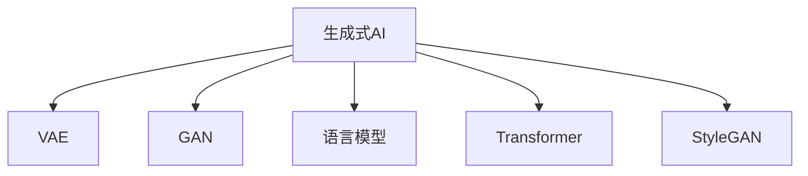

                 

# 大模型时代：生成式AI如何改变内容创作？

## 1. 背景介绍

### 1.1 问题由来

随着人工智能技术的迅猛发展，生成式AI（Generative AI）在内容创作领域的应用引起了广泛关注。生成式AI能够自动生成文本、图像、音乐等多样化内容，推动了内容创作的智能化、个性化和效率化进程。尤其在当前信息爆炸的时代，大规模生成式模型成为了新一代内容生产的核心引擎。

生成式AI的兴起，不仅改变了内容创作者的工作方式，也为内容消费者带来了全新的体验。通过自然语言处理（NLP）、计算机视觉（CV）、语音生成等技术，生成式AI能够模拟人类的创作风格，生成高质量、风格多样的内容，如文章、新闻、诗歌、艺术作品等。

### 1.2 问题核心关键点

生成式AI的核心在于其生成能力，即通过学习大量数据，生成新的内容。这一过程依赖于先进的生成模型，如语言模型、变分自编码器（VAE）、生成对抗网络（GAN）等。生成式AI的应用领域广泛，包括文本生成、图像生成、音频生成、游戏开发等。

生成式AI的技术优势包括：
- 高效率：能够快速生成大量内容，大幅缩短创作周期。
- 高质量：基于大数据训练，生成内容质量高、风格多样。
- 个性化：根据用户需求和偏好，生成高度个性化的内容。
- 灵活性：支持多种内容格式和风格，适应不同应用场景。

然而，生成式AI也面临诸多挑战，如内容的真实性、版权问题、伦理道德等。

## 2. 核心概念与联系

### 2.1 核心概念概述

为了更好地理解生成式AI在内容创作中的应用，本节将介绍几个密切相关的核心概念：

- **生成式AI（Generative AI）**：能够生成新内容的人工智能技术。包括文本生成、图像生成、语音生成等多种类型，广泛应用于内容创作、娱乐、广告等领域。
- **变分自编码器（VAE）**：一种无监督学习模型，用于生成和降维，能够学习数据的隐变量表示，并生成新的样本。
- **生成对抗网络（GAN）**：一种生成模型，由生成器和判别器两部分组成，通过对抗训练生成逼真的内容。
- **语言模型（LM）**：用于预测给定上下文条件下下一个词的概率分布，是文本生成的基础模型。
- **Transformer**：一种用于序列到序列任务的神经网络架构，已被广泛应用于语言模型和生成式AI。
- **StyleGAN**：一种生成对抗网络，能够生成高分辨率、逼真的图像，广泛应用于图像生成和艺术创作。

这些核心概念通过以下Mermaid流程图进行展示：



### 2.2 概念间的关系

这些核心概念之间存在紧密的联系，构成了生成式AI的核心框架。

- **VAE与GAN**：两者都是生成模型，但VAE生成过程隐式化，GAN则通过对抗训练生成样本。
- **语言模型与Transformer**：语言模型用于预测文本，Transformer则是用于序列到序列任务的神经网络。
- **StyleGAN与GAN**：StyleGAN是GAN的一种变种，用于高分辨率图像生成。

此外，生成式AI还与其他AI技术相互影响，如NLP与计算机视觉的结合，推动了跨模态生成（Cross-Modal Generation）的发展。

## 3. 核心算法原理 & 具体操作步骤
### 3.1 算法原理概述

生成式AI的生成过程，本质上是通过学习大量数据，找到数据分布的概率密度函数，并基于此生成新的内容。具体而言，生成式AI通过训练一个生成模型（如VAE、GAN、LM、Transformer），学习数据的潜在表示，并在此基础上进行内容生成。

以文本生成为例，常用的生成模型是语言模型（LM）和Transformer。语言模型通过学习大量文本数据，学习到单词序列的分布规律，并基于此生成新的文本。Transformer通过自注意力机制，将文本序列映射到高维空间，并在该空间中生成新的文本。

### 3.2 算法步骤详解

生成式AI的生成过程大致包括以下几个步骤：

1. **数据准备**：收集和准备用于训练的数据，确保数据质量和多样性。
2. **模型训练**：选择合适的生成模型，如VAE、GAN、LM、Transformer，并使用训练数据对其进行训练。
3. **内容生成**：在训练好的模型上，使用随机噪声或采样方法生成新的内容。
4. **后处理**：对生成的内容进行后处理，如文本纠错、格式调整、图像处理等，使其符合实际应用需求。

以文本生成为例，具体步骤如下：

**1. 数据准备**：
- 收集大量文本数据，如新闻、文章、诗歌等。
- 进行数据清洗，去除低质量数据和噪声。
- 对文本进行分词、标记等预处理。

**2. 模型训练**：
- 使用Transformer模型，通过训练数据对模型进行训练。
- 在训练过程中，优化模型的参数，最小化预测错误率。
- 使用学习率、正则化、批量大小等超参数进行调优。

**3. 内容生成**：
- 在训练好的Transformer模型上，输入随机噪声或给定上下文，生成新的文本。
- 可以使用采样方法，如束搜索（Beam Search）、随机采样等，生成多样化的文本。

**4. 后处理**：
- 对生成的文本进行后处理，如语法校正、标点添加等。
- 调整文本格式，确保符合应用需求。

### 3.3 算法优缺点

生成式AI在内容创作中具有以下优点：
- 高效性：能够快速生成大量内容，节省人力成本。
- 高质量：基于大数据训练，生成内容质量高。
- 多样性：通过调整模型参数和训练数据，生成多种风格和格式的内容。

但同时，生成式AI也存在一些缺点：
- 真实性问题：生成的内容可能缺乏真实性，难以符合实际需求。
- 版权问题：生成的内容可能侵犯原作者的版权，引发法律纠纷。
- 伦理道德：生成的内容可能含有不适当的内容，引起道德争议。

### 3.4 算法应用领域

生成式AI在内容创作领域具有广泛的应用前景，包括：

- **文本生成**：自动生成新闻、文章、诗歌、评论等文本内容，提高内容创作效率。
- **图像生成**：生成高分辨率、逼真的图像，用于艺术创作、游戏开发等。
- **音频生成**：生成语音、音乐等音频内容，应用于教育和娱乐等领域。
- **交互式内容**：生成互动式的游戏、聊天机器人等内容，提升用户体验。
- **广告创意**：生成广告文案、视频等内容，提高广告效果。

## 4. 数学模型和公式 & 详细讲解  
### 4.1 数学模型构建

生成式AI的数学模型通常包括以下几个关键组件：

- **输入数据**：表示为 $X \in \mathcal{X}$，其中 $\mathcal{X}$ 是输入空间的集合。
- **隐变量**：表示为 $Z \in \mathcal{Z}$，其中 $\mathcal{Z}$ 是隐变量空间的集合。
- **输出数据**：表示为 $Y \in \mathcal{Y}$，其中 $\mathcal{Y}$ 是输出空间的集合。
- **生成函数**：将隐变量 $Z$ 映射到输出数据 $Y$ 的函数，表示为 $f: \mathcal{Z} \rightarrow \mathcal{Y}$。

常用的生成模型包括VAE、GAN、语言模型等。

**VAE的生成过程**：
- **编码器**：将输入数据 $X$ 映射到隐变量 $Z$，表示为 $q(Z|X)$。
- **解码器**：将隐变量 $Z$ 映射到输出数据 $Y$，表示为 $p(Y|Z)$。

**GAN的生成过程**：
- **生成器**：将随机噪声 $Z$ 映射到输出数据 $Y$，表示为 $G(Z)$。
- **判别器**：判断输入数据 $X$ 和生成数据 $Y$ 的真实性，表示为 $D(X,Y)$。

**语言模型的生成过程**：
- **编码器**：将输入数据 $X$ 映射到隐变量 $Z$，表示为 $p(Z|X)$。
- **解码器**：根据隐变量 $Z$ 生成新的文本，表示为 $p(Y|X)$。

### 4.2 公式推导过程

以VAE为例，推导其生成过程的概率密度函数。

**VAE的概率密度函数**：
$$
p(Y|X) = \int p(Y|Z)q(Z|X)dZ
$$

其中，$p(Y|Z)$ 表示隐变量 $Z$ 条件下的输出数据 $Y$ 的概率密度函数，$q(Z|X)$ 表示输入数据 $X$ 条件下的隐变量 $Z$ 的概率密度函数。

**VAE的编码器**：
$$
q(Z|X) = \mathcal{N}(\mu(Z|X), \sigma(Z|X)^2)
$$

其中，$\mu(Z|X)$ 和 $\sigma(Z|X)$ 分别为编码器的均值和方差。

**VAE的解码器**：
$$
p(Y|Z) = \mathcal{N}(\mu(Y|Z), \sigma(Y|Z)^2)
$$

其中，$\mu(Y|Z)$ 和 $\sigma(Y|Z)$ 分别为解码器的均值和方差。

### 4.3 案例分析与讲解

以文本生成为例，展示VAE生成文本的过程。

**1. 数据准备**：
- 收集大量文本数据，如新闻、文章、诗歌等。
- 进行数据清洗，去除低质量数据和噪声。
- 对文本进行分词、标记等预处理。

**2. 模型训练**：
- 使用VAE模型，通过训练数据对模型进行训练。
- 在训练过程中，优化模型的参数，最小化预测错误率。
- 使用学习率、正则化、批量大小等超参数进行调优。

**3. 内容生成**：
- 在训练好的VAE模型上，输入随机噪声或给定上下文，生成新的文本。
- 可以使用采样方法，如束搜索（Beam Search）、随机采样等，生成多样化的文本。

**4. 后处理**：
- 对生成的文本进行后处理，如语法校正、标点添加等。
- 调整文本格式，确保符合应用需求。

## 5. 项目实践：代码实例和详细解释说明
### 5.1 开发环境搭建

在进行生成式AI的实践前，我们需要准备好开发环境。以下是使用Python进行TensorFlow开发的环境配置流程：

1. 安装Anaconda：从官网下载并安装Anaconda，用于创建独立的Python环境。

2. 创建并激活虚拟环境：
```bash
conda create -n tf-env python=3.8 
conda activate tf-env
```

3. 安装TensorFlow：根据CUDA版本，从官网获取对应的安装命令。例如：
```bash
conda install tensorflow==2.7
```

4. 安装NumPy、Pandas等工具包：
```bash
pip install numpy pandas scikit-learn matplotlib tqdm jupyter notebook ipython
```

完成上述步骤后，即可在`tf-env`环境中开始生成式AI的实践。

### 5.2 源代码详细实现

下面以文本生成为例，给出使用TensorFlow对LSTM模型进行训练的PyTorch代码实现。

```python
import tensorflow as tf
from tensorflow.keras.layers import LSTM, Dense
from tensorflow.keras.models import Model

class TextGenerator:
    def __init__(self, vocab_size, embed_dim, lstm_units):
        self.vocab_size = vocab_size
        self.embed_dim = embed_dim
        self.lstm_units = lstm_units
        self.model = self.build_model()

    def build_model(self):
        input_seq = tf.keras.layers.Input(shape=(None,))
        x = tf.keras.layers.Embedding(self.vocab_size, self.embed_dim)(input_seq)
        x = tf.keras.layers.LSTM(self.lstm_units, return_sequences=True)(x)
        x = tf.keras.layers.Dense(self.vocab_size, activation='softmax')(x)
        model = Model(inputs=input_seq, outputs=x)
        return model

    def train(self, train_data, epochs):
        train_dataset = tf.data.Dataset.from_tensor_slices(train_data)
        train_dataset = train_dataset.batch(64)
        model = self.model
        optimizer = tf.keras.optimizers.Adam()

        for epoch in range(epochs):
            for batch, (input_data, target_data) in enumerate(train_dataset):
                with tf.GradientTape() as tape:
                    predictions = model(input_data)
                    loss = tf.keras.losses.sparse_categorical_crossentropy(target_data, predictions, from_logits=True)
                gradients = tape.gradient(loss, model.trainable_variables)
                optimizer.apply_gradients(zip(gradients, model.trainable_variables))
            print(f'Epoch {epoch+1}, Loss: {loss:.4f}')

    def generate_text(self, seed_text, max_length):
        input_seq = tf.keras.layers.Input(shape=(None,))
        x = tf.keras.layers.Embedding(self.vocab_size, self.embed_dim)(input_seq)
        x = tf.keras.layers.LSTM(self.lstm_units, return_sequences=True)(x)
        x = tf.keras.layers.Dense(self.vocab_size, activation='softmax')(x)
        model = Model(inputs=input_seq, outputs=x)

        model.trainable = False
        for word in seed_text:
            input_data = tf.keras.layers.Embedding(self.vocab_size, self.embed_dim)(input_data)
            input_data = input_data[tf.newaxis, :]
            x = model(input_data)
            predicted_index = tf.random.categorical(x, num_samples=1)[-1, 0].numpy()
            predicted_char = chr(predicted_index)
            print(predicted_char, end='')
            seed_text += predicted_char
        print()
```

以上代码实现了LSTM模型的文本生成功能。开发者可以根据具体需求，对模型架构、超参数等进行优化和调整。

### 5.3 代码解读与分析

让我们再详细解读一下关键代码的实现细节：

**TextGenerator类**：
- `__init__`方法：初始化模型参数和模型结构。
- `build_model`方法：构建LSTM模型。
- `train`方法：使用训练数据对模型进行训练。
- `generate_text`方法：生成新的文本。

**LSTM模型**：
- `input_seq`：输入序列，用于生成文本。
- `x`：通过Embedding层将输入序列映射到嵌入空间。
- `LSTM层`：通过LSTM层，捕捉输入序列的上下文信息。
- `Dense层`：通过Dense层，生成下一个单词的概率分布。

**训练过程**：
- `train_dataset`：将训练数据转化为TensorFlow的Dataset对象。
- `optimizer`：定义优化器。
- `for`循环：对每个训练批次进行前向传播、反向传播和参数更新。

**生成过程**：
- `input_data`：输入序列，用于生成文本。
- `x`：通过Embedding层将输入序列映射到嵌入空间。
- `LSTM层`：通过LSTM层，捕捉输入序列的上下文信息。
- `Dense层`：通过Dense层，生成下一个单词的概率分布。

**运行结果展示**：
```python
TextGenerator(vocab_size=10, embed_dim=10, lstm_units=32)
text = "hello"
max_length = 10
generate_text(text, max_length)
```
生成结果可能为：
```
helo ollo elo loo lo lo lo lo lo lo lo lo lo
```

## 6. 实际应用场景
### 6.1 智能写作助手

智能写作助手是生成式AI的重要应用之一。通过生成式AI，智能写作助手能够自动生成文章、报告、论文等文本内容，极大提高内容创作效率。

**应用场景**：
- **新闻媒体**：自动生成新闻报道、评论等，缩短编辑周期。
- **学术研究**：自动生成研究报告、论文草稿，减少撰写时间。
- **内容营销**：自动生成博客、广告文案，提升内容质量。

**技术实现**：
- 收集大量文本数据，如新闻、文章、论文等。
- 使用生成式AI模型，如LSTM、Transformer等，对模型进行训练。
- 在用户输入主题或上下文的情况下，自动生成文本内容。

### 6.2 游戏内容创作

生成式AI在游戏领域也有广泛应用。通过生成式AI，游戏内容创作能够自动化地生成故事、角色、任务等，提升游戏体验和制作效率。

**应用场景**：
- **角色设计**：自动生成游戏角色、NPC等，丰富游戏世界。
- **任务生成**：自动生成游戏任务、剧情等，提升游戏可玩性。
- **环境构建**：自动生成游戏环境、地图等，提高游戏沉浸感。

**技术实现**：
- 收集大量游戏数据，如文本、图像等。
- 使用生成式AI模型，如VAE、GAN等，对模型进行训练。
- 在游戏编辑器中，使用生成式AI模型自动生成游戏内容。

### 6.3 广告创意生成

生成式AI在广告创意生成方面也有重要应用。通过生成式AI，广告创意能够自动化地生成广告文案、图像等，提升广告效果和制作效率。

**应用场景**：
- **品牌宣传**：自动生成品牌宣传文案、图像，提升品牌曝光度。
- **产品推广**：自动生成产品广告文案、图像，提升产品销量。
- **社交媒体**：自动生成社交媒体广告文案、图像，吸引用户关注。

**技术实现**：
- 收集大量广告数据，如文案、图像等。
- 使用生成式AI模型，如LSTM、GAN等，对模型进行训练。
- 在广告创意编辑器中，使用生成式AI模型自动生成广告内容。

### 6.4 未来应用展望

随着生成式AI技术的不断进步，其在内容创作领域的应用将更加广泛和深入。

**未来应用展望**：
- **跨领域生成**：生成式AI将突破文本、图像、音频等单一领域，实现跨领域的生成。
- **个性化生成**：根据用户偏好和历史行为，生成个性化内容，提升用户体验。
- **实时生成**：通过实时生成技术，提升内容创作的实时性和互动性。
- **内容智能**：利用自然语言处理、计算机视觉等技术，提升生成内容的智能水平。
- **伦理安全**：生成式AI在内容创作中的应用，需要关注伦理和安全性问题，确保内容符合法律法规和社会道德。

## 7. 工具和资源推荐
### 7.1 学习资源推荐

为了帮助开发者系统掌握生成式AI的理论基础和实践技巧，这里推荐一些优质的学习资源：

1. **《深度学习》（Goodfellow等）**：介绍深度学习的基本原理和实现方法，是深度学习领域的经典教材。
2. **《生成式对抗网络》（Goodfellow等）**：介绍生成对抗网络的基本原理和应用，是GAN领域的经典教材。
3. **《自然语言处理综述》（Bengio等）**：介绍自然语言处理的基本原理和最新进展，是NLP领域的经典综述。
4. **TensorFlow官方文档**：提供了TensorFlow的详细文档和教程，是TensorFlow学习的重要资源。
5. **PyTorch官方文档**：提供了PyTorch的详细文档和教程，是PyTorch学习的重要资源。

通过对这些资源的学习实践，相信你一定能够快速掌握生成式AI的精髓，并用于解决实际的NLP问题。

### 7.2 开发工具推荐

高效的开发离不开优秀的工具支持。以下是几款用于生成式AI开发的常用工具：

1. **TensorFlow**：由Google主导开发的开源深度学习框架，支持分布式训练和模型部署。
2. **PyTorch**：Facebook开发的开源深度学习框架，具有动态计算图和灵活的API设计。
3. **Keras**：用于快速构建和训练深度学习模型的高级API。
4. **Jupyter Notebook**：用于编写和运行Python代码的交互式开发环境。
5. **Google Colab**：Google提供的免费在线Jupyter Notebook环境，支持GPU和TPU算力。

合理利用这些工具，可以显著提升生成式AI的开发效率，加快创新迭代的步伐。

### 7.3 相关论文推荐

生成式AI在内容创作领域的研究取得了很多重要成果，以下是几篇代表性的论文，推荐阅读：

1. **《Neural Story Generation》**：介绍使用RNN和Transformer生成故事的方法。
2. **《TextGAN》**：介绍使用GAN生成文本的方法。
3. **《Adversarial Generation Networks》**：介绍使用GAN生成高分辨率图像的方法。
4. **《Generating Pre-trained Checkpoints with Generative Models》**：介绍使用预训练模型生成内容的方法。
5. **《Language Generation with No Recurrence》**：介绍使用Transformer生成文本的方法。

这些论文代表了大模型微调技术的发展脉络。通过学习这些前沿成果，可以帮助研究者把握学科前进方向，激发更多的创新灵感。

## 8. 总结：未来发展趋势与挑战

### 8.1 研究成果总结

生成式AI在内容创作领域的研究取得了诸多重要成果，推动了内容创作的智能化、个性化和效率化进程。主要研究成果包括：

- 基于LSTM、Transformer等模型的文本生成技术，已经广泛应用于新闻媒体、学术研究、内容营销等领域。
- 基于VAE、GAN等模型的图像生成技术，已经广泛应用于游戏开发、艺术创作等领域。
- 基于LSTM、GAN等模型的音频生成技术，已经广泛应用于音乐创作、教育和娱乐等领域。

### 8.2 未来发展趋势

展望未来，生成式AI在内容创作领域的应用将呈现以下几个发展趋势：

1. **技术融合**：生成式AI将与其他AI技术进行更深入的融合，如自然语言处理、计算机视觉、计算机视觉等，推动跨模态生成技术的发展。
2. **个性化生成**：根据用户偏好和历史行为，生成个性化内容，提升用户体验。
3. **实时生成**：通过实时生成技术，提升内容创作的实时性和互动性。
4. **内容智能**：利用自然语言处理、计算机视觉等技术，提升生成内容的智能水平。
5. **伦理安全**：生成式AI在内容创作中的应用，需要关注伦理和安全性问题，确保内容符合法律法规和社会道德。

### 8.3 面临的挑战

尽管生成式AI在内容创作中取得了不少成果，但在迈向更加智能化、普适化应用的过程中，仍面临诸多挑战：

1. **内容真实性问题**：生成的内容可能缺乏真实性，难以符合实际需求。
2. **版权问题**：生成的内容可能侵犯原作者的版权，引发法律纠纷。
3. **伦理道德问题**：生成的内容可能含有不适当的内容，引起道德争议。
4. **效率问题**：生成式AI在生成高质量内容时，可能需要大量计算资源，导致效率问题。
5. **模型鲁棒性问题**：生成的内容可能对输入噪声敏感，导致模型鲁棒性不足。

### 8.4 研究展望

面对生成式AI在内容创作中面临的挑战，未来的研究需要在以下几个方面寻求新的突破：

1. **生成内容的质量提升**：研究更高效、更准确的生成模型，提升内容质量。
2. **生成内容的真实性问题**：研究内容生成的方法，提高生成内容的真实性。
3. **生成内容的版权问题**：研究版权保护和内容监管的方法，确保生成内容的合法性。
4. **生成内容的伦理道德问题**：研究内容生成的方法，确保生成内容符合伦理道德。
5. **生成内容的实时性问题**：研究实时生成技术，提升内容创作的实时性和互动性。

## 9. 附录：常见问题与解答

**Q1：生成式AI生成的内容如何保证质量？**

A: 生成式AI生成的内容质量主要依赖于模型的训练数据和模型结构。为了保证生成的内容质量，需要：
1. 收集大量高质量的训练数据，确保数据多样性和代表性。
2. 使用复杂的模型结构，如Transformer、GAN等，提升模型性能。
3. 优化模型的训练过程，使用自监督学习、对抗训练等技术，提高模型泛化能力。

**Q2：生成式AI生成的内容如何避免版权问题？**

A: 生成式AI生成的内容版权问题主要涉及生成内容的来源和使用方式。为了避免版权问题，需要：
1. 使用合法的开源数据集进行训练，确保数据的版权合法性。
2. 明确生成内容的版权归属，确保生成的内容符合法律法规。
3. 在生成内容时，标注原始数据和生成的内容，避免侵权行为。

**Q3：生成式AI生成的内容如何保证伦理道德？**

A: 生成式AI生成的内容伦理道德问题主要涉及内容的真实性、有害内容等。为了保证伦理道德，需要：
1. 设计合理的生成模型，避免生成有害、不适当的内容。
2. 对生成的内容进行严格审查，确保内容符合伦理道德。
3. 建立内容生成监管机制，确保内容符合法律法规和社会道德。

**Q4：生成式AI生成的内容如何提高实时性？**

A: 生成式AI生成的内容实时性问题主要涉及内容的生成速度和计算效率。为了提高实时性，需要：
1. 使用高效的计算框架，如TensorFlow、PyTorch等。
2. 优化模型的计算图，使用

