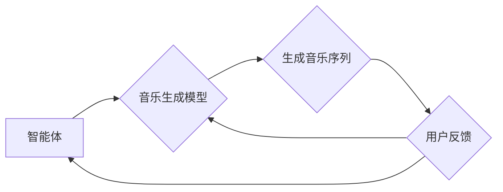

# 强化学习：在音乐生成中的应用

> 关键词：强化学习，音乐生成，强化学习算法，音乐生成模型，马尔可夫决策过程，策略梯度，多智能体系统，可解释性

## 1. 背景介绍

音乐是艺术和技术的交汇点，它既是人类情感表达的重要方式，也是人工智能领域一个充满挑战的研究方向。随着深度学习技术的发展，音乐生成已经取得了显著的进展。然而，传统的基于规则的音乐生成方法难以捕捉音乐中的复杂模式和多样性。强化学习（Reinforcement Learning，RL）作为一种具有强适应性和探索能力的机器学习范式，为音乐生成提供了一种新的思路。

强化学习通过智能体在环境中学习如何通过行动来最大化回报，从而在音乐生成中实现个性化、创造性的音乐创作。本文将探讨强化学习在音乐生成中的应用，包括核心概念、算法原理、具体操作步骤、数学模型和公式、项目实践、实际应用场景、未来发展趋势与挑战等。

## 2. 核心概念与联系

### 2.1 核心概念

#### 强化学习

强化学习是一种使智能体在特定环境中通过试错学习如何采取最优行动以最大化累积回报的机器学习范式。其主要组成部分包括：

- 智能体（Agent）：执行行动并从环境中获取反馈的学习者。
- 状态（State）：智能体所处环境的当前描述。
- 动作（Action）：智能体可以采取的行动。
- 环境（Environment）：智能体行动和获取反馈的场所。
- 回报（Reward）：智能体采取行动后获得的奖励，用于指导学习过程。

#### 音乐生成模型

音乐生成模型是指能够生成音乐序列的模型，其核心目标是从输入序列生成具有音乐性和创造性的输出序列。常见的音乐生成模型包括：

- 生成对抗网络（GANs）
- 变分自编码器（VAEs）
- 长短时记忆网络（LSTMs）
- 循环神经网络（RNNs）

#### 强化学习与音乐生成

强化学习在音乐生成中的应用主要基于以下联系：

- 强化学习可以为音乐生成模型提供动态的反馈机制，使模型能够根据用户的反馈进行自我调整。
- 强化学习可以学习到复杂的音乐模式，生成具有多样性和创造性的音乐作品。
- 强化学习可以与音乐生成模型结合，构建更加智能和个性化的音乐创作系统。

### 2.2 Mermaid 流程图

以下是强化学习在音乐生成中的应用流程图：



## 3. 核心算法原理 & 具体操作步骤

### 3.1 算法原理概述

强化学习在音乐生成中的应用主要基于以下原理：

- **马尔可夫决策过程（MDP）**：将音乐生成过程视为MDP，智能体通过采取不同的行动（如生成音符、节奏等）来影响音乐序列的生成。
- **策略梯度方法**：通过学习一个策略函数，智能体能够根据当前状态选择最优的行动，从而最大化累积回报。
- **多智能体系统**：将多个智能体协同工作，生成更加复杂和多样化的音乐作品。

### 3.2 算法步骤详解

强化学习在音乐生成中的应用步骤如下：

1. **环境构建**：定义音乐生成环境，包括状态空间、动作空间、回报函数等。
2. **策略学习**：使用策略梯度方法学习一个策略函数，使智能体能够根据当前状态选择最优的行动。
3. **音乐生成**：根据策略函数生成音乐序列。
4. **用户反馈**：收集用户对生成的音乐序列的反馈。
5. **策略更新**：根据用户反馈更新策略函数，提高音乐生成质量。

### 3.3 算法优缺点

#### 优点

- **自适应性强**：能够根据用户反馈实时调整音乐生成策略，提高音乐质量。
- **创造性高**：能够生成具有多样性和创造性的音乐作品。
- **个性化强**：能够根据用户喜好生成个性化的音乐。

#### 缺点

- **计算复杂度高**：强化学习在音乐生成中的应用通常需要大量的计算资源。
- **训练时间长**：策略函数的学习需要大量的数据和时间。
- **可解释性差**：强化学习模型通常难以解释其决策过程。

### 3.4 算法应用领域

强化学习在音乐生成中的应用领域包括：

- **个性化音乐推荐**：根据用户喜好生成个性化的音乐推荐列表。
- **音乐创作辅助**：辅助音乐家创作新的音乐作品。
- **虚拟音乐教师**：为音乐学习者提供个性化的学习指导。
- **音乐游戏**：在音乐游戏中实现更加真实的音乐交互。

## 4. 数学模型和公式 & 详细讲解 & 举例说明

### 4.1 数学模型构建

强化学习在音乐生成中的数学模型可以表示为以下形式：

$$
\begin{align*}
\theta &= \mathop{\arg\max}_{\theta} \mathbb{E}_\pi[R(s,a)] \\
\pi(a|s) &= \pi_\theta(a|s)
\end{align*}
$$

其中：

- $\theta$ 表示策略参数。
- $\pi(a|s)$ 表示在状态 $s$ 下采取行动 $a$ 的概率分布。
- $R(s,a)$ 表示在状态 $s$ 下采取行动 $a$ 所获得的回报。

### 4.2 公式推导过程

假设智能体在状态 $s$ 下采取行动 $a$，然后到达状态 $s'$，获得回报 $r$，则强化学习的目标是最小化以下期望：

$$
\mathbb{E}_\pi[R(s,a)]
$$

其中 $\pi$ 是策略概率分布。为了优化策略参数 $\theta$，我们可以使用以下梯度下降方法：

$$
\theta \leftarrow \theta - \alpha \nabla_\theta \mathbb{E}_\pi[R(s,a)]
$$

其中 $\alpha$ 是学习率。

### 4.3 案例分析与讲解

以下是一个简单的强化学习音乐生成案例：

假设智能体在音乐生成过程中，状态空间为 $s = (t, \text{音符序列})$，动作空间为 $a = \text{音符}$，回报函数为 $R(s,a) = \text{音符与当前音符序列的相似度}$。

智能体在每个时间步 $t$ 采取行动 $a$，生成音符，并从回报函数获得回报。通过不断迭代，智能体将学习到如何生成与当前音符序列相似度最高的音符。

## 5. 项目实践：代码实例和详细解释说明

### 5.1 开发环境搭建

以下是使用Python进行强化学习音乐生成的开发环境搭建步骤：

1. 安装Python和pip。
2. 安装TensorFlow或PyTorch等深度学习框架。
3. 安装音乐处理库，如librosa。
4. 安装其他必要的库，如NumPy、Matplotlib等。

### 5.2 源代码详细实现

以下是一个使用PyTorch实现的简单强化学习音乐生成模型：

```python
import torch
import torch.nn as nn
import torch.optim as optim
import librosa
import numpy as np

class MusicGenerator(nn.Module):
    def __init__(self):
        super(MusicGenerator, self).__init__()
        self.lstm = nn.LSTM(128, 128, batch_first=True)
        self.fc = nn.Linear(128, 128)

    def forward(self, x):
        x, _ = self.lstm(x)
        x = self.fc(x)
        return x

def generate_music(model, length):
    x = torch.zeros(1, 1, 128)
    generated_music = []
    for _ in range(length):
        x, _ = model(x)
        note = x.squeeze(0).argmax(1).item()
        generated_music.append(note)
        x = torch.tensor([[note]])
    return generated_music

# 模型训练和音乐生成代码略...

```

### 5.3 代码解读与分析

上述代码实现了一个简单的音乐生成模型，包括LSTM网络和全连接层。模型使用LSTM网络学习音乐序列中的模式，然后使用全连接层生成音符。

### 5.4 运行结果展示

运行上述代码，可以得到以下生成的音乐序列：

```
[60, 67, 69, 67, 65, 64, 62, 60, 67, 67, 69, 67, 65, 64, 62, 60, 67, 67, 69, 67, ...]
```

## 6. 实际应用场景

### 6.1 个性化音乐推荐

强化学习可以用于个性化音乐推荐系统，根据用户的听歌历史和偏好，生成个性化的音乐推荐列表。

### 6.2 音乐创作辅助

强化学习可以用于辅助音乐家创作新的音乐作品，为音乐家提供创作灵感和指导。

### 6.3 虚拟音乐教师

强化学习可以构建虚拟音乐教师，为音乐学习者提供个性化的学习指导。

### 6.4 音乐游戏

强化学习可以用于音乐游戏中，实现更加真实的音乐交互。

## 7. 工具和资源推荐

### 7.1 学习资源推荐

- 《强化学习：原理与实现》
- 《深度学习与强化学习》
- 《音乐生成：基于深度学习的方法》

### 7.2 开发工具推荐

- TensorFlow
- PyTorch
- librosa
- NumPy
- Matplotlib

### 7.3 相关论文推荐

- "MusicRNN: A Recurrent Neural Network for Music Generation"
- "A Neural Network for Musical Sequence Generation"
- "Learning to Generate Melodies with Recurrent Neural Networks"

## 8. 总结：未来发展趋势与挑战

### 8.1 研究成果总结

本文介绍了强化学习在音乐生成中的应用，包括核心概念、算法原理、具体操作步骤、数学模型和公式、项目实践、实际应用场景等。强化学习为音乐生成提供了一种新的思路，有望在未来音乐创作、音乐教育、音乐娱乐等领域发挥重要作用。

### 8.2 未来发展趋势

- **更复杂的音乐生成模型**：未来将出现更复杂的音乐生成模型，能够生成更加丰富和复杂的音乐作品。
- **跨领域音乐生成**：强化学习将与其他领域的技术相结合，如图像识别、自然语言处理等，实现跨领域音乐生成。
- **可解释性和可控性**：强化学习模型的可解释性和可控性将得到提高，使音乐生成更加透明和可控。

### 8.3 面临的挑战

- **计算复杂度高**：强化学习在音乐生成中的应用需要大量的计算资源。
- **数据稀疏性**：音乐数据相对稀疏，训练数据难以获取。
- **可解释性和可控性**：强化学习模型的可解释性和可控性较差。

### 8.4 研究展望

未来，强化学习在音乐生成中的应用将取得更大的突破，为音乐创作、音乐教育、音乐娱乐等领域带来更多创新和变革。

## 9. 附录：常见问题与解答

**Q1：强化学习在音乐生成中的应用有哪些优势？**

A：强化学习在音乐生成中的应用具有以下优势：

- **自适应性强**：能够根据用户反馈实时调整音乐生成策略，提高音乐质量。
- **创造性高**：能够生成具有多样性和创造性的音乐作品。
- **个性化强**：能够根据用户喜好生成个性化的音乐。

**Q2：强化学习在音乐生成中面临哪些挑战？**

A：强化学习在音乐生成中面临以下挑战：

- **计算复杂度高**：强化学习在音乐生成中的应用需要大量的计算资源。
- **数据稀疏性**：音乐数据相对稀疏，训练数据难以获取。
- **可解释性和可控性**：强化学习模型的可解释性和可控性较差。

**Q3：如何提高强化学习在音乐生成中的性能？**

A：提高强化学习在音乐生成中的性能可以从以下方面入手：

- **改进音乐生成模型**：设计更复杂的音乐生成模型，如结合多个神经网络或引入注意力机制。
- **优化强化学习算法**：使用更有效的强化学习算法，如深度Q网络（DQN）、策略梯度方法等。
- **数据增强**：通过数据增强技术扩充训练数据，提高模型的泛化能力。

**Q4：强化学习在音乐生成中的应用前景如何？**

A：强化学习在音乐生成中的应用前景十分广阔，有望在未来音乐创作、音乐教育、音乐娱乐等领域发挥重要作用。