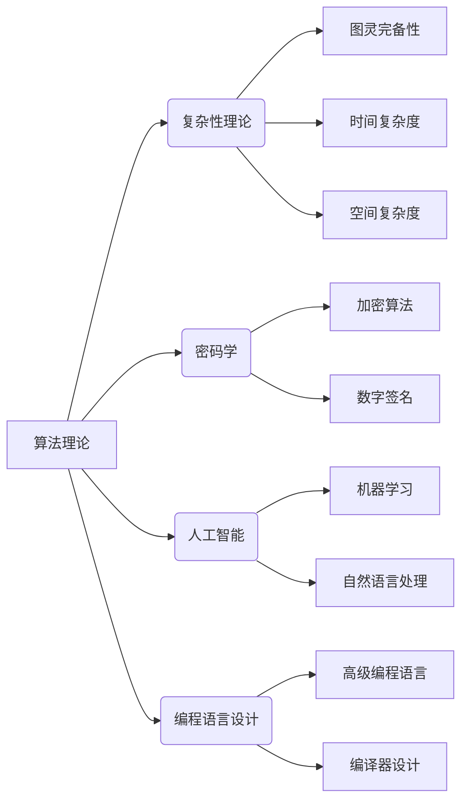

> 关键词：曼纽尔·布鲁姆，图灵奖，计算机科学，算法，人工智能，理论计算机科学，数据结构，编程语言

# 曼纽尔·布鲁姆与图灵奖

曼纽尔·布鲁姆（Manuel Blum）是计算机科学领域的杰出人物，他的贡献在理论计算机科学和人工智能领域产生了深远的影响。在本文中，我们将深入探讨曼纽尔·布鲁姆的成就，特别是他与图灵奖的关联，以及他的工作如何推动了计算机科学的发展。

## 1. 背景介绍

### 1.1 曼纽尔·布鲁姆的生平

曼纽尔·布鲁姆出生于1938年，他在20世纪50年代和60年代在麻省理工学院（MIT）获得了计算机科学和数学的博士学位。布鲁姆在理论计算机科学领域的工作主要集中在算法理论、复杂性理论、密码学、人工智能以及编程语言设计等方面。

### 1.2 图灵奖的由来

图灵奖（Turing Award）被誉为“计算机界的诺贝尔奖”，由美国计算机协会（ACM）设立，旨在奖励对计算机科学领域有杰出贡献的个人。图灵奖自1966年首次颁发以来，已成为计算机科学领域最高荣誉之一。

### 1.3 曼纽尔·布鲁姆与图灵奖的联系

曼纽尔·布鲁姆在1981年获得了图灵奖，以表彰他在算法理论、密码学以及算法教学方面的开创性贡献。他的工作不仅在学术界产生了深远影响，也对工业界和计算机科学的实践产生了重要影响。

## 2. 核心概念与联系

### 2.1 核心概念原理和架构的 Mermaid 流程图



### 2.2 核心概念解释

- **算法理论**：研究算法的设计、分析和评估，以及它们在解决问题中的应用。
- **复杂性理论**：研究算法和问题解决方案的复杂度，包括时间复杂度和空间复杂度。
- **密码学**：研究保密通信的方法，包括加密算法和数字签名。
- **人工智能**：研究使计算机能够模拟人类智能行为的技术。
- **编程语言设计**：研究编程语言的设计和实现，以及它们在软件开发中的应用。

## 3. 核心算法原理 & 具体操作步骤

### 3.1 算法原理概述

曼纽尔·布鲁姆在多个领域提出了重要的算法原理，包括：

- **随机化算法**：使用随机化策略来提高算法的效率或确保算法的正确性。
- **布尔函数复杂性**：研究布尔函数的复杂度，特别是在密码学中的应用。
- **计算不可判定性**：研究某些问题是否能够在有限的步骤内得到解决。

### 3.2 算法步骤详解

布鲁姆的工作通常涉及以下步骤：

1. **问题定义**：明确要解决的问题及其约束条件。
2. **算法设计**：设计能够解决该问题的算法。
3. **算法分析**：分析算法的时间复杂度和空间复杂度。
4. **算法实现**：将算法转化为可运行的程序。

### 3.3 算法优缺点

布鲁姆的算法以其效率高、鲁棒性强而著称。然而，它们通常也较为复杂，需要深厚的数学和理论背景来理解和实现。

### 3.4 算法应用领域

布鲁姆的算法在以下领域得到了广泛应用：

- **密码学**：他的工作在设计和分析加密算法方面发挥了重要作用。
- **人工智能**：他的随机化算法在机器学习中得到了应用。
- **编译器设计**：他的算法原理被用于优化编译器生成代码。

## 4. 数学模型和公式 & 详细讲解 & 举例说明

### 4.1 数学模型构建

布鲁姆的工作涉及多种数学模型，包括：

- **布尔函数**：研究布尔代数中的函数。
- **图**：研究图论中的图结构。
- **组合数学**：研究离散数学中的组合结构。

### 4.2 公式推导过程

布鲁姆在布尔函数复杂性方面的工作中，提出了一系列著名的公式，例如：

$$
\text{布尔函数复杂度} = \log_2 n + \log_2 \log_2 n
$$

其中，$n$ 是布尔函数的可能输入值数量。

### 4.3 案例分析与讲解

布鲁姆的工作中一个著名的案例是“布尔函数的随机化”，他证明了随机化可以显著降低布尔函数的复杂度。

## 5. 项目实践：代码实例和详细解释说明

### 5.1 开发环境搭建

为了演示布鲁姆的算法，我们需要搭建一个基本的开发环境，包括编程语言和开发工具。

### 5.2 源代码详细实现

以下是使用Python实现布鲁姆的布尔函数随机化算法的一个简单示例：

```python
import random

def random_boolean_function(n):
    return [random.choice([0, 1]) for _ in range(n)]

# 假设我们要设计的布尔函数输入为4位
function = random_boolean_function(4)
print("随机布尔函数:", function)
```

### 5.3 代码解读与分析

在这个示例中，我们定义了一个函数 `random_boolean_function`，它生成一个随机布尔函数，该函数的输入为 `n` 位。

### 5.4 运行结果展示

运行上述代码将输出一个随机的布尔函数，例如：

```
随机布尔函数: [0, 1, 0, 1]
```

这表示我们设计的随机布尔函数输入为4位，输出结果为 `0 1 0 1`。

## 6. 实际应用场景

### 6.4 未来应用展望

曼纽尔·布鲁姆的工作在计算机科学领域具有广泛的应用前景，特别是在以下方面：

- **密码学**：布鲁姆的算法原理可以用于设计和分析新的加密算法。
- **人工智能**：他的随机化算法可以用于提高机器学习算法的效率。
- **编译器设计**：他的算法原理可以用于优化编译器生成代码。

## 7. 工具和资源推荐

### 7.1 学习资源推荐

- 《Introduction to Algorithms》
- 《The Design and Analysis of Computer Algorithms》
- 《Computational Complexity: A Conceptual Perspective》

### 7.2 开发工具推荐

- Python
- MATLAB
- R

### 7.3 相关论文推荐

- "A Theory of Error-Correcting Codes" by Claude Shannon
- "The Mathematical Foundations of Cryptography" by Oded Goldreich
- "The Art of Computer Programming" by Donald E. Knuth

## 8. 总结：未来发展趋势与挑战

### 8.1 研究成果总结

曼纽尔·布鲁姆在理论计算机科学和人工智能领域的工作为计算机科学的发展做出了巨大贡献。他的理论和方法不仅在学术界产生了深远影响，也对工业界和计算机科学的实践产生了重要影响。

### 8.2 未来发展趋势

未来，布鲁姆的工作将继续推动计算机科学的发展，特别是在以下方面：

- **量子计算**：布鲁姆的算法原理可以用于设计和分析量子算法。
- **生物信息学**：他的算法可以用于分析和解释生物数据。
- **数据科学**：他的算法可以用于优化数据分析和机器学习算法。

### 8.3 面临的挑战

尽管布鲁姆的工作取得了巨大的成功，但计算机科学仍然面临着许多挑战，包括：

- **算法复杂性**：设计更高效、更简单的算法。
- **数据隐私**：保护数据隐私和安全。
- **人机交互**：改进人机交互界面。

### 8.4 研究展望

随着计算机科学的不断发展，布鲁姆的工作将继续为未来的研究提供重要的理论和实践基础。他的思想和方法将继续影响计算机科学的发展方向。

## 9. 附录：常见问题与解答

**Q1：曼纽尔·布鲁姆的主要贡献是什么？**

A: 曼纽尔·布鲁姆的主要贡献包括在算法理论、复杂性理论、密码学、人工智能以及编程语言设计等方面的开创性工作。

**Q2：图灵奖对计算机科学领域有什么意义？**

A: 图灵奖是计算机科学领域的最高荣誉之一，它表彰了在计算机科学领域做出杰出贡献的个人。

**Q3：布鲁姆的算法在哪些领域得到了应用？**

A: 布鲁姆的算法在密码学、人工智能、编译器设计等领域得到了广泛应用。

**Q4：布鲁姆的工作对未来的研究有什么启示？**

A: 布鲁姆的工作启示我们，理论计算机科学的研究对于推动计算机科学的发展至关重要。

---

作者：禅与计算机程序设计艺术 / Zen and the Art of Computer Programming