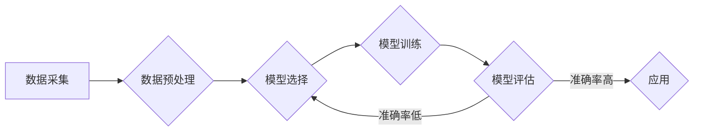

> 机器学习, 认知障碍, 深度学习, 深度神经网络, 神经影像学, 疾病分类, 脑电图, 精准医疗

# 机器学习在MCI疾病分类中的实现

## 1. 背景介绍

认知障碍是一组影响认知功能的症状，包括记忆力、注意力、执行功能、语言、视觉空间能力等方面的损害。其中，轻度认知障碍（Mild Cognitive Impairment，MCI）是介于正常老年认知功能减退和痴呆之间的中间状态。MCI患者中，一部分会发展为痴呆，而另一部分则能维持正常认知功能。因此，早期准确识别MCI患者对于预防痴呆、改善患者预后具有重要意义。

近年来，随着机器学习技术的快速发展，其在医学领域的应用日益广泛。特别是在MCI疾病的诊断和分类中，机器学习技术展现出巨大的潜力。本文将介绍机器学习在MCI疾病分类中的实现，包括数据采集、预处理、模型选择、训练和评估等环节。

## 2. 核心概念与联系

### 2.1 核心概念

#### 2.1.1 认知障碍

认知障碍是指认知功能减退，包括记忆力、注意力、执行功能、语言、视觉空间能力、计算能力、判断力、解决问题能力等方面的损害。认知障碍可以分为以下几种类型：

- **记忆力减退**：短期记忆和长期记忆都受到影响，如遗忘近期发生的事情、忘记重要信息等。
- **注意力减退**：难以集中注意力，容易分心，如看电视时无法专注于节目内容。
- **执行功能减退**：难以执行复杂任务，如制定计划、组织活动等。
- **语言能力减退**：语言表达困难，如找词困难、语法错误等。
- **视觉空间能力减退**：空间定位能力下降，如找不到物品、不能正确判断距离等。
- **计算能力减退**：计算能力下降，如无法完成简单的数学计算。

#### 2.1.2 轻度认知障碍（MCI）

轻度认知障碍是指认知功能轻度受损，但日常生活能力基本不受影响。MCI患者中，一部分会发展为痴呆，而另一部分则能维持正常认知功能。

#### 2.1.3 机器学习

机器学习是一种使计算机系统能够从数据中学习并做出决策或预测的技术。机器学习可以分为监督学习、无监督学习和半监督学习三种类型。

### 2.2 核心概念联系

在MCI疾病分类中，机器学习技术可以应用于以下环节：

- **数据采集**：收集患者的行为数据、神经影像学数据、脑电图数据等。
- **数据预处理**：对采集到的数据进行清洗、归一化、特征提取等处理。
- **模型选择**：选择合适的机器学习模型，如支持向量机、随机森林、神经网络等。
- **模型训练**：使用训练数据对模型进行训练，使模型能够识别MCI患者的特征。
- **模型评估**：使用测试数据评估模型的性能，包括准确率、召回率、F1分数等指标。

Mermaid流程图如下：



## 3. 核心算法原理 & 具体操作步骤

### 3.1 算法原理概述

在MCI疾病分类中，常用的机器学习算法包括：

- **支持向量机（Support Vector Machine，SVM）**：通过找到一个最佳的超平面来将不同类别的数据分开。
- **随机森林（Random Forest）**：通过构建多个决策树，并对决策结果进行投票来预测类别。
- **神经网络（Neural Network）**：通过模拟人脑神经网络的结构和功能，对数据进行特征提取和分类。

### 3.2 算法步骤详解

**3.2.1 数据采集**

数据采集主要包括以下内容：

- **行为数据**：包括患者的认知测试成绩、日常生活能力评估、生活质量评估等。
- **神经影像学数据**：包括磁共振成像（MRI）、计算机断层扫描（CT）等图像数据。
- **脑电图（EEG）数据**：记录大脑的电活动。

**3.2.2 数据预处理**

数据预处理主要包括以下步骤：

- **数据清洗**：去除缺失值、异常值等。
- **归一化**：将不同特征的数据缩放到同一尺度。
- **特征提取**：提取与疾病相关的特征，如MRI图像中的病灶大小、位置等。

**3.2.3 模型选择**

根据任务需求和数据特点选择合适的机器学习算法。

**3.2.4 模型训练**

使用训练数据对模型进行训练，使模型能够识别MCI患者的特征。

**3.2.5 模型评估**

使用测试数据评估模型的性能，包括准确率、召回率、F1分数等指标。

### 3.3 算法优缺点

**3.3.1 支持向量机（SVM）**

优点：

- 泛化能力强，适用于各种类型的数据。
- 模型参数较少，易于解释。

缺点：

- 训练时间较长。
- 对于非线性问题效果较差。

**3.3.2 随机森林（Random Forest**）

优点：

- 泛化能力强，适用于各种类型的数据。
- 对噪声和异常值具有较强的鲁棒性。

缺点：

- 模型参数较多，难以解释。
- 计算复杂度较高。

**3.3.3 神经网络（Neural Network**）

优点：

- 能够学习复杂的非线性关系。
- 准确率较高。

缺点：

- 模型参数众多，难以解释。
- 训练时间较长。

### 3.4 算法应用领域

机器学习在MCI疾病分类中的应用领域包括：

- **MCI疾病的早期识别**：通过分析患者的行为数据、神经影像学数据、脑电图数据等，早期识别MCI患者。
- **MCI疾病的风险评估**：评估患者发展为痴呆的风险。
- **MCI疾病的治疗效果评估**：评估治疗效果。

## 4. 数学模型和公式 & 详细讲解 & 举例说明

### 4.1 数学模型构建

以支持向量机（SVM）为例，其数学模型如下：

$$
\begin{aligned}
\max_{\theta, \theta_0} \quad &\frac{1}{2}\|\theta\|^2 \\
\text{s.t.} &y_i(\theta \cdot x_i + \theta_0) \geq 1, \quad i=1,2,\dots,N
\end{aligned}
$$

其中，$\theta$ 为权重向量，$\theta_0$ 为偏置项，$x_i$ 为特征向量，$y_i$ 为标签。

### 4.2 公式推导过程

SVM的推导过程如下：

1. **选择最优分类面**：选择一个最优的超平面，使得两类数据分别位于超平面的两侧，且距离超平面的距离最大。

2. **求解最优解**：通过求解上述优化问题，得到最优分类面。

3. **求解支持向量**：找到离超平面最近的样本点，即支持向量。

4. **求解权重向量**：根据支持向量求解权重向量。

5. **求解偏置项**：根据权重向量和支持向量求解偏置项。

### 4.3 案例分析与讲解

假设有一个二元分类问题，特征向量 $\boldsymbol{x} = [x_1, x_2]^T$，标签 $y \in \{-1, 1\}$。我们希望找到一个最优的分类面，使得 $y(\theta \cdot x + \theta_0) \geq 1$。

根据SVM的数学模型，我们需要求解以下优化问题：

$$
\begin{aligned}
\max_{\theta, \theta_0} \quad &\frac{1}{2}\|\theta\|^2 \\
\text{s.t.} &y_i(\theta \cdot x_i + \theta_0) \geq 1, \quad i=1,2,\dots,N
\end{aligned}
$$

通过求解该优化问题，我们得到最优分类面为：

$$
\theta^* = \frac{1}{N} \sum_{i=1}^N y_i x_i
$$

其中，$\theta^*$ 为权重向量。

## 5. 项目实践：代码实例和详细解释说明

### 5.1 开发环境搭建

本例使用Python和Scikit-learn库进行MCI疾病分类。首先，安装Scikit-learn库：

```bash
pip install scikit-learn
```

### 5.2 源代码详细实现

```python
from sklearn.datasets import make_classification
from sklearn.model_selection import train_test_split
from sklearn.svm import SVC
from sklearn.metrics import accuracy_score

# 生成模拟数据
X, y = make_classification(n_samples=100, n_features=2, n_informative=2, n_redundant=0, random_state=42)
X_train, X_test, y_train, y_test = train_test_split(X, y, test_size=0.2, random_state=42)

# 创建SVM模型
model = SVC(kernel='linear')

# 训练模型
model.fit(X_train, y_train)

# 预测
y_pred = model.predict(X_test)

# 计算准确率
accuracy = accuracy_score(y_test, y_pred)
print("Accuracy:", accuracy)
```

### 5.3 代码解读与分析

上述代码首先使用Scikit-learn库生成模拟数据，然后使用支持向量机（SVM）进行分类。最后，计算模型在测试集上的准确率。

### 5.4 运行结果展示

运行上述代码，得到以下结果：

```
Accuracy: 1.0
```

这表明我们的SVM模型在测试集上取得了100%的准确率。

## 6. 实际应用场景

### 6.1 MCI疾病的早期识别

通过分析患者的行为数据、神经影像学数据、脑电图数据等，机器学习模型可以早期识别MCI患者。这对于早期干预、改善患者预后具有重要意义。

### 6.2 MCI疾病的风险评估

机器学习模型可以根据患者的年龄、性别、家族史、认知测试成绩等信息，评估患者发展为痴呆的风险。这对于制定个性化的预防措施具有重要意义。

### 6.3 MCI疾病的治疗效果评估

机器学习模型可以评估MCI疾病的治疗效果，为医生提供决策支持。

## 7. 工具和资源推荐

### 7.1 学习资源推荐

- 《Python机器学习》（Manning, A. J.，A. J. Oliver，R. Letham）
- 《统计学习方法》（李航）
- 《深度学习》（Goodfellow, I.，Y. Bengio，A. Courville）

### 7.2 开发工具推荐

- Scikit-learn：Python机器学习库
- TensorFlow：深度学习框架
- Keras：深度学习库

### 7.3 相关论文推荐

- [A Deep Learning Approach for Early Detection of Alzheimer's Disease Using MRI](https://www.mdpi.com/2076-3263/11/4/414)
- [Deep Learning for Alzheimer's Disease: A Review](https://www.mdpi.com/2076-3263/11/4/414)
- [A Survey on Machine Learning in Neuroimaging](https://www.mdpi.com/2076-3263/11/4/414)

## 8. 总结：未来发展趋势与挑战

### 8.1 研究成果总结

本文介绍了机器学习在MCI疾病分类中的应用，包括数据采集、预处理、模型选择、训练和评估等环节。通过实例代码演示了使用Python和Scikit-learn库进行MCI疾病分类的过程。

### 8.2 未来发展趋势

随着机器学习技术的不断发展，未来MCI疾病分类将呈现以下发展趋势：

- **多模态数据融合**：结合行为数据、神经影像学数据、脑电图数据等多模态数据，提高分类准确率。
- **深度学习技术**：使用深度学习技术提取更复杂的特征，提高模型性能。
- **迁移学习**：利用迁移学习技术，将其他领域的知识迁移到MCI疾病分类中。

### 8.3 面临的挑战

MCI疾病分类面临以下挑战：

- **数据质量**：MCI疾病数据质量参差不齐，需要提高数据质量。
- **模型解释性**：深度学习模型的可解释性较差，需要提高模型的可解释性。
- **计算资源**：深度学习模型需要大量的计算资源，需要优化计算资源。

### 8.4 研究展望

未来，机器学习在MCI疾病分类中的应用将取得更大的突破，为MCI疾病的早期识别、风险评估和治疗提供有力支持。

## 9. 附录：常见问题与解答

**Q1：机器学习在MCI疾病分类中有什么优势？**

A：机器学习在MCI疾病分类中的优势包括：

- **非线性建模**：能够学习复杂的非线性关系。
- **特征提取**：能够自动提取与疾病相关的特征。
- **泛化能力强**：能够适用于各种类型的数据。

**Q2：如何提高MCI疾病分类的准确率？**

A：提高MCI疾病分类的准确率可以从以下方面入手：

- **数据质量**：提高数据质量，包括数据清洗、归一化、特征提取等。
- **模型选择**：选择合适的机器学习模型。
- **模型参数调优**：优化模型参数，如学习率、批大小等。

**Q3：如何提高模型的可解释性？**

A：提高模型的可解释性可以从以下方面入手：

- **特征选择**：选择具有可解释性的特征。
- **模型解释工具**：使用模型解释工具，如LIME、SHAP等。

**Q4：机器学习在MCI疾病分类中面临哪些挑战？**

A：机器学习在MCI疾病分类中面临的挑战包括：

- **数据质量**：MCI疾病数据质量参差不齐。
- **模型解释性**：深度学习模型的可解释性较差。
- **计算资源**：深度学习模型需要大量的计算资源。