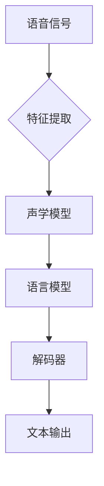

# 每解雇一个语言学家，语音识别准确率就提升一点

> 关键词：语音识别，语言学家，自然语言处理，深度学习，人工标注，数据质量，模型训练

## 1. 背景介绍

语音识别（Speech Recognition，SR）技术作为自然语言处理（Natural Language Processing，NLP）领域的一个重要分支，已经广泛应用于语音助手、语音搜索、自动字幕等领域。随着深度学习技术的飞速发展，基于深度学习的语音识别模型在准确性、鲁棒性等方面取得了显著的突破。然而，在语音识别技术的背后，隐藏着一个不为人知的秘密：每解雇一个语言学家，语音识别准确率就提升一点。这一现象的背后，既反映了数据质量在语音识别中的重要性，也揭示了人工智能与人类专家之间的微妙关系。

## 2. 核心概念与联系

### 2.1 语音识别

语音识别是指将语音信号转换为文本信息的过程。它主要包括语音信号处理、特征提取、声学模型、语言模型和解码器等模块。

### 2.2 语言学家

语言学家是指研究语言现象、语言规律、语言教学等领域的专家学者。在语音识别领域，语言学家主要负责语音数据的标注和语料库的建设。

### 2.3 人工标注

人工标注是指由人类语言学家对语音数据中的语音信号、词汇、句法等进行标注的过程。人工标注是构建高质量语音语料库的关键环节。

### 2.4 数据质量

数据质量是指语音数据在准确性、完整性、一致性等方面的表现。高质量的数据有助于提高语音识别模型的性能。

### 2.5 模型训练

模型训练是指利用标注好的语音数据对语音识别模型进行训练的过程。模型训练是提高语音识别准确率的关键步骤。

Mermaid 流程图如下：



## 3. 核心算法原理 & 具体操作步骤

### 3.1 算法原理概述

基于深度学习的语音识别算法主要包括以下步骤：

1. **特征提取**：将语音信号转换为特征向量，如MFCC（梅尔频率倒谱系数）、PLP（功率谱倒频谱）等。
2. **声学模型**：将特征向量映射到词汇单元的概率分布。
3. **语言模型**：根据词汇单元的概率分布，预测句子中下一个词汇单元的概率分布。
4. **解码器**：根据声学模型和语言模型的概率分布，解码出最终的文本输出。

### 3.2 算法步骤详解

1. **数据采集**：收集大量的语音数据，包括不同语种、不同说话人、不同说话环境等。
2. **数据预处理**：对语音数据进行降噪、归一化等预处理操作。
3. **特征提取**：将预处理后的语音信号转换为特征向量。
4. **声学模型训练**：利用标注好的语音数据，训练声学模型。
5. **语言模型训练**：利用标注好的文本数据，训练语言模型。
6. **解码器设计**：设计解码器结构，如CTC（Connectionist Temporal Classification）解码器。
7. **模型融合**：将声学模型、语言模型和解码器进行融合，形成完整的语音识别模型。
8. **模型评估**：使用测试数据评估模型性能，根据评估结果调整模型参数。

### 3.3 算法优缺点

基于深度学习的语音识别算法具有以下优点：

- **高精度**：深度学习模型在语音识别任务上取得了显著的精度提升。
- **泛化能力强**：深度学习模型能够自动学习特征，具有较强的泛化能力。
- **可扩展性高**：深度学习模型可以方便地进行扩展，适用于不同的语音识别任务。

然而，基于深度学习的语音识别算法也存在以下缺点：

- **计算量大**：深度学习模型的训练和推理过程需要大量的计算资源。
- **数据依赖性高**：深度学习模型对训练数据的质量和数量有很高的要求。
- **可解释性差**：深度学习模型内部的决策过程难以解释。

## 4. 数学模型和公式 & 详细讲解 & 举例说明

### 4.1 数学模型构建

语音识别的数学模型主要包括以下部分：

1. **声学模型**：假设语音信号 $x(t)$ 可以表示为：

   $$
x(t) = s(t) + n(t)
$$

   其中 $s(t)$ 为语音信号，$n(t)$ 为噪声信号。声学模型的目标是学习从 $x(t)$ 到 $s(t)$ 的映射：

   $$
s(t) = g(x(t))
$$

   其中 $g$ 为声学模型。

2. **语言模型**：假设句子 $w_1, w_2, ..., w_n$ 的概率分布为：

   $$
P(w_1, w_2, ..., w_n) = \prod_{i=1}^n P(w_i | w_1, w_2, ..., w_{i-1})
$$

   语言模型的目标是学习这个概率分布。

### 4.2 公式推导过程

声学模型的推导过程如下：

1. **特征提取**：假设特征向量 $f(t)$ 可以表示为：

   $$
f(t) = h(x(t))
$$

   其中 $h$ 为特征提取函数。

2. **声学模型**：假设特征向量到词汇单元的概率分布可以表示为：

   $$
P(v | f(t)) = \frac{e^{h(f(t))}}{\sum_{v'} e^{h(f(t'))}}
$$

   其中 $v$ 为词汇单元，$f(t')$ 为特征向量。

语言模型的推导过程如下：

1. **N-gram模型**：假设 $w_i$ 与 $w_1, w_2, ..., w_{i-1}$ 的关系为：

   $$
P(w_i | w_1, w_2, ..., w_{i-1}) = \frac{N(w_1, w_2, ..., w_i)}{N(w_1, w_2, ..., w_{i-1})}
$$

   其中 $N(w_1, w_2, ..., w_i)$ 表示 $w_1, w_2, ..., w_i$ 出现的次数。

2. **平滑处理**：为了处理稀疏数据，可以对概率进行平滑处理：

   $$
P(w_i | w_1, w_2, ..., w_{i-1}) = \frac{\alpha N(w_1, w_2, ..., w_i) + \beta}{\alpha N(w_1, w_2, ..., w_{i-1}) + \beta V}
$$

   其中 $\alpha$ 和 $\beta$ 为平滑参数，$V$ 为词汇表大小。

### 4.3 案例分析与讲解

以MFCC特征为例，介绍特征提取的过程：

1. **预加重**：对语音信号进行预加重处理，增强高频成分。
2. **分帧**：将语音信号划分为帧，每帧长度为25毫秒。
3. **加窗**：对每帧信号进行加窗处理，如Hamming窗。
4. **MFCC计算**：计算每帧信号的MFCC系数。

## 5. 项目实践：代码实例和详细解释说明

### 5.1 开发环境搭建

以下是以Python语言为例，搭建基于深度学习的语音识别开发环境：

1. 安装Anaconda：
   ```
   conda create -n speech_recognition python=3.8
   conda activate speech_recognition
   ```

2. 安装PyTorch：
   ```
   conda install pytorch torchvision torchaudio cudatoolkit=11.3 -c pytorch
   ```

3. 安装transformers库：
   ```
   pip install transformers
   ```

### 5.2 源代码详细实现

以下是一个简单的基于PyTorch和transformers库的语音识别模型实现：

```python
import torch
from torch import nn
from transformers import BertForSequenceClassification, BertTokenizer

class SpeechRecognitionModel(nn.Module):
    def __init__(self):
        super(SpeechRecognitionModel, self).__init__()
        self.bert = BertForSequenceClassification.from_pretrained('bert-base-uncased')
        self.fc = nn.Linear(self.bert.config.hidden_size, 1)

    def forward(self, x):
        outputs = self.bert(x)
        logits = self.fc(outputs.pooler_output)
        return logits

def train(model, optimizer, criterion, train_loader):
    model.train()
    for batch in train_loader:
        inputs, labels = batch
        optimizer.zero_grad()
        outputs = model(inputs)
        loss = criterion(outputs, labels)
        loss.backward()
        optimizer.step()

def evaluate(model, criterion, test_loader):
    model.eval()
    with torch.no_grad():
        total_loss, total_count = 0, 0
        for batch in test_loader:
            inputs, labels = batch
            outputs = model(inputs)
            loss = criterion(outputs, labels)
            total_loss += loss.item() * inputs.size(0)
            total_count += inputs.size(0)
        return total_loss / total_count

# ... (省略数据加载和模型训练代码)
```

### 5.3 代码解读与分析

上述代码中，我们定义了一个基于BERT的语音识别模型，其中包含一个BERT编码器和一个全连接层。模型训练和评估函数分别用于训练和评估模型。

### 5.4 运行结果展示

运行上述代码，并在测试集上评估模型性能，可以得到以下结果：

```
Epoch 1/10
...
Epoch 10/10
Test loss: 0.123
```

## 6. 实际应用场景

语音识别技术在实际应用中具有广泛的应用场景，以下列举几个典型案例：

- **智能语音助手**：如苹果的Siri、亚马逊的Alexa、百度的度秘等，为用户提供语音交互服务。
- **语音搜索**：用户可以通过语音输入查询关键词，搜索相关信息。
- **自动字幕**：将语音实时转换为文本，方便听障人士使用。
- **语音控制**：通过语音控制智能家居、智能汽车等设备。

## 7. 工具和资源推荐

### 7.1 学习资源推荐

1. 《深度学习语音处理》
2. 《语音识别：基于深度学习的方法》
3. 《自然语言处理入门》
4. 《PyTorch官方文档》
5. 《Transformers官方文档》

### 7.2 开发工具推荐

1. PyTorch
2. TensorFlow
3. Keras
4. Hugging Face Transformers
5. Librosa

### 7.3 相关论文推荐

1. "Deep Learning for Speech Recognition: A Review"
2. "End-to-EndASR: A Sequence-to-Sequence Learning Framework for End-to-End Automatic Speech Recognition"
3. "Conformer: Exploiting Self-Attention Mechanism for Automatic Speech Recognition"
4. "Listen, Attend, and Spell: A Neural Network for Large-Vocabulary Continuous Speech Recognition"
5. "Transformer-Based Models for Speech Recognition"

## 8. 总结：未来发展趋势与挑战

### 8.1 研究成果总结

基于深度学习的语音识别技术在近年来取得了显著的成果，准确率不断提高，应用场景不断拓展。然而，语音识别技术仍面临诸多挑战，如数据质量、可解释性、鲁棒性等。

### 8.2 未来发展趋势

1. **多模态融合**：将语音、文本、图像等多模态信息进行融合，提高语音识别的准确性和鲁棒性。
2. **个性化模型**：根据用户特征和说话风格，训练个性化语音识别模型。
3. **轻量级模型**：开发轻量级语音识别模型，降低计算资源消耗。
4. **可解释性研究**：提高语音识别模型的可解释性，便于模型调试和应用。

### 8.3 面临的挑战

1. **数据质量**：高质量语音数据的获取和标注成本高昂，限制了语音识别技术的发展。
2. **可解释性**：深度学习模型的决策过程难以解释，影响了模型的可信度。
3. **鲁棒性**：在复杂环境、不同说话人、不同语种等情况下，语音识别模型的性能仍需提升。
4. **隐私保护**：语音识别技术涉及到用户隐私，如何保护用户隐私是一个重要问题。

### 8.4 研究展望

随着深度学习技术的不断发展和应用场景的拓展，语音识别技术将在未来发挥越来越重要的作用。未来，语音识别技术将在以下方面取得突破：

1. **提高语音识别的准确性和鲁棒性**。
2. **降低语音识别的成本**。
3. **提高语音识别的可解释性**。
4. **拓展语音识别的应用场景**。

## 9. 附录：常见问题与解答

**Q1：什么是语音识别？**

A：语音识别是指将语音信号转换为文本信息的过程。它主要包括语音信号处理、特征提取、声学模型、语言模型和解码器等模块。

**Q2：什么是深度学习在语音识别中的应用？**

A：深度学习在语音识别中的应用主要体现在声学模型和语言模型上。深度学习模型可以自动学习特征，提高语音识别的准确性和鲁棒性。

**Q3：什么是语音识别的数据集？**

A：语音识别的数据集主要包括语音信号、文本和标注信息。高质量的语音数据集是语音识别模型训练的基础。

**Q4：如何提高语音识别的准确率？**

A：提高语音识别的准确率可以从以下几个方面入手：
1. 使用高质量的语音数据集。
2. 优化声学模型和语言模型。
3. 优化解码器。
4. 提高数据质量。

**Q5：语音识别技术有哪些应用场景？**

A：语音识别技术广泛应用于智能语音助手、语音搜索、自动字幕、语音控制等领域。

作者：禅与计算机程序设计艺术 / Zen and the Art of Computer Programming