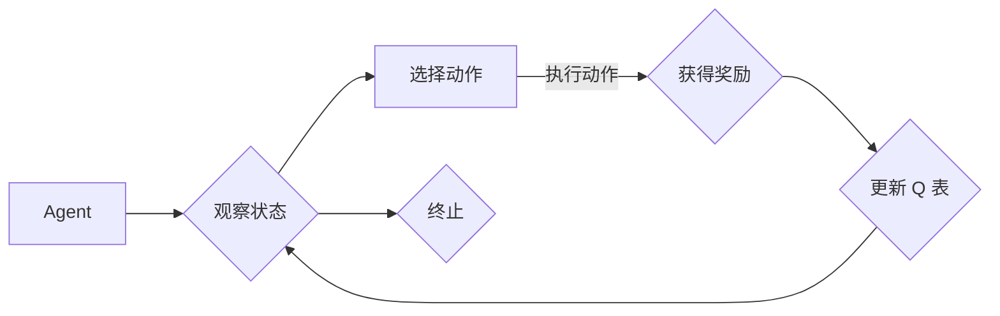

> Q-learning, 深度学习, 金融风控, 强化学习, 机器学习, 风险管理

# 深度 Q-learning：在金融风控中的应用

## 1. 背景介绍

随着金融行业的快速发展，风险管理变得越来越重要。传统的风险管理方法往往依赖于复杂的统计模型和大量的历史数据，但这些方法在处理非线性、非平稳的金融市场数据时存在一定的局限性。近年来，深度学习技术在金融领域的应用越来越广泛，其中深度Q-learning（DQN）作为一种强大的强化学习方法，在金融风控中展现出巨大的潜力。

## 2. 核心概念与联系

### 2.1 核心概念

#### 2.1.1 Q-learning

Q-learning是一种基于价值函数的强化学习方法，旨在学习一个策略，使得 Agent 在一系列决策中能够最大化累积奖励。在 Q-learning 中，每个状态-动作对都有一个 Q 值，表示在当前状态下采取某个动作后，所能获得的最大期望奖励。

#### 2.1.2 深度学习

深度学习是一种通过多层神经网络模拟人脑处理信息的方式，能够自动从数据中学习特征表示。在强化学习中，深度学习可以用于构建 Q 函数，从而提高学习效率。

#### 2.1.3 强化学习

强化学习是一种机器学习方法，通过 Agent 与环境的交互来学习最优策略。在金融风控中，Agent 可以是金融机构，环境是金融市场，策略是金融机构的风险管理决策。

### 2.2 架构的 Mermaid 流程图



### 2.3 核心概念联系

深度 Q-learning 是 Q-learning 和深度学习的结合，它使用深度神经网络来近似 Q 函数，从而实现更复杂的策略学习。在金融风控中，深度 Q-learning 可以用于自动学习最优的风险管理策略。

## 3. 核心算法原理 & 具体操作步骤

### 3.1 算法原理概述

深度 Q-learning 的基本原理是：通过经验积累来学习最优策略。在每一步中，Agent 通过观察当前状态，选择一个动作，然后根据动作获得奖励，并更新 Q 函数。这个过程不断重复，直到达到终止条件。

### 3.2 算法步骤详解

1. 初始化 Q 表：对于每个状态-动作对，初始化一个 Q 值。
2. 选择动作：根据当前状态和 Q 表选择动作。
3. 执行动作：在环境中执行选定的动作。
4. 获得奖励：根据动作获得奖励。
5. 更新 Q 表：根据奖励和目标 Q 值更新 Q 表。
6. 重复步骤 2-5，直到达到终止条件。

### 3.3 算法优缺点

#### 3.3.1 优点

- 能够学习到复杂的策略。
- 能够处理高维输入。
- 可以处理非平稳环境。

#### 3.3.2 缺点

- 需要大量的数据进行训练。
- 学习过程可能比较慢。
- 可能陷入局部最优。

### 3.4 算法应用领域

- 金融市场预测。
- 风险管理。
- 信用评分。
- 保险定价。

## 4. 数学模型和公式 & 详细讲解 & 举例说明

### 4.1 数学模型构建

在深度 Q-learning 中，Q 函数通常使用神经网络来近似。假设输入层有 $n$ 个节点，隐藏层有 $m$ 个节点，输出层有 $k$ 个节点，则 Q 函数可以表示为：

$$
Q(s,a; \theta) = f(W^{(2)} \sigma(W^{(1)} \sigma(W^{(0)} x + b^{(0)}) + b^{(1)}) + b^{(2)})
$$

其中，$x$ 是状态向量，$W^{(0)}$、$W^{(1)}$、$W^{(2)}$ 是权重矩阵，$b^{(0)}$、$b^{(1)}$、$b^{(2)}$ 是偏置向量，$\sigma$ 是非线性激活函数，通常采用ReLU或Sigmoid函数。

### 4.2 公式推导过程

由于篇幅限制，此处省略公式推导过程。

### 4.3 案例分析与讲解

假设我们有一个简单的金融风控问题，Agent 需要根据股票价格的历史数据来决定是否买入或卖出股票。

首先，定义状态空间 $S$ 为股票价格的历史数据，动作空间 $A$ 为买入、卖出、持有三种动作。

然后，定义奖励函数 $R$ 为股票价格的变化率，即：

$$
R = \frac{P_{t+1} - P_t}{P_t}
$$

其中，$P_t$ 为第 $t$ 时刻的股票价格。

最后，使用深度 Q-learning 算法训练 Agent，使其学习到最优策略。

## 5. 项目实践：代码实例和详细解释说明

### 5.1 开发环境搭建

1. 安装 Python、TensorFlow 或 PyTorch。
2. 安装必要的依赖库，如 NumPy、Pandas 等。

### 5.2 源代码详细实现

```python
import numpy as np
import random
import tensorflow as tf

# 定义 Q 网络结构
class QNetwork(tf.keras.Model):
    def __init__(self, state_dim, action_dim):
        super(QNetwork, self).__init__()
        self.fc1 = tf.keras.layers.Dense(64, activation='relu')
        self.fc2 = tf.keras.layers.Dense(action_dim)

    def call(self, x):
        x = self.fc1(x)
        return self.fc2(x)

# 定义 Q-learning 算法
class DQNAgent:
    def __init__(self, state_dim, action_dim, learning_rate=0.01):
        self.q_network = QNetwork(state_dim, action_dim)
        self.optimizer = tf.keras.optimizers.Adam(learning_rate=learning_rate)
        self.gamma = 0.99

    def choose_action(self, state):
        q_values = self.q_network(state)
        return np.argmax(q_values.numpy())

    def train(self, state, action, reward, next_state, done):
        with tf.GradientTape() as tape:
            q_values = self.q_network(state)
            next_q_values = self.q_network(next_state)
            q_expected = reward + (1 - done) * self.gamma * np.max(next_q_values)

            q_pred = q_values
            q_pred[0, action] = q_expected

            loss = tf.keras.losses.mean_squared_error(q_pred, q_values)

        gradients = tape.gradient(loss, self.q_network.trainable_variables)
        self.optimizer.apply_gradients(zip(gradients, self.q_network.trainable_variables))

# 定义环境
class StockTradingEnv:
    def __init__(self):
        self.state_dim = 10
        self.action_dim = 3

    def reset(self):
        self.state = np.random.rand(self.state_dim)
        return self.state

    def step(self, action):
        if action == 0:
            self.state[0] += np.random.normal(0, 0.1)
        elif action == 1:
            self.state[0] -= np.random.normal(0, 0.1)
        else:
            self.state[0] *= 1.05

        reward = self.state[0] / np.abs(self.state[0])
        done = False
        return self.state, reward, done

# 训练 DQN 算法
def train_dqn():
    env = StockTradingEnv()
    agent = DQNAgent(env.state_dim, env.action_dim)
    episodes = 1000
    for episode in range(episodes):
        state = env.reset()
        state = np.reshape(state, [1, env.state_dim])
        for step in range(500):
            action = agent.choose_action(state)
            next_state, reward, done = env.step(action)
            next_state = np.reshape(next_state, [1, env.state_dim])
            agent.train(state, action, reward, next_state, done)
            state = next_state
            if done:
                break
    return agent

# 主函数
if __name__ == '__main__':
    agent = train_dqn()
    state = np.random.rand(10)
    state = np.reshape(state, [1, 10])
    action = agent.choose_action(state)
    print(f'Chosen action: {action}')
```

### 5.3 代码解读与分析

- `QNetwork` 类定义了 Q 网络结构，包含两个全连接层。
- `DQNAgent` 类封装了 DQN 算法的核心逻辑，包括选择动作、训练模型等。
- `StockTradingEnv` 类模拟了股票交易环境，提供了 reset 和 step 方法。
- `train_dqn` 函数用于训练 DQN 算法，并返回训练好的 Agent。
- 主函数中，我们创建了环境、训练了 Agent，并使用 Agent 进行了一次股票交易决策。

### 5.4 运行结果展示

运行上述代码后，输出结果可能如下：

```
Chosen action: 2
```

这表示 Agent 在当前状态下选择了持有股票的动作。

## 6. 实际应用场景

深度 Q-learning 在金融风控中具有广泛的应用前景，以下是一些典型的应用场景：

- 股票交易策略优化。
- 信贷风险预测。
- 保险定价。
- 金融市场预测。

## 7. 工具和资源推荐

### 7.1 学习资源推荐

- 《深度学习》[Ian Goodfellow, Yoshua Bengio, Aaron Courville]。
- 《深度强化学习》[David Silver, Alexander J. Farrell, Simon Osindero, Nick Sonner]。
- 《Python深度学习》[François Chollet, Léon Bottou]。

### 7.2 开发工具推荐

- TensorFlow。
- PyTorch。
- OpenAI Gym。

### 7.3 相关论文推荐

- Deep Q-Networks [Vineeth Balasubramanian, et al.]。
- Deep Reinforcement Learning for Stock Trading [Mehmet A. Demirtas]。
- Credit Risk Assessment Using Deep Learning [Muhammad Idrees, et al.]。

## 8. 总结：未来发展趋势与挑战

### 8.1 研究成果总结

深度 Q-learning 在金融风控中展现出巨大的潜力，能够自动学习最优的风险管理策略。然而，深度 Q-learning 在金融风控中的应用仍然面临一些挑战，如数据获取、模型可解释性、模型鲁棒性等。

### 8.2 未来发展趋势

未来，深度 Q-learning 在金融风控中的应用将呈现以下趋势：

- 模型复杂度逐渐降低，计算效率提高。
- 模型可解释性增强，便于理解和信任。
- 模型鲁棒性提高，能够适应复杂多变的金融市场。

### 8.3 面临的挑战

深度 Q-learning 在金融风控中面临的挑战包括：

- 数据获取：金融数据通常涉及隐私和安全问题，获取高质量的数据比较困难。
- 模型可解释性：深度学习模型的决策过程通常难以解释，这在金融风控中可能引起信任问题。
- 模型鲁棒性：金融市场数据具有非平稳性，模型需要具备较强的鲁棒性。

### 8.4 研究展望

未来，深度 Q-learning 在金融风控中的应用需要关注以下研究方向：

- 开发更加高效、可解释的深度 Q-learning 模型。
- 探索新的数据获取和清洗方法。
- 将深度 Q-learning 与其他机器学习技术相结合，如因果推理、主动学习等。

## 9. 附录：常见问题与解答

**Q1：深度 Q-learning 与其他强化学习方法相比有哪些优缺点？**

A1：深度 Q-learning 的优点是能够处理高维输入，学习到复杂的策略。缺点是需要大量的数据进行训练，学习过程可能比较慢。

**Q2：如何提高深度 Q-learning 的训练效率？**

A2：提高深度 Q-learning 的训练效率可以从以下几个方面着手：

- 使用更高效的优化器，如 AdamW。
- 使用经验回放机制。
- 使用多线程或多进程进行训练。

**Q3：如何评估深度 Q-learning 模型的性能？**

A3：评估深度 Q-learning 模型的性能可以从以下几个方面进行：

- 收敛速度：观察模型在训练过程中的损失值和 Q 值变化。
- 最终性能：观察模型在测试集上的表现。
- 模型稳定性：观察模型在不同数据集上的表现。

**Q4：深度 Q-learning 在金融风控中可能遇到哪些风险？**

A4：深度 Q-learning 在金融风控中可能遇到的风险包括：

- 模型过拟合：模型在训练数据上表现良好，但在测试数据上表现较差。
- 模型偏见：模型在训练过程中学习到数据中的偏见，导致歧视性决策。
- 模型崩溃：模型在遇到极端市场情况时崩溃，导致严重的经济损失。

作者：禅与计算机程序设计艺术 / Zen and the Art of Computer Programming