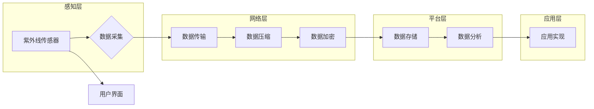

> 物联网, IoT, 传感器, 紫外线传感器, 集成, 应用, 发展, 智能化, 环境监测, 健康安全

# 物联网(IoT)技术和各种传感器设备的集成：紫外线传感器的应用与发展

随着物联网（IoT）技术的飞速发展，传感器设备在各个领域的应用越来越广泛。紫外线传感器作为重要的环境监测和健康安全设备，在空气净化、医疗卫生、农业种植等领域扮演着不可或缺的角色。本文将深入探讨物联网技术与紫外线传感器的集成，分析其应用与发展趋势。

## 1. 背景介绍

### 1.1 物联网（IoT）技术的发展

物联网（Internet of Things，IoT）是指通过信息传感设备，将各种物体连接到互联网上进行信息交换和通信的技术。随着5G、人工智能、云计算等技术的快速发展，物联网技术已经渗透到人们生活的方方面面，成为推动社会进步的重要力量。

### 1.2 紫外线传感器的应用需求

紫外线传感器是一种能够检测环境中紫外线强度的设备，广泛应用于空气净化、医疗卫生、农业种植等领域。以下列举几个紫外线传感器的典型应用场景：

- **空气净化**：检测室内外空气中的紫外线强度，为空气净化器提供实时数据，实现智能调节。
- **医疗卫生**：监测手术室、病房等医疗环境中的紫外线强度，保障医疗安全。
- **农业种植**：监测温室大棚中的紫外线强度，优化作物生长环境。

### 1.3 物联网与紫外线传感器的集成优势

将物联网技术与紫外线传感器集成，可以实现以下优势：

- **实时监测**：通过物联网技术，实现紫外线数据的远程传输和实时监控，方便用户及时了解环境状况。
- **智能化控制**：根据监测到的紫外线强度，自动调节相关设备，提高环境控制效率。
- **数据积累与分析**：通过长期数据积累，分析紫外线变化趋势，为科学研究和管理决策提供依据。

## 2. 核心概念与联系

### 2.1 紫外线传感器原理

紫外线传感器根据检测原理可分为光量子传感器、光电倍增管传感器、光电二极管传感器等。以下以光电二极管传感器为例，介绍其工作原理：

1. 光电二极管受到紫外线照射时，会产生光电流。
2. 光电流的大小与紫外线强度成正比。
3. 通过测量光电流，可以计算出紫外线强度。

### 2.2 物联网架构

物联网架构主要由感知层、网络层、平台层和应用层组成。

- **感知层**：负责收集环境数据，如温度、湿度、紫外线强度等。
- **网络层**：负责将感知层收集的数据传输到平台层。
- **平台层**：负责数据处理、存储和分析，并提供数据可视化等功能。
- **应用层**：负责将平台层提供的数据应用于实际场景，如空气净化、医疗卫生等。

### 2.3 Mermaid流程图



## 3. 核心算法原理 & 具体操作步骤

### 3.1 算法原理概述

紫外线传感器的数据采集与处理主要涉及以下算法：

- **数据采集**：使用光电二极管传感器采集紫外线强度数据。
- **数据传输**：将采集到的数据通过无线通信模块传输到平台层。
- **数据压缩**：对传输数据进行压缩，降低传输带宽。
- **数据加密**：对传输数据进行加密，保障数据安全。
- **数据分析**：对平台层存储的数据进行分析，提取有用信息。
- **应用实现**：根据分析结果，实现特定应用场景的功能。

### 3.2 算法步骤详解

**数据采集**：

1. 将紫外线传感器接入电路。
2. 使用ADC（模数转换器）将光电流转换为数字信号。
3. 计算紫外线强度，输出数字信号。

**数据传输**：

1. 将传感器采集到的数据通过无线通信模块发送到平台层。
2. 选择合适的通信协议，如Wi-Fi、LoRa等。

**数据压缩**：

1. 根据需求选择压缩算法，如Huffman编码、算术编码等。
2. 对数据进行压缩，减少数据量。

**数据加密**：

1. 选择加密算法，如AES、RSA等。
2. 对数据进行加密，保障数据安全。

**数据分析**：

1. 将平台层存储的数据导入分析工具。
2. 使用数据挖掘、机器学习等技术，提取有用信息。

**应用实现**：

1. 根据分析结果，实现特定应用场景的功能。
2. 将结果反馈给用户，或控制相关设备。

### 3.3 算法优缺点

**优点**：

- 数据采集准确可靠。
- 数据传输稳定高效。
- 数据分析全面深入。
- 应用实现灵活多样。

**缺点**：

- 系统复杂度高。
- 对硬件和软件要求较高。
- 部署和维护成本较高。

### 3.4 算法应用领域

- **空气净化**：实时监测室内外紫外线强度，为空气净化器提供数据支持，实现智能调节。
- **医疗卫生**：监测手术室、病房等医疗环境中的紫外线强度，保障医疗安全。
- **农业种植**：监测温室大棚中的紫外线强度，优化作物生长环境。
- **环境监测**：监测大气中的紫外线强度，评估环境质量。

## 4. 数学模型和公式 & 详细讲解 & 举例说明

### 4.1 数学模型构建

紫外线强度 $I$ 与光电流 $I_{光}$ 之间的关系可以用以下公式表示：

$$
I = k \times I_{光}
$$

其中，$k$ 为比例系数，由传感器硬件参数决定。

### 4.2 公式推导过程

光电流 $I_{光}$ 与紫外线强度 $I$ 之间的关系可以通过实验测量得到。根据光电效应原理，光电流 $I_{光}$ 与入射光子的数量成正比，入射光子的数量与紫外线强度成正比。因此，可以建立以下关系：

$$
I_{光} = n \times I_{\text{photon}}
$$

其中，$n$ 为入射光子数量，$I_{\text{photon}}$ 为单个光子的能量。

由于光子能量 $E = h \times f$（$h$ 为普朗克常数，$f$ 为光子频率），可以得到：

$$
I_{光} = n \times \frac{E}{h \times f}
$$

由于紫外线的频率 $f$ 与强度 $I$ 成正比，可以将 $n$ 表示为 $n = \frac{I}{I_0}$（$I_0$ 为参考强度），从而得到：

$$
I_{光} = \frac{I}{I_0} \times \frac{E}{h \times f}
$$

将光电流 $I_{光}$ 与紫外线强度 $I$ 之间的关系代入上述公式，得到：

$$
I = k \times I_{光}
$$

其中，比例系数 $k$ 由传感器硬件参数决定。

### 4.3 案例分析与讲解

以下以空气净化器为例，说明如何利用紫外线传感器进行智能调节。

1. **数据采集**：将紫外线传感器接入空气净化器电路，实时采集室内外紫外线强度数据。
2. **数据传输**：将传感器采集到的数据通过无线通信模块发送到平台层。
3. **数据压缩**：对传输数据进行压缩，降低传输带宽。
4. **数据加密**：对传输数据进行加密，保障数据安全。
5. **数据分析**：分析紫外线强度数据，判断空气质量。
6. **应用实现**：根据空气质量，自动调节空气净化器工作模式。

当室内外紫外线强度较高时，表明空气质量较差，此时空气净化器自动切换到强力模式，提高净化效果。当紫外线强度较低时，表明空气质量较好，空气净化器自动切换到节能模式，降低能耗。

## 5. 项目实践：代码实例和详细解释说明

### 5.1 开发环境搭建

1. 安装开发工具：如Arduino IDE、Python等。
2. 选择合适的传感器：如HC-SR501红外传感器、HC-12无线通信模块等。
3. 选择合适的平台：如ESP8266、ESP32等。

### 5.2 源代码详细实现

以下以Arduino IDE为例，说明如何实现紫外线传感器的数据采集和传输。

```cpp
#include <ESP8266WiFi.h>
#include <WiFiUDP.h>
#include <DHT.h>

const char* ssid = "your-ssid";
const char* password = "your-password";
const char* host = "your-host";
const int port = 12345;

DHT dht(DHTPIN, DHT11);

void setup() {
  Serial.begin(115200);
  WiFi.begin(ssid, password);
  while (WiFi.status() != WL_CONNECTED) {
    delay(500);
    Serial.print(".");
  }
  Serial.println("WiFi connected");
  dht.begin();
}

void loop() {
  float h = dht.readHumidity();
  float t = dht.readTemperature();
  int uv = analogRead(UV_PIN);
  
  if (isnan(h) || isnan(t)) {
    Serial.println("Failed to read from DHT sensor!");
    return;
  }
  
  WiFiUDP Udp;
  Udp.begin(port);
  Udp.beginPacket(host, port);
  Udp.write(String(h).c_str());
  Udp.write(",");
  Udp.write(String(t).c_str());
  Udp.write(",");
  Udp.write(String(uv).c_str());
  Udp.endPacket();
  
  delay(1000);
}
```

### 5.3 代码解读与分析

1. **初始化WiFi连接**：连接到指定的WiFi网络。
2. **初始化传感器**：初始化DHT传感器和紫外线传感器。
3. **数据采集**：读取温湿度、紫外线强度数据。
4. **数据传输**：将采集到的数据通过UDP协议发送到平台层。

### 5.4 运行结果展示

运行程序后，可以通过UDP客户端接收紫外线传感器采集到的数据，并显示在电脑终端。

## 6. 实际应用场景

### 6.1 空气净化

紫外线传感器可以用于空气净化器，实时监测室内外空气质量，并根据空气质量自动调节净化器的运行模式。

### 6.2 医疗卫生

紫外线传感器可以用于监测手术室、病房等医疗环境中的紫外线强度，保障医疗安全。

### 6.3 农业种植

紫外线传感器可以用于监测温室大棚中的紫外线强度，优化作物生长环境。

### 6.4 环境监测

紫外线传感器可以用于监测大气中的紫外线强度，评估环境质量。

## 7. 工具和资源推荐

### 7.1 学习资源推荐

1. 《物联网技术》
2. 《物联网编程实战》
3. 《传感器技术与应用》

### 7.2 开发工具推荐

1. Arduino IDE
2. ESP8266/ESP32开发板
3. Wi-Fi模块
4. 紫外线传感器

### 7.3 相关论文推荐

1. “An Overview of Internet of Things (IoT) Technology”
2. “A Survey of Wireless Sensor Networks for Environmental Monitoring”
3. “Ultraviolet Radiation Sensors: Principles, Applications, and Challenges”

## 8. 总结：未来发展趋势与挑战

### 8.1 研究成果总结

本文对物联网技术与紫外线传感器的集成进行了深入探讨，分析了其应用与发展趋势。通过物联网技术，可以实现紫外线传感器的实时监测、数据传输、数据分析等功能，为各种应用场景提供技术支持。

### 8.2 未来发展趋势

1. 紫外线传感器性能将进一步提升，如灵敏度、稳定性、抗干扰能力等。
2. 物联网技术将进一步成熟，为紫外线传感器提供更稳定、高效的数据传输通道。
3. 紫外线传感器将与其他传感器融合，实现更加全面的环境监测和健康管理。
4. 人工智能技术将应用于紫外线传感器的数据分析和应用实现，提高智能化水平。

### 8.3 面临的挑战

1. 紫外线传感器成本较高，需要进一步降低成本，提高普及率。
2. 紫外线传感器需要提高抗干扰能力，避免环境因素对测量结果的影响。
3. 物联网技术需要进一步提升稳定性，保障数据传输的可靠性。
4. 人工智能技术在紫外线传感器领域的应用需要进一步探索和优化。

### 8.4 研究展望

随着物联网技术和人工智能技术的不断发展，紫外线传感器在各个领域的应用将更加广泛。未来，紫外线传感器将与其他传感器融合，实现更加智能、高效的环境监测和健康管理。

## 9. 附录：常见问题与解答

**Q1：什么是紫外线传感器？**

A：紫外线传感器是一种能够检测环境中紫外线强度的设备，广泛应用于空气净化、医疗卫生、农业种植等领域。

**Q2：紫外线传感器有哪些类型？**

A：紫外线传感器主要有光量子传感器、光电倍增管传感器、光电二极管传感器等。

**Q3：物联网与紫外线传感器的集成有哪些优势？**

A：物联网与紫外线传感器的集成可以实现实时监测、智能化控制、数据积累与分析等优势。

**Q4：紫外线传感器在哪些领域有应用？**

A：紫外线传感器在空气净化、医疗卫生、农业种植、环境监测等领域有广泛应用。

**Q5：未来紫外线传感器有哪些发展趋势？**

A：未来紫外线传感器将进一步提高性能，与其他传感器融合，实现更加智能、高效的应用。

作者：禅与计算机程序设计艺术 / Zen and the Art of Computer Programming