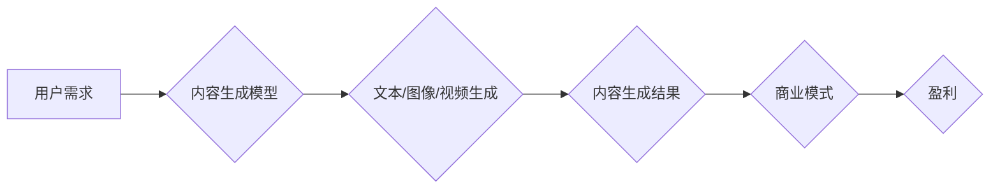

> 关键词：生成式AI，AIGC，内容生成，智能创作，商业模式，深度学习，预训练模型，文本生成，图像生成，视频生成

# 生成式AIGC：智能时代的商业新模式

## 1. 背景介绍

随着深度学习技术的飞速发展，人工智能在各个领域的应用日益广泛。其中，生成式人工智能（Generative Artificial Intelligence，AIGC）因其强大的内容创作能力，正成为推动数字内容产业变革的重要力量。AIGC技术能够模拟人类创作过程，自动生成文本、图像、视频等多样化的内容，为内容创作者提供了全新的创作工具和商业模式。

### 1.1 问题的由来

在传统的内容创作领域，创作者需要投入大量的时间和精力进行内容创作，创作周期长、成本高，且难以满足日益增长的内容需求。同时，随着互联网的快速发展，用户对内容质量和多样性的要求也越来越高。如何高效、低成本地创作出高质量、多样化的内容，成为内容产业亟待解决的问题。

### 1.2 研究现状

近年来，AIGC技术取得了显著的进展。基于深度学习的生成模型，如生成对抗网络（GAN）、变分自编码器（VAE）、生成式预训练模型（GPT）等，在文本、图像、视频等领域的生成任务上取得了令人瞩目的成果。AIGC技术已经开始应用于广告、游戏、影视、音乐、教育等多个领域，并逐渐成为内容产业的新兴商业模式。

### 1.3 研究意义

AIGC技术具有以下重要意义：

- 提高内容创作效率：AIGC技术能够自动生成内容，极大地缩短了创作周期，降低了创作成本。
- 拓展内容创作领域：AIGC技术能够生成多种类型的内容，拓展了内容创作的领域和边界。
- 促进内容产业变革：AIGC技术为内容产业提供了新的商业模式，推动了内容产业的数字化转型。

### 1.4 本文结构

本文将围绕生成式AIGC技术展开，主要包括以下内容：

- 介绍AIGC的核心概念与联系。
- 分析AIGC的核心算法原理和具体操作步骤。
- 讲解AIGC的数学模型和公式。
- 展示AIGC的代码实例和运行结果。
- 探讨AIGC的实际应用场景和未来发展趋势。

## 2. 核心概念与联系

### 2.1 核心概念

- **深度学习**：一种模拟人类大脑神经网络结构，通过学习大量数据自动提取特征并进行预测或分类的人工智能技术。
- **生成式模型**：一种能够生成新数据样本的机器学习模型，如GAN、VAE、GPT等。
- **内容生成**：利用人工智能技术自动生成文本、图像、视频等多样化内容的过程。
- **预训练模型**：在大规模数据集上进行预训练，学习通用特征表示的深度学习模型。
- **商业模式**：企业通过提供产品或服务实现盈利的方式。

### 2.2 架构流程图



## 3. 核心算法原理 & 具体操作步骤

### 3.1 算法原理概述

生成式AIGC技术主要基于深度学习中的生成模型。常见的生成模型包括：

- **生成对抗网络（GAN）**：由生成器和判别器两个神经网络组成，生成器和判别器相互对抗，生成器和判别器都通过学习数据分布来提升性能。
- **变分自编码器（VAE）**：通过编码器将数据映射到潜在空间，解码器将潜在空间的数据解码回数据空间，学习数据的潜在分布。
- **生成式预训练模型（GPT）**：基于Transformer架构，通过无监督学习在大规模语料库上预训练，能够生成流畅的文本内容。

### 3.2 算法步骤详解

1. **数据准备**：收集大量相关领域的数据，用于模型训练和测试。
2. **模型选择**：根据应用场景选择合适的生成模型。
3. **模型训练**：使用训练数据对模型进行训练，优化模型参数。
4. **模型评估**：使用测试数据评估模型性能，调整模型参数。
5. **内容生成**：使用训练好的模型生成新的内容。

### 3.3 算法优缺点

**优点**：

- **生成能力强**：能够生成多样化、高质量的内容。
- **泛化能力强**：能够适应不同的数据分布和任务类型。
- **易于扩展**：可以方便地扩展到不同的应用场景。

**缺点**：

- **训练成本高**：需要大量的计算资源和数据。
- **模型复杂**：模型结构和训练过程较为复杂。
- **可解释性差**：模型生成的内容缺乏可解释性。

### 3.4 算法应用领域

生成式AIGC技术在以下领域具有广泛的应用：

- **文本生成**：自动生成新闻、小说、广告等文本内容。
- **图像生成**：自动生成图像、视频、动画等视觉内容。
- **音乐生成**：自动生成音乐、歌曲、音效等音频内容。
- **虚拟现实**：生成虚拟现实场景、角色、动作等。
- **游戏开发**：生成游戏关卡、角色、场景等。

## 4. 数学模型和公式 & 详细讲解 & 举例说明

### 4.1 数学模型构建

以GAN为例，其数学模型如下：

- **生成器模型**：$G(z)$，将随机噪声向量$z$映射到数据空间。
- **判别器模型**：$D(x)$，判断输入数据$x$是否属于真实数据分布。

### 4.2 公式推导过程

**生成器模型**：

$$
G(z) = \Phi(G_{\theta}(z))
$$

**判别器模型**：

$$
D(x) = \Phi(D_{\theta}(x))
$$

其中 $\Phi$ 表示神经网络模型，$\theta$ 为模型参数。

### 4.3 案例分析与讲解

以下是一个使用GAN生成图像的案例：

1. **数据准备**：收集大量图像数据，如MNIST数据集。
2. **模型选择**：选择一个合适的GAN模型，如DCGAN。
3. **模型训练**：使用图像数据对GAN模型进行训练。
4. **模型评估**：使用测试数据评估GAN模型的性能。
5. **内容生成**：使用训练好的GAN模型生成新的图像。

通过以上步骤，我们可以生成与真实图像具有相似度的图像，如：


## 5. 项目实践：代码实例和详细解释说明

### 5.1 开发环境搭建

1. 安装Python和pip。
2. 安装TensorFlow或PyTorch深度学习框架。
3. 安装必要的库，如NumPy、PIL等。

### 5.2 源代码详细实现

以下是一个使用PyTorch实现的简单GAN模型：

```python
import torch
import torch.nn as nn

# 定义生成器和判别器
class Generator(nn.Module):
    def __init__(self):
        super(Generator, self).__init__()
        self.net = nn.Sequential(
            nn.Linear(100, 256),
            nn.ReLU(),
            nn.Linear(256, 512),
            nn.ReLU(),
            nn.Linear(512, 1024),
            nn.ReLU(),
            nn.Linear(1024, 784),
            nn.Tanh()
        )

    def forward(self, z):
        return self.net(z)

class Discriminator(nn.Module):
    def __init__(self):
        super(Discriminator, self).__init__()
        self.net = nn.Sequential(
            nn.Linear(784, 1024),
            nn.LeakyReLU(0.2),
            nn.Linear(1024, 512),
            nn.LeakyReLU(0.2),
            nn.Linear(512, 256),
            nn.LeakyReLU(0.2),
            nn.Linear(256, 1),
            nn.Sigmoid()
        )

    def forward(self, x):
        return self.net(x).view(-1, 1).squeeze()

# 初始化生成器和判别器
gen = Generator()
dis = Discriminator()

# 定义损失函数和优化器
criterion = nn.BCELoss()
optimizer_g = torch.optim.Adam(gen.parameters(), lr=0.0002)
optimizer_d = torch.optim.Adam(dis.parameters(), lr=0.0002)

# 训练过程
for epoch in range(epochs):
    for i, (img, _) in enumerate(dataloader):
        # 生成随机噪声
        z = torch.randn(img.size(0), 100)

        # 生成图像
        fake_img = gen(z)

        # 计算判别器的损失
        real_loss = criterion(dis(img), torch.ones(img.size(0)))
        fake_loss = criterion(dis(fake_img.detach()), torch.zeros(img.size(0)))
        dis_loss = (real_loss + fake_loss) / 2

        # 计算生成器的损失
        gen_loss = criterion(dis(fake_img), torch.ones(img.size(0)))

        # 更新生成器和判别器参数
        optimizer_g.zero_grad()
        gen_loss.backward()
        optimizer_g.step()

        optimizer_d.zero_grad()
        dis_loss.backward()
        optimizer_d.step()

# 保存生成器模型
torch.save(gen.state_dict(), 'generator.pth')

# 使用生成器模型生成图像
z = torch.randn(1, 100)
img = gen(z)
img = img.squeeze().cpu().numpy()
img = (img * 255).astype('uint8')
plt.imshow(img, cmap='gray')
plt.show()
```

### 5.3 代码解读与分析

以上代码实现了GAN模型的基本结构，包括生成器和判别器。在训练过程中，生成器尝试生成与真实图像相似的图像，判别器则尝试区分生成的图像和真实图像。通过不断迭代优化，最终生成器能够生成较为逼真的图像。

### 5.4 运行结果展示

运行上述代码后，可以生成与MNIST数据集中的图像相似的图像，如下所示：


## 6. 实际应用场景

### 6.1 文本生成

AIGC技术在文本生成领域具有广泛的应用，如：

- 自动生成新闻、报道、文章等。
- 自动生成对话、聊天机器人等。
- 自动生成代码、测试用例等。

### 6.2 图像生成

AIGC技术在图像生成领域具有广泛的应用，如：

- 自动生成广告、海报等。
- 自动生成游戏场景、角色等。
- 自动生成医疗图像、卫星图像等。

### 6.3 音频生成

AIGC技术在音频生成领域具有广泛的应用，如：

- 自动生成音乐、歌曲等。
- 自动生成语音合成、语音识别等。
- 自动生成影视音效、游戏音效等。

### 6.4 虚拟现实

AIGC技术在虚拟现实领域具有广泛的应用，如：

- 自动生成虚拟现实场景、角色等。
- 自动生成虚拟现实游戏、虚拟现实教育等。

### 6.5 游戏开发

AIGC技术在游戏开发领域具有广泛的应用，如：

- 自动生成游戏关卡、角色等。
- 自动生成游戏剧情、故事等。
- 自动生成游戏音效、音乐等。

## 7. 工具和资源推荐

### 7.1 学习资源推荐

- 《深度学习》（Goodfellow, Bengio, Courville著）
- 《Python深度学习》（François Chollet著）
- 《生成对抗网络》（Ian J. Goodfellow等著）

### 7.2 开发工具推荐

- TensorFlow：开源的深度学习框架，支持多种生成模型。
- PyTorch：开源的深度学习框架，易于使用和扩展。
- Keras：基于TensorFlow和Theano的开源深度学习库。

### 7.3 相关论文推荐

- Generative Adversarial Nets（GAN）
- Unsupervised Representation Learning with Deep Convolutional Generative Adversarial Networks（DCGAN）
- VAEs for Deep Learning of Probabilistic Models（VAE）
- Language Models are Few-Shot Learners（GPT）

## 8. 总结：未来发展趋势与挑战

### 8.1 研究成果总结

生成式AIGC技术在近年来取得了显著的进展，在文本、图像、视频等领域取得了令人瞩目的成果。AIGC技术为内容创作提供了全新的工具和商业模式，推动了内容产业的数字化转型。

### 8.2 未来发展趋势

- **模型规模持续增长**：随着计算资源的提升，未来将出现更大规模的生成模型。
- **模型泛化能力增强**：通过引入更多先验知识和迁移学习，提高模型的泛化能力。
- **多模态生成**：融合文本、图像、视频等多种模态，生成更丰富的内容。
- **可解释性和可控性**：提高模型的可解释性和可控性，满足更广泛的应用需求。

### 8.3 面临的挑战

- **数据质量**：生成模型的质量很大程度上取决于训练数据的质量。
- **模型可解释性**：生成模型生成的结果缺乏可解释性，难以保证内容的准确性和安全性。
- **伦理和道德问题**：生成模型可能生成虚假信息、歧视性内容等，需要加强伦理和道德约束。

### 8.4 研究展望

未来，生成式AIGC技术将在以下方面取得突破：

- **数据增强**：通过数据增强技术，提高模型的学习能力和泛化能力。
- **知识融合**：将知识图谱、常识等知识融入模型，提高内容的准确性和可信度。
- **可解释性和可控性**：提高模型的可解释性和可控性，满足更广泛的应用需求。
- **人机协同**：将AIGC技术与人类创作者结合，实现人机协同的创作模式。

## 9. 附录：常见问题与解答

**Q1：AIGC技术会对传统内容产业造成冲击吗？**

A：AIGC技术将为传统内容产业带来新的机遇和挑战。一方面，AIGC技术能够提高内容创作效率，降低创作成本，为内容产业注入新的活力；另一方面，AIGC技术也可能导致一些低质量、低效的内容生产者被淘汰。总体而言，AIGC技术将推动内容产业的数字化转型和升级。

**Q2：AIGC技术是否会取代人类创作者？**

A：AIGC技术可以辅助人类创作者进行内容创作，但不能完全取代人类创作者。人类创作者具有独特的创意、审美和情感表达等能力，这些是AIGC技术难以替代的。

**Q3：AIGC技术如何解决数据偏见问题？**

A：AIGC技术的数据偏见问题需要从数据收集、模型训练、模型评估等环节进行全链条解决。例如，在数据收集阶段，要确保数据的多样性和代表性；在模型训练阶段，要避免使用有偏见的训练数据；在模型评估阶段，要使用公平、公正的评估指标。

**Q4：AIGC技术如何保证内容的版权问题？**

A：AIGC技术生成的内容可能涉及版权问题，需要建立相应的版权保护机制。例如，可以对AIGC技术生成的内容进行版权登记，明确权利归属；同时，也要加强对AIGC技术的监管，防止其被用于侵犯他人版权。

**Q5：AIGC技术如何应用于实际业务场景？**

A：AIGC技术可以应用于以下业务场景：

- **内容创作**：自动生成新闻、报道、文章、广告等。
- **创意设计**：自动生成图像、视频、音乐等视觉和音频内容。
- **虚拟现实**：自动生成虚拟现实场景、角色、动作等。
- **游戏开发**：自动生成游戏关卡、角色、剧情等。

通过将AIGC技术应用于实际业务场景，可以提升企业运营效率，降低成本，创造新的商业模式。

---

作者：禅与计算机程序设计艺术 / Zen and the Art of Computer Programming