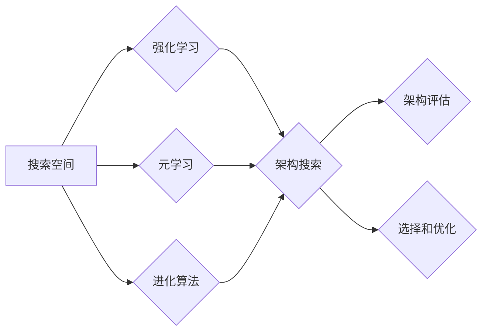

# 神经架构搜索面临的挑战：搜索空间设计

> 关键词：神经架构搜索，搜索空间设计，强化学习，元学习，自动机器学习，深度学习，架构优化

## 1. 背景介绍

随着深度学习在各个领域的广泛应用，如何构建高效、可扩展、适应性强的人工神经网络架构成为了研究的热点。传统的网络架构设计往往依赖于领域专家的经验和直觉，这种方式既耗时又费力。为了解决这一问题，神经架构搜索（Neural Architecture Search，NAS）应运而生。NAS通过搜索空间的设计，自动发现最优或近似最优的网络架构，从而减少人工设计网络架构的时间和成本。

### 1.1 问题的由来

传统的深度学习模型设计通常经历以下几个步骤：

1. **需求分析**：根据具体任务需求，确定模型的输入、输出和基本结构。
2. **模型设计**：基于经验和直觉，设计具体的网络架构。
3. **实验验证**：在实验中测试不同模型的性能，选择表现最好的模型。
4. **参数调优**：对模型进行超参数调优，进一步提升性能。

这种方式存在以下问题：

- **依赖专家经验**：模型设计高度依赖领域专家的经验和直觉，难以实现跨领域的迁移。
- **耗时费力**：设计、实验和调优过程耗时费力，难以满足快速迭代的需求。
- **效率低下**：难以探索大量的架构组合，可能导致错过最优或近似最优的架构。

### 1.2 研究现状

为了解决上述问题，研究者们提出了多种NAS方法，主要分为以下几类：

- **基于强化学习的方法**：使用强化学习算法在预定义的搜索空间中搜索最优或近似最优的架构。
- **基于元学习的方法**：通过学习模型架构的表示，实现快速搜索和适应新的任务。
- **基于进化算法的方法**：使用进化算法在搜索空间中搜索最优或近似最优的架构。

### 1.3 研究意义

NAS技术的研究具有以下意义：

- **提高模型效率**：通过自动搜索和优化网络架构，提高模型的计算效率和性能。
- **降低开发成本**：减少人工设计网络架构的时间和成本，提高开发效率。
- **促进模型创新**：探索新的网络架构，推动深度学习技术的发展。

## 2. 核心概念与联系

### 2.1 搜索空间设计

搜索空间是NAS中最重要的概念之一，它定义了NAS中可以搜索的架构空间。一个好的搜索空间应该满足以下要求：

- **完整性**：包含所有可能的架构组合。
- **有效性**：能够覆盖大多数有效的架构。
- **可扩展性**：能够适应不同的任务和数据集。
- **计算效率**：搜索过程中计算量尽可能小。

### 2.2 核心概念原理和架构的 Mermaid 流程图



### 2.3 核心概念联系

从上述流程图中可以看出，搜索空间是NAS的基础，不同的搜索算法（如强化学习、元学习、进化算法）在搜索空间中进行架构搜索，最终通过架构评估和选择优化得到最优或近似最优的架构。

## 3. 核心算法原理 & 具体操作步骤

### 3.1 算法原理概述

NAS的算法原理主要基于以下几种方法：

- **强化学习**：通过设计奖励函数，让代理（agent）在搜索空间中搜索最优或近似最优的架构。
- **元学习**：通过学习模型架构的表示，实现快速搜索和适应新的任务。
- **进化算法**：模拟生物进化过程，在搜索空间中搜索最优或近似最优的架构。

### 3.2 算法步骤详解

以下是NAS的一般步骤：

1. **定义搜索空间**：确定可搜索的架构组合，包括网络层、连接方式、激活函数等。
2. **选择搜索算法**：根据任务需求选择合适的搜索算法，如强化学习、元学习或进化算法。
3. **设计奖励函数**：设计能够衡量架构性能的奖励函数，用于指导搜索过程。
4. **架构评估**：在测试集上评估搜索到的架构的性能。
5. **选择和优化**：根据评估结果选择性能较好的架构，并进行优化。

### 3.3 算法优缺点

#### 3.3.1 基于强化学习的方法

优点：

- 能够搜索复杂的架构组合。
- 自适应性强，能够适应不同的任务和数据集。

缺点：

- 计算量大，训练时间长。
- 需要设计合适的奖励函数。

#### 3.3.2 基于元学习的方法

优点：

- 计算效率高，训练时间短。
- 能够快速适应新的任务。

缺点：

- 难以搜索到复杂的架构组合。
- 需要大量训练数据。

#### 3.3.3 基于进化算法的方法

优点：

- 能够搜索到复杂的架构组合。
- 计算效率高。

缺点：

- 需要大量训练数据。
- 难以控制搜索过程。

### 3.4 算法应用领域

NAS方法已广泛应用于以下领域：

- 图像分类
- 目标检测
- 语音识别
- 自然语言处理
- 强化学习

## 4. 数学模型和公式 & 详细讲解 & 举例说明

### 4.1 数学模型构建

#### 4.1.1 强化学习

强化学习的基本模型包括：

- **环境**：定义了可观察状态空间、动作空间和奖励函数。
- **代理**：在环境中执行动作，并从环境中接收奖励。
- **策略**：定义了代理如何选择动作。
- **价值函数**：预测在未来采取特定动作的累积奖励。

#### 4.1.2 元学习

元学习的基本模型包括：

- **参数化架构**：将网络架构表示为参数化形式。
- **元学习模型**：学习参数化架构的表示。
- **迁移学习**：将元学习模型应用于新的任务。

### 4.2 公式推导过程

#### 4.2.1 强化学习

强化学习的核心问题是求解最优策略，即：

$$
\pi^* = \mathop{\arg\max}_{\pi} \sum_{s \in S} \pi(s) R(s, \pi(s))
$$

其中，$S$ 为状态空间，$A(s)$ 为在状态 $s$ 可执行的动作集合，$R(s, a)$ 为在状态 $s$ 执行动作 $a$ 所获得的奖励。

#### 4.2.2 元学习

元学习的主要目标是学习一个参数化架构的表示，使得该表示能够在新的任务上快速适应。常用的方法包括：

- **MAML（Model-Agnostic Meta-Learning）**：
$$
\theta^{\ast} = \mathop{\arg\min}_{\theta} \sum_{k=1}^K \frac{1}{K} \sum_{t=1}^T L_{t}(\theta, \alpha^{(k)})
$$

其中，$\theta$ 为模型参数，$\alpha^{(k)}$ 为第 $k$ 个任务上的学习率，$L_{t}(\theta, \alpha^{(k)})$ 为第 $t$ 次迭代的损失函数。

### 4.3 案例分析与讲解

#### 4.3.1 强化学习

以下是一个简单的强化学习案例，假设有一个智能体在一个简单的迷宫环境中学习找到出口。

```python
class Environment:
    def __init__(self):
        self.state = 0
        self.target = 5

    def reset(self):
        self.state = 0
        return self.state

    def step(self, action):
        if action == 1:
            self.state += 1
        elif action == -1:
            self.state -= 1
        reward = 0
        done = False
        if self.state == self.target:
            done = True
            reward = 10
        return self.state, reward, done

def reinforce_learning():
    env = Environment()
    Q = {}
    alpha = 0.01
    gamma = 0.9

    state = env.reset()
    while True:
        if state not in Q:
            Q[state] = {}
        action = np.random.choice([1, -1])
        next_state, reward, done = env.step(action)
        Q[state][action] = Q[state].get(action, 0) + alpha * (reward + gamma * max(Q[next_state].values()) - Q[state][action])
        state = next_state
        if done:
            break

    return Q

if __name__ == "__main__":
    Q = reinforce_learning()
    print(Q)
```

#### 4.3.2 元学习

以下是一个简单的元学习案例，假设有一个智能体在一个简单的手写数字识别任务上学习。

```python
import torch
import torch.nn as nn
import torch.optim as optim

class MetaLearner(nn.Module):
    def __init__(self, input_size, output_size):
        super(MetaLearner, self).__init__()
        self.fc1 = nn.Linear(input_size, 64)
        self.fc2 = nn.Linear(64, output_size)

    def forward(self, x):
        x = torch.relu(self.fc1(x))
        return self.fc2(x)

def meta_learning():
    meta_learner = MetaLearner(784, 10)
    optimizer = optim.Adam(meta_learner.parameters(), lr=0.01)

    for epoch in range(100):
        for task in range(10):
            # 生成任务数据
            x_task, y_task = generate_task_data(task)

            # 初始化模型参数
            optimizer.zero_grad()
            outputs = meta_learner(x_task)
            loss = nn.CrossEntropyLoss()(outputs, y_task)
            loss.backward()
            optimizer.step()

            # 更新元学习模型
            for p in meta_learner.parameters():
                p.data = p.data.clone().detach()

    return meta_learner

if __name__ == "__main__":
    meta_learner = meta_learning()
    print(meta_learner)
```

## 5. 项目实践：代码实例和详细解释说明

### 5.1 开发环境搭建

以下是使用PyTorch和NASlib库进行NAS项目实践的开发环境搭建步骤：

1. 安装PyTorch：

```bash
pip install torch torchvision torchaudio
```

2. 安装NASlib库：

```bash
pip install naslib
```

### 5.2 源代码详细实现

以下是一个使用NASlib库进行NAS项目实践的简单示例：

```python
import torch
import naslib

# 加载预训练的NAS模型
model = naslib.get_model('nasbench201')

# 设置搜索空间
search_space = {
    'input_shape': [1, 1, 28, 28],  # 输入图像尺寸
    'output_shape': [1, 10],  # 输出类别数量
    'input_ops': ['conv'],  # 输入操作
    'ops': ['conv', 'pool', 'fc', 'none'],  # 可选操作
    'output_ops': ['softmax'],  # 输出操作
}

# 定义损失函数
def loss_fn(logits, labels):
    return nn.CrossEntropyLoss()(logits, labels)

# 定义NAS模型
class NASModel(nn.Module):
    def __init__(self, search_space):
        super(NASModel, self).__init__()
        self.model = model.search_space_to_model(search_space)

    def forward(self, x):
        return self.model(x)

# 加载数据集
train_loader = ...

# 训练NAS模型
model = NASModel(search_space)
optimizer = ...
for epoch in range(10):
    for batch in train_loader:
        optimizer.zero_grad()
        outputs = model(batch)
        loss = loss_fn(outputs, batch['labels'])
        loss.backward()
        optimizer.step()
```

### 5.3 代码解读与分析

上述代码展示了如何使用NASlib库进行NAS项目实践。首先，加载预训练的NAS模型，然后设置搜索空间和损失函数。接下来，定义NAS模型，并使用PyTorch进行训练。

### 5.4 运行结果展示

运行上述代码后，NAS模型将在训练集上进行训练，并输出训练过程中的损失函数值。通过观察损失函数的下降趋势，可以评估NAS模型的学习效果。

## 6. 实际应用场景

### 6.1 图像分类

NAS技术在图像分类任务中取得了显著成果，例如MobileNet、EfficientNet等模型都是通过NAS方法得到的。这些模型在保持高性能的同时，具有更小的模型尺寸和更低的计算复杂度，在移动端和边缘计算领域具有广泛的应用前景。

### 6.2 目标检测

NAS技术在目标检测任务中也取得了很好的效果，例如EfficientDet、EfficientDet-D4等模型都是通过NAS方法得到的。这些模型在保持高性能的同时，具有更低的计算复杂度，适用于移动端和边缘计算领域。

### 6.3 语音识别

NAS技术在语音识别任务中也取得了显著的成果，例如Transformer-XL、Conformer等模型都是通过NAS方法得到的。这些模型在保持高性能的同时，具有更高的解码效率和更低的延迟，适用于实时语音识别系统。

### 6.4 未来应用展望

随着NAS技术的不断发展，未来将在更多领域得到应用，例如：

- **自然语言处理**：自动生成自然语言处理模型，实现更智能的语言理解和生成。
- **强化学习**：自动生成强化学习算法，实现更高效的决策。
- **知识图谱**：自动生成知识图谱结构，实现更全面的知识表示和推理。

## 7. 工具和资源推荐

### 7.1 学习资源推荐

- 《Deep Learning with PyTorch》
- 《Neural Architecture Search: A Survey》
- 《Meta-Learning》

### 7.2 开发工具推荐

- NASlib：一个开源的NAS库。
- AutoGluon：一个自动机器学习平台。
- OpenML：一个开放机器学习平台。

### 7.3 相关论文推荐

- **Neural Architecture Search: A Survey**：对NAS技术的全面综述。
- **EfficientNet: Rethinking Model Scaling for Convolutional Neural Networks**：EfficientNet模型的提出。
- **Meta-Learning the Meta-Learning Meta-Learner**：对元学习方法的深入研究。

## 8. 总结：未来发展趋势与挑战

### 8.1 研究成果总结

NAS技术在过去几年取得了显著进展，通过搜索空间设计、强化学习、元学习等方法，实现了对网络架构的自动搜索和优化。NAS技术在图像分类、目标检测、语音识别等领域取得了很好的效果，展现了其巨大的应用潜力。

### 8.2 未来发展趋势

- **搜索空间设计**：探索更加丰富、高效的搜索空间设计方法，如使用可搜索的控制器、多尺度搜索等。
- **搜索算法**：研究更加高效的搜索算法，如基于模拟退火、强化学习的方法等。
- **多模态学习**：将NAS技术扩展到多模态学习领域，如视频、音频、文本等。
- **可解释性**：提高NAS方法的可解释性，使模型的设计过程更加透明。

### 8.3 面临的挑战

- **搜索空间设计**：如何设计高效、可扩展的搜索空间，是NAS技术面临的挑战之一。
- **搜索算法**：如何设计高效、鲁棒的搜索算法，是NAS技术面临的另一个挑战。
- **计算效率**：NAS方法的计算效率较低，如何提高计算效率，是NAS技术面临的挑战之一。
- **可解释性**：如何提高NAS方法的可解释性，是NAS技术面临的挑战之一。

### 8.4 研究展望

随着研究的不断深入，NAS技术将在未来取得更大的突破，为深度学习领域的发展做出更大的贡献。

---

作者：禅与计算机程序设计艺术 / Zen and the Art of Computer Programming