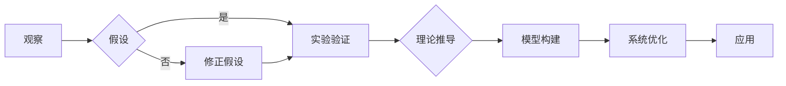

> 第一性原理, 科学方法, 基础科学, 复杂系统, 量子力学, 人工智能, 算法设计, 系统优化

# 第一性原理：从基础到复杂的科学方法

### 1. 背景介绍

科学方法是人类认识世界、改造世界的基本途径。从古希腊的亚里士多德到现代的科学家们，科学方法始终贯穿于人类文明的进步之中。第一性原理（First Principles Thinking）作为一种科学方法，强调从最基本的物理定律和事实出发，通过逻辑推理和演绎，构建起对复杂系统的理解。本文将深入探讨第一性原理的科学方法，从基础到复杂系统的应用，以及其在人工智能和算法设计中的重要性。

### 2. 核心概念与联系

#### 2.1 核心概念

**第一性原理**：指构成事物最基本、最本质的原理或定律。在物理学中，第一性原理通常指牛顿运动定律、能量守恒定律等基础物理定律。

**科学方法**：一种通过观察、实验、推理和演绎来获取知识的方法。

**复杂系统**：由众多相互作用的元素组成的系统，其行为和性质难以用简单的公式描述。

#### 2.2 核心概念原理和架构的 Mermaid 流程图



### 3. 核心算法原理 & 具体操作步骤

#### 3.1 算法原理概述

第一性原理方法的原理可以概括为以下步骤：

1. **观察**：对复杂系统进行观察，收集数据和事实。
2. **假设**：基于观察结果，提出可能的解释或假设。
3. **实验验证**：设计实验来验证假设的正确性。
4. **理论推导**：根据第一性原理，推导出理论模型。
5. **模型构建**：构建数学模型或算法模型来描述系统行为。
6. **系统优化**：通过模型优化，改善系统性能。
7. **应用**：将优化后的系统应用于实际问题。

#### 3.2 算法步骤详解

1. **观察**：通过对复杂系统的观察，收集必要的数据和事实。
2. **假设**：基于观察结果，提出可能的解释或假设。
3. **实验验证**：设计实验来测试假设的正确性。实验设计应遵循科学方法的原则，确保实验结果的可靠性和可重复性。
4. **理论推导**：根据第一性原理，推导出理论模型。理论推导应基于严格的逻辑推理，确保结论的准确性。
5. **模型构建**：根据理论推导，构建数学模型或算法模型来描述系统行为。模型应简洁、准确，并能够捕捉到系统的关键特性。
6. **系统优化**：通过模型优化，改善系统性能。优化方法包括但不限于参数调整、算法改进、数据增强等。
7. **应用**：将优化后的系统应用于实际问题。应用过程中应对系统进行持续的监测和评估，以确保其性能和稳定性。

#### 3.3 算法优缺点

**优点**：

- **科学性**：基于第一性原理的方法遵循科学方法的原则，确保结论的可靠性和可重复性。
- **普适性**：第一性原理方法可以应用于各种复杂系统，包括物理系统、生物系统、社会系统等。
- **创新性**：第一性原理方法鼓励从基础出发，寻找新的解决方案，具有创新性。

**缺点**：

- **复杂性**：第一性原理方法通常涉及复杂的理论推导和模型构建，对研究者的理论基础和计算能力要求较高。
- **成本**：实验验证和理论推导往往需要大量的时间和资源。

#### 3.4 算法应用领域

第一性原理方法在以下领域具有广泛的应用：

- **物理学**：牛顿运动定律、能量守恒定律等。
- **化学**：化学反应动力学、分子结构等。
- **生物学**：细胞信号传导、神经网络等。
- **人工智能**：机器学习算法设计、深度学习模型优化等。

### 4. 数学模型和公式 & 详细讲解 & 举例说明

#### 4.1 数学模型构建

以物理学中的经典力学为例，牛顿运动定律可以用以下数学模型描述：

$$
F = ma
$$

其中 $F$ 表示力，$m$ 表示质量，$a$ 表示加速度。

#### 4.2 公式推导过程

牛顿运动定律的推导过程如下：

1. **观察**：观察物体的运动，发现力是改变物体运动状态的原因。
2. **假设**：假设存在一个与物体质量和加速度成正比的力。
3. **实验验证**：通过实验验证力的存在和大小。
4. **理论推导**：根据牛顿第二定律 $F = ma$，推导出牛顿运动定律。

#### 4.3 案例分析与讲解

以机器学习中的线性回归为例，其数学模型可以用以下公式描述：

$$
y = \beta_0 + \beta_1 x_1 + \beta_2 x_2 + \cdots + \beta_n x_n + \epsilon
$$

其中 $y$ 表示因变量，$x_1, x_2, \cdots, x_n$ 表示自变量，$\beta_0, \beta_1, \cdots, \beta_n$ 表示模型参数，$\epsilon$ 表示误差项。

线性回归模型的目标是找到一组参数 $\beta_0, \beta_1, \cdots, \beta_n$，使得模型对数据的预测误差最小。

### 5. 项目实践：代码实例和详细解释说明

#### 5.1 开发环境搭建

以Python为例，搭建线性回归模型的开发环境需要以下步骤：

1. 安装Python和PyTorch。
2. 安装NumPy和SciPy等科学计算库。

#### 5.2 源代码详细实现

以下是一个简单的线性回归模型实现：

```python
import torch
import torch.nn as nn

class LinearRegression(nn.Module):
    def __init__(self, input_size, output_size):
        super(LinearRegression, self).__init__()
        self.linear = nn.Linear(input_size, output_size)

    def forward(self, x):
        out = self.linear(x)
        return out

# 实例化模型
model = LinearRegression(input_size=2, output_size=1)

# 训练模型
# ...

# 预测
# ...
```

#### 5.3 代码解读与分析

上述代码定义了一个简单的线性回归模型，使用PyTorch框架实现。模型包含一个线性层，用于拟合输入和输出之间的关系。

#### 5.4 运行结果展示

运行上述代码，可以得到线性回归模型的预测结果。通过对比预测结果和真实值，可以评估模型的性能。

### 6. 实际应用场景

#### 6.1 人工智能

在人工智能领域，第一性原理方法可以用于：

- **算法设计**：从基本的物理或数学原理出发，设计新的机器学习算法。
- **模型优化**：通过分析模型的内部机制，优化模型结构和参数。
- **数据预处理**：从数据的基本特征出发，设计有效的数据预处理方法。

#### 6.2 生物学

在生物学领域，第一性原理方法可以用于：

- **蛋白质结构预测**：通过分析蛋白质的氨基酸序列，预测其三维结构。
- **药物设计**：基于生物分子的相互作用原理，设计新的药物分子。

### 7. 工具和资源推荐

#### 7.1 学习资源推荐

- 《第一性原理：科学革命背后的思想》
- 《复杂性：秩序、混沌与科学革命》
- 《Python编程：从入门到实践》

#### 7.2 开发工具推荐

- Python
- PyTorch
- TensorFlow

#### 7.3 相关论文推荐

- 《Deep Learning》
- 《The Elements of Statistical Learning》
- 《Reinforcement Learning: An Introduction》

### 8. 总结：未来发展趋势与挑战

#### 8.1 研究成果总结

本文从第一性原理的科学方法出发，探讨了其在复杂系统中的应用。通过分析第一性原理方法的原理、步骤和优缺点，展示了其在人工智能、生物学等领域的广泛应用。

#### 8.2 未来发展趋势

未来，第一性原理方法在以下方面具有发展趋势：

- **跨学科融合**：第一性原理方法与其他学科知识的融合，将促进新领域的发展。
- **人工智能**：第一性原理方法在人工智能领域的应用将更加深入，推动人工智能技术的发展。
- **量子计算**：量子计算与第一性原理方法的结合，将开辟新的计算范式。

#### 8.3 面临的挑战

第一性原理方法在以下方面面临挑战：

- **复杂性**：复杂系统的复杂性使得第一性原理方法的实际应用变得更加困难。
- **数据**：数据质量和数量对第一性原理方法的准确性有重要影响。
- **计算**：复杂模型的计算量巨大，对计算资源提出了挑战。

#### 8.4 研究展望

未来，第一性原理方法的研究将朝着以下方向发展：

- **简化模型**：通过理论分析和计算方法，简化复杂模型的计算量。
- **数据驱动**：将数据驱动方法与第一性原理方法结合，提高模型的预测能力。
- **跨学科研究**：跨学科研究将推动第一性原理方法的创新和应用。

### 9. 附录：常见问题与解答

**Q1：第一性原理方法与其他科学方法有什么区别？**

A：第一性原理方法强调从最基本的原理出发，通过逻辑推理和演绎构建对复杂系统的理解。而其他科学方法，如归纳法、类比法等，则更注重从具体事实出发，归纳出一般规律。

**Q2：第一性原理方法在人工智能领域有哪些应用？**

A：第一性原理方法在人工智能领域的应用包括算法设计、模型优化、数据预处理等。

**Q3：如何将第一性原理方法应用于实际项目？**

A：将第一性原理方法应用于实际项目需要以下步骤：

1. 明确项目目标和问题。
2. 收集相关数据和事实。
3. 提出可能的解释或假设。
4. 设计实验验证假设。
5. 根据第一性原理推导出理论模型。
6. 构建数学模型或算法模型。
7. 优化模型和系统。
8. 应用模型和系统。

**Q4：第一性原理方法在生物学领域有哪些应用？**

A：第一性原理方法在生物学领域的应用包括蛋白质结构预测、药物设计等。

**Q5：第一性原理方法在量子计算领域有哪些应用？**

A：第一性原理方法在量子计算领域的应用包括量子算法设计、量子系统模拟等。

---

作者：禅与计算机程序设计艺术 / Zen and the Art of Computer Programming