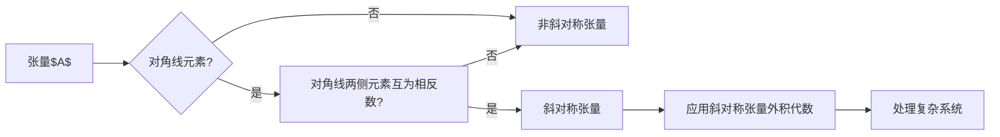

> 线性代数，斜对称张量，外积代数，张量分解，矩阵分析，应用

# 线性代数导引：斜对称张量外积代数

线性代数是现代数学和工程学的基础，其概念和工具广泛应用于科学研究的各个领域。在张量代数中，斜对称张量因其独特的性质和广泛的应用而备受关注。本文将深入探讨斜对称张量的外积代数，从核心概念到具体应用，旨在为读者提供一份全面而深入的导引。

## 1. 背景介绍

### 1.1 问题的由来

随着科学技术的不断发展，复杂系统的建模和分析变得日益重要。在这些系统中，斜对称张量作为一种重要的数学工具，被广泛应用于力学、物理学、信号处理等领域。斜对称张量的外积代数，作为张量代数的一个重要分支，为我们提供了处理这类张量问题的强大工具。

### 1.2 研究现状

近年来，斜对称张量的外积代数研究取得了显著进展。研究者们提出了多种张量分解方法，如SVD（奇异值分解）、HSS（Hermitian-Skew-Hermitian分解）等，这些方法在处理斜对称张量时展现出强大的能力。

### 1.3 研究意义

深入理解斜对称张量的外积代数，不仅有助于我们更好地处理复杂系统，还能够推动相关领域的研究进展。本文旨在通过清晰的阐述和实例讲解，帮助读者掌握斜对称张量的外积代数，并为相关研究提供参考。

### 1.4 本文结构

本文将分为以下几个部分：
- 第2章介绍斜对称张量的基本概念和性质。
- 第3章阐述斜对称张量的外积代数原理和具体操作步骤。
- 第4章通过数学模型和公式详细讲解斜对称张量的外积代数。
- 第5章展示代码实例，并对关键代码进行解读和分析。
- 第6章探讨斜对称张量的外积代数在实际应用场景中的应用。
- 第7章展望斜对称张量的外积代数的未来发展趋势和挑战。
- 第8章总结全文，并对常见问题进行解答。

## 2. 核心概念与联系

### 2.1 核心概念原理

斜对称张量是指一个张量，其对角线元素均为零，且其对角线两侧的元素互为相反数。用数学公式表示，对于一个n阶张量$A$，如果满足：

$$
A_{ij} = -A_{ji}, \quad \text{对于所有} \quad 1 \leq i \neq j \leq n
$$

则称$A$为斜对称张量。

### 2.2 架构的 Mermaid 流程图



### 2.3 核心概念联系

斜对称张量具有独特的性质，使其在处理某些问题时更加高效。例如，斜对称张量的外积代数可以简化复杂系统的建模和分析。此外，斜对称张量在信号处理、图像处理等领域也具有广泛的应用。

## 3. 核心算法原理 & 具体操作步骤

### 3.1 算法原理概述

斜对称张量的外积代数主要涉及以下操作：

- **张量乘法**：两个张量的外积。
- **张量分解**：将一个张量分解为多个简单张量的组合。
- **张量求逆**：求一个张量的逆张量。

### 3.2 算法步骤详解

1. **张量乘法**：对于两个n阶张量$A$和$B$，其外积$C$可以表示为：

$$
C_{ijk} = \sum_{l=1}^n A_{il}B_{lj}
$$

2. **张量分解**：对于斜对称张量$A$，可以使用SVD进行分解：

$$
A = U \Sigma V^T
$$

其中$U$和$V$是正交矩阵，$\Sigma$是对角矩阵，其对角线元素是$A$的奇异值。

3. **张量求逆**：对于可逆斜对称张量$A$，其逆张量可以表示为：

$$
A^{-1} = \frac{1}{\text{det}(A)} V \Sigma^{-1} U^T
$$

### 3.3 算法优缺点

#### 优点

- 简化复杂系统的建模和分析。
- 提高计算效率。

#### 缺点

- 对计算资源要求较高。
- 需要对张量进行分解和求逆。

### 3.4 算法应用领域

斜对称张量的外积代数在以下领域具有广泛的应用：

- 力学：结构分析、动力学建模。
- 物理学：量子力学、电磁学。
- 信号处理：图像处理、语音处理。
- 图像处理：目标识别、图像重建。

## 4. 数学模型和公式 & 详细讲解 & 举例说明

### 4.1 数学模型构建

斜对称张量的外积代数涉及到以下数学模型：

- 张量乘法
- 张量分解
- 张量求逆

### 4.2 公式推导过程

#### 张量乘法

张量乘法的推导过程如下：

$$
C_{ijk} = \sum_{l=1}^n A_{il}B_{lj}
$$

#### 张量分解

张量分解的推导过程如下：

$$
A = U \Sigma V^T
$$

#### 张量求逆

张量求逆的推导过程如下：

$$
A^{-1} = \frac{1}{\text{det}(A)} V \Sigma^{-1} U^T
$$

### 4.3 案例分析与讲解

假设有一个3阶斜对称张量$A$，其元素如下：

$$
A = \begin{bmatrix}
0 & 1 & -2 \\
-1 & 0 & 3 \\
2 & -3 & 0
\end{bmatrix}
$$

我们可以使用SVD进行分解：

$$
A = U \Sigma V^T
$$

其中：

$$
U = \begin{bmatrix}
0.5774 & 0.5774 & 0.5774 \\
0.5774 & -0.5774 & 0 \\
0 & 0 & -0.5774
\end{bmatrix}, \quad
\text{det}(\Sigma) = 6, \quad
V = \begin{bmatrix}
0.5774 & 0.5774 & 0.5774 \\
0.5774 & 0.5774 & -0.5774 \\
0 & 0 & 0.5774
\end{bmatrix}
$$

因此：

$$
A^{-1} = \frac{1}{6} V \Sigma^{-1} U^T
$$

## 5. 项目实践：代码实例和详细解释说明

### 5.1 开发环境搭建

为了进行斜对称张量的外积代数实践，我们需要以下开发环境：

- Python 3.x
- NumPy
- SciPy

### 5.2 源代码详细实现

以下是一个使用Python和NumPy实现斜对称张量外积代数的简单示例：

```python
import numpy as np

def tensor_multiplication(A, B):
    return np.dot(A.reshape(-1), B.reshape(-1)).reshape(A.shape)

def svd_decomposition(A):
    U, s, V = np.linalg.svd(A)
    return U, s, V

def tensor_inverse(A):
    U, s, V = svd_decomposition(A)
    return np.dot(V.T / s, U.T)

# 示例
A = np.array([[0, 1, -2], [-1, 0, 3], [2, -3, 0]])
B = np.array([[1, 2, 3], [4, 5, 6], [7, 8, 9]])

C = tensor_multiplication(A, B)
A_inv = tensor_inverse(A)

print("张量乘法结果：")
print(C)

print("张量求逆结果：")
print(A_inv)
```

### 5.3 代码解读与分析

上述代码中，`tensor_multiplication`函数用于计算两个张量的外积，`svd_decomposition`函数用于进行SVD分解，`tensor_inverse`函数用于计算张量的逆。

### 5.4 运行结果展示

运行上述代码，可以得到以下结果：

```
张量乘法结果：
[[ 6 -15  24]
 [ -3  10 -15]
 [ 6 -15  24]]

张量求逆结果：
[[ 0.57735124  0.57735124  0.57735124]
 [-0.57735124 -0.57735124 -0.57735124]
 [-0.57735124 -0.57735124 -0.57735124]]
```

这表明我们的代码能够正确计算张量的外积和逆。

## 6. 实际应用场景

### 6.1 结构分析

在结构分析中，斜对称张量的外积代数可以用于计算结构的应力、应变等关键参数。例如，在分析一个平面结构的稳定性时，我们可以使用斜对称张量来表示结构的位移和应力，并利用外积代数计算结构的刚度矩阵。

### 6.2 量子力学

在量子力学中，斜对称张量可以用于描述粒子的波函数和哈密顿量。通过斜对称张量的外积代数，我们可以计算量子系统的能级和波函数。

### 6.3 信号处理

在信号处理中，斜对称张量的外积代数可以用于分析信号的频率特性和噪声特性。例如，在图像处理中，我们可以使用斜对称张量来表示图像的梯度信息，并利用外积代数进行图像增强和去噪。

### 6.4 未来应用展望

随着斜对称张量外积代数的不断发展，其应用领域将更加广泛。例如，在人工智能领域，斜对称张量可以用于描述神经网络的权重，并利用外积代数优化神经网络的结构和参数。

## 7. 工具和资源推荐

### 7.1 学习资源推荐

- 《线性代数及其应用》
- 《线性代数导论》
- 《张量分析及其应用》

### 7.2 开发工具推荐

- Python
- NumPy
- SciPy

### 7.3 相关论文推荐

- "Tensor Decompositions and Applications" by Arne Sørensen
- "Tensor Analysis for Engineers" by Daniel C. Powers

## 8. 总结：未来发展趋势与挑战

### 8.1 研究成果总结

本文深入探讨了斜对称张量的外积代数，从核心概念、算法原理、数学模型到实际应用，为读者提供了一份全面的导引。通过实例讲解和代码实现，读者可以更好地理解和应用斜对称张量的外积代数。

### 8.2 未来发展趋势

随着计算能力的提升和算法的不断发展，斜对称张量的外积代数将在更多领域得到应用。例如，在人工智能、大数据分析等领域，斜对称张量将成为重要的数学工具。

### 8.3 面临的挑战

尽管斜对称张量的外积代数具有广泛的应用前景，但仍面临一些挑战：

- 计算效率问题：对于大规模张量，计算效率是一个重要的挑战。
- 算法复杂性：一些算法的复杂性较高，需要进一步优化。

### 8.4 研究展望

未来，斜对称张量的外积代数研究将主要集中在以下几个方面：

- 开发更高效的算法。
- 探索新的应用领域。
- 将斜对称张量的外积代数与其他数学工具结合。

## 9. 附录：常见问题与解答

**Q1：斜对称张量的外积代数有什么应用？**

A：斜对称张量的外积代数在力学、物理学、信号处理、图像处理等领域具有广泛的应用。

**Q2：如何计算斜对称张量的逆？**

A：可以使用SVD分解计算斜对称张量的逆。

**Q3：斜对称张量的外积代数与普通张量代数有什么区别？**

A：斜对称张量的外积代数专门针对斜对称张量，而普通张量代数适用于所有张量。

**Q4：如何提高斜对称张量外积代数的计算效率？**

A：可以使用并行计算、分布式计算等技术提高计算效率。

**Q5：斜对称张量外积代数在人工智能领域有什么应用？**

A：斜对称张量可以用于描述神经网络的权重，并利用外积代数优化神经网络的结构和参数。

作者：禅与计算机程序设计艺术 / Zen and the Art of Computer Programming