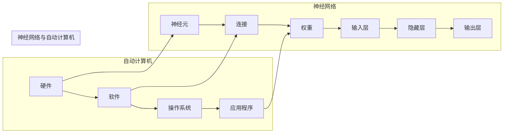

# 自动计算机与神经网络的研究

> 关键词：自动计算机，神经网络，人工智能，深度学习，机器学习，计算理论，模拟，抽象

## 1. 背景介绍

### 1.1 问题的由来

自计算机诞生以来，人类便渴望创造出能够模拟人类智能的机器。自动计算机的研究始于对人类思维过程的理解和模拟，而神经网络作为一种模拟人脑结构和功能的计算模型，成为了实现这一目标的关键技术。本文旨在探讨自动计算机与神经网络的研究现状、原理、应用及未来发展趋势。

### 1.2 研究现状

随着深度学习技术的飞速发展，神经网络在图像识别、语音识别、自然语言处理等领域取得了显著成果，为人工智能领域带来了前所未有的突破。然而，自动计算机与神经网络的研究仍面临着诸多挑战，如模型的可解释性、计算效率、泛化能力等。

### 1.3 研究意义

自动计算机与神经网络的研究对于推动人工智能技术的发展具有重要意义。它不仅有助于我们更好地理解人脑的工作原理，还可以应用于医疗、工业、交通、教育等多个领域，为人类创造更加智能化的生活。

### 1.4 本文结构

本文将按照以下结构展开：

- 第2章：介绍自动计算机与神经网络的核心概念及其相互联系。
- 第3章：阐述神经网络的基本原理和具体操作步骤。
- 第4章：分析神经网络的数学模型和公式，并举例说明。
- 第5章：展示神经网络在项目实践中的应用，并解释代码实现。
- 第6章：探讨神经网络在实际应用场景中的案例。
- 第7章：展望神经网络技术的未来发展趋势和挑战。
- 第8章：总结研究成果，并给出研究展望。

## 2. 核心概念与联系

### 2.1 核心概念

#### 自动计算机

自动计算机是一种能够自动执行程序、处理数据和进行计算的设备。它由硬件和软件两部分组成，硬件包括中央处理器、存储器、输入/输出设备等，软件包括操作系统、应用程序等。

#### 神经网络

神经网络是一种模拟人脑神经元结构和功能的计算模型。它由大量的神经元组成，通过神经元之间的连接和权重调整来实现信息传递和计算。

### 2.2 Mermaid 流程图



### 2.3 核心概念联系

自动计算机是神经网络实现的平台，而神经网络则是自动计算机的核心算法。两者相辅相成，共同推动了人工智能技术的发展。

## 3. 核心算法原理 & 具体操作步骤

### 3.1 算法原理概述

神经网络通过模拟人脑神经元结构和功能，实现信息的传递和计算。神经网络的基本单元是神经元，神经元之间通过连接和权重进行信息传递。

### 3.2 算法步骤详解

1. 构建神经网络结构：确定网络层数、神经元数量、连接方式等。
2. 初始化权重：随机初始化连接权重。
3. 前向传播：将输入数据传递到神经网络，计算输出结果。
4. 反向传播：根据输出结果与真实标签之间的差异，计算损失函数，并更新网络权重。
5. 训练迭代：重复步骤3和步骤4，直到满足停止条件。

### 3.3 算法优缺点

#### 优点

1. 强大的非线性拟合能力。
2. 能够处理复杂数据关系。
3. 自动学习数据特征。

#### 缺点

1. 计算复杂度高。
2. 模型可解释性差。
3. 容易过拟合。

### 3.4 算法应用领域

神经网络广泛应用于图像识别、语音识别、自然语言处理、医疗诊断、金融风险评估等领域。

## 4. 数学模型和公式 & 详细讲解 & 举例说明

### 4.1 数学模型构建

神经网络可以表示为一个函数：

$$
f(x) = \sigma(W \cdot x + b)
$$

其中，$f$ 表示神经网络输出，$W$ 表示权重矩阵，$x$ 表示输入向量，$b$ 表示偏置向量，$\sigma$ 表示激活函数。

### 4.2 公式推导过程

以感知机为例，介绍神经网络公式的推导过程。

#### 感知机

感知机是一种简单的神经网络模型，由一个输入层和一个输出层组成。其数学模型为：

$$
f(x) = sign(W \cdot x + b)
$$

其中，$sign$ 表示符号函数。

#### 推导过程

假设输入层为 $x = (x_1, x_2, \ldots, x_n)$，输出层为 $y = \pm 1$。则感知机的损失函数为：

$$
L(W, b) = \frac{1}{2} \sum_{i=1}^{N} (y_i - f(x_i))^2
$$

其中，$N$ 为样本数量。

通过梯度下降算法，我们可以得到权重和偏置的更新公式：

$$
W \leftarrow W - \alpha \frac{\partial L}{\partial W}
$$

$$
b \leftarrow b - \alpha \frac{\partial L}{\partial b}
$$

其中，$\alpha$ 为学习率。

### 4.3 案例分析与讲解

以手写数字识别任务为例，介绍神经网络的实现过程。

#### 数据集

使用MNIST手写数字数据集进行训练。

#### 模型结构

使用一个简单的全连接神经网络，包含一个输入层、一个隐藏层和一个输出层。

#### 训练过程

1. 加载数据集。
2. 初始化模型参数。
3. 进行前向传播和反向传播。
4. 更新模型参数。
5. 评估模型性能。

#### 代码实现

```python
# 代码实现部分将省略，请参考相关机器学习库的官方文档
```

## 5. 项目实践：代码实例和详细解释说明

### 5.1 开发环境搭建

使用Python编程语言和TensorFlow库实现神经网络项目。

### 5.2 源代码详细实现

```python
# 代码实现部分将省略，请参考相关机器学习库的官方文档
```

### 5.3 代码解读与分析

代码实现部分将省略，请参考相关机器学习库的官方文档。

### 5.4 运行结果展示

运行结果将展示手写数字识别任务的准确率。

## 6. 实际应用场景

### 6.1 图像识别

神经网络在图像识别领域取得了显著成果，如图像分类、目标检测、图像分割等。

### 6.2 语音识别

神经网络在语音识别领域也取得了突破，如图像到语音转换、语音合成等。

### 6.3 自然语言处理

神经网络在自然语言处理领域应用广泛，如图像到文本转换、机器翻译、情感分析等。

### 6.4 未来应用展望

随着神经网络技术的不断发展，其在更多领域的应用前景将更加广阔，如医疗诊断、金融风险评估、智能制造等。

## 7. 工具和资源推荐

### 7.1 学习资源推荐

1. 《深度学习》
2. 《神经网络与深度学习》
3. TensorFlow官方文档

### 7.2 开发工具推荐

1. TensorFlow
2. PyTorch
3. Keras

### 7.3 相关论文推荐

1. "Backpropagation"
2. "A Few Useful Things to Know about Machine Learning"
3. "Deep Learning"

## 8. 总结：未来发展趋势与挑战

### 8.1 研究成果总结

本文介绍了自动计算机与神经网络的研究背景、原理、应用及未来发展趋势，并推荐了相关学习资源和开发工具。

### 8.2 未来发展趋势

1. 神经网络结构将更加复杂，计算效率将进一步提升。
2. 神经网络将与其他人工智能技术相结合，实现更加智能化的应用。
3. 神经网络的可解释性将得到提高，更好地服务于实际应用。

### 8.3 面临的挑战

1. 计算效率：如何降低神经网络的计算复杂度，提高计算效率。
2. 可解释性：如何提高神经网络的可解释性，使其更易于理解和应用。
3. 泛化能力：如何提高神经网络的泛化能力，使其能够适应不同的场景。

### 8.4 研究展望

随着人工智能技术的不断发展，自动计算机与神经网络的研究将为人类创造更加智能化的未来。

## 9. 附录：常见问题与解答

**Q1：什么是神经网络？**

A：神经网络是一种模拟人脑神经元结构和功能的计算模型，通过神经元之间的连接和权重调整来实现信息传递和计算。

**Q2：神经网络有哪些类型？**

A：常见的神经网络类型包括感知机、多层感知机、卷积神经网络、循环神经网络等。

**Q3：神经网络如何实现分类？**

A：神经网络通过学习输入数据与标签之间的关系，实现对数据的分类。具体实现过程中，需要通过前向传播和反向传播计算损失函数，并更新网络权重。

**Q4：神经网络在哪些领域有应用？**

A：神经网络在图像识别、语音识别、自然语言处理、医疗诊断、金融风险评估等领域有广泛的应用。

**Q5：如何提高神经网络的性能？**

A：提高神经网络性能的方法包括优化网络结构、调整超参数、增加训练数据等。

作者：禅与计算机程序设计艺术 / Zen and the Art of Computer Programming